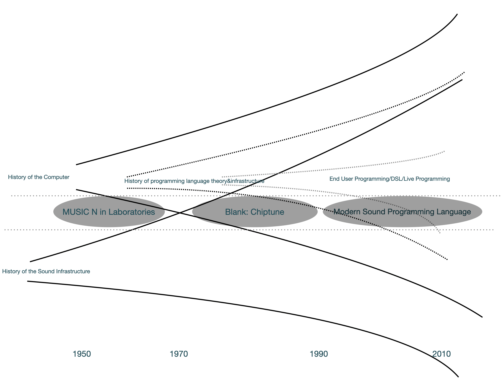

# イントロのイントロ

2021年9月。北九州市の植物園でこのイントロダクションを書いている。

植物園、というか自然公園みたいなこの場所にはフリーランスの仕事で来ている。公園を大きく使ったナイトウォークのようなイルミネーションのようなイベントで、そのための音楽やSEを流すためのシステムを作る仕事である。仕事の半分くらいはスピーカーをどこに配置するかとか、どの機材を使うかとかそういう話なのだが、もう半分はその沢山あるスピーカーにどう音を割り振ったり、パソコンを起動したら自動的に音が鳴り始めるようにするためのプログラムを作る作業になる。

制御のためのソフトウェアはCycling'74社のMaxという音声処理が得意なマルチメディアプログラミング環境で構築している。長い歴史を持ち、現在音楽のためのプログラミング環境としては（知る限り）最も多く使われており、個人的には2015年から使い始めたこのMaxというソフトウェアを使うと、例えば展示空間にスピーカーを10個とか（それも、いわゆるサラウンドとかとは全然違うレイアウトで）配置してそれぞれに違う音を同期して流したりすることができる。あるいは、映像を生成するコンピュータからネットワーク経由で特定の信号を受け取ったら特定の効果音を流すようにしたり。

なんだか言葉にすると大したことがない仕事のように聞こえる。実際、プログラムを書く作業自体は主観的には大したことがないのだ（ソフトウェア特有のニッチな問題やらバグは細々あるにしても）。こんな作業でお金をもらってしまっていいんだろうかと思う時もある。

しかし実際のところ似たような仕事ができる人はそこまで多いわけでもないらしい。例えば、仕事を受けようとしたが予定が埋まっているときに別の似たような職能を持った人を紹介しようと思っても、パッと思いつく人はそう多くない。

これは、自分がこうした仕事に慣れすぎてしまったのだろうか。半分はそうなのだろうが、この仕事をしているとやはり考えざるを得ない疑問は、コンピューターはなんでもできる装置のはずなのに、たかだか沢山のスピーカーに同時にたくさん音楽を流すぐらいのことに、どうしていちいちこんな専用の（しかも有料の）ソフトウェアを使ってカスタムツールを使ってプログラムを作るような手間がかかる作業になってしまうのだろう、ということなのだ。

これは別に、使うスピーカーが多いから必要なコンピューター処理能力が大きい、という話でもない。例えば、映像インスタレーション作品でどうしてもフォーマット的に3chのスピーカーを制御したい、となったときにも、大体10chの時と同じくらいの面倒臭さが発生する。2chが3chになったりするだけで、普通の音楽制作ソフトウェアでは扱いづらくなる。なんでmacOSでファイルを選択してスペースバーを押したら音声ファイルが再生されるように、物理的なセンサーに触ったら音声ファイルを再生する程度のことに労力が必要なのか。なんでエクセルファイルをちょっと編集するぐらいの手間で10chのスピーカーに音声ファイルを割り振れるようにならないのか。

この疑問こそが、おそらくはインフラストラクチャやフォーマットの持つ力というものの説明なのだろう。つまり、人々は2chのステレオ音声のフォーマットがすでにあるから2chステレオで音楽を作る。作るためのツールも2chが一番主流なのでそれが最も作りやすいように良心的な配慮をしてしまう。それに、いかに音楽や芸術表現が新しさを欲するものだとしても、とりあえずはその2chのフォーマットの中で表現が可能な新しさであれば問題にはならない。そして、別に3ch以上の音声フォーマットも表現として”不可能なわけではない”。ただ、ちょっと手間がかかるのだ。

技術決定論者/あるいはマルクス主義者風の言い方をすればインフラストラクチャ:下部構造が上部構造ー、つまり音楽表現とかを規定するということになるのだろうか。おそらくはそうではない。インフラストラクチャは表現を完全に縛りはしないが**誘導**する。そしてその誘導方向は既存の上部構造によって作り出されるものであり、互いに循環し合いながら徐々に路面は踏み固められていく。

# イントロダクション

本論文は、音楽のためのプログラミング言語mimiumの設計と実装を通じて、音楽プログラミング言語を作るという行為の概念化を試み、その上であるべきコンピューターと音楽の関係性を考え直すものである。

音楽プログラミング言語とは、その名の通りテキストやグラフィック操作を用いてコンピューターで音楽を生成するための人工言語である。

その多くはコンピューターを用いて、既存の楽器では不可能な新しい音楽表現を追求するために使われたり、近年ではコードを書くプロセスそのものを演奏として見せるライブコーディングのような表現なども登場しており、プログラミングを用いた音楽表現はますます広がりを見せている。

プログラミングに限らず音楽とコンピューターの関係性に視野を広げてみれば、2021年現在、音楽を聴いたり、演奏したり、作ったりする上で、コンピュータが一切関与しない、という状況を考えるのは難しくなっている。作曲にはProtoolsやCubaseに代表されるDAW（Digital Audio Workstation）ソフトウェアを使用し、配信にはApple MusicやSpotifyのようなストリーミングサービスを通じて、デジタルデータという形で音楽は配布される。最終的に、コンピューターやスマートフォン上のソフトウェアでそのデータをデコードし、音はスピーカーへと送られようやく空気の振動になる。スピーカーの中にさえデジタル信号処理(DSP:Digital Signal Processing)用のチップが入っていて計算によって音質の調整をしていることも珍しくはない。2020年以後のコロナウィルスの影響も含めれば、クラシック音楽のコンサートさえもその場で空気の振動を体感することよりも録画録音されたものをコンピューターを通じて摂取することの方が多くなってしまったかもしれない。とかく音楽文化を見れば、マーク・ワイザーの提唱したユビキタス（Ubiquitous:偏在する）・コンピューティングの概念は字義通りには達成されたようにも見える。

それにもにもかかわらず、音楽文化全体を見てみれば、音楽制作自体にプログラミングという手段を用いること自体はメインストリームとは程遠いと言える。例えば、今日のDAWソフトウェアの中で、プログラムを用いてソフトウェアそれ自体を拡張する方法は、Ableton社のLiveにおける、音楽プログラミング環境Maxを内部拡張として用いることができるMax for Live、独自のスクリプト言語を使用できるReaperなどを除けば、VSTプラグインなど一部の仕組みに限られる。こうした拡張も、多くはC++のような、音楽を専門とする人には難易度の高いプログラミング言語で記述する必要があり、作家が自ら道具の機能を拡張するには未だハードルが高い。

音楽にプログラミングを用いることですらこの現状であるので、音楽のためのプログラミング言語や環境自体を作ることの事例はますます限られている。今日ソースコード共有サービスGitHubにおいて、"Programming Language"と検索すれば87502のリポジトリが出てくるのに対して、"Sound Programming Language"では137しか出てこないことからその探究の規模の小ささががわかるだろう。実際第3章で見ていくことになる2000年代以後に開発された音楽プログラミング言語は多く数えて30ちょっとに限られ、年を追うごとにコミュニティが拡大しているとも言い難い。

そして、受容の形式という視点で音楽とテクノロジーとの関わりを見てみると、どれだけ高度なテクノロジーを用いて生成された音声も、最終的には何らかの5〜10分の音声ファイルとして編集され、ほとんどの場合スピーカーやヘッドホンという2chの音波を発する装置によって発され耳に届くという、コンピューターが発明される前の19世紀の録音技術黎明期の受容の形式から大きくは変化していないと言える。

本論文での、音楽プログラミング言語を設計する第一の問題意識となるのは、このような、コンピューターが本来万能とも言ってもいい可変性を持っているはずで、現状音楽に関与するあらゆるマシンの中にコンピューターが関与しているにも関わらず、音楽や音を用いた表現の形式には変化が乏しいのは何故だろうかという疑問、そして、コンピューターの可変性を十全に発揮するための道具とも言えるプログラミング言語を、音楽という目的に特化させて作ることは音楽表現の新たな可能性の追求としては一見最もストレートなアプローチにも見えるのに、何故未だにその開発事例が少ないのか、という疑問である。

# 方法論：デザイン実践を通した研究

この疑問に対して、本研究ではデザインの実践を通した研究アプローチをとる。簡単に言い換えると、音楽プログラミング言語を設計：デザイン、また実装することを通じて、音楽プログラミングがなぜメインストリームな手段とならないのか、音楽におけるコンピューターの利用のされ方が旧来の文化様式に固定されたままなのかを明らかにするということだ。

それゆえ、本研究は通常コンピューター科学の応用分野とも言える、音楽に特化したプログラミング言語の設計の研究としては以下のような特徴がある。

**1:まず、研究のアウトプットのひとつであるプログラミング言語、mimiumの設計や実装はプロトタイプではなく、実際に使われることを想定している。**

なぜなら、音楽プログラミング言語がなぜ多くは作られていないのかという疑問に答えるには、その言語の機関部分だけを作るーつまり、Proof-of-Work的なプロトタイプを作るだけでは、例えば実際にソースコード共有サイトへのアップロード、リリースの作業、さらにリリース後のメンテナンスや、ドキュメンテーションといった、ツールを実際に運用するプロセスの中にも、言語を実際に作るにあたって高いハードルが存在しているかもしれなからだ。実際に、mimiumの実行プログラムのソースコードはすでにGithubに公開されており、何人かが開発の一部に参加してくれてもいる。
<!-- また音楽向けの言語はオリジナルの開発者が中心的役割になって継続的開発、運用を続けているケースが多数を占める。代表的な例としてはPuredataを開発したMiller Pucketteは今日まで30年近く開発とメンテナンスを続けている。数少ない例外としてはオリジナルの作者が早期に開発から抜け、コミュニティベースで運用を行っているSuperColliderや、Cycling'74という企業によってメンテナンスされるMaxといった例を挙げることができる。 -->

**2:しかし、研究のアウトプットとしてのプログラムで実用的に役に立つほどに完成はしていなくてもよいものとする。**

これは次のような理由で正当化できよう。まず、プログラミング言語やそれを実行するプログラムには明確な完成という状態を定義しにくい。常に新しい言語仕様が追加されたり削除されたりを繰り返しながら時間をかけてアップデートされていく。同じC++という言語でも、C++98という初期バージョンの言語とC++20という最新のリリースでは、言語仕様もそれで書かれるソースコードの様式も大きく異なる。

さらに、プログラミング言語の開発やそれが実際に使われるようになるまでには一般的に2年を超える長い時間がかかるため、実用になって初めてその内容を研究として提示するプロセスを取ってしまっては研究サイクルとして時間が掛かりすぎるという問題がある。たとえばRubyを開発したまつもとゆきひろによればRubyの開発自体は1993年に成され、最低限の機能が揃ったのは半年後[@Matsumoto2014,51p]ながら、最初に公開されたバージョンである0.95は1995年と2年の時間を要している。音楽系の言語の例で言えば、mimiumの参考になっている言語であるFaustはプロジェクト自体が始まったのが2002年(https://faust.grame.fr/about/)だが、最初にリリースされた正式なバージョン0.9.0はやはり2年後の2004年になってリリースされている（https://github.com/grame-cncm/faust/tree/v0-9-0）。それでも研究対象としては具体的な幾つかの言語仕様に焦点を当てて議論を行うことで学術的な知見を生み出すことは十分に可能だと言えるはずだ。実際にmimiumは最初のバージョンをリリースするのに9ヶ月、そもそも音楽のための言語でありながら信号処理をして実際に音がなるまでに7ヶ月の時間を要しており、この論文が書かれている現在(バージョン0.4.0)でも、外部ファイルを読み込むinclude機能は単なるテキスト置換で行っており、実行性能の効率も悪いし予期しない動作を引き起こしかねないという、とりあえずの間に合わせとして実装されているように、暫定的な機能やバグが多数存在する。

**3:学術的研究として、作った言語の評価としてユーザーからのフィードバックを（定量的な実験結果であれ、インタビュー等の質的な内容であれ）必ずしも必要としない。**

この理由としては、筆者が焦点を当てたいのは音楽プログラミング言語がなぜ使われないかよりも、なぜ作る人の人数が増えないのかという問題であること、さらには、プログラミングという行為は、誰かの作ったライブラリのソースコードが公開されてさえいれば、その中身をどこまでも辿っていける、知識の階層を思うがままに辿っていける道路のネットワークであるにもかかわらず、コンピューターの中で音を（アプリケーションなどを通して）扱うことと、音楽や音のためのプログラムを作ること、さらには音楽や音を**記述するためのプログラム**：音楽プログラミング言語を作るということにはそれぞれ大きな隔たりがある、という問題であるからだ。この疑問に答えるために調べなければいけない対象は、すでに多く研究対象となっているユーザー：音楽のためのプログラム、アプリケーションや音楽プログラミング言語を仕様する人たちだけではなく、むしろ研究主体である自分自身とその経験なのだ。つまり音楽プログラミング言語やそれを作るという行為がブラックボックス化されている現状を、自らの手で作ることによって開き、そこで使われる知識や語彙の体系化を改めて試みることで疑問に対するヒントを掴むような道筋を辿ることになる。

もちろんこれは、1.で述べたように実用的なツールとしてもmimiumを開発している以上、そのツールをよりよいものにしていくために今後ユーザーにインタビューなどの形でフィードバックを求めることは有益になるだろう、という意見を否定するものにはならない。

本研究のような音楽のためのソフトウェアを制作することを研究にするにあたって、どのように研究を正当化するかに関しては、コンピューター科学の中でもHuman-Computer-Interaction(HCI)の分野や、Creativity Support Tools(CST)、End-User-Programming(EUP)といった分野で議論が行われている。このようなデザインの実践を通した研究:Research through Design(RtD)としての本研究の位置付けに関しては6章で改めて詳しく議論するが、本研究は、何か既存の言語に足りない機能があったり、既存の言語ではできない表現があるので新しい言語を作るのではなく、言語の実装と文献調査を通して、音楽プログラミング言語という研究領域はどういった領域か、またその領域にどんな課題があるかといったものを明確化することを主眼においている。そのため、プログラミング言語mimium自体も特定の問題意識や仮説に基づいた設計や実装が行われてはいるものの、実装するうちにその問題意識も徐々に変化していることには留意する必要がある。第3章で提示する音楽プログラミング言語の歴史観や、第4章で議論する音楽プログラミング言語の存在論はmimium実装のためのモチベーションであると同時に、mimiumを実装することによって得られた洞察でもあるということだ。

このような考察→設計→実装→考察…といった循環的な作業を行う以上、それを問題提起→解決という線状のプロセスに形式的にでも開くことは、試行と実験を繰り返す中で発生する考えの変遷のディテールを削いでしまうことは否定できない。それを補うためにもmimiumの設計と実装が時系列的にどのように行われてきたかについてをまず簡単にまとめておくことにする。

## mimium制作までのバックグラウンド

本研究の主題となる音楽プログラミング言語mimiumの開発は2018年頃に遡る。

個人的な動機の話にはなるが、筆者のバックグラウンドはコンピューターサイエンスではなく、音楽プログラミング言語を作り始めようと思ってからプログラミング言語理論を学び始めたという順番を取っており、そのバックグラウンドが音楽プログラミング言語研究の方法論自体の見直しという本論文の大きなテーマの一つにも大きく影響してくるのでその経緯を簡単に記しておくことにする。

2018年の9月から11月にかけて、筆者はSchool for Poetic Computation(SFPC)という、ニューヨークにあるアーティスト・ラン・スクールへ留学した。SFPCはテクノロジーと表現を批評的に、かつ実践的に学ぶ私学校のような場所で、年に2回、20人ほどの学生（10代から50代まで幅広い）が集まり、OpenFrameworks[^openframeworks]を用いたグラフィックプログラミングから技術批評の文献購読までを3ヶ月間、対話を交わしながら進めていくものだった。

[^openframeworks]:openframeworks

筆者はそれまで、物理モデリング楽器を物理的な要素で再構築するインスタレーション作品の制作や、オーディオフィードバックを主要素とする電子音響楽器の開発とそれを用いた即興演奏などを中心に活動してきた。

これらの作品制作への大元のモチベーションは簡単に言うならば、どれだけ工夫したプログラムを作ったところで全ては2chのステレオPCMサウンドというフォーマットに収束してしまうことへの窮屈さから来る、より異なる音楽表現の可能性の追求であった。つまりインスタレーション作品も、オーディオフィードバックを用いる電子楽器も、コンピューターにスピーカーを繋げるだけでは実現不可能な表現領域を探索することに意義を見いだしていた。

しかし同時に、音楽のフォーマット（あるいは、より広範な意味合いでの"形式"）から離れたところで、インスタレーションや、展示、あるいは即興演奏のイディオムという異なる形式へと従属する対象が変わっただけのようにも感じていた。

そうした疑問を抱えながら過ごしたSFPCでの授業は全くこれまでと違う考え方を自分に与えてくれた場所であった。

SFPCの入居しているウエストベス・アーティスツ・コミュニティという建物は、元々1890年代から1960年代までベル研究所の建物だった場所で、有名なところではショックレーらによる切開で初めてのトランジスタが発明された場所でもある。そして同時にこの場所はニューヨークのテクノロジー・アートの歴史の中心地と言ってもよい歴史的な経緯を持つ場所でもある。

ベル研究所のエンジニア、ビリー・クルーヴァーは美術家のロバート・ラウシェンバーグとともに、60年代にExperiments in Arts And Technology(E.A.T)というアーティストとエンジニアの共同作業のための集団を組織し、《九つの夕べ》や、1970年の大阪万博ペプシ館の演出を担当するなど、のちのテクノロジーを用いた芸術制作へと大きな影響を与えている。こうしたニューヨークにおける技術者と芸術家の共同作業は、ラウシェンバーグを始め、ウエストベスにのちに入居するダンサーのマース・カニングハムや、彼らとの共同作業も行った作曲家のジョン・ケージやデイヴィッド・チューダーといったアーティストの参加したブラックマウンテン・カレッジ、またケージの参加したフルクサスのような、反制度、反形式的な思想や運動を背景としていることが特徴であり、これは例えば人類学者のジョージナ・ボーンが"Rationalizing Culture"で、フランスの電子音楽研究所において70~80年代にピエール・ブーレーズのような作曲家が電子音楽のための技術を、現代音楽という積み重ねられてきた歴史の上で正当化する過程を描いた様子とは大きく異なる[@Born1995]。

SFPCのプログラムはこうした歴史的背景をもとに、ブラックマウンテン・カレッジのような既存の教育の枠を外し、生徒が互いに教え合う機会を多く設けた"Horizontal Pedagogy"(http://taeyoonchoi.com/2012/05/notes-on-critical-pedagogy/)と呼ぶ学びの姿勢を重視したものであり、かつ、大阪万博を一つのピークとして捉えられる、60年代のテクノロジーアートにおける、表現に先行して技術を無批判に用いることや、大規模化するごとに資本主義に迎合していってしまう傾向[^mediaarthistory]への内省を踏まえたものとなっている。技術を用いる際に暗黙的に発生する政治性に自覚的になり、また技術を与えられたブラックボックスとせず、すでにライブラリやツールが存在しているものだったとしても一度自分の手で作り直すことによって体でその内容を理解することで、異なる技術のエコシステムの可能性を想像することができるようになるというわけである。

[^mediaarthistory]: 例えば、[@Ma2014,58p]の坂根厳夫の引用では、70年代はじめのオイルショックや環境問題を単に発した科学技術自体への批判との共鳴が指摘されているし、大阪万博ペプシ館でのスポンサーによる会期中のプログラム中断と、E.A.Tのその後の活動の衰退をあげることができるだろう。

それゆえ、SFPCで教える講師達の活動形態も、必ずしも作品を作って美術館に展示することが中心なわけではない。OpenFrameworksでほぼ毎日短いCGアニメーションを作り投稿し続けるZachaly Liebermanや、CPUの動作原理を餃子作りに見立てた"CPU Dumpling"ワークショップを行うTaeyoon Choi、ポストコロニアルスタディーズをベースに、白人中心主義的なコンピューター文化批判のインスタレーションやZineを制作するAmerican Artist、ただ時を刻むだけのカウンターのようなオーバー・エンジニアリングなツールを自宅の工房で作って売り続けるCW&T……のように、多様な活動を見せる彼/彼女らの活動を通して（それでどうやって生計を立てられるかはともかくとしても）テクノロジーと社会の関係性への向き合い方は必ずしもアートという閉じられた空間の中だけで行うものでなくてもよいのだと実感させられた。

こうした経験が音楽プログラミング言語という実に微妙な領域の制作へ筆者が本格的に入っていくきっかけとなった。

詰まるところ、はじめにあげた"どれだけ工夫したプログラムを作ったところで全ては2chのステレオPCMサウンドというフォーマットに収束してしまうことへの窮屈さ"に対して真に向き合うには、何が社会的にそのフォーマットを構築しているのかについて突き詰めて考える必要があったのだ。違う表現の形式へスライドしても結局その形式の束縛を受けるだけになってしまう。ならばやるべきは制作を無意識的に支配している形式や制度そのものの脱構築に他ならない。つまり筆者にとって音楽プログラミング言語の制作とは音楽を生み出す下部構造＝インフラストラクチャになりうる道具自体を自らの手で作ることを通じて、異なる音楽の形式や制度そのものをメタ的に制作する芸術（と言い切ってしまうことにより失われるニュアンスがあり他の言葉を探している途中だが、暫定的に芸術と言ってしまう）実践でもある。

この大きな問題意識のもと、筆者の音楽プログラミング言語制作の目標はその中で二転三転を経てmimiumという現在のプロジェクトに落ち着く。
始めにある程度まとまった人数に対して言語設計の話を持ち出したのは、SFPC滞在期間中の自己紹介兼、3ヶ月の間に何をやろうとしているかのプレゼンテーションをする場所だった[^meetthestudent]。そこでは、1つのソースコードに対して複数の処理系を通すことで異なる音楽が発生するという、どちらかといえばCode Poetry[^CodePoetry]などの詩としてのソースコードとその処理系の関係性、コードを書く人と処理系を作る人のオーサーシップの関係性に焦点を当てたものだった。結局SFPCの滞在期間中に制作したのはよりハードウェアのレイヤーでコンピューターの構造と音楽という時間芸術の形式の関係性を問い直すものになり[^edtac]、言語設計を実際に始めるのはもう少し後になる。

[^meetthestudent]: SFPC 2018 fall classにおけるMeet the Studentsという公開イベント。YoutubeのURLとSpeakerDeckのスライドを貼る

[^CodePoetry]: プログラミング言語のソースコード自体を詩のように扱う芸術の形式。実際には実行できないがソースコードの見た目を模したもの、実行することで初めて詩として読めるもの、ソースコードとしても可読性があり、実行することでさらにグラフィックを生成するものなど様々な種類がある。[@Montfort2013]などを参照。

[^edtac]: Electronic Delay Time Automatic Calculator(EDTAC)という作品。修士論文[@Matsuura2019mathesis]や2019年JSSA研究会での[@Matsuura2019jssa]を参照。

2019年ごろの設計初期段階では、Mayer、ChughらのSketch-n-Sketch[@Mayer2018]や、JacobsらのPara[@Jacobs2017]、橋本麦によるGlisp(NiU)[^Glisp]など、グラフィック生成のためのアプリケーションにおいて、ソースコードの編集をDirect Manipulation(Adobe IllustlatorやMicrosoft PowerPointにおけるベクター図形編集のような、図形の要素をGUIで直接サイズ調整できるような種類のアプリケーション)と組み合わせたり、相互に行き来できるソフトウェアを、音楽プログラミングの領域においても実現できないかというアイデアが中心に置かれていた。

[^Glisp]: https://glisp.app

実際、この提案は2019年情報処理推進機構未踏IT人材発掘・育成事業という、革新的なソフトウェア制作に対する支援事業に採択され、その当初のアイデアはプログラミング言語設計とそのソースコードをグラフィカルに編集できるソフトウェアという2つのプロジェクトを並列して行うものになっていた。[^mitou]

[^mitou]: 未踏IT人材発掘・育成事業：2019年度採択プロジェクト概要（松浦PJ）(https://www.ipa.go.jp/jinzai/mitou/2019/gaiyou_tk-1.html)を参照。また同時期に情報処理学会音声情報処理研究会にて同様の案についてのポスター発表を行っている[@Matsuura2019MUS]。

結果として、2019年6月から2020年2月までの同事業でのディスカッションを中心に実装を進める中で、実装内容はその根幹となる、音を生成するプログラミング言語一本に絞っていくことになった。その理由は主に、筆者がプログラミング言語実装そのものの領域に対しては初心者であったが故に実装にかかる時間的な都合の問題が主な理由であった。言い訳がましく聞こえるかもしれないがこれは同事業で言語設計、実装を進めた中での大きな収穫の一つだと考えている。つまり、**音楽プログラミング言語を設計したり実装することは、想像しているよりもずっと難しかった**という、本論文の1つのテーマでもある、なぜ音楽プログラミング言語を作ることのハードルが高いのかという疑問に答えるための材料を身を持って入手したわけである。

# Problem Statement

本研究は以上のような動機をもとにしているため、音楽プログラミング言語の開発が主題ではあるものの、その言語を作ることによって何かユーザビリティが改善されたり、それまで不可能だった表現が可能になるといった具体的な効用を実証するものではない。そうではなくむしろ、作られたmimiumという言語は2021年現在において、音楽プログラミング言語とはなんなのか、あるいは音楽プログラミング言語をつくるとはどういう行為なのかという疑問を観察するためのレンズのようなものと考えてもらいたい。

このような、人文学的な視点からの音楽プログラミング言語制作についての研究の先行例としては、[@Magnusson2009]と[@Mclean2011]がある。

Magunussonはコンピューターを用いた楽器がアコースティック楽器とどのように異なるかを、自身の開発したIXIというライブコーディング環境での実践を例にしつつ、現象学や認識論、哲学を経由することで議論している。それによると、デジタル楽器(DMI)はそれを構成するシステム自体がコンピューターという象徴（シンボリック）なシステムに依存しているため、より道具そのものも既存の音楽や信号処理の言語体系を反映したものになる、**認識論的道具（Epistemic Tools）**であると指摘している。

またMcleanは 〜〜説明が難しい

これら2つの先行研究との本研究のアプローチの違いとしては、先行研究では、アーティストがパフォーマンスややライブ演奏をするにあたり、言語や記号というシステムを介してコンピューターとインタラクションを行う過程を描き出したものだったのに対し、本研究が焦点をあてるのは、コンピューター言語

音楽言語というブラックボックスがあること（知識的な）
それを開けても別の開けられないブラックボックス（UGEN）が残ること

# 本論文の貢献

本論文を通じて学術的に貢献する内容をまとめると、以下のようになる。

1つ目は、音楽プログラミング言語の存在論の提示だ。音楽プログラミング言語は歴史的にコンピューターを用いて音楽を生成するための技術としてスタートしつつも汎用プログラミング言語の理論を取り込んで発展してきたことにより、一重に音楽のためのプログラミング言語/環境といってもその応用範囲や想定される使用方法、さらに内部の実装方法までが多岐に及び、単純な比較をすることが難しい。また、評価のための語彙も"表現力が高い" "効率的" "汎用的"などの言葉が共通認識の無いまま慣例的に使われており、実際に何を意味するかもはっきりしないことがある。本稿ではまずこのような、"音楽プログラミング言語とは何か"、"音楽プログラミング言語にはどんな種類があるのか"、"音楽プログラミング言語の特性はどう記述できるか"といった概念を整理して提示する。

2つ目は、音楽プログラミング言語を音楽を作るためのツールとしてだけではなく、インフラストラクチャとしての役割から批評することだ。

()繋ぎ
録音技術（音響再生産技術）に端を欲した音楽のフォーマットは現在空間音響技術のためのフォーマットによって、原音再現という従来の明確な一つの目標を失いつつある。その環境でコンピュータ上の表現の自由度を最大限担保するためにはプログラミング言語そのものを音楽のためのフォーマットすることが必要になってくる。

3つ目は、音楽プログラミング言語自体を学術的な研究とする際の異なる方法論の提示だ。音楽プログラミング言語の研究自体は、人文学的な動機で研究をされつつも、基本的には作ることで問題を解決する（≒できなかった表現をできるようにする）という、形式を取ることが多かった。本論文ではそうではなく、問題がなんなのかははっきりとはわからないままに作り始めることで、事後的に問題が浮かび上がってくる、質的研究法の中で言われるReflexivity（自己反映性[^reflex]）、つまり自分の研究内容によって自分自身が変化することを重視した研究である。今回の研究では、初めは音楽プログラミング言語という範囲の中での問題点という狭い視野で作り始めたものが、最終的には音楽におけるコンピューターの使い方全般の問題や、音楽流通におけるデジタルフォーマットの問題、テクノロジーにおけるブラックボックス性の是非といったより広い問題意識へと広がっていく過程をオートエスノグラフィーの形で（？）示すことで、

[^reflex]: Reflexivityという言葉は再帰性や反射性という訳語があてられることも多い。本論文中では計算機科学の用語としての再帰（Recursion）との不要な混同を避けるため、また、プログラミング言語において実行環境（コンパイラやインタプリタ）の挙動自体を実行コードからメタ的に操作できる機能のことをReflectionと呼び、日本語としては自己反映言語や自己反映計算と呼ばれることもあり、意味合いとしてはより類似しているように思われるため、自己反映性という言葉を用いる。

最後に、筆者が設計/実装した自己拡張性の高い音楽プログラミング言語"mimium"についての設計思想とその具体的な実装を提示した上で、以上3つの観点からの位置付けを試みることだ。mimiumは先述した音楽のためのプログラミング言語の歴史を見直し、汎用プログラミング言語の設計の上に最低限の音楽のために特化した言語機能を備える構造を取ることで音楽のための言語におけるブラックボックスを減らしながらもその実装の単純さと自己拡張性の高さを同時に実現できるように設計されている。

# 構成

本研究はプログラミング言語制作という実践行為を通じて音楽プログラミング言語とはそもそも何か、音楽プログラミング言語を作るとはいかなる行為なのか、それがどう役に立つのか、と言った疑問を検証するものである。

5、6章で詳しく記述することになるが、mimiumの実装そのものには音楽に関わる話題がほとんど存在しない。そこにあるのはコンピューターの中で時間をどう取り扱うかといった問題や、ソースコードというテキストデータをどのようなプロセスで機械語に近い構造まで変換するかというデータ構造の変換の問題が中心となる。これは可能な限り既存の音楽の様式に依存しない形で音楽プログラミング言語の言語仕様を定義するという、2000年以降の音楽プログラミング言語設計の一つのテーマにのっとった帰結である。なので、音楽表現の汎用性（Universality）を意識すればするほどに実装の内容は汎用プログラミング言語の理論へと接近していき、「音楽に特化した言語」から離れていく矛盾が浮き彫りになる。

この矛盾は実装をすることで初めて

つまり、第2〜4章で記述することになる歴史や音楽プログラミング言語の特性はmimium実装の背景知識であると同時に、mimiumを実装することによって初めて浮かび上がった痕跡でもある。

## 三重の歴史の提示

第2章以降は以下のような構成で論じる。本論文全体の構造を図nに示した。

第2章ではコンピューターが単に計算の自動化のための装置から、70年代にメタメディア装置にへと変化しさらにその先にユビキタス・コンピューティングに代表される、コンピューターを不可視（Invisible）にする思想が醸成される過程を示す。
ここではメタメディアとしてのコンピューターが、ユーザーがプログラミングによって自分で機能を組み替えられるようになっていたことに本質的な点があったことを指摘する。その一方で、当時のメタメディアの音楽的な利用が既存の音楽表現のレールに乗っていることで成立していることにも言及する。

第3章では、現在の音楽インフラストラクチャに大きく影響を与えた録音技術