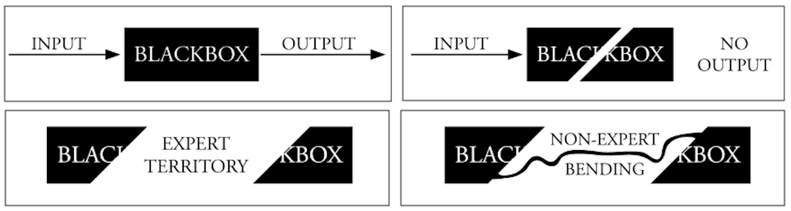

<!-- なぜ音楽プログラミング言語を作るか、研究するか -->

# なぜインフラストラクチャとしての音楽プログラミング言語なのか

> コンピューターの音楽的価値は、本物の楽器に可能なことをきっちり複製できるという能力にあるのではもちろんなく、むしろ、現実の楽器音を包括したうえで、さらにそれを超えた、拡張された音の種類を生み出せることにある。[@Mathews1969,筆者訳]

> バイオリン、ギター、フルート、ピアノが合わさった楽器を想像してみよう。そんなことができるだろうか。もちろん。小粋なシンセサイザープログラムがパソコンキーボードからこれら全ての楽器の音色を生成してくれるだろう。しかし、それは感動的な音楽になるだろうか？実際の音楽家がそれを使うだろうか？もちろん使わないだろう。[@Norman2000,p101]

---

本章では、メディア装置としてのコンピューターの思想と、音楽家のような芸術実践のあり方の関係性の歴史を記述する。序章で既に触れたように、本研究で音楽のための道具作りのデザイン行為のありようを知るために、音楽のためのプログラミング言語という事例に着目するのは、コンピューターを単なる高速計算機から万能メディア装置として再定義したメタメディアの思想には、ユーザーによるプログラミングという作業がセットになって考えられていたからである。しかし、今日のコンピューターを用いた音楽を作るための道具–平たく言えばソフトウェアを使うにあたってプログラミングという行為は、徐々に普及しつつはあるものの、未だメインストリームからは程遠い状況にある。

もちろん一般的な音楽制作ソフトウェアもユーザーの手によってある程度は機能拡張可能だ。リバーブエフェクトが足りないと思えば、どこかのメーカーからリバーブエフェクトのプラグインを購入してきて、DAWソフトウェアから読み込めばそのソフトウェアの機能は確実に拡張されている。しかしもっと根本的な機能–例えば5拍子と4拍子が混ざったポリリズムの曲を作りたいので、この両方のリズムのクリック音を録音時に別々のヘッドホンから鳴るようにしたいとなれば、それは正規の利用方法では不可能である。DAWソフトウェアの中にはメトロノームは1つしかない。4拍子と5拍子の頭にノートをそれぞれ配置してクリックを鳴らすためのトラックを作ったりするような応急処置で望む機能は実現できなくはないが、そもそもメトロノームが2つや3つやに増やせればその方が手っ取り早いのは自明だ。

こうしたソフトウェアの拡張性の概念は、HCI分野におけるEnd-User Development、つまりソフトウェアのユーザー自身がソフトウェアの機能を拡張していく方法についての研究において2段階に分類されている。

> 1. パラメータ化もしくはカスタマイズ。ユーザーにアプリケーションの中で既に利用可能な幾つかの挙動（もしくは表現やインタラクションの仕組み）を選択することを許容させるような活動。
> 2. プログラム作成と変更。ソフトウェアを白紙の状態から作成したり既存のソフトウェアを修正したりすることを目的とした、なんらかの変更を伴うような活動。こうしたアプローチの例としては、例示によるプログラミング（デモンストレーションによるプログラミングとも呼ばれる）〔プログラムの入出力の例を書く事で実装を自動的に生成するような手法〕、ビジュアルプログラミング、マクロ、スクリプト言語などがある。[@Lieberman2016,筆者訳]

つまり現代の音楽制作ソフトウェアには1.のパラメーター化、カスタマイズはできても多くは2.プログラムの機能そのものを変更することができないということになる。しかし繰り返しになるが、そもそもの自らの手で機能を拡張できる道具としてのコンピューターの思想で重視されていたのは2.のプログラムそのものを変更できることだった。本研究ではエマーソンによるメディア考古学的検証[@Emerson2014]を参照しつつ、メディア装置としてのコンピューターの原点である、Xerox PARCで開発されたDynabookの思想を、**不完全な形で定着したもの**という批判的な形で位置付ける。

{#fig:computerhistory width=100%}

第2章と同様、1960年代から2020年代までの歴史の見取り図を、今度はメディアとしてのコンピューターの思想という視点で[@fig:computerhistory]に示した。本章で歴史区分のガイドとなるのは、ユビキタス・コンピューティングの概念を提唱したマーク・ワイザーがその概念の説明に用いた、利用者あたりに使えるコンピューターの数（コンピュータ1台あたりのユーザー数）の時代に伴う変化である。計算機の低価格化/高性能化に伴って、1960年代には研究所やオフィスに置かれた巨大な装置を複数のユーザーがシェアして用い、1980年代以降は家電のように、個人が計算機を自宅で手軽に利用し、そして1990年代から今日に至っては、スマートフォンも含めて、私たちは日常的にコンピューターを複数台利用するように、1人あたりが利用する計算機の数は増えていった。しかし一方で、計算機が手軽に便利に利用できるようになる過程とは、エマーソンの解釈では計算機がアクセス不可能なブラックボックス化していく過程でもある。

無論、パーソナルコンピューターが普及して以降の音楽制作においても、自らが音を生み出す方法を自らの手で作り上げるDIY的アプローチは積極的に行われてきた。とはいえ、それらはメタメディアとしての不完全さの結果として、プログラミングによる自己拡張という手段ではなく、ブラックボックス化された音楽に関わるテクノロジーを、誤用などを積極的に用いて開拓する、カスコーンの "失敗の美学"に代表される態度として現れることになった。最終的に、テクノロジーの発展は単に技術が高度に積み重なっていくのみならず、インフラストラクチャの力によってテクノロジーの中にアクセスすること自体を遠ざけてしまい、現在はアマチュアリズムを伴った誤用の余地すらも残されていない。

それゆえ、2020年代に音楽家が取ることのできるアプローチとは、ブラックボックス化され、不可視となったインフラストラクチャを自らの手で開き、自らの手で作り上げ進んでいくという方法にしかなり得ない。本章ではそうした主張を、音楽を中心とした芸術家やデザイナーの取り組みを参照することで提示する。

<!-- 本研究全体の大きな問題意識は、大きくまとめると、**コンピューターで音楽を作るための方法を自分自身で開拓することがなぜ難しいのか**とまとめることができる。

しかし無論、パーソナルコンピューターが普及して以降の音楽制作において、自らが音を生み出す方法を自らの手で作り上げるDIY的アプローチは積極的に行われてはいた。本章では、まずこの90〜00年代の音楽制作におけるコンピューターの利用方法を振り返り、それらは自らの手でブラックボックス化された音楽にまつわるテクノロジーを、誤用などを積極的に用いて開拓する、カスコーンの "失敗の美学" に代表される態度であったがしかし、最終的には失敗することにすらも失敗した歴史であった、と位置付けることを試みる。そして2020年代に音楽家が取ることのできるアプローチとして、ブラックボックス化され、不可視となったインフラストラクチャを自らの手で開き、自らの手で作り上げ進んでいくという方法を、Human-Computer Interaction(HCI)におけるインターフェース研究、科学技術社会論(STS)におけるインフラストラクチャ研究、メディア考古学、グリッチアートといった様々な領域を参照しながら提示する。 -->

# メタメディアとしてのコンピューターの思想

コンピューターはいつから単なる高速計算装置から、様々な表現の形態に対応可能な汎用メディア装置として捉えられるようになったのだろうか？本研究は既存の研究と同様に、Xerox PARC(Palo Alto Research Center–ゼロックス社を母体とする、シリコンバレーに存在する研究所)で開発されたDynabookというシステムにその原点を見出しているが、それは既存の言説よりもやや踏み込んだ理由づけを必要とする。

なぜなら第4章で詳しく見るように、コンピューターを単に計算装置として用いるのではなく、音楽の生成のために用いる試みは電子計算機のごく初期である1951年にはすでに、イギリスのBINAC、アメリカのUNIVAC I、オーストラリアのCSIRAC（CSIR Mk-I）と、世界各地で行われていたからである。もっとも、これら最初期の試みは、メディア処理のためのシステムを作ったのではなく、例えばBINACでは回路中を流れる信号をデバッグするためにHIGH/LOWの2値電圧を直接スピーカーに流せるようになっていたことを利用して、逆にスピーカーに任意の周波数のパルス波を流すことによって、メロディを鳴らせるようになっていた。それゆえ、今日のコンピューター音楽プログラミング環境のように任意の音圧波形を生成するには程遠い、いわば既存の機能の流用で可能な範囲の音楽生成の試みであった[@Tanaka2017]。

そのため、コンピューターをメディア装置として本格的に用いようとした思想の原点と呼ぶにはやや弱い試みである。では、ハードウェアも含めたシステムとしてあらかじめメディア装置として使うことを目的としたシステムという視点ならどうか。GUI（Graphical User Interface）の最初期の例である、ペン型のポインティングデバイスをディスプレイと組み合わせて使用できる、アイバン・サザーランドのSketchPad[@Sutherland1963]はこの意味合いでは最も有名なシステムだ。しかしハードウェアも込みのシステムという意味だとしても、やはり音楽分野においてより早い時期である1957年に、マックス・マシューズらがMUSICという音声合成のためのプログラミング環境を既に完成させている。MUSIC（I）自体はIBM 704という汎用のコンピューター上で動作するシステムではあったが、専用のデジタル－アナログコンバーター（二進数の集合として離散的に表されている音声信号を、スピーカーに流す時間的に連続した電気信号へと変換するハードウェア）と組み合わせることではじめて成立するシステムだったことを加味すれば、コンピューターをメディア装置として用いる例としてはSketchPadなどと同様に記述されるべき事例だと言える。

このように、コンピューターを取り扱う事例に限らず、メディア論全般に関して、既存の言説が視覚メディア偏重になる傾向には注意を払う必要はあるものの、それでも筆者はメディア装置としてのコンピューターの思想に大きく影響を与えた原点としては、サザーランドの教え子であるケイによって研究されたDynabookを据えるべきだと考える。なぜなら、ケイやゴールドバーグは計算機を音声や映像を生成するために限らず、メディアそのものを自ら生み出すことができる装置、**メタメディア**と捉えることをDynabookの思想の根幹としていたからである。とくにアラン・ケイはメディア論の古典であるマーシャル・マクルーハンの思想に大きく影響を受けている。

世界中の地点が接続されあらゆるイベントが同時刻的に共有される地球村（Global Village）に代表されるマクルーハンの思想が、今日のインターネットで繋がれたメディア環境を鋭く予見していたことは言うまでもない。しかし実のところその予見は、ムーアの法則が未来予測という形をとって社会への期待を浸透させていた状況（[@sec:expectation]）とよく似て、ケイのようにメディアとしてのコンピューター技術を作り上げてきた研究者たちがマクルーハンの思想に直接的に影響を受けることで実現されてきたという因果逆転の側面も少なくない。

そのような、メタメディアとしての計算機の思想が明確に示されたのがケイとゴールドバーグによる1977年の "Personal Dynamic Media"という論文である。ケイらはこの論文で、Dynabookというあらゆる情報–詩、レシピ、レコード、絵、アニメーション、楽譜、波形や物理シミュレーションなどを蓄積する動的な知識の入出力機としての、来たるべき個人が利用する電子計算機のビジョンを提示した[@Kay1977]。

Dynabookはその理想的姿として、今日のラップトップやiPadにキーボードのついたような見た目のデザインが提示された。これは当時ケイがブラウン管ではない、プラズマ液晶ディスプレイの研究を知ったことで、将来ディスプレイは板のように薄型化されることへの確信を得たからだという[^flexmachine]。しかし当時のコンピューターの処理速度ではまだそのサイズでは実現不可能であったため、その見た目はダンボール製のモックアップとして示され、動作モデルとしてディスプレイ、音楽キーボード、タイプライター、マウスなど多様な入出力デバイスを組み合わされた1つの勉強机のような構成のデスクトップコンピューター、Altoの上で実行される "暫定版（Interim）"Dynabookが作成された。暫定版DynabookはSmalltalkという対話的手法を得意とするオブジェクト指向のプログラミング言語をシステムの根幹に据えることで、テキストだけでなく音や画像といったあらゆる種別の入力を処理しリアルタイムでまた何かしらの形式でアウトプットする、しかもそのプログラムを動的に書き換えられるような**メタメディア**としての電子計算機の利用方法を実現できた。注意して読んで欲しいのは、DynabookにおけるSmalltalkとは、今日のmacOSにおけるAppleScriptのような、オペレーティングシステム（OS）の機能を操作できるプログラミング言語というよりは、Smalltalkの実行環境そのものが複数のタスクを分割したり、入出力の管理を行うOSに相当するものだった。

[^flexmachine]: ケイはビジョンを提示するためにスケッチをよく描いているが、Dynabookの前に取り組んでいたFLEXにおけるパーソナルコンピューターの未来の姿のスケッチでは、未だブラウン管式ディスプレイを思わせる奥行きのあるデザインになっていた。

Dynabookにおけるメタメディア概念の中で中核となっていたのがあらゆるものの**シミュレーション**である。ここには、「あらゆるメッセージは、なんらかの意味で、何かの概念のシミュレーションである」とケイらが書くように、先のマクルーハンの「メディアはメッセージである」のという考え方に明らかに影響を受けているのがわかる。

> マクルーハンはその『グーテンベルグの銀河系』のなかで、しばしば新しいメディアは、当初は古いメディアの内容を取り入れる、と指摘し、聖書の写本を例に挙げている。わたしは、FLEXマシン〔ケイらがDynabookよりも前に開発していたシステム〕のような、デスクトップ・パーソナル・コンピュータは、企業や公的機関で使われるメインフレームの時分割利用のあとにくる、『グーテンベルグ聖書』なのだということに気づいた。[@Kay1992,p18]

また同時に、この考え方はデザイン・サイエンスの運動に影響を与えたハーバート・サイモンの「システムの科学」における、観察ではなく、モデルを構築して、シミュレーションを行うことによって世界を理解しようというサイバネティクス的思想とも共鳴しているように読める。しかし一方で、ケイはマクルーハンを経由することで当時のサイバネティクスとコンピューター科学の関わりの本丸であった人工知能研究や、例えば今日におけるデジタルツインの概念のように、現実世界に存在する生物や世界そのものを計算機上に完全再現することともまた違う方向を歩んだ。

ケイはマクルーハンが言うところの、人が道具を作ると同時に、道具がまた人を形作るという関係性に重きを置いていた。またここには、子どもを対象にしたプログラミングシステム、LOGOを作成した研究者シーモア・パパートの、幼児が成長過程で物を作ることによって概念習得を行う、構築主義（Constructionism）という思想の影響も大きく関わっている。この思想のサイバネティクス的世界観との違いを大味に説明すれば、サイバネティクスのような思想は "現実世界"に直接対応づけられるような人間の思考上の概念を数学的モデルなどを用いてなるべく近づけるよう努める。しかし構築主義的な世界観では、言語や、あるいは道具の使いかたによって、その人の認知によって観測される "現実世界"の方が変化するのだ。

ケイやゴールドバーグの他に、Smalltalkの開発に関わる様々な研究者らが、この暫定版Dynabookを用いていくつかのアプリケーションソフトウェアを作成し、中学生程度の年齢を含む幅広い対象に使用してもらう実験を行った。本研究の興味関心に引きつけ、この中で音楽関係のアプリケーションを抜き出すと、今日の楽譜編集ソフトのように、キーボード入力をキャプチャしてその後マウスなどで編集ができる、楽譜編集アプリケーションOPUS、キーボード入力の取得と再編集が可能な今日のいわゆるシーケンサーアプリケーションのようなTWANGと呼ばれるシステム、のちにTWANGに統合したとされるシンセサイザーの音色編集のアプリケーションが挙げられている。ただしここで注意して読むべきは、まずコンピューターを用いた音声の合成それ自体の取り組みはすでに述べたように1950年代から行われてきていることだ。リアルタイムでの（それも専用のハードウェアに依存せずCPU処理とデジタル-アナログコンバーターのみでの）音声合成はこの時代としては比較的目新しいと言えるものの、その信号処理は任意にプログラムできるようなものではなく、ちょうどこの時期、スタンフォード大学のコンピューター音楽研究センターCCRMAのチョウニングによって提案されたFM（周波数変調合成）と呼ばれる方式での合成をサンプリングレート13.5kHz、量子化ビット数12bitという精度で、同時に5ボイスまでを制御できるという、ある程度制限されてはいたものだった[@Saunders1977]。

また、 "Personal Dynamic Media"ではミュージシャンによってプログラムされた、と見出しが付けられてはいるものの、これらの音楽関連のアプリケーションに関しては、他の、例えば花びらの模様を生成的に描画するアプリケーションを14歳の子が自分でプログラムしたという状況とはやや異なる。たとえばTWANGをプログラムしたのはのちのSmalltalkの開発に中心的に関わり続けていたテッド・ケーラーだとされている[^minitwang]。とはいえ、子供ではないにせよプログラミングの非専門家によって作成されたシステムもあった。楽譜キャプチャシステムOPUSを作ったのはクリス・ジェファーズという、コンピューターサイエンティストではなく音楽家かつ教育者だったとされる人物で、OPUSでは今日の類似アプリケーションと比較しても特異な、演奏したノートの強弱からテンポとそのゆらぎを推定した上で改めて音符を配置するという機能を持ちケイたちを驚かせたという[@Kay1993]。実際のところ、ジェファーズのようなプログラミングを専門としない人のアプリケーション開発において、どれほどケイやゴールドバーグによる支援なしに自力でプログラミングが行えていたのかに関しては定かではない。

それでも、ひとまずケイらのDynabookにおいて、ユーザーが可変的にメタメディアの機能をチューニングしていく過程では、与えられたパラメーター化だけでなく、ジェファーズのような自らが楽譜キャプチャシステムという仕組みのモデル化を行うことで独自のシステムを作り出しており、そこにはSmalltalkというプログラミング言語の存在が欠かせなかったのは間違いない。

[^minitwang]: ヒルツィックによるPARCのメンバーらへのインタビューをもとに構成された書籍「DEALERS OF LIGHTNING」においては中学生程度の学生が簡易的な(Junior)バージョンのTwangや回路図描画プログラムを作っていたとの記述がある[@Hiltzik1999,p223]。

と言うよりも、今日直感的に想像するのはもはや難しいが、1970年代当時はコンピューターを利用することとプログラミングという作業は未だ不可分な作業だった。ケイは "Personal Dynamic Media"と同年の1977年、 "Microelectronics and the Personal Computer"というタイトルの論文で、ムーアの法則による計算機の漸進的価格低下の予測をもとに、1980年代には個人がコンピューターを日常的に利用できるようになることを予見した。浜野によれば「パーソナルコンピューター」という概念自体は、Dynabookの前のプロジェクトであるFLEXの開発過程でケイが用いたことばとされている[@Hamano1992]が、ケイが着目していたのはその利用インターフェース、特に既存のプログラミング言語の意味論が人間の思考のメンタルモデルからズレていることだった。それまでのプログラミング言語は機械語の構造に倣った上から順番に命令（例えばレジスタ上の数値を足し算する、あるデータを別のメモリへ移動させる、特定のアドレスへジャンプする、など）を実行していく命令型（Imperative）あるいは手続き型（Procedural）的な考え方をベースにしていたが、このような考え方は本質的に、同時に複数のイベントを取り扱うような考え方を実行しにくい。Smalltalkで明示的に提示されたオブジェクト指向という考え方は、数値や文字列、図形のようなデータがそれぞれ等しく "オブジェクト"という概念として取り扱われ、お互いにメッセージを送り合うような文法を持っており、これにより並行して発生するイベントを意識することなく扱えるようにすることを大きな問題意識にしていた。

> われわれ自身の経験や、プログラミングを教えている他の人たちの経験から、最初に接すコンピュータ言語のスタイルと基本的概念は、初心者のプログラミングに大きな影響を与えるだけでなく、のちのちまで消えない、プログラミングとコンピューターの印象を与えることがわかっている。コンピューターのプログラム方法を学ぶ過程が原因で、こうした特定の見方を初心者の心に植えつけ、問題を認識し、解決するべつの方法を覚えることに対し、拒絶反応を起こさせてしまうこともある。[@Kay1997Micro]

つまりケイのパーソナルコンピューティングに対する考え方とは、プログラミング言語の意味論を人間のメンタルモデルにより近い形に設計することによって、コンピューターの初学者に対する内部構造の理解し難さのハードルを一段下げることに重きを置いており、プログラムを作ることそのものは依然コンピューターを道具として使うことの本質と考えていたと捉えられる。しかし、その後普及するパーソナルコンピューターの概念は、当初のケイによる思想に触発されながらも、結果的には、**ユーザーをプログラミングという複雑で難解な作業から遠ざけることによって、誰もが簡単にコンピューターを使えるようにする**という思想へと変化していくことになる。

エマーソンは、この変遷を決定づけたものとして、アップル初期のコンピューターである、スティーブ・ウォズニアックが中心になって設計したApple II（1977）から、スティーブ・ジョブズが中心となって設計したMacintosh（1984）への変化を位置付ける[@Emerson2014]。

Apple IIからMacintoshへの変化にはコマンドユーザーインターフェース（CUI）からグラフィカルユーザーインターフェース（GUI）への変遷が大きな違いとして一般に挙げられ、ユーザーはプログラミングという作業を意識することなくコンピューターを利用できるようになった。一方でエマーソンは、それだけでなく拡張スロットの有無こそがコンピューティングの歴史を方向付ける重要なものだったとも主張する。Apple IIに搭載されていた8つの拡張スロットはディスプレイやメモリ、ハードディスクを始めとした様々な機器をユーザーが自由に付け加えることのできる機能だった。しかしこうした拡張機能はオフィス用途のようなタスクの効率化のためだけにコンピューターを用いたい人には不要なものであったし、メーカーごとに異なる拡張スロットの仕様を規格化（Standardization）し統一する、もしくは無くしてしまうことが、民生機器（≒家電）としてのコンピューターの価格を下げるための重要な手段でもあり、ユーザーの混乱を避けることにもつながる。そうして初代Macintoshの拡張ポートは、フロッピーディスク、プリンタ、モデム、マウスの4つだけに限定されることになり、メインメモリの拡張は高額なオプションとする代わりに当時としては、また前身の高機能な代わりに高価格で商業的には成功しなかったLisaという機種と比べて大幅な低価格化に成功した。プログラミングの作業の隠蔽というソフトウェアのレイヤー、拡張ポートの制限というハードウェアのレイヤーにおける2つの隠蔽を行うことによって、Macintoshはその内部を覗くことのできない不可視な箱としてのパーソナルコンピューターの姿を実現したのである。

スティーブ・ジョブスはPARCにおけるDynabookのデモに強く触発されLisaやMacintoshの設計を行なったことはよく知られており[^gates]、ケイ自身、PARCの経営母体であるゼロックス社が、デモを除いた対外的な成果発表を許可しなかったり、ゼロックス社自身からのパーソナルコンピューターの発売に経営陣が納得しなかったりという流れの中で、1984年にアップル社へ移籍している。ところが結果としてパーソナル・コンピューターの普及を決定づけたMacintoshの存在の中からは、ケイが中心においていたプログラミングという作業がユーザーから遠ざけられたものになってしまったのである。

[^gates]: なお、ビル・ゲイツもDynabookのデモに触発されのちのWindowsの開発と普及につながったことが知られている。

メディア研究者のレフ・マノヴィッチも同様に、現在の表現のメディウムとしてのコンピューターの思想の原点にはDynabookを置くものの、その特性が現れるには1990年代以降のPerlやPHP、Python、Javascriptといった高レベルのスクリプティングプログラミング言語の登場を待たなくてはならなかったとする。（そしてこうしたユーザーがプログラムを組むことができるの中での、画像や音声といったマルチメディア処理の分野における代表としては、ReasとFryによる画像/映像表現のためのプログラミング環境Processingや、音楽においてはPucketteによるMax、Puredataを挙げている）[@Manovich2013,p104~p105]。
ケイは2019年にQ＆A WebサイトQuora上でiPadとDynabookの思想の違いの質問に答え、概ねエマーソンやマノヴィッチと同様の見解を示した。ケイにとってアップルのコンピューターは、例えばアップル社で最初の仕事として行った初代Macintoshの評価にて「語るに足る最初のパーソナル・コンピューター」ではあったものの、「四分の一ガロンのガソリンタンクしかないホンダ」と形容していたように[@Hamano1992]、メタメディアの思想の実現からは程遠いものだった。少なくともケイがアップル社を1997年に去ってから13年後に発売されたiPadは、単純にメディア消費を便利にすることに関してはDynabookのメタメディアとしての思想を部分的に実現してたとはいえ、

1. メタメディアのユーザー自身によるオーサリング
1. 子どもらの様々なアイデアを実際に作り、そしてそれらを共有することを手助けする環境

という2つの思想には不十分で、特に2.に関してはユーザーがプログラム作成や変更を主体的に行い共有することを禁じられている[^appstore]、教育のためのカリキュラム開発に資金が投じられていないなどの理由で、ジョブズがDynabookを「思考の車輪」と称賛した当初のアップルのパーソナルコンピューターに対する思想は単純な消費主義によって埋没させられてしまった、iPadは見た目はDynabookのモックアップに似ているかもしれないが、その思想は何千倍も貧弱（meager）である、とまで辛辣に批判している[@Kay2019]。

[^appstore]: macOS、iOS、iPadOSではユーザーが作ったアプリケーションをApp Storeで配布するためのセキュリティ公証のプロセスやストアによる審査が年々複雑化している。特に、iOSやiPadOSでは（近年ようやくiPadOS上でアプリケーション開発のための統合開発環境XCodeが配布されようとしているものの）そのマシン上でネイティブアプリケーションプログラムを開発することはできず、Macintoshを利用して開発をする必要がある。

# Ubicompとサッチマンの状況論、ギブソンのアフォーダンス

個人の手によって機能を組み替えられるコンピューターの万能性という側面は、単にコンピューターの商業化の流れのみならず、ケイが去った後のPARC自身によっても薄められていくことになる。それが、マーク・ワイザーによって提唱された、ユビキタス・コンピューティング(ubicomp)やカーム・テクノロジーという考え方だ。
　
ワイザーはケイと同様、ムーアの法則による予測をはじめとした、1980年代の以降のマイクロプロセッサの登場による計算機の物理的な小型化、製造コストの減少などを背景として、コンピューターを利用する環境を以下のような3段階に区別した。

- 第1段階：研究所などで多人数が1台のコンピューターを共有して使う状況（多人数:1計算機）
- 第2段階：個人が家庭などでコンピューターを所有できる状況（1人:1計算機）=パーソナルコンピューティング
- 第3段階：1人が様々な機能を持つ複数の計算機に囲まれて生活するような状況（1人：多計算機）=ユビキタスコンピューティング

ユビキタスコンピューティングは（当時すでにアップル社に移籍していた）ケイによっても「コンピューティングの3番目のパラダイム」と表現されていた[^thirdparadigm]。

[^thirdparadigm]: もっともこのケイの発言はワイザーによるUbicompについて説明したWebサイトに乗っている言葉[@Wiserubihome]であり、ケイの論文や公の発言には残されていない。

ワイザーはそのモチベーションを「世界はデスクトップではない（The World is Not a Desktop）」という論文で語っている。当時までのコンピューター科学で指向されてきた、知能を持った賢いエージェントとしてのコンピューター（ワイザーの呼び方に従えば、DynabookのようなKnowledge Navigator）という考え方は彼によればあくまで次のステップへの過渡期的な考え方に過ぎず、より小さな機能を持ったコンピューターがあらゆる装置の中に埋め込まれ相互に通信し合う事で人間の生活する環境を再構築するような世界観を提示した。これは現在におけるモノのインターネット（Internet of Things:IoT）やスマートデバイスのような、低消費電力なハードウェアを様々な場面で利用する考え方の基礎となっている。

ワイザーがUbicompの考え方の基盤として繰り返し強調するのは良い道具とは**不可視（Invisibile）**なものであるという事だ。眼鏡やコンタクトレンズのように、良い道具は使い慣れるほどにその存在を意識することはなくなっていく。文章を書くときにペンについて意識するのはそれのインクが切れたときだし、本を読んでいて紙に意識がいくのはそれが折れ曲がっていたりインクが擦れているときだ。

こうした考え方に影響を与えているものとして、人間をセンサーとアクチュエーター、入出力装置を持った機械と同一視するような認知主義（Cognitivist）的発想からの転換に大きく影響を与えた2つの思想がある。

1つはデザインサイエンス的運動からデザイン思考的運動への変遷にも一役買った文化人類学的観察、特に、ルーシー・サッチマンによる状況的行為（Situated Action）の概念である。Dynabookを生み出したゼロックス社PARCは1979年から2000年までサッチマンを研究者として雇用し、そのフィールドワークの中でサッチマンはコピー機利用補助システムのエスノメソドロジー的会話分析を通じて、機械を利用する人間は、システム設計者のプランどおりの理想的な行動をせず、常に状況に依存してその場その場に応じた判断と行為をしていることを明らかにした[@Suchman1984]。この研究は第2章で説明したように、製品デザインの過程で、ユーザーのことを社会学的な方法や、人類学的な観察と分析を通じて正しく理解することが重要であるという、ユーザー中心的デザイン（UCD）に大きな影響を与え、1980〜2000年代にアップルやインテルなど多くのコンピューター技術に関わる企業が文化人類学者を招き入れる流れにも寄与した。

もう1つはアメリカの知覚心理学者、ジェームズ・ギブソンのアフォーダンス論である。ギブソンもまた、従来の認知心理学の知覚モデルからの転換を図った人物の一人である。佐々木によればギブソンは、光や音などの外的刺激を目や耳のような感覚器官が受け取り、脳がその刺激を加工することで情報を取り出しているという、刺激-受容器官-中枢という三項関係によってなる間接知覚モデルを否定し、環境と、それに意味を見出す動物という二項関係の直接知覚モデルを提示した[@Sasaki2015]。ギブソンによって提示されたアフォーダンスという概念は、*afford*という、何かを後押ししたり、与えたりする意味合いを持つ単語を名詞化したもので、ギブソンの理論では**環境が動物に与え、提供している意味や価値**としての意味合いを持つ。アフォーダンスとは、例えばここでも佐々木が用いていた紙の例を借りれば、適当に部屋の中を見つかる紙は大抵、それを見たときに破ることが可能だと感じることができる。この時、紙はその人に破りやすさをアフォードしている、と言える。段ボールのような分厚い紙であればそうは知覚されない。しかし、握力が非常に強い人であればその人にとってはダンボールでも破りやすさをアフォードしてくれるわけである。このように、環境に存在するアフォーダンスは人によって変化する。しかしアフォーダンス論の特徴は、だからといって、そのアフォーダンスは人や生物の中に存在しているとも、人と紙の関係性において発生するともせず、あくまで環境の中に実在していると主張するのだ。例えば、分厚い段ボールでも千切ろうとして様々な方向に捻る向きを工夫したり、手の力の入れ方の工夫を行ったり、あるいはトレーニングを行い握力を増強することで破れるようになったとしたら、段ボールの破りやすさに関するアフォーダンスはそれまで環境に存在はしていたが知覚はされていなかっただけで、様々な素材との対話と試行によりはじめて知覚されるようになった、と考えるのである。

さらに、アフォーダンスの概念は認知心理学者/デザイナーのドナルド・ノーマンによってデザイン学の中にも広く知られるようになった。ノーマンに代表されるユーザー中心デザインのような思想（彼の著書のタイトルが「インビジブル・コンピューター」であったように）に後押しされることによって、PARCのコンピューターの思想の中から、ユーザー自らが機能を拡張できるメタメディア装置という色は段々と薄れていくことになる。ワイザーは自身の論文で明示的にサッチマンの状況論からの影響を受けていることを表明していたし、直接引用こそしないものの論文内ではアフォーダンスという語を繰り返し用いていた。ワイザーは状況論が明らかにした、初期サイバネティクスが指向した、シンプルなモデルによる自律的に思考する機械のようなコンピューターのあり方の困難さを基点にして、アフォーダンスの考え方と相性のよい、コンピューターをエージェント的存在ではなく普段は知覚されない、不可視の環境の一部として捉えるような方向性の転換を図ったのである。

しかし、現在の技術環境がユビキタス・コンピューティングの理想に近いものかといえばそういうわけでもない。ワイザーが3段階に分けたコンピューター技術環境は、「穏やかな技術（カーム・テクノロジー）時代の到来」という論文で第2段階と第3段階の間に**過渡期**という段階が挟まっている。これはコンピューターが身の周りには溢れおり、それらはインターネットを介して相互接続されているものの、決して不可視な存在ではなく、むしろあらゆるコンピューターがユーザーに通知を垂れ流しているような状況を指している。

> 24時間キーボードに向かい続け、寝落ちしそうになったまま夜も明けようという午前6時、繊細な技術者にはときに3500万のWebページ、30万のサーバー、9000万人のユーザーが "私を見て!"と叫んでいるのが聞こえてくる。[@WiserCalmTech]

これはすなわちワイザーが論文を書いた1996年当時のことを表し[^pillow97]、そして、2014年にメディア研究者のロリ・エマーソンがWifi付きIoT冷蔵庫でTwitterができるような、大半のユビキタス・コンピューティングを謳う製品の馬鹿馬鹿しさを、ワイザーが提示した「テクノロジーに支配されるのではなくテクノロジーを使いこなす」未来ではなく、「支配的で、ブランド化されていて退屈なもの」[@Emerson2014]と表現した頃のことを指しており、そして彼が本当のUbicompの時代が到来するだろうと予測していた2005年〜2020年を通り過ぎてしまった現在も、我々はこの過渡期の中を留まり続け、鳴り止むことのないスマートフォンの通知音に苛まれている。

[^pillow97]: 付け加えれば、第2章で紹介したダンとゲイバーが "The Pillow"で警鐘を鳴らしたように、電磁波を発するデバイスが生活の中に氾濫することが危惧されていた時代でもある。余談だが、今日のスマートフォンの通知音の原点とも言える、デスクトップコンピューティング環境におけるサウンドエフェクトの利用をAuditory Iconという形で初めて提示したのは1980年代にアップルに所属していたウィリアム・ゲイバーその人である[@Gaver1986]。

結局のところ、現在のコンピュータの技術環境とは、ケイによって提示された個人の手によって機能を組み替えられるメタメディア装置としてのコンピューターの姿は、ユーザーフレンドリーなパラメータ選択こそできるものの積極的にユーザーをプログラミングという作業に向かわせることもなく、一方ワイザーによって提示されたユーザーに意識されることなく環境に溶け込むコンピューターの姿も、過渡期のままといった、どちらにしても消費主義の波にのまれ、まったく人間中心主義的でない、中途半端な形で実現されてしまっている状態だと表現できる。それどころか、ユビキタス・コンピューティングの思想の根幹に置かれた不可視性は、パーソナル・コンピューティングが商業化するにあたり、ユーザーが自由にプログラムをできる可能性を直感的でない面倒なものとして覆い隠すことによって親しみやすくするための正当化の材料として曲解されているとも言える。

<!-- 
（それでも、ワイザーが目指した穏やかな技術の思想自体が完全に死んだわけはない。サイボーグ人類学者かつUXデザイナーであるアンバー・ケースによって、カーム・テクノロジーの未来の姿には2つの大きな思想が現代の状況に合わせて付け加えられている。

1つはネットワークのトポロジーのあり方だ。すでにワイザーのUbicompの思想の中には分散型ネットワークの思想が含まれていたが、それは今日においてはギャロウェイの説明を借りれば脱中心化されてはいるが、それはあくまで複数の中央集権的ネットワークが接続された形を持つ状態、すなわち大きなサーバーのようなノードと、それにつながるクライアントという主従関係が存在する[@Galloway2017,p77~82]に過ぎない。ケースの指している分散化とは、より個別のデバイスが直接相互に通信し合うようにして一つの大きなネットワーク（リゾーム）を構成するような形を持つ。
もう1つは装置の修理のしやすさという観点だ。ケースはUbicompのようなコンピューターの使い方においては、常に電源が入ったまま、何かの部品が壊れても稼働し続けるような冗長性〜〜〜
） -->

# 音楽のデジタル化と生産と消費

ケイはメディア研究者マーシャル・マクルーハンが提示した、人間が道具を作り、道具がまた人間の世界認識を形づくるという自己反映性を持つという考えに大きく影響を受けインターフェースを自ら発明することの重要性を意識していた。歴史的に新しいメディアは常に古いメディアを包括（あるいはシミュレート）する形で現れることを、マクルーハンは「メディアはメッセージである」という呼び方で表現し[@Mcluhan]、ケイは「メッセージはなんらかの思考のシミュレーションである」と表現した[@Kay1992]。コンピューター自体が数値的表象によってあらゆるメディアのシミュレーションが可能なメタメディアだからこそ、コンピューターはその装置自身で新しいメディアを生み出し続けられるメタメディアとしての特徴を持ちえていた。

しかし、この自己反映性はユーザーがパラメーターやプリセットを調整できるという意味での弱いカスタマイズ性だけを残したコンピューターにはもはや存在していない。その時、コンピューターのユーザーはその道具を消費する者になる。このユーザーの消費者化、という変化は我々が議論の対象とする領域で置き換えて考えれば、音楽制作ソフトウェアを使う音楽家が経済的な側面から見れば、音楽を生産する者であると同時に、出来上がったソフトウェアやプラグインを消費する者（＝Customer、カスタムする主体）という二重の存在として見える、ということになる。

例えばReaktor[^reaktor]を用いた音楽ソフトウェアを自分で制作し音楽作りに積極的に使っているSquarepusher(トム・ジェンキンソン)は、既存の音楽制作ソフトウェアやそのためのプラグインなどが万年半額セールになっている状況を背景に、音楽制作環境が過度に消費主義的になることに警鐘を鳴らしている。

[^reaktor]: reaktorの解説。Squarepusherは音楽制作にソフトウェアを用いていると度々発言してはいるが実際にどういったソフトウェア環境で制作をしているかの詳細についてはどのインタビューでも触れられておらずはっきりしない。2014年？のインタビュー映像ではPuredata、Max、Reaktorに言及しているが、映像として写されているのはReaktorのみであった。 https://www.youtube.com/watch?v=zEofbwt0zRY&t=534s

> 僕が強く異議を唱えることのひとつに、「音楽作りのマーケット化」ってことがあってね。
> それはどういう意味かというと、今の時代、音楽を作る人びとは『この最新の商品を買わなくちゃ』って風に駆り立てられているわけだよね？　それはもちろん、ソフトウェア製造会社、あるいは楽器メーカーによるマーケティング・キャンペーンが拍車をかけているんだけど……特に若いミュージシャンの場合がそうなんだけど、彼らはどういうわけか、新しい音楽を作り出す、今風で……そうだね、そこにファッショナブルなって要素も加わるんだろうけど、そういったトレンディで新しい音楽を作るためには、この最新の楽器、あるいはこの最新のソフトウェアをゲットしなくちゃダメなんだ、そんな風に感じるように仕向けられている[^squarepusherurl]。

[^squarepusherurl]: https://www.ele-king.net/interviews/004425/index-2.php

音楽における生産と消費の関係がコンピューターの登場によって、（あるいは「デジタル化」によって）変化するといった議論は、1980年代におけるパーソナルコンピューティングそのものの到来からしばらく遅れて、2000年代初頭から活発的に行われるようになった。この要因は次章で詳しく見るが大きく分けて2つあり、1つはこの時期に個人向けのラップトップコンピューターでもリアルタイムに音声信号の処理が可能なレベルにCPUやメモリなどのハードウェアの性能向上、低価格化が進んだこと、もう1つはインターネットの普及によりデータでの音楽配布が（黎明期の違法なものを含めて）活発化したためである。

例えば増田はKorg社のKAOSSILATORやYAMAHAのTENORI-ONのような2000年代に登場した音楽フレーズ自体を演奏として操作できる電子楽器を例に挙げ、そうした楽器の発音ボタンを押す行為と、iPodのようなデジタル音楽プレーヤの再生ボタンを押すと言う行為とは、どちらも物理的にはコンピューターによって音声処理をするデバイス（第2章で触れた、ノーマンが言う "情報アプライアンス"）である以上、両者の "Play"にどれほどの差がつけられるのだろうか、という視点から、音楽がデジタル化することによって演奏と聴取–言い換えれば消費と生産の区別がつかなくなるという議論を展開した[@Masuda2008]。

増田はこれらTENORI-ONのような楽器を「Play」する行為をジャック・アタリが作曲の系（レゾー）と呼ぶ時代の到来となぞらえる。アタリは「音楽は予言である」という、音楽の変化が社会の変化に先んじて起きると述べた著作「ノイズ（Bruits）」で、社会における音楽の位置付けを儀式、演奏、反復、作曲という4つの時代(系)に分け、録音技術の登場により発生した、反復の系における「麻酔をかけられた市場のための、大量生産される音楽（182p〜183p）」に続き、作曲の系という「諸個人が、自分自身のために、意味、使用、それに交換を度外視して楽しむために生産する音楽」の時代（と、それに呼応する消費経済に替わる社会構造）が訪れる可能性を議論した[@Attali1985]。

一方で日本におけるMIDI規格成立までの過程の調査を行った篠田ミルは、カナダのポピュラー音楽学者ポール・テベルジュの議論を取り上げ増田と対比し、 "「音楽のデジタル化」とは 一方でそれ以前は特権的なものであった音楽の制作テクノロジーを消費者へと解放していく過程であり、他方で音楽の制作者であるミュージシャンを消費者の一類型として取り込んでいく過程"であったと指摘する[@Shinoda2018]。

> ミュージシャン達はプリセットされた新たなサウンドを求めて、様々 なデジタル楽器を次から次へと買い足していくようになり、そのカタログやレビューメディアとしての役割をミュージシャン雑誌は果たしていくようになる。(中略)もはや、ミュージシャンは楽器をゼロから演奏して音楽制作に勤しむのではなく、デジタル楽器にプリセットされた音色やパターンを駆使して、音楽制作を行っていくようになったのであり、ミュージシャンはそのようなテクノロジーを使って音楽を生産する時に、同時にそのテクノロジーを消費し再生産する存在なのだ。テベルジュによれば、音楽制作のデジタル化とは、このように音楽の生産者たるミュージシャンがある種の消費者として再編成されていく過程であるのだ。

実際、アタリの反復の系における解説を読むと、現代の音楽ソフトウェア産業の状況にそのまま当てはまるようにも読める。

> 音楽は音楽家をすり抜ける。たとえ、音楽家が、構造を考え、それを、彼らの経験（あるいはむしろそれから離れて）をもちい、曲解された数学からのしばしば誤った借用物によって、理論化していると信じようとも、彼らの役割は、音の生産の予見不可能な展開を誘導するのが精一杯で、とても、しっかりした楽器から生じる予測できる音の組み合わせどころではない。「作曲家はボタンを押すだけのパイロットのようなものになる」。ほとんど有機的な、その歴史、その意義によって音楽自体を生み出す作品。作曲家が、作品のために発明された楽器を往々にしてもたないために、表象することのできないような作品。経済学においてと同様、いや、それに先がけ、音楽は、人間の知識と道具による人間の凌駕の実験となる。もはや生産の発展は組織されず、ただ、良く知られていない法則（音の素材の法則）へと進化を調整しようと苦心するだけだ。**生産したいと思うもののテクノロジーを作り出すかわりに、テクノロジーが可能にするものを生産する**。(強調は筆者)

<!-- > とってかわるべきシステムとは、人間が自己の自由と創造性を責任をもってひきうけるシステムのことである。 -->

ここでアタリが「作曲家はボタンを押すだけのパイロットのようなものになる」と引用しているのは20世紀の作曲家ヤニス・クセナキスの言葉だ[^xenakisquote]。クセナキスは20世紀の作家の中でも数学、特に確率統計的アプローチによって音を操ることで新しい音楽を生み出す試みをしていた作曲家で、後年はUPICという、二次元平面上のドローイングを直接的に音声へと変換するプログラムをCEMAmu(現CCMIX)という研究所と共同で開発していた[@Xenakis2019]。アタリが録音音源による表現の画一化を厳しく批判する中でクセナキスのような次世代の楽器、あるいはより高度な音楽生成システム作り自体を行うとしていたクセナキスの発言を引き合いに出しているのは、単に音楽を作る（あるいはそれに準じた何かしらの制作行為）ことを皆がはじめればそれが作曲の系であるということではないことを端に示している。

[^xenakisquote]: "作曲家は退屈な計算から解放されて，この新たな音楽の形が投げかける一般的な問題に没頭し，さらに入力データの値をいじるなどしてこの音楽形態の詳細な調査に専念することができる．たとえば，ソリストや室内オーケストラから大オーケストラまでのありとあらゆる楽器の組み合わせを試してみるのもよいだろう．電子頭脳という助っ人を得たことで，作曲家はいわば飛行士となる．ボタンを押し，座標を入力して，音の空間を航行する宇宙船を監督，制御し，以前は遠い夢でしかなく覗き見るだけだった音の星座や銀河を抜けて、さらに前に進むことができる．今や安楽椅子に座ったままで星座や銀河を自在に探検することが可能なのである．"[@Xenakis2019,pxx]

アタリが反復の系と作曲の系を分かつものとして議論の中心においていたのは、大量消費社会が産む、一方で個々の商品の差異によって価値を生み出しながらも、他方では生産物と消費者のスペクトラムがそれぞれ自らを画一するように収束し続けるという矛盾した傾向である。これは第2章で見たマグヌッソンの指摘する、「想像できなければ作り出すことができない」創造性の限界と呼応する。マグヌッソンの着想のひとつであったスティグレールの技術哲学における「象徴の貧困」[@Stigrer2015]を補足したジョナサン・クレーリーの文章がこれをわかりやすく説明している。

> 意識やその流れが産業的に均質化されるという彼〔スティグレール〕の考えに反して、経験の共有領域が情動やシンボルからなる微小世界に細分化し断片化されるという考えが対置化できるだろう。アクセスできる計り知れないほどの情報量は、個人的なものであれ、政治的なものであれ、どんなに常軌を逸したものであれ、あらゆるもののために配置され整備されうる。フィルタリングとカスタム化の無限の可能性を通して、個々人は、物理的に近くにいても、互いに無関係でコミュニケーションのない世界に住むことができる。しかしながら、これらの微小世界の大部分は、明らかに異なるコンテンツにもかかわらず、それらの時間的なパターンや分節において単調な同質性を呈する。[@Crary2015,p69~70]

個人レベルにおける「想像できなければ作り出すことができない」状態が社会において循環し、変化させることが難しいインフラストラクチャを形成し終わってしまった結果、ある個人にとっては「想像できても作り出すことができない」状況を作ってしまう。そして、音楽ソフトウェアやプラグインという場所でこれを考えてみれば、録音音楽そのものの販売と同様の市場原理に基づいてブランディングやスタイル付けをされ続ける以上は常にオリジナリティや新規性を謳う一方でその根本的同質性こそが市場を安定して形成している。これでは作曲の系に突入したと見せかけて反復の系に逆戻りという状況を産むのも必然と言える。

実際、2000年代に見られた増田のような楽観論は、未来学者アルビン・トフラーの「第三の波」で提示された「プロシューマー（ProducerとConsumerの合成語）」といった概念[@Tofler1980]や、法学者のローレンス・レッシグのリード・ライト・カルチャーといった文献に後押しされた、Consumer Generated Media：CGMとともに、作り手にもストレートにソフトウェアとして音楽制作をするという影響を与えたものの、長続きはしなかった。それを象徴づけるのがiPhoneアプリケーションとしての音楽の盛衰だ。iPhoneアプリケーションとしての音楽としては例えばブライアン・イーノがプログラマーのピーター・チルバースと共同で制作したBloom（2008）が挙げられる。Bloomや、その後のReflections(2015)などは、イーノが用意した音素材を基に毎回異なるパターンの音楽を再生し続けるような、レコードやCDのような録音を基本とした音楽では不可能なものだった。

徳井、永野、金子、城らはイーノのアプリケーションや、RjDjのようなマイクロフォンの入力を基に音楽を生成するアプリケーションなどの登場を背景として、iPhoneアプリとしての新しい音楽の形を「Audible Realities」というプロジェクトで展開した。そのいくつかの例としては環境音を10秒だけ遅延させて再生するアプリケーションや、内蔵されている加速度センサを用いた、iPhoneがジャンプすると、TVゲーム風の効果音が鳴るだけといった非常にシンプルな機能を持つ、ゲームでもなく、音楽でもない音の制作と聴取のあり方を探求していた。徳井らはイーノやRjDjのような例を含めたこうした取り組みを「いつか音楽と呼ばれるもの」と表現していた[@Tokui2009]。この新しい音楽の形にiPhoneが起点として置かれた理由は、2000年代初頭のラップトップの機器性能向上と同じように、こんどは携帯電話のようなモバイル機器でも音声信号処理がリアルタイムで行えるだけの性能を手に入れたことが大きな理由とされた。もう1つは、それまでの携帯電話には存在しなかった、ユーザーが制作したアプリケーションをApp Storeというマーケットプレイスを介して配布、もしくは販売することが可能になった点である。

しかし、徳井は2018年に山口情報芸術センターで開催された「メディアアートの墓」に、様々な意味での死んだ作品を設置するという趣旨の展示「メディアアートの輪廻転生」にこのAudible Realitiesのアプリケーションたちを出品している[@RemaYCAM2018]。その理由は、「機能が単純すぎてApp Storeの審査を通過しなかったため、開発者が手元で動作させることは可能だが、配布することは不可能になってしまったため（要正確な出典）」と説明する。そもそもスティーブ・ジョブズはiPhoneに対してサードパーティ製アプリケーションを許可するつもりが無かったことは知られている[^appstore2]し、iPhoneアプリケーションはiPhoneではなくMacintoshで開発しなくてはならず、その上App Storeに登録するためにはAppleに年会費を払ってデベロッパーとして登録する必要がある。こうした、ユーザー生成コンテンツとしてはかなり管理された箱庭とも言えるiPhoneのアプリケーション環境ではあるが、それでもソフトウェアとしての音楽が音の聴取や制作の形を変えると確信していた徳井が作ったアプリケーションが、その機能自体が変化することなく、平均的なiPhoneアプリケーションの水準や、期待されるアプリケーションの内容の独自性という基準が変化することによって墓に入れられてしまったということは、ソフトウェアとしての音楽の失敗を象徴する出来事と言える。

[^appstore2]:https://9to5mac.com/2011/10/21/jobs-original-vision-for-the-iphone-no-third-party-native-apps/

> 特に便利でも、ユニークでも、「Appらしく」もない場合、そのAppをApp Storeで提供することはできません。Appが継続的に楽しめる何らかの価値、または十分な有用性を備えていない場合は、承認されない可能性があります。（App Store Reviewガイドライン[^reviewguide]）

[^reviewguide]: https://developer.apple.com/jp/app-store/review/guidelines/#acceptable

このような例に歯向かうように、弱い意味でのカスタマイズ性しか持てなかった計算機、いわばNon-Meta-Yet-New Mediaがパーソナルコンピューターの一般的位置づけになった状態において、自らの表現のための道具を作るアプローチをとる芸術家が取ることのできるアプローチは、真っ当にソフトウェアとしての音楽制作をするよりも、正当でない使い方をすることで不可視の装置を脱神秘化する、**ベンディング(Bending)的**アプローチを方向づけられることになる。ここで用いているベンディング的という語は、サーキットベンディングと呼ばれる音の出る電子楽器の回路を意図的に間違えた配線につなぎ変えたりすることで出音を変化させるようなアプローチや、そこから派生したデータをフォーマットに従わず読み出したり壊すアプローチであるデータベンディングといった語から取っている。ハッカー的アプローチと読み替えても大枠は問題ないのだが、この語には技術に深く精通したものがソフトウェアを定められた方法と異なるやり方で改造するような意味合いが込められており、それよりもここでは、時にアマチュアリズムを伴う装置の目的外使用や改造といった意味合いを重視してこの語を用いることにする。

エマーソンはこうしたアプローチを、タイプライターというインターフェースによって画一化される読み書きのインターフェースに抗うように発生した具体詩（コンクリート・ポエトリー）という、文字の空間的レイアウトや視覚的形状を作品の要素とする運動と並置して、アーティスト、デザイナーのためのグラフィックプログラミング環境Processingを用いたメアリー・フラナガンのようなアーティストの作品と接続することを試みた[@Emerson2014]。

パーソナルコンピューター時代に音楽制作者はどのように単なる消費者に成り下がる潮流に抗ってきたのか。それを代表するのが、テクノロジーを戦略的に誤用する、カスコーンの「失敗の美学」に代表される態度だ。

# サーキットベンディング、失敗の美学、グリッチ

では、パラメーター化という開放された箱庭で遊ぶに過ぎない状態に対して、パーソナルコンピューター時代に音楽制作者はどのように単なる消費者に成り下がる潮流に抗ってきたのか。それを代表するのが、テクノロジーを戦略的に誤用する、カスコーンの「失敗の美学」に代表される態度だ。

> サーキットベンディングは変わりました。Reed Ghazalaがこの単語を作った頃よりも、オモチャ内部の実装密度が高くなり、機能が一つのチップに集約されるようになったことが要因のひとつでしょう。90年代までは、音を鳴らす、ライトを点滅させる、スイッチを読み取るといった機能ごとに個別のICが使われていたので、IC間の配線をいじくりまわす喜びがあったのです。今日のおもちゃは単一の邪悪な黒い物体に全てがコントロールされていて、再配線可能な接続箇所が1つも見つからないことがあります。（中略）今やサーキットベンダーたちは改造可能な中古オモチャを求めて、リサイクルショップやeBayを物色してまわる運命です。[@Collins2013]

増田の議論における"CDを再生することも、サンプラーを操ることも、人がテクノロジーを介してデジタル・データを操作し、音響へと変換している点では等しい"というある種の唯物論、もしくはマテリアリスム的価値観は、メディア論などでもコンピューターというメディウムならではの表現の特徴を考察する中では支配的なものである（例えばマノヴィッチが「ニューメディアの言語」でニューメディア≒コンピューターを用いた表現の特性の初めに「数値による表象(Numerical Representation)」を挙げている[@Manovich2001]ことなど）。

# トーマス・トウェイツ「トースター・プロジェクト」

だがShowroomでの提示は方法論としては、現場とは異なる場所で議論を引き起こす以上、常に実際の問題への直接的な議論からは遠ざかりかねない危険性もある。Marpusは"実証主義的なリサーチは知識を生み出すたびに問いかけを止めてしまう"[@Marpus2019,240p]ことによりデザインという行為における批評性の重要性を強調するが、一方で現状のクリティカルデザインはその発表される場の性質として、芸術作品と同じような枠組みでの議論に巻き込まれてしまい、デザインの実践における狙いを達成しきれない危険性も指摘し、そのためにはなるべく広いコミュニティを巻き込んでいく必要性があると言う。

このクリティカル・デザインの困難を説明しやすい例として、本研究のアプローチでもある、高度にブラックボックス化されすぎたテクノロジーを開く試みという共通点を持つ、トーマス・トウェイツによる「Toaster Project」が挙げられる[@Tweiz2009]。トウェイツは彼が「近代の消費文化の象徴」と考える、トースターという工業製品が出来上がるまでに詰め込まれている人類の知識の蓄積を、ゼロからー例えば筐体を構成する鉄を、外装を構成するプラスチックを、電熱線として機能するニッケルのワイヤーを、すべてを自らの手で作り上げることで目の前に出現させる。

しかし、そのトースターのデモは結局、作った機械から煙が出ることでパンは焼けずに終了する。さらに作る過程では実は鉄を生成するためには電子レンジを（アブノーマルな使い方であるとはいえ）用いているし、プラスチックの原材料には廃棄された工業製品を（ある種の人間が捨てたものももはや自然の一部であるという人新世的な問題意識と重ね合わせることによって）用いているし、ニッケルワイヤーはeBayで売られていた記念硬貨を溶かして作られると言ったように、高度に洗練された工業製品を自らの手で作るにあたって、その工業製品溢れる文化の結果存在している材料や道具に依存するという、一見矛盾した状況を、手間やコストの理由から半ば強制的に受け入れることになっている。また何より彼は、トースターを作るとなった時に、では火でパンをあぶる事はトースターで焼いたことになるのだろうか？というトースターの存在論を突きつけられることになる。

久保田はこのToaster Projectを、"DIYを突き詰めていくと、それはやがてラディカリズムに至る。ラディカルとは、根本的、徹底的という意味であり、ラディカリズムとは、今のやり方を根本から見直すための行動でもある。"という、ラディカルなDIYとして評価しつつも、同時に、"ある一時の熱中によって、半ば奇跡的に現れたとしても、すぐに消え去ってしまうような儚いものである。"という一過性にも触れている[@Kubota2020]。

実際、トウェイツのプロジェクトは、後から映像や書籍のようなドキュメント（KoskinenのいうShowroomの広義の形とみなせるだろう）として記録されることを前提としたパフォーマティヴな実践という側面もある[^goatproject]。トウェイツのトースターやその制作過程を見ることを通じて、確かに私たちはトースターの背後にある技術の蓄積を実感はできるかもしれないが、それを見た人がトースターを自らの手で作れるようになるわけではない（むしろ遠ざかってしまうかもしれない）し、未来の工業製品の作られ方にどれほどインパクトを与えられているかは疑わしくもある。

[^goatproject]: なお、トウェイツはこのプロジェクトの後に、「GoatMan Project」という、自らがヤギと同じような歩き方ができる歩行具を作り実際に生活する、よりパフォーマティヴなプロジェクトを行ってもいる。

例えばこのような"一見高度そうなテクノロジーを自らの手でゼロから作ってみる"というプロジェクトはもはやデザイナーを自覚する者に限らずとも多数実行されている。例えばYoutubeでの動画投稿を中心に活動するメイカーのSam Zeloofは、これまでパーソナル・ファブリケーションの動向が加速しながらも、個人が作ることはほぼ不可能だと思われていた集積回路(IC)を、ガレージ程度の規模で実現する方法を追求し、1200個のトランジスタを埋め込むチップを作り上げてしまっている。同様に、日本のメイカーであるゆな でぃじっく、またアメリカのDalibor Farnyはすでに商用製品としては時代遅れとされ生産されなくなった、冷陰極管の仕組みを用いて数字や文字を表示するデバイスであるニキシー管を、個人で作る方法をそれぞれ継続的に研究し安定した生産を行えるまでに技術を高めており、その様子をYoutubeに投稿している。

Zaloof、でぃじっく、Farnyの取り組みは共にデザインとしての取り組みというよりも、個人のエンジニアリング的興味を突き詰めた結果に過ぎないが、彼らがブログに残した足跡を辿ることで（金銭、設備のコストを度外視すれば）ある程度は再現することも可能になっている。彼らの残した動画やブログ記事はトウェイツが提示するのと同様の（あるいはそれ以上に）、大量消費社会とそれに伴うトップダウンに時代遅れなものと決め付けられるテクノロジー、ブラックボックス化されたテクノロジーを自らの手に取り戻せるという強いメッセージを発している。そこに存在するのはもはやパフォーマンスではない現実そのもので、What-Ifを提示して議論を引き起こしているヒマがあったらそのIfの中へ突き進んでしまえばいいという説得力がある。

# UCNV 「The Art of PNG Glitch」

UCNVによる「The Art of PNG Glitch」[^theartof]は画像データの可逆圧縮フォーマットの1つであるPNGファイルをグリッチ(データを意図的に破壊することで意図しない画像や、音声の変化を引き起こす技法)させる技法をまとめた技術文書である。画像のグリッチは、最も簡単な方法では、バイナリデータをそのまま編集できるエディタで開き、適当な部分のデータを書き換えたり、入れ替えたり削除したりすることで成される。しかしこの方法は、JPEGフォーマットでは機能する一方でPNGフォーマットでは機能しない。PNGにはチェックサムと呼ばれる画像データが壊れているかどうかを判定するためのフラグが含まれており、適当にデータを壊すとこのチェックサムの機能によってシステムからは「画像が壊れている」と判断され表示することができなくなる。そこでUCNVはグリッチさせた後のデータに改めてチェックサムを付加するような、PNGグリッチ専用のRuby言語で書かれたライブラリを作成し、そのライブラリを用いたPNGフォーマットが生み出す多様なグリッチのバリエーションを例示したドキュメントを作成したのだ。

UCNVによればこの文書は「技術文書を模した芸術作品という意図で作成された」ものだという[@ucnv2020]。彼の論考「グリッチアート試論」では、「グリッチ」と「グリッチアート」を区別し、半ば偶発的に発生し、発見された前者が、プログラマたちにより再現可能、永続可能であることが示されることによって、「再現性をもった事故」へと変質され、その一見矛盾めいた状態が後者を支えるものになるという。Rosa Menkman、Antonio Roberts、Benjamin Bergといったグリッチを扱う作家が、グリッチという事故を単に表象として扱うだけではなく、それに再現性を持たせる制作プロセスの理解を通じてはじめて作品の受容が達成されるという態度を指摘している。

"グリッチアートが時代固有の現象であるとしたらその固有性こそがグリッチアートの限界となる"

[^theartof]: The Art of Xという表現は、例えば慣用句的に技術やコツといった意味を持つ（例えばThe Art of Warと言えば兵法、戦術といった意味合いを持つ）。当然、この慣用句的意味合いと芸術という二重の意味が込められていると考えられる。

# Hundred Rabbits

Hundred Rabbits(以下、100R)はイラストレーター、ライターのRek Bellumとミュージシャン、プログラマーのDevine Lu Linvegaの2人によるユニットである。彼/彼女らは帆船で(日本を含む)世界中を旅しながら様々なソフトウェアを作り続けている。

彼/彼女らはORCΛという生成的音楽シーケンスを作るための難解プログラミング言語を2018年にリリースしている[@Orca2018]。この言語は難解プログラミング言語（Esoteric Language:わざと読んだり理解することが難しくなるように作られた言語）の中でも有名なBefungeにインスパイアされている[^befunge]。Befungeは、チューリングマシンのような1次元のテープ状のメモリからデータや命令を読み込み、実行し、テープに書き戻すというような仮想機械モデルを1次元から2次元平面に拡張した、チューリング完全[^turingcomplete]なプログラミング言語で、ORCΛも2次元のグリッドにデータと命令を配置してグラフィカルに、かつ複雑な音楽のシーケンスを作ることができる。

[^befunge]: https://esolangs.org/wiki/Befunge

ORCΛをはじめとした100Rのソフトウェアは、彼/彼女らがもともとWeb関連の仕事をしていたこともあり、Electron[^electron]という、Webブラウザ状で動作するアプリケーションを各OS状で動作するスタンドアロンアプリケーションとして動作させることが可能なプラットフォームを用いて構築されていた。しかしElectronは配布の簡単さに対して、最小限に部品を削ってはいるもののWebブラウザを丸ごとアプリケーションに格納するような方式になるため、アプリケーションのデータサイズやエネルギー消費が必然的に大きくなる。一方世界中を帆船で旅する100Rにとって、（例えばニュージーランドで大都市近郊に行けたとしても）電源はソーラー発電のバッテリーに大きく頼っており、ソフトウェアのエネルギー消費は実用上の問題となっていた。またポリネシアのようなインターネットの回線速度が限られる中でXCodeやPhotoshopのようなプロフェッショナル向けソフトウェアのアップデートが10GBのようなデータサイズでやってくることも問題となった。そして彼/彼女らはこのようなコンピューター自体が大量消費文化を前提としてしまっていること自体を見直すべく、自らの使うコンピューターをRaspberryPi[^raspberrypi]のようなオープンソースかつ低消費電力なデバイスに切り替え、ORCΛをはじめとした彼らが作ってきたソフトウェアや、彼らのWebサイトを生成するためのプログラムまでを可能な限り単純なエコシステムで動作させるべく、C言語で書き直すことをはじめた[@HundredRabbits2021]。

そして100Rはのちに、Nintendo Entertainment System(NES[^NES])に用いられた6502というCPU向けのアセンブリ言語を勉強し、Uxnと呼ばれる最小限の要素(仮想機械、アセンブリ言語、オーディオやグラフィックスなどの各種ドライバ)で構成された独自のソフトウェアエコシステムを作りはじめている。もともとは自分たちのソフトウェアを自分たちでホストするためのプラットフォーム作りではあったが、この仕様をオープンソースとして公開した結果、Webブラウザをはじめ、ESP32というモダンなマイクロコントローラ(https://github.com/max22-/uxn-esp32)から、Nintendo DSやゲームボーイアドバンスのようなレトロゲーム機(https://github.com/asiekierka/uxnds、https://git.badd10de.dev/uxngba)の上で動作させるバックエンドが有志によって作られはじめている。

[^turingcomplete]: ある機械がチューリングマシンと同等の計算能力を持つ≒メモリが無限にあればあらゆる種類の計算がその言語状で記述できるという状態をチューリング完全と呼ぶ（出典？）

[^electron]: https://www.electronjs.org/

[^raspberrypi]: Raspberry Pi財団が中心となり発売されている、オープンソース・ハードウェアの低価格なシングルボードコンピュータ。もともとはコンピューターを用いた教育目的で立ち上がったプロジェクトだが、現在は産業、商業プロダクトのメインボードとして利用されることも珍しくない。音楽の分野では、monomeのnorns(https://monome.org/docs/norns/)やCritter&GuitariのOrganelleのようなプログラマブル電子楽器であったり、電子音楽家のGo Hiyamaを中心とするエコーズブレスのAISOという音楽家が作る生成的BGMのプラットフォーム(https://aiso.ooo/)に使われている。

[^NES]: 任天堂が日本国外で発売した、ファミリーコンピュータ（ファミコン）のマイナーアップデート版とも言えるゲーム機。海外においてファミコンのエミュレーター（コンピューターソフトウェアとしてゲーム機のハードウェアを再現するもの）としてはこのNESのエミュレーターが主流である。

<!-- [^CEF]: Chromium(Google Chromeの開発のベースともなっている、オープンソースのWebブラウザ)をこうした目的に必要な要素だけ切り出したChromium Embededd Frameworkを用いている。 -->

100Rの活動は帆船の旅による(かなり字義通りの意味での)ノマディックな生活と硬く結びついた実体験から来る、技術を誰がControl(管理＝制御)するのかという問いや、技術の副作用としての環境負荷の問題を、自らのために、自ら技術を理解し、自ら実装することで異なる技術社会のあり方を実践している。その上で、その姿勢やプロセスを公開することで結果的に多くの人間を巻き込みはじめてもいる。この点では、深く隠蔽された技術を自ら実装することによって理解し、異なる可能性を提示しているトウェイツの実践から、実際に機能し、大企業の作るソフトウェアにはない価値を提示しユーザー（あるいは協力者）を巻き込んでいる100Rの実践はさらに一歩踏み出したものだと言えるだろう[^nime2022]。

[^nime2022]: なお彼らの活動がアカデミックな研究から参照されることはこれまで少なかったが、電子楽器や音楽のインターフェースに関する国際会議New Interfaces for Musical Expression(NIME)の2022年のキーノートに100Rが招かれる予定になっており、緩やかにだが接続を見せはじめている。 https://nime2022.org/

# 「ブラックボックス」概念自体の分解と整理

続けて紹介してきたサーキットベンディング、トウェイツのトースター・プロジェクト、UCNVのグリッチアート概念、HandredRabbitsの活動の位置付けの違いを整理するために、ここでこれらに共通するアプローチであった「ブラックボックスを開く」という行為を、より細かい意味合いに分解することから検討してみよう。

そもそも、ブラックボックスという言葉は、中身の内容を知らずとも使えるという意味合いから、科学技術批評における単に自分が知らない高度な技術スタックの集合というような意味合いまである程度日常的に使う語となっているが、その語が指す意味合いには4つの複数の意味合いが包含されており、それらの概念を都合よくまとめているマジックワードといった節もある。

例えば、ラトゥールは科学技術社会論の文脈における「ブラックボックス化」という語の定義を以下のように与えている。

> 科学や技術の成果が、その成功それ自体によって不可視になる過程を指示する過程を指示する科学社会学の表現。機械が効率的に稼働していたり、事実に疑念の余地がない場合、インプットとアウトプットだけに焦点を当てればよく、内部の複雑な機構に着目する必要はない。したがって、逆説的ではあるが、科学や技術は、成功すればするほど、不透明で不鮮明なものになっていく。[@Latour2007,p403]

> **ブラックボックス**という用語は、サイバネティクスの分野において、機器の一部や集合があまりに複雑な場合に常に用いられる。機器や命令の代わりに、入力と出力しか知る必要のない小さな箱を描くのである[@Latour2015]。

しかし、ここでラトゥールがブラックボックスという用語の原点としているサイバネティクスの分野における説明を読むと、この用法はやや拡大解釈である。例えば、サイバネティクスにおいて、外部入力に対して自律的に出力を一定に保つホメオスタットという装置を作ったことで知られるロス・アシュビーは「AN INTRODUCTION TO CYBERNETICS」という書籍で、サイバネティクスにおけるブラックボックス概念を説明している。

> 事実、我々が思う以上に、我々は日常生活の中でブラックボックスと共に働いている。例えば、一見自転車は全てのパーツの連結部分が見えているからブラックボックスではないと思いがちだ。しかし我々は自分自身を欺くものだ。
> ペダルと車輪を繋ぐ究極的な連結は、金属の粒子同士をつなぎ合わせる分子間力である。これは我々の目には見えないし、自転車に乗ることを学習する子どもは単にペダルに力を込めれば車輪が回るという知識だけで上手になるものだ。
> （中略）ここで示唆されているのは、ブラックボックスが実在するオブジェクトのように振る舞うというようなことではなく、**実在するオブジェクトの方が実はすべてブラックボックスなのだ**、ということで、我々は実際にブラックボックスたちと共に我々の暮らしを作動させてきたのだということだ。[@Ashby1956,p110、筆者訳、強調は筆者による]

ラトゥールによるブラックボックス化の概念とアシュビーのこの説明の対比は、特にコンピューターの本質がシミュレーションにあるというケイやマノヴィッチの主張を採用するならば重要な問題である。ラトゥールの説明におけるブラックボックスという用語は、科学者のような特定のグループの人間にとっては構築された科学技術の詳細な内容が把握できているが、非科学者にはその内容が覆い隠されていて、科学者の提示した事実を信頼することによって使うことができている、つまり科学者がブラックボックスを構築しそれ以外の人が使用する、といった意味合いが強い。しかしアシュビーのようなサイバネティシャンにとっては、彼らが認識している世界そのものの方が大きなブラックボックスであり、科学者はそうした大きな対象を小さなブラックボックスの単位へと分節化し名前を与えることで世界を構築している、つまりブラックボックスとはむしろ分節化しきれなかった対象の残ったパーツという位置付けだと言える。

いや実のところ、ラトゥールの科学技術論は、科学技術がこれまで発見されなかった事実を何処かから掘り出していくようなものではなく、（人間が時に物質や環境のような非人間的なアクターに影響を受けながら）、ある科学的事実を "制作"していく[@Kubo2019,p110]という側面を持っているため、アシュビーの考え方とそこまで相反するものではない。しかしながらラトゥールの用いた定義だけを抜き出すと、ブラックボックスとは単にスマートフォンは科学技術者たちがユーザーの理解しきれない高度な技術を詰め込んだもの、というような希少化された使い方をどうしても想起してしまう。

少なくとも今日において使われているブラックボックス/ブラックボックス化という言葉は以下の4つの意味合いを、ときに包括したものとして、ときに限定的な意味合いとして用いられている。このそれぞれの意味合いを具体的に検討しつつ、ブラックボックスを開くという意味でのアーティストたちの取り組みの位置付けを検討してみよう。

1. 知識的：技術に対する知識の欠如
1. 身体機能的：起きている現象が人間の生理的/認知的限界を超えている
1. 言語的：何が起きているかはわかっているが、その現象を言語化できない
1. 社会的：契約や法律によって技術の内部を覗き見ることが不可能である

## 理解不可能性：知識的ブラックボックス

例えばAppleの最新のMacbookProに入っているCPUのことを考える。我々は普段CPUがどう動いているかについてわからないままにCPUを使うことができてしまっている。
わからない最もシンプルな理由は、CPUとは何かについて勉強してないので、それがどういうものかわからない、ということである。このカテゴリで重要なのは”学習すれば解決できる”という話である。
この例えを使っているものとしてはパリッカとハーツのサーキットベンディングに関する論考があてはまる。彼らはサーキットベンディングという行為を[@fig:parikkablackbox]のように、アマチュアが中身の動作原理を理解しないまま、回路をつなぎ変えることで別の目的に（例えば、幼児向けおもちゃをノイズ楽器へと）再利用するモデルを示している。彼らがNon-expertという用語を使っていることからも、ここでの意図は改造者に電子回路の詳しい知識がないことに重きがおかれていることがわかる。

{#fig:parikkablackbox width=100%}

## 知覚不可能性：身体機能的ブラックボックス

しかし、筆者はCPUの基本的な仕組みや構成方法を知っているが、CPUが実際に動いているところを眺めたところで、いまCPUのこの機能が使われているのだということを知覚することは不可能だ。仮に自分でトランジスタを1つ1つはんだ付けしていってCPUを自作したとしても、それが正しく動いている "らしい"と判断できるのは、結局のところ入力に対して期待した出力が出てくることで確かめている＝ブラックボックスとしての利用であることに変わりはない。
もっと単純な例で、1つのトランジスタが動く場合を考える。トランジスタがゲート-エミッタ間を流れる電流に伴ってコレクタ-エミッタ間を流れる電流を増幅させる作用があることを私たちは勉強で知っているし、不純物の混入で余った/足りなくなった電子が電圧によって移動して～というミクロスケールでの動作の概念についても理解している。しかし私たちは実際に電子が移動している様をこの目で確かめたわけではない。結局これも、入力に伴って出力が変化した、という入出力の対応をもって確かめているに過ぎない。

これは突き詰めれば人間の身体機能が限界にある、といって良いだろう。我々は電子が移動する様を直に見ることはできないし、3GHzで変化するHIGH/LOWの電圧変化をリアルタイムのスピードで知覚することはひとまずできない。

ここで、先述した知識や学習という視点も人間の身体機能の一部なのでまとめても良いのではないかという考えもあるだろう。しかし、電子が移動する様を眺めるには何か（例えばオーグメンテッドヒューマン的に視力を改造するSF的処置が未来に可能になったとして）、外在的な要因で身体機能を強化することでなら可能になるだろうが、人一人が自らの力だけでそこまでの身体的変化を起こすことはまず不可能だろうという点で、ここでは分けておく方が有益だと考える。

## 翻訳不可能性：言語的ブラックボックス

これは少しCPUの例では説明の仕方を変えよう。言語化不可能なことによるブラックボックス性といった時に筆者が想定しているのは、主に機械学習のモデルが下す判断の根拠を説明するのが不可能である、といった問題である。

与えられた画像がイヌかそうでないかを判断するプログラムがあったとしよう。人間が画像認識のアルゴリズムを組み合わせてモデルを構築した場合、プログラムのソースコードにおける関数や変数の名前は人間が解釈可能なものとして残っている。そのため、何かイヌじゃない画像を入れたのに結果がイヌと判断されてこれはおかしい、となった時に、少なくともどの時点での計算での結果がおかしいかがわかり、構築したモデルが正確でない要因をある程度判断することができる。

これが、学習ベースの推論の場合は、モデル自体は大量の並列化された非線形関数とそれ同士の入出力重みづけが並んでいるだけで、学習に伴ってその重みづけのパラメーターが少しづつ変化していくだけだ。イヌかどうかを99%近くの確率で判断できたとしても、中身を開けたとしても、なぜイヌと判断できるのかの理由はわからない。

実際にはCNNのような二次元の重み付けをつけるようなモデルでは、重みづけの分布自体が二次元になるので、この層ではこういう特徴を抽出しているようだ、というモデル解釈に近いこともできるし、機械学習の判断として実用的に（例えば社会的信用スコアをAIで出す時に根拠が出せないのは結構困るので）モデルの説明をするような研究も進んでいる。 https://tjo.hatenablog.com/entry/2019/12/19/190000

もちろん、別に機械学習モデルでなくても、例えば我々の目や脳が何かを見た時にあれをイヌだとかイヌじゃないとか判断していたとして、脳の電気信号をいくら計測したところで "なぜ"イヌかがわかるわけじゃないので、機械学習の方が劣っているという意味でもない。。

重要なのは1とも2とも違って、人間が学習すれば剥がれるブラックボックスでもないし、人間の身体機能をいかに強化したところで解決する問題でもないという意味で種類が違う、ということである。

## アクセス不可能性：社会的ブラックボックス

さて、1、2のCPUの例えに戻る。私はCPUの仕組みを勉強していて動作原理をある程度理解しているが、最新のMacbookProに搭載されているCPUの構造を知ることはできない。なぜなら最新のMBPに搭載されているM1チップというAppleが独自に設計したチップの仕様はオフィシャルには公開されていないので知ることができない、ということである。

こうしたことは大概のプロプライエタリなソフトウェアでも同じことがいえ、ブラックボックスの入出力の対応を確かめる＝リバースエンジニアリングによってある程度内部の仕組みを知ることができる可能性はある。しかし、場合によってはエンドユーザー利用規約でリバースエンジニアリングが禁止されており、中身を知ろうとしたことが判明れば訴えられることもあるかもしれない。

1~3のブラックボックスと明らかに異なるのは、誰かが意図的にこのブラックボックスを作っていることだ。それは経済的、政治的な都合などによって生み出され、社会的に存在する権力構造を利用して存在し続けている。

なので、コンピューターを自由な装置として利用するべきであるという方向性での、メガプラットフォーム批判に使われる材料になる。iPhoneという小さなコンピューターを、OSレベルでカスタマイズすることはできず、Appleの公証を受けたアプリケーションしかインストールすることができない、といった意味合いだ。

# アクセス不可能性の突破へ

Hackingはブラックボックス1,2,3に対しては機能するかもしれないが、4に対しては効かないだろう

ブラックボックスを構成する要素をこのように4つに分類してみると、カウンターカルチャーとしてのハッキングはもはや有効な手段とは言えなくなってくる。テクノロジーを誤用したから、だからなんだっていうんだよ？と。
高度化しすぎた知識を、誤用することによって表に出すことには一定の効果があった。サーキットベンディングで音声合成ICをめちゃくちゃに配線することでおかしな音を出したり、音声ファイルのデータをおかしな順番で読み込むことによってめちゃくちゃな音を出すグリッチも、その背後にある音声合成ICの構成や、音声データフォーマットのテクスチャ/質感ともいえる物を表に引っ張り出してきた。

ハッキングが無効になる過程としてのひとつめのカテゴリとしては、アマチュアリズムが無効化されることだ。音が出る電子回路は今や音を出す以外の機能も全て一つのCPUの中に納められており、回路を適当に繋ぎ変えたところで、機械そのものが動作しなくなっておしまいだ。データをグリッチさせようとして適当にビットを弄くり回しても、そこにはエラー訂正の仕組みが入り込み、データは再生不可能な壊れた(corrupted)ものとして扱われておしまいだ。
その上でテクノロジーを誤用し背景にあるものを引き出そうとすれば、ハッカーもまた専門的な知識を頭に入れた上で、敢えて誤用するという態度が必要になってくる。フータモが言うところの”Tinkerer”から”Thinkerer”への変化だ。グリッチの例を取れば、UCNVのThe Art of PNG Glitch[@UCNV2015]の例を考えることがわかりやすいだろう。PNGファイルは今使われる画像ファイルの中でもJPGと並んでスタンダードなもののひとつだが、先述したような、フォーマット自体にエラー訂正の仕組みが備えられているフォーマットである。UCNVはそのエラーを避ける形でなおPNGのフォーマットの持つ圧縮アルゴリズムを露呈させるようなグリッチを、自らpngglitchというrubyライブラリを作ることで可能にした。

さらなる無効化の過程は、ハックするのに時間がかかるようになることだ。PNGグリッチの例を考えれば、PNGフォーマットに対する知識をつけた（＝1:学習によるブラックボックスを開けた）ところで、JPGファイルをバイナリエディタで開いて適当にデータを壊すことよりも、rubyを用いたプログラミングによってPNGファイルをグリッチさせることには、(例えライブラリの開発を自分でやっていなかったとしても)時間がかかる。
そもそもソフトウェアのハッキングはハードウェアと比べると基本的には

最後の無効化の過程が4の社会的都合によってハックが不可能になることだ。
キットラーのCPUのプロテクト・モード
リングプロテクション：モダンなCPUとOSの権限システム

音楽における例：プリエンプティブ・スケジューリング

	ユーザープログラムはOSがタイムスライスする都合に関与することができない
	xenomaiの様なカーネル拡張を利用すれば関与できる(Bela)ーしかし、問題はほとんどのコンピューターのOSは自力で改造することができないことだ.

なるべく公平に多数のユーザプログラムがCPUを使用する時間を分配するので、ユーザープログラムから仮にいじれる様なオプションがあったとしても、結局はスケジューリング優先順位の奪い合いになってしまう。これは公共性をめぐる政治そのものである。

この状況下においてはもはやテクノロジーの抜け穴を突いていくセキュリティのvulnerabilityを突いていく様なCracking行為しか成立しないし、そうした獣道を作ったり見つける様な隙すらないほどに現代のコンピューターをめぐるインフラは舗装されすぎてしまっている。カスコーンの言葉を借りるならば、「失敗の美学」のような失敗をすることすら私たちにはもはや難しい。

さらに抜け穴を探す作業すらも往年のプロフェショナルなプログラマーが手作業でセキュリティホールを見つけ出す様なやり方からFuzzingの様にそれすらもコンピューターで抜け穴を機械的に探し続けては埋める様な作業に移行しつつある。ハッキングという質の問題がコンピューティングリソースという量（あるいは、資本）の問題へと転化されていく過程は機械学習における計算リソースの問題をはじめとしてあらゆるところで発生している。

# 小括 {#sec:summarychap3}

本章ではまずコンピューターをユーザー自身の手で機能を組み替えられるメタメディアとして使う思想として、ケイやゴールドバーグによるDynabookという源流を紹介した。ユーザーが自由にコンピューターの機能をプログラミングによって組み換えられることがそもそもなぜ重要なのか、といえば、ユーザーが自らの世界の境界面：インターフェースを自らの手で作ることによって、自らの生きる世界の言語体系そのものを構築する主体性を獲得することができるというマクルーハンの思想を背景としたものであった。そして計算機は既存の物理的道具よりも、シミュレーションという本質的機能によってそのサイクルを加速できる、まさにスティーブ・ジョブズが評価した「思考の車輪」たる部分にあった。

しかし、ユーザー自身によるプログラミングという要素は、パーソナルコンピューティングの次の波として位置付けられたユビキタス・コンピューティングの根幹にある、コンピューターを不可視にするべきという思想と、商品としてのPC普及の過程における拡張入出力の規格化という要素によって薄められてしまうという背景があった。コンピューターとインターネットの登場は、確かにレッシグの予期したリード・ライトカルチャーや、トフラーの予期したプロシューマーのような、消費者がコンテンツを作り始めることでマスメディア主導の一方向的メディア環境を大きく変えることには繋がったかもしれない。しかしそれはテベルジュが指摘したように、これまで自らが自らのための楽器演奏などを行っていた人までもを単なる消費者へと転化してしまう過程であり、アタリが予期した作曲の系からはむしろ遠ざかるものであったことを指摘しなくてはならない。

アラン・ケイの言葉として最も有名な「未来を予測する最良の方法は、それを発明してしまうことである」という言葉はメタメディア性を不完全なまま引きずり続けるパーソナルコンピューターの現状と、そもそもこの言葉は自社からパーソナルコンピューターを発売することを渋り続けるゼロックス社の経営陣に対する言葉だったことを思えば、単に発明したとてそれが社会に十分実装されるわけではないという難しさをよく象徴する言葉として読むことができる。

この不完全なパーソナルコンピューティングという状況が、音楽を含め、コンピューターという新しい技術を用いて新しい表現を探求するアーティストたちのアプローチを、本来想定されていなかった使い方をすることによって、不可視化されたインフラストラクチャを表出させるような、サーキットベンディング、データベンディング、グリッチといったアプローチへと導くことになった。それは科学技術の成立過程で、中身はわからないが使用することはできるブラックボックスをわざわざ開く過程だと表現することができたのだった。

しかしそれらの「ハッカー的態度」には、特に音を用いた表現という分野においては、その中身をわからないままにいじくり回すことで異なる表現を生み出す、サーキットベンディングや失敗の美学に代表されるアマチュアリズムが中心に位置づけられていた。それゆえ、「ブラックボックスを開く」といった時の行為は、高度に積み上げられた技術スタックという、知識的なブラックボックスに対してアプローチすることはできても、あらゆる回路が1つのICチップに収まってしまうような、アクセス不可能という意味でのブラックボックスに対処することができなくなっていたと言える。

このアクセス不可能性へ立ち向かう態度として、自らが技術を深く理解した上で、それをパフォーマティブに見せるトウェイツのプロジェクトや、技術文書を装うなどの方法で、グリッチのような技術の誤用を、鑑賞者にとっての単なる視覚的表彰から技術者の視点へと引き寄せるというUCNVの啓蒙的グリッチアート概念、自らのための道具を自らの手で作りながらそれを媒介にコミュニティを作りはじめてしまう100Rのような異なる態度を紹介した。

音楽のためのプログラミング言語を作るという行為は今日、音楽家が意識的にコンピューターを用いた音楽制作をする実践として、単にソフトウェアを作るだけでも、単に既存のソフトウェアやツールのベンディングでも袋小路になってしまう状況において可能な数少ない主体的行動の1つとして位置付けられよう。そしてその行為はコンピューターを自らが読み書きをするための道具を発明できる道具、メタメディアとして扱う思想にセットになっていた、プログラミング言語という糸でつながっている。

---

> とってかわるべきシステムとは、人間が自己の自由と創造性とを責任をもってひきうけるシステムのことである。[@Attali1985,p144]