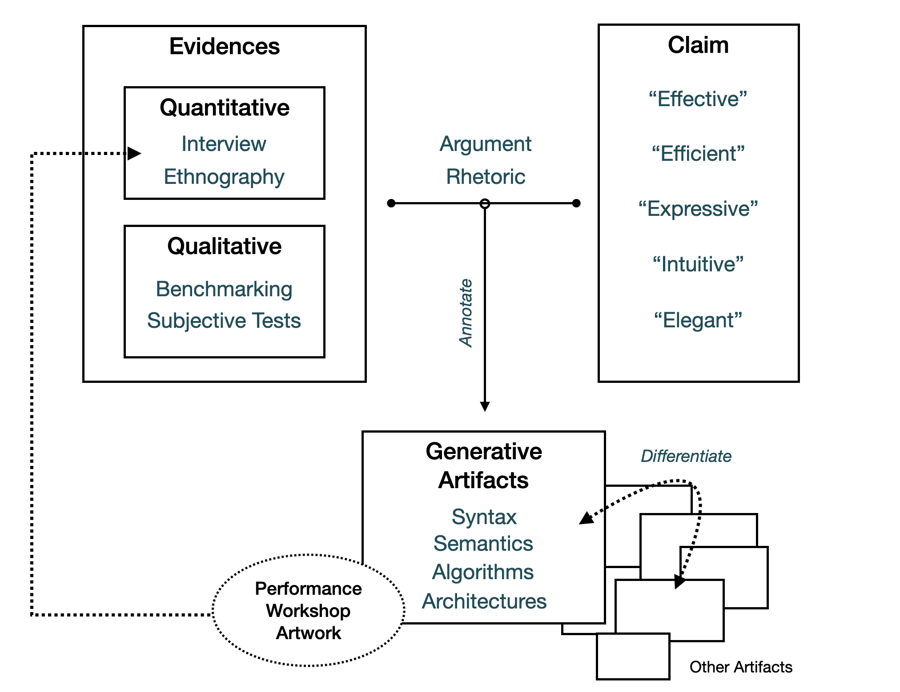

<!-- どうコンピュータ音楽プログラミング言語を研究するか -->

# 音楽プログラミング言語をどう研究するか

前章では、音楽プログラミング言語におけるブラックボックスを減らしていくことで、より音楽プログラミングにおいてユーザーが自由にプログラムを組めるようになり、長期的には、一度は失敗したように見える、デジタルした音楽における消費と生産の二分化からの脱却に改めてアプローチするきっかけになるかもしれないことを音楽のインフラストラクチャという視点から考察した。

ではそのような音楽プログラミング言語を設計するという行為は学術的にはどのように正当化できるだろうか、という問いを本章では検討する。

新しい音楽プログラミング言語や、コンピューターを用いた音楽の表現を科学的な研究として提示するには直感的には2つのアプローチがあるように見える。

1つは、これまでできたことをさらに効率よくできるようになったと主張すること、もう1つは、これまでできなかった表現ができるようになったと主張することだ。合わせ技として、例えば人間にはできないレベルの複雑さのアルゴリズミックコンポジションをコンピューターの計算能力を借りることによって実現できるようにする、効率により新しい表現にアプローチするというものも考えられる。

さてこの時、できなかったことをできるようにしたタイプの研究の場合、新しくできるようになったことの何がよいのかに関しての正当化を求めるべきか、仮にそうだとしたらどのようにすればいいのかという問題がある。研究者とその音楽の表現を必要としている者（≒ユーザー）が分かれている場合にはどんなにニッチな表現であっても表現の多様性を押し広げるものとして正当化でき、一方で研究者自身が表現の当事者でもある時には、その表現ができたからどうした？といった構造があるように見える・・・。（もうちょっと整理したい）

こうした、音楽のためのソフトウェア制作を研究とする場合の位置づけとして、**デザイン実践を通じた研究（Research through Design:RtD）**と呼ばれるアプローチが考えられる。RtDとは簡単には、デザインという行為や対象が、単なるプロダクトからソフトウェア、インターフェース、サービスなど多様化する中、それを学術研究として捉えた時には、単に問題解決、仮説検証を行う科学とは異なる分野の学問として考える必要があるのではないかといった問題意識の中行われている様々な議論を、"不明瞭かつ個別固有の社会・技術的問題を対象とする臨床的、生成的研究"[@Mizuno2017]として位置付けるような運動である。

もっとも、RtD音楽のためのソフトウェア研究や新しい音表現のためのインターフェース（New Interfaces for Expression:NIME）研究においては、それらを包括するHuman-Computer Interaction(HCI)の分野において、単に仮説を検証し量的な評価を行うのでは正当化することができないような研究をどう評価していくべきかといった意味でのディスカッションとしても扱われている言葉ではある。本章ではまずデザイン学全体におけるRtDの議論の変遷を水野大二郎の文献[@Mizuno2014;@Mizuno2017]を中心に参照しつつ、音楽プログラミング言語、NIME研究の中でRtD的研究についての位置付けを行った論文との議論を並列することで、音楽プログラミング言語研究において、これまでより広範な意味でのRtD、特に、長い時間をかけて社会構造の変革を促すことを目指すトランジション・デザインのようなアプローチの研究の可能性を議論する。

# RtDの変遷 

HCI研究の中でのRtDというアプローチの位置付けについて検討したウィリアム・ゲイバーの「What Should We Expect from Research through Design?」(デザインを通じた研究に何を期待するべきか？)という論文では、RtDには、カール・ポパーの言う科学的アプローチたる必須条件、反証可能性（Falsifiability）がないことにより、RtDを科学から明確に区別する[@Gaver2012]。デザインが今日対象とする問題はリッテルとウェバーが60年代に導入し、90年代にブキャナンがデザインの理論の中に位置付けた "意地悪な問題(Wicked Problem)"[@Buchanan1992]—全ての問題やその解決のための試行が個別に異なりその試みを実証主義的な方法で理論として一般化することができないような問題だからである。

ゲイバーはその上でデザイン学における理論とは、作られた人工物に対する注釈(annotation)付きのポートフォリオのようなものだという提案をする。建築家クリストファー・アレクサンダーが提示し、2000年代にコンピュータープログラムやインターフェースのデザインのための指標となったパターンランゲージ[@Eto2009]のような、繰り返される試行から帰納的に得られる規則ではなく、個々の事例の個別性を保ったままに、自らが新しく作ったものの類似点や差異を見ることで、各事例の究極的個別性(Ultimate Particular)を保ちながらも、拡張可能かつ検証可能(Verifiable)な理論を構築できるというのだ。それゆえ、 "デザインの知識は生み出した人工物に近づき留まった時最も信頼に足る"[@Gaver2014,筆者訳]であるとする。

確かに、世界の中から未知の事実を発見する科学という行為と、世界の中に未知の事物を作り出しそれを解釈したりするデザインという行為はこの見方では全く別の体系に基づく学問ということとなる。しかし、この議論に乗るのだとすれば、筆者がこれから行おうと思っている音楽プログラミング言語の特徴や評価の語彙を整理したりする一般化や抽象化は無粋なものとなってしまうように思える。そこで、ここからはRtDの歴史的流れを継続してみていきながらも、一般論だけでなく音楽プログラミング言語という分野特有の事情を考慮しても同じ結論が出るかを考え、より本研究の位置付けを詳細に検討しよう。

# 音楽ソフトウェア・インターフェース研究におけるRtD

ダールは音楽のための新しいインターフェース：NIME研究は学術研究としてどのように位置づけられるかについての論考の中で、いくつかの指摘と問題提起を行う[@Dahl2015]。まず、新しい楽器を作ることは意地悪な問題の一類型であるということだ。これは環境問題のような大規模な問題の類と比べれば全く同じような類の意地悪さではないようにも感じるが、最低でも明確な議論のガイドラインが存在しないということや、一般化できる事例が少な過ぎて理論化しづらいという意味では、明確に科学的事実を解明する研究パラダイムとは異なるという意味では納得がいく。

加えて、ダールはストークスの研究という行為を基礎的理解(≒知の創出)のための研究であるか？という軸、実用されることを考慮されているか？という軸の2つで分割した "パスツールの象限"[@Stokes1997]を参照しNIME研究の位置付けを試みる。[@fig:stoke]において、知の創出かつ実用を目的としない左上の領域は例えば量子力学におけるボーアのような基礎研究の領域であり、一方実用されることだけを目的とし知の創出そのものは目的としない右下のエジソンの発明群、そして、右上に実用的な理由に牽引されつつも新しい知の基礎となったパスツールの乳酸発酵の研究などがある。

![ストークスによる研究の象限。[@Dahl2015]より。](img/stokequad.png){#fig:stoke width=50%}

この象限にNIME研究を位置付けるとすればどこになるだろうか？右下の実用だけを意識したものだとすれば、それは企業が生産する楽器群とどのように区別ができるのだろうかという問題がある。実際にダールは、フォールマンによるデザインリサーチの3つ組という分類[@Fallman2003]を参照し、"産業とのインターフェース"であるDesign ProcessとはNIME研究において企業が一般的に楽器を作るプロセスと対応するという。

一方右上の実用を通じて知の創出を得る研究なのだとすれば、1.その知とは一体なんなのか、2.その知をいかに証明できるか、3.その知は一体いつ発生するのかといった問題群が浮かび上がってくる。仮にNIMEで創出できる知もゲイバーがいうようなAnnotated Portfolioのように、理論として一般化することができず、個々の差異との比較によって議論されるものだとしたらいったん1.(What)と2.(How)は横に置いておいてもよいだろう。しかし3.(When)は筆者のようなソフトウェアを研究するものにとっては考えるべき重要な問題になる。つまり、NIME研究をするということは、楽器を作る過程で得られる知見と、その楽器を演奏するとき、あるいは評価実験などでユーザーに使ってもらうことで得られる知見とが混在していることをダールも指摘している。

音楽プログラミング言語全般の開発を研究とする場合にも、NIME研究における学術的研究の位置付けとは何かという疑問を同様に適用することができる。西野は音楽プログラミング言語設計という行為が、音声合成の手法の確立などの研究と比べれば、実用的なツールとしての目的意識と評価という側面が強く、知への貢献という側面が十分に取り上げられていないということを指摘し、自らが開発するLC言語の設計をRtDの側面から分析している。西野はmicrosoundという、ローズによって提案された、音声データを数ミリ秒単位に切り刻み再構成するような音声合成の手法[@Roads2003]が既存の言語では十分に表現できないという具体的事象から、mostly-strongly-timed languageという新しい音楽プログラミング言語における概念の創出ができているという具体例を示す[@Nishino2012]。これはストークスの四象限におけるパスツールに相当するものと言える。もっとも、mostly-strongly-timedというコンセプト自体を引き継いだ言語はLC以後開発されているわけではなく、果たして創出された知や概念というものがパスツールの発見した乳酸菌と同じように扱えるのだろうか、デザインを通じて作られた、究極的に個別的な人工物と区別がつくのだろうかという疑問は残る。
とはいえ、第4章で詳しく見るように、mostly-strongly-timedコンセプトの元となったChucK言語のstrongly-timedという、論理時間スケジューラ上でのサンプル単位での正確な制御を可能にする概念は明確に他の言語にも影響を与えている他、直接的にChucK

# プログラミング言語における量と質の相互作用

こうしたデザインの個別性に伴う理論の一般化や評価の困難さは本論文で検討するもう1つの領域、プログラミング言語一般に関する評価について検討することでもう少し明確な議論をすることができる。

音楽目的に限らない、システムレベルのソフトウェア開発などに使われるプログラミング言語の設計を考えれば、その言語によって作られるアプリケーションの実行速度は明らかに重要な評価指標であり、また（使われるマシンの種類などの環境を揃えれば）定量的に計測することが可能である。では、あるプログラミング言語のコンパイラの機能Xの実装を工夫することにより、実行速度を20%ほど改善できたとしたら、それはなんらかの事実を解明したことになるのだろうか、それともある手法やソフトウェアといった人工物を生成したことになるのだろうか？といったように、プログラミング言語という分野自体、1960年頃から工学的なアプローチで長く研究がされている中、学術的研究としてどう正当化するか、特にどのように評価すればよいかという話題は2009年のACM SIGPLAN（Special Interest Group of Programming Language:プログラミング言語の国際会議を主催する団体で最も大きなもの）主催の*PLATEAU: Evaluation and Usability of Programming Languages and Tools*が開催されるまであまり触れられてこなかった。

その中でMarkstrumは新しい言語の実装や設計などのアイデアを論文として提示する際の正当化の方法として、**主張と根拠の整合性(Claim-Evidence-Correspondense)**という見方を提示する[@Markstrum2010]。Markstrumによれば、プログラミング言語の論文で提示される主張は大きく分けて3種類あるという。1つ目はこれまで存在しなかった新機能を作ったというもの、2つ目はすでにある既存の機能の効率性を上げるような内容、3つ目は望ましい言語の特徴(property)、つまりこの言語は直感的である、読みやすい、効率的であるといったような内容だ。しかしこれまでのプログラミング言語の論文には、1と2、つまり新機能と機能の増強に関しては論文が査読されたものであるならば十分認められるものであるが、望ましい言語の特徴に関してはその主張と、それを支える根拠は両方とも提示されているが論理的な結びつきが不十分であるとしたのだ。

こうした研究はのちにより近年のCoblenzらによるプログラミング言語における評価語彙の整理（第5章で詳しく紹介する）などにつながっており、Markstrum自身も警鐘したように、主張と根拠の整合性を証明する方法論は統計的な評価実験のような実証主義的方法よりも、例えば近年のMullerとRinglerの修辞的フレームワークのように、論文中で主張された表現の変遷などを人文学的手法で辿ることで明らかにするような研究が進んでいる[@Muller2020]。

つまりプログラミング言語という領域における知の創出の体系は、新しい文法の提示のような生成的な人工物、ベンチマークテストのような量的に計測、比較ができる結果、ユーザーインタビュー調査のような質的調査の結果、主観評価実験のような統計的手法による量的なユーザーフィードバックといった様々な種類の論拠を組み合わせて、効率が良い、読みやすい、表現力が高いと言った主張をなんらかの修辞的な方法によって結びつけることによって行われる。

このようにプログラミング言語という領域が、論拠に関してはある程度反証可能性が存在する、しかし最終的に作られた言語そのものの定量、定質的評価が難しいという形而上学とも形而下学(≒科学)とも言える独特の体系を持つ理由としては、量的な特徴の変化がその言語の質的な変化に大きく影響を与えることが時にあるという事情もある。

例えば音楽プログラミング言語に関していえば、本章冒頭で"合わせ技"と表現したように、アルゴリズムを用いた作曲を同じ手法でも、人間が手動では行えないような計算速度を借りることによって異なる種類の音楽にすることができるし、第4章で見るように、音楽プログラミング初期の一度信号処理の結果をテープに書き込んでから再生する方式と、80年代以降のリアルタイムに信号処理ができる環境とでは作られる音楽の質も大きく異なる。加えて、より事情を複雑にする問題としては、例えばライブコーディングのような、プログラムの動的変更のしやすさという質的特徴を強化した言語を作ろうと思うと、プログラムの実行性能は静的な言語と比べると低くならざるを得ないという、いわば**量的特徴と質的特徴間のトレードオフ**が発生するという問題がある。

こうした事情を鑑みれば、ベンチマークや主観評価実験、インタビュー調査といったあらゆる手法による証拠そのものにはそれが存在するだけである程度一次資料として有用性もあるし、ただ実行速度が上がるような改善をもたらすだけでもその言語の存在意義に関わる変化となる可能性はある。そこから先の主張に関してはゲイバーの言うような人工物のAnnotationを補強するものとしてこれらの論拠を使うことで、個別の言語の具体性をより高め、理論化は個々の差異を見ることによって可能になる反証できない生成的学問として取り扱う、というような棲み分けをすることでRtDとしてのプログラミング言語研究という領域を記述することができる。

この考え方は音楽プログラミング言語という、汎用プログラミング言語よりは量的に測れない指標が多くなってくる研究対象に関して、工学的アプローチ以外の研究方法の見通しを良くしてくれるものになるだろう。

# 音楽プログラミング言語のデザインという研究領域

{#fig:researchprogram width=80%}

さて、ここまでの議論を[@fig:researchprogram]にまとめた。プログラミング言語のための新しい文法やアルゴリズムを提案するという作業は時に既存の研究から飛躍することもある生成的な作業である。そしてそれによって成される主張は時に主観的な用語を用いる不明瞭なものでもある。そうした主張を支えるものとして、ある程度反証可能な方法で論拠を提示する。これには主にベンチマークや主観評価実験に基づく定量的データによる論拠、文献調査、インタビューとその分析、エスノグラフィと言った様々な手法によって得られる質的なデータによる論拠、時にその両方が存在することになる。その論拠と主張は適切な修辞によって結び付けられ、そのclaim-evidenceの結び目を持って生成した言語やアルゴリズムという人工物に注釈：Annotationを付ける。これらの要素はある程度独立性があるため、例えば論拠となっているベンチマークの測定に間違いがあったり、質的データ分析の方法論が適切でなかったとしてそれらのデータを取り下げたとしても、作られた人工物そのものを丸ごと棄却しなければならないわけではない。新たにデータを分析し直して適切に主張と結びつけ直すことができればその言語の学術的価値を改めて提示することができる。

注意しなくてはならないのは、論拠はあくまでも主張と結びつくことによってはじめて意味があるものとなるので、単に言語Aにおけるベンチマークと言語Bのベンチマークを比較してAのほうが性能が高かったからといって、言語Bは淘汰されるべきということにはならない。これは量的特徴と質的特徴のトレードオフの問題を考えれば当然とも言えることだろう。加えて、論拠には様々な研究パラダイムが混在しており、質的研究の中でも実証主義的—解釈主義的なスペクトラムが存在しているため、自分がどの立ち位置で論拠を見出そうしているのかを依然自覚する必要がある[@Otani2019,p30~p32]。それゆえ、ベンチマークを取るのであればその手法や環境は再現可能性が担保されているべきだし、評価実験を行なったのであれば、その実験自体も追試が可能なものであり、実験によって得られたデータの分析方法も検証可能なものでなければならない。

加えて、音楽プログラミング言語という領域で考えれば、DahlのNIME研究におけるWhenの問題を考えれば、作られた音楽プログラミング言語を用いて作った音楽、プログラム、パフォーマンスといった二次人工物とでも言うべきものが、それ自体デザインの成果としての比較対象になる独立性を持ちながらも、その経験を通したインタビューやエスノグラフィといった、新たに一次人工物に注釈を付けるための材料にもなっているという、再帰的な構造を持っていることがわかる。

# 拡大するデザインの領域

ここまでは比較的HCIという閉じた領域におけるRtDの実践からみた音楽プログラミング言語研究の位置付けと方法論について検討してきた。しかし近年、RtDの対象とする領域はこれまでのプロダクト、サービスといった単位のものから社会システム、法、金融などより広がりつつある。Koskinenはこの広がりつつあるデザインをその活動の場という視点でLab、Field、Showroomという3つに分類した[@Koskinen2015]。LabにおけるRtDは本論文でも中心的に議論の対象となっている、ソフトウェア、インターフェース、特にNIME研究にも代表されるもので、生態学、認知心理学などに由来し、プロトタイピングと評価実験を繰り返しその価値を提示する。FieldでのRtDは文化人類学などに由来する、ユーザーがいる環境を社会科学的な質的な調査法を中心に理解することを目指した研究である。そしてShowroomでのRtDはいわゆるクリティカル・デザイン[@Marpus2019]やスペキュラティブ・デザイン[@Dan2013]に代表される、ありえるかもしれない並行世界に存在しうるような装置や、時にユーモアを交えた不合理さを持つ、必ずしも現代において役立つものではないプロダクトのような人工物を、物語、展示や映像といった表象を組み合わせることで、社会構造に対する批評的役割を担ったり、議論を促すことを目的としたアプローチだ。スペキュラティブ・デザインやクリティカル・デザインに通底する考え方は、現在の科学技術が中立的ではないあるイデオロギーのもとに出来上がったものだとして、Papanekの「生きのびるためのデザイン」[@Papanek1971]に代表される、大量消費社会における功利主義的なプロダクトデザイナーに対する批判を受け継いだものである。

このようなデザイン領域の広がりと並列して、音楽プログラミング言語のデザインも単にコンピューターを使った音楽制作のための道具というだけの側面ではなく、コンピューターを用いる音楽文化そのもののグランドデザインといった側面を持つ研究が行われてきた。Mclean、Magnusson、Sorensenらのような、ライブコーディングと呼ばれるコードを書くことで演奏する文化を形成してきた音楽プログラミング言語の設計者たちはそうした音楽文化自体の（再）デザインを試みてきた人物である。本章の残りは、このような音楽プログラミング言語設計自体の再構築する試みを広義のRtD的実践として位置付け、さらにその背後にある科学技術社会論の理論と接続することを目指す。なお本章で取り上げるTidalCycles、IXI、Extemporeという言語はその実装面を技術的にも様々な議論の切り口はあるものの、その視点は第4、5章へ先送りし、本章ではその言語の目指す音楽文化のビジョンという大きな射程の方により重きを置く。

# 科学技術社会論との繋がり

クリティカル・デザインの背景には科学技術社会論（STS）と多くの理論的系譜を共有する[@Marpus2019,p113~p114]とされており、中でも80年代にブルアが提唱したストロングプログラムに代表される、社会学の理論を科学にまで拡張させ、科学知識の理論もある社会集団によって形成された信念の一種であるため、その集団の特性やプロセスの分析によって科学や技術の実態を明らかにすることができるという社会構築主義的な態度と並列して発展してきたものと並行して発展してきている。 一歩進めて、分析からデザインという人工物を作ることにより、開かれた環境で議論を巻き起こし未来の科学技術環境をかたどる公衆を形成するものとして

## マグヌッソンによる認識論的道具としてのDMI

SuperColliderを用いたライブコーディング環境ixiQuarksを制作したマグヌッソンは博士論文でコンピューターを用いたデジタル楽器（DMI:Digital Musical Instruments）を特徴付けるものはなにか、つまり、アコースティックな楽器とDMIはどう違うのだろうかというシンプルな問いを、スティグレールの技術哲学、ラトゥール、カロンらによるアクターネットワーク理論などを援用しながらDMIの現象学的考察を行った[@Magnusson2009]。これはコンピューター音楽のためのプログラミング言語やDMI研究の中でも特異かつ長大な人文学的考察を行っている。その中で彼は**認識論的道具(Epistemic Tool)**という概念を提唱した。この認識論的道具とは、別の表現では**拡張された精神によって使用される、知識のコンベヤー**ともされており、なるべく単純に言い直すのであれば、コンピューターという、シンボルを操作する装置を使って楽器を作る以上、その楽器の中にはその文化圏でやりとりされるシンボルが埋め込まれることになるという現象を表した言葉である。

マグヌッソンが議論の射程に置いたものを簡単に解釈すれば、DMIを演奏するときの身体の役割はどこにあるのかという視点、それから、演奏者における主体はどこにあるのか、ということだとまとめられる。前者の、DMIにおける身体性というのはNIME研究の中でも重要な話題であり、90年代にラップトップによる個人での音楽制作が容易になって以降、演奏においてラップトップに向かいトラックパッドやつまみの付いたコントローラを操作するだけのような傾向に対して、より人間の身体を十全に活用できるようなインターフェース作りが目指されてきたという背景がある[@Jensenius2016,4.2]。

確かに、コンピューターを用いた楽器は身体の様々な動きをセンサーなどを通じて取り込み、様々な音楽的要素にマッピングすることでアコースティック楽器とは異なる新しい表現を可能にするかもしれない。TanakaはDMIにおけるパラメーターのマッピングこれを認知心理学者ギブソンが提唱し、ノーマンがインターフェースデザインの分野に援用し（さらに次節で解説するように、のちに撤回され）たアフォーダンス理論、つまり主体が行動できる可能性が環境やオブジェクトの中に埋め込まれているという考え方を用いて分析することで、DMIを演奏するという時には、楽器が演奏者の音楽的表現を引き出すというアフォーダンスと同時に、それを見る/聴く聴衆との間に音楽を通じた対話的なやりとりを引き起こすアフォーダンスという、2段階のアフォーダンスが存在していると主張する[@Tanaka2010]。

この主張は、楽器のデザインにおける視点を演奏者–楽器という閉じた系から、演奏者–楽器–聴衆という系として、DMI制作を社会的行動の1つとして視点を広げるものであり、実際Magnusson自身もTanakaの論文で引用されるようにixiを用いたパフォーマンスをアフォーダンスの観点から分析している[@Magnusson2006]。

マグヌッソンの認識論的道具はこの社会的行動としての道具をさらに、演奏者–楽器–聴衆の三者の一回きりの関係とするのではなく、プログラマが長い時間をかけて楽器を作る作業の中に、その中で他の人がさらに時間を掛けて開発してきたライブラリを用いて開発し、繰り返しパフォーマンスをする中で演奏者と聴衆の間で共通の語彙が形作られていく、という、長い時間をかけて培われる音楽文化の中の行動のひとつとしてDMI、あるいはixiという音楽プログラミング言語制作を位置付けた。 だがここでマグヌッソンが指摘するのはDMIを作ることが社会的行為である（特に、センシングなどを用いた参加型の楽器やパフォーマンスなど）ことを肯定するよりも、むしろDMIの制作者はアコースティック楽器に不可能な自由な音楽制作を一見しているように見えて、その実記号的循環の中で形成される社会の文脈に拘束されているといった否定的ニュアンスを強調している。

> アコースティック楽器制作者とは反対に、構築/作曲された（composed）デジタル楽器のデザイナーは、シンボル的デザインを通じアフォーダンスをかたどるため、それゆえ音楽理論のスナップショットを作り音楽文化を時間的に凍結させるのだ。[@Magnusson2009]

この悲観的とも言える態度は科学技術社会論の潮流の変化と照らし合わせることで理解しやすくなる。科学技術はある社会集団のイデオロギーによって形成されるというような、ブルアに代表される社会構築主義的な見方を採用するとすれば、例えば楽器は常に製作者が考える出したい音色や、あるいは生産コストと需要の兼ね合い、ユーザーテストの結果というような、人間側の都合によってだけ左右されるのであって、材料のような物質的な、より端的に言えば自然の中にあるものは作るものに何も影響を与えないのだろうか？という疑問を考えてみよう。

マグヌッソンが念頭におく、ラトゥールとカロンによって提唱されたアクターネットワーク理論のような、非人間、人間の区別を取り払い（アクターとすることで）、それらが相互に影響を与え合うという視点での科学史観には、社会一元論的な考え方に対して、自然–社会とそれぞれが与え合う影響のバランスを取る意味合いがある[@Fukushima2017]。この価値観の中では、楽器は楽器製作者の意図それだけによって構築されるのではない。アコースティック楽器の制作者は木材や金属といった材料を相手にし、その音色や演奏される方法は制作者と素材というエージェント（無生物）との折衝において形成されていく。またマグヌッソンはシンセサイザーのような電気楽器であってもやはり電子部品という素材と格闘しながら反復的試作プロセスを繰り返す中でデザインが固まっていく。ここでは、例えばオシレーターやフィルターと言った、科学技術の用語とメンタルモデルを組み合わせることで楽器は構築されていくため、素材との対話といった側面はやや落ち着くものの、物理的制約や不確定性は未だ残るとしている。

では果たしてコンピューターを用いた楽器の場合はどうだろうか？コンピューターという象徴機械におけるプログラミング作業はもはや不確定な物理的特徴による制約がない代わりに、材料となりうるものは言語や記号そのものであり、しかもそれはほとんどが誰かが作り上げてきた言語体系をブラックボックス化したもの（≒ライブラリ）だ。結局、 "想像しうるどんな音でも作れる[@Theberge1997]" 、というシンセサイザーやコンピューターを用いた音楽の売り文句であった言葉は、対偶を取れば "想像することができなければどんな音も作ることはできない" となるようにその可能性に限界をはじめから示しており、むしろ材料や物理的特性による意図しない変化や使用法を生み出すことができないという意味では、さらに広がりが無いものにもなりかねないのだ。

## 知覚されるアフォーダンスとシグニファイア

このアコースティック楽器とデジタル楽器の特徴の違いはアフォーダンスが「真のアフォーダンス」か「知覚されたアフォーダンス」かという視点でも同じことが説明できる。

ギブソンが認知心理学の分野において導入したアフォーダンスという概念と、それをデザインの分野に援用したノーマンのアフォーダンスの概念はかなり異なることが知られており（Tanakaの文献でも明確に区別されている）、ノーマンもこれを後に自分でも別物だと認識し、ギブソンの提唱した本来のものを「真のアフォーダンス」、自らがデザインに応用したものを「知覚されたアフォーダンス」と言い直し[@Norman2000,p162]、さらに後年では明確にアフォーダンスという語を導入したことが失敗だったと話し、知覚されたアフォーダンスという名前も「シグニファイア」と新たに名付け直している[@Norman2011,p100,p253]。

ノーマンの解説を借りれば、ギブソンの意味するアフォーダンスとは "生態の持つ可能性とモノの持つ可能性との間の関係性であって、それらは存在に気づくか気づかないかには関係なく実世界に存在するもの"[@Norman2011,p254] であり、一方の知覚されたアフォーダンス（シグニファイア）とは、例えばWebブラウザの縦スクロールバーは上下方向にしか動かないことでこのページが左右にはスクロールできないことを示し、ユーザーの行動を補助していると見ることができ、これはプログラマが付けた制約によって生まれた知覚がユーザーの行動をアフォードしているといったようなものだ。"知覚されたアフォーダンスは、現実のものよりも約束事に関係することが多い"[@Norman2000,p163]という説明と、後の言い換えの\ruby{シグニファイア}{Signifier}とはソシュール言語学における\ruby{シニフィアン}{Signifian}そのものであるように、\ruby{信号}{Signal}を伝える記号的な、あるいは記号によらずとも形式的な仕組み—例えばギャロウェイの言うプロトコル[@Galloway2017]などを用いて伝達する仕組みを表したものだと言えるだろう。

アコースティック楽器を制作する際に楽器製作者は作りたいものを想像して作っているかもしれないが、現実の制作は木材や金属、あるいは電子部品といった材料にアフォードされてその材料特有の性質が決定される。一方コンピューターを用いた楽器をプログラムを組むことで作る際には、誰かが作ったライブラリのAPI–Application Programming **Interface**やプログラミング言語の統語論、意味論に持たせられたシグニファイアに従ってその性質が形作られていく。

# 小括–コンピューターで「自由に」音楽を作る？

