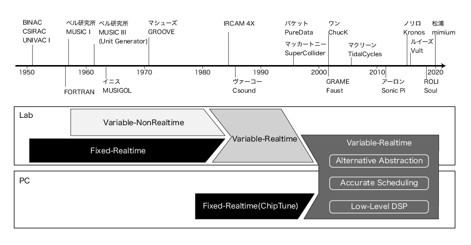
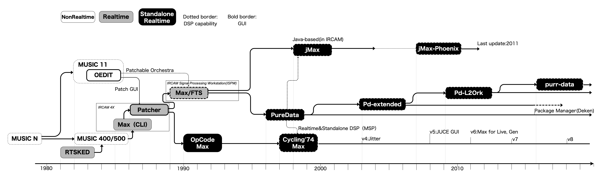

<!-- \epigraph{コンピューターは「器楽的」な音楽の演奏を、作曲家を補助するために、もしくは誰の補助もなく作曲するように、プログラム可能である。}{『\citefield{Mathews1963}{title}』\\ \citep[筆者訳。]{Mathews1963}}

\epigraph{コンピューターはコンピュータ処理において、いわば音楽における楽器のような役割を果たす。ソフトウェアは譜面にあたり、それを「演奏」したものは、人間の能力を増幅し、精神を高める。}{『\citefield{Kay1984}{title}』\\ \citep[p96]{Kay1984}} -->

> コンピューターは「器楽的」な音楽の演奏を、作曲家を補助するために、もしくは誰の補助もなく作曲するように、プログラム可能である。
> [@Mathews1963,筆者訳]

> コンピューターはコンピュータ処理において、いわば音楽における楽器のような役割を果たす。ソフトウェアは譜面にあたり、それを「演奏」したものは、人間の能力を増幅し、精神を高める。
> [@Kay1984,p96]

# 音楽のためのプログラミング言語とはなにか

本章では音楽のためのプログラミング言語（Programming Language for Music：PLfM）の歴史を再検討し、その存在論の通時的な整理を行う。

## PLfMという用語導入の必要性 {#sec:plfmdef}

ここで初めて、ここまでは字義通りの定義に留めて暗黙的に用いてきたPLfMという用語を用いる意図を改めて説明する。音楽のためのプログラミング言語は既存の文献では、Computer Music Language[@McCartney2002;@Mcpherson2020]、Language for Computer Music[@Dannenberg2018]、Computer Music Programming Systems[@Lazzarini2013]などの呼ばれ方がされているが、それぞれの語の使用に明確なコンセンサスがあるわけではない。

その中で敢えて、既存の語を用いずPLfMという新しい語を導入するのには、少なくとも3つの理由がある。

1つ目は、Computer Musicという語を用いることによって、そのための道具が、コンピューターを用いることで新しい音楽表現を追求するというイデオロギーを持つ、特定の音楽様式と結びついてしまうことを避けるためだ。今日ではあらゆる音楽制作と再生のためにコンピューターが用いられている以上、あらゆる音楽は**弱い意味でのComputer Music**と呼ぶことができる。しかしそれらの多くはコンピューターでなければ不可能な、コンピューターというメディア固有の表現を目指しているわけではない。同様に、たとえば信号処理のアルゴリズムを抽象化することに特化したプログラミング言語Faust[@Orlarey2004]は、新しい音楽表現を必ずしも目的としていないが、その言語実装のための技術的要素はComputer Musicのための言語とも多数の共通点がある。またそれらのコンピューター音楽の文脈とは、3章で解説した、Macintosh以後のユーザーの誕生以前から行われてきた取り組みであることを頭に入れる必要がある。つまり、プログラミングという作業がユーザーから隠蔽される以前の1950〜1970年代におけるコンピューターの利用することはほぼ必然的にプログラミングを行うことでもあった。それゆえ、1990年代以降に現れてきた、パーソナルコンピューティング環境で使うことを想定された言語とは、コンピューターを使うためのインターフェースの中でよりユーザーフレンドリーな選択肢があるにも関わらず、それでもなお人工言語という形を選んでいるという面が強調されて然るべきである。

2つ目はPLfMという枠組みを用いることで、単にコンピューター上のテキストというフォーマットで音楽を表すことを目的とした言語たち、例えばMML（Music Macro Language）のように五線譜上の記法を直接的にテキストに置き換えたような言語が、これまでの文献では比較対象に入れられること自体少なかったのに対して、チップチューンを含めた広い意味でのコンピューターを用いる音楽文化を構成する要素の1つという文脈での議論が可能になる。

3つ目は、Computer Musicという語を避けたのと同じように、Programming EnvironmentやProgramming Systemといった語を避ける理由である。これは、音楽のためのプログラミング言語といった時に、Maxのような、ある特定のアプリケーションを想像するニュアンスを抑えるための選択だ。たとえば、汎用プログラミング言語の理論においては、プログラミング言語、と言った時にはその言語を実行するためのソフトウェアやプログラムのことを必ずしも指していない。同じC++という言語であったとしても、それを実行するソフトウェア（コンパイラあるいはインタプリタ）はGCC、Clang、Microsoft Visual C++といったように複数存在し得るからだ。これらのコンパイラは、どれもC++の厳格な言語仕様で定まっている通りの動作をするが、言語仕様で未定義とされている動作をさせたときの挙動はそれぞれ異なるし、同じソースコードだったとしてもコンパイラが出力する実行バイナリ（≒アプリケーション）の中身はそれぞれ異なる。音楽プログラミング言語においては、基本的にある言語＝特定の実行アプリケーションを指すことがほとんどではある。根本的にはアプリケーションの設計実装という作業とプログラミング言語の設計実装という作業は異なり、本研究が対象にしたいのは言語（Language）の設計なのだ。こうしたニュアンスを込めて筆者はEnvironmentやSystemという語を用いないことにした。

プログラミング言語はコンピューターを使うための道具であることは間違いないにせよ、極論を言えば、Faustのような厳密に意味論が定義されている言語ではコンピューターを用いずともソースコードを手作業で解釈し実行できることを考えれば、徹頭徹尾人間のための道具でしかない。だからComputer Music Languageとも、Computer Music Programming Environmentとも、呼ばずに、ただ音楽のためのプログラミング言語：Programming Language for Music、PLfMなのだ。

## PLfMに関連する既存のサーベイ

まずは、既存の音楽のためのプログラミング言語に関連したサーベイについてを列挙しておく。

既存の音楽のためのプログラミング言語や、コンピューター音楽のためのシステムのサーベイとしては[@Roads2001]や[@Nishino2016]、[@Wang2017]、[@Dannenberg2018]などが存在する[^authorsinfo]。ローズによるコンピューター音楽の手法を網羅的に記述した著書（原題：Computer Music Tutorial）では、初期のコンピューター音楽の試みが過去のインタビュー[@Roads1980]なども踏まえて記述されている。西野と中津のサーベイではこれよりも詳しく、1940年代から2010年代まで時系列順でコンピューターを用いた音、音楽生成の試みの歴史が網羅的に記述されている。ダネンバーグの文献は西野同様歴史的に代表的な言語の紹介と、より言語の特性や分類について構成的な整理が行われている（これは主に第5章で足掛かりとする部分である）。

[^authorsinfo]:なお、西野はLC[@Nishino2014]の、ワンはChucK[@Wang2015]の、ダネンバーグはNyquist[@Dannenberg1997]他多数の言語の設計者でもある。このことからもやはり、音楽プログラミング言語の歴史を記述するには基本的にその設計や実装に関する知識や経験が必要になっていることが窺える。

またメディア考古学的検証を行う本研究において重要な、1940〜1960年代までのコンピューター音楽黎明期歴史の整理が詳しくなされている文献として、オーストラリアにおける初期のコンピューターを用いた音楽生成の試みを研究したポール・ドーンブッシュの調査がある[@Doornbusch2005]。この調査を契機として2005年以降、イギリスの放送局BBCやアーティストのirrlicht projectにより最古のコンピューター音楽生成の検証が進んだ[@Fildes2008][@Irrlicht2015]。これらの調査はのちに日本において、田中がチップチューン（1980年代の初期パーソナルコンピューターやゲーム機において用いられていた音声生成用のICチップを利用した音楽ジャンル）の歴史的起源として位置付けることで、改めてまとめられている[@Tanaka2017][^chiptune]。ドーンブッシュ自身もこれらの検証を踏まえ改めて黎明期の歴史を整理し、アメリカ中心的コンピューター音楽の歴史観を批判的検証を行った[@Doornbusch2017]。

[^chiptune]: 田中も記述するようにチップチューン自体は日本での独自の発達を遂げたこともあり、コンピューター音楽の歴史としては傍流の歴史として扱われている。しかし、その文化の中から生まれたMML（Music Macro Language）のような、テキスト形式で十二音とリズムを記述する言語の系列は、そのハードウェアやプラットフォームごとに複雑な派生を遂げており、その歴史は未だ十分にまとめられていない。PLfMの歴史研究としてはその後のTakt[@Nishimura2014]のようなより汎用言語の理論を取り込んだ言語への発展や、ゲーム音楽研究との接点となりうることを考えても、正統な発展に位置付けられているコンピューター音楽史とポピュラー音楽の中のコンピューター利用を繋ぐものとして重要な位置づけにある。本研究内ではあまり触れられなかったが、チップチューンをメディア論の視点から検証している近年の研究には例えば[@Hidaka2021]がある。

本研究ではこれらの研究を参照しつつも、3章で見てきたメディア装置としてのコンピューターと、パーソナルコンピューティングの歴史との対応関係から、時代ごとの取り組みの焦点の変化をより明確に描き出すことを試みる。

## PLfM史概略

{#fig:plfmhistory width=100%}

そのために本章では、PLfMの歴史的推移の大枠を捉えるために3つの視点での区分を導入する（なお1.2.は西野らのサーベイで使われていた観点である）。

1. **リアルタイム性**：一度結果を書き込んでから読み出すのではなく、実時間での処理ができるか。
2. **可変DSP**：音声合成のためのモジュールが有限か、（理論上）ソフトウェアで無制限に利用できるか。
3. **Lab/PC**：研究所における取り組みか、パーソナルコンピューティングか。

これらの取り組みが歴史的にそれぞれ異なる方向性の試みが重なるように行われてきた。2、3章同様に、歴史の見取り図を[@fig:plfmhistory]に示す。

1950〜1970年代の計算機自体の黎明期は全ての信号処理をCPU上で行うと、例えば10秒の音声信号の計算結果を得るのに10秒以上かかってしまう状況だった。そのため、研究内容は例え非リアルタイムだとしてもソフトウェア上で音声を計算して合成する可変DSPを重視した試みと、それよりも、たとえ限られた範囲での合成しかできなくともリアルタイムインタラクションを重視する試みという、トレードオフの選択があった。この両立は研究所レベルでは1984年のIRCAM 4Xというワークステーションによって成されたというのが一般的な認識だ。

そして、行われていた場所が大学などのラボラトリーか個人かという違いも重要な点である。すでに述べたようにMacintosh以後のパーソナルコンピューティングこそがプログラミングという作業をコンピューターの利用から分離したからである。1980年代以降のパーソナルコンピューター黎明期は、個人向けの低価格コンピューターにおける計算機リソースという制限から、1970年代までのラボラトリーにおける状況が繰り返されていた。つまり、音声合成ICによる限られた範囲での音楽制作の試みである、チップチューンがこの部分に当てはまる。

1990年代に入って以降は、パーソナルコンピューターでも専用の音声合成ICなしにリアルタイムの信号処理が可能な程度に性能向上と低価格化が進み、SuperColliderや（OpCode社によって商用化された）Max、Pure Dataなどよりハードウェアに依存しない形式のPLfMが登場した。

2000年代以降はさらに3つの流れが発生する。1つはより**正確なイベントスケジューリング**である。この理由の1つには、専用のICを用いずに音声合成をすることと、OSが複数のアプリケーションを管理することで、ユーザーアプリケーションの処理タイミングがOSのスケジューラーへ依存するようになり、実行タイミングの複雑さと非決定性[^indeterminacy]の増加が挙げられる。またもう1つにはローズが提案したmicrosound[@Roads2003]のような、音声データを細かく切り刻み再配置するような手法で必要だった正確なタイミング制御のような、表現からの要求という側面もある。加えて、この時期、汎用プログラミング言語のためのツールや理論が発展することによって、音楽のための言語にもその技術が流入してくることになった。その結果、Faustに代表される、これまでブラックボックスとして隠蔽されていた信号処理のプリミティブな部分をハードウェアに依存せず記述可能な、**低レイヤー方向の拡張**を目的とした言語の登場につながった。同時に、この時期登場してきたRubyやHaskell、Pythonなど様々な汎用性の高い言語をフロントエンドとして用い、SuperColliderを音声合成エンジンとしてだけ利用することで、言語の意味論をこれまでのPLfMと大きく変える、**オルタナティブな抽象化**を試みる言語も多く現れることになる。

[^indeterminacy]: 不確定性と読み替えても概ね問題ないが、何が不確定性に寄与しているかユーザーが判断できない：*Uncertainity*よりも、実行タイミングのズレの根本的な原因は分かっていても、それをユーザーが完全には制御しきれないというアクセス不可能性：*Indeterminacy*の意味合いで用いている。

本章において注意して読んで欲しいのは、時代ごとの変遷の見通しをよくするために3つの視点の区分を導入してはいるものの、それらはむしろ、キッパリと区分できない境界線のにじみを強調するために用いているということだ。例えば、計算リソースが限られた時代におけるリアルタイム性と可変DSPのトレードオフは、そのどちらに重きを置いていたかという、各システムのスタンスを理解しやすくするが、現実には微妙な例がいくつもある。

こうした例はチップチューンで用いられるテクニックのことを考えると理解しやすくなる。初期のチップチューンはPSG（Programmable Sound Generator）という、CPUからの命令で、3〜4種類の音程や発音タイミング、エンベロープ（音量変化）の形を制御できるシンセサイザーを用いることで作られる音楽だった。しかし、エンベロープによる音量調節をCPU側から、つまりソフトウェアの命令で非常に細かく制御してしまうことで、例えば矩形波しか出せないようなチップでも疑似的に三角波やノコギリ波に近い波形を生み出せる[@Tanaka2017,p73]。この疑似三角波は純粋な三角波とも異なる音色を持つため今やチップチューンらしさを象徴する音色でもある[^magical8bit]。この方法論はさらに突き詰めると、音量制御を細かく制御することで任意の音声波形を再生するというテクニックにもつながる[@Holst1998]。このように、リアルタイム性と可変DSPのトレードオフは、コンピューターが理論上はどんな処理も可能であることを謳う以上、同じシステム同じハードウェアだとしてもその境界線が揺らぐことは防ぎようがない。

[^magical8bit]: 例えばチップチューンとジャズ、ポップスを掛け合わせた音楽を作っている8bitミュージック・ユニット、YMCKのメンバーであるYokemuraが開発するMagical 8bit Plugというソフトウェアシンセサイザーは「三角波を8bit機の処理能力の限界内で擬似的に再現した波形です。ベースなどに適しています。波形のギザギザによるビービーというノイズが特徴で、8bitっぽさの演出には欠かせない音色です。」とあるように疑似三角波が作れることを売りにしている[@Yokemura2020]。

同様に、研究所における取り組みと個人の取り組みという区分も、直感的に理解しやすい分け方として用いたものではあるが注意して読む必要がある。そのためには、[@fig:plfmhistory]における1990年代以降の取り組みをやや個人の側に寄りながらも、研究所にもまたがる形で配置している意図を説明しなくてはならない。

現在活発に使われているPLfMは、コミュニティベースで開発されていることはあっても、その開発は当初の設計者が継続して中心的役割を果たしていることがほとんどで、かつその多くは（筆者も含め）大学などの研究機関、あるいは企業に所属している人間である。言い換えると、組織の力を借りつつ個人のスキルを活かすことでどうにか成り立っているという状況である。こうした視点に立つと、黎明期の研究所におけるコンピューター音楽の研究の中にも、非常に個人的な興味の中から生まれてきた言語やソフトウェアもあるのではないかと考えられるだろう。ただし、この視点を用いて筆者は伝統的なコンピューター音楽の権威主義的性質を否定しようとしているわけではない。第2章でロスナーの個人主義批判を見てきたように、研究所における音楽のためのシステム開発の中にも、論文には名前が残らない形での様々な貢献があったはずだということには常に注意を払い続ける必要がある。

さらに、研究所中心なコンピュータ音楽史に対するオルタナティブの提示という構造は、PC以後のコンピューターを用いる音楽実践を安易に権威化されたコンピューター音楽からの市民による民主的取り組みの萌芽という図式を作ることで、結果的にチップやコンピューターを規格化/製造する企業などによるインフラストラクチャという研究所と異なる形の権力構造から目を逸らすことにも繋がる。集団の中の個人性、これが本章を考える上で持つべき視点である。音楽を作り出す個人は常にある集団の中の個人でしかありえないし、同様にテクノロジーを生み出すある社会集団もまた、特異な個人の寄せ集めである。

# 最古の「コンピューター音楽」の解体（1950年代初頭、リアルタイム）{#sec:delaymemory}

本研究が焦点を当てるのは音楽のためのプログラミング言語であるとはいえ、直接的に言語という手段を用いない時代まで遡って、コンピューターと音楽の関わりを見つめることは背理法的に、どこからが音楽のためのプログラミングをよりそれらしくしたのかを明らかにしてくれるだろう。

同時に、コンピューターを用いた音楽の生成の試みを掘り下げるということは、ここから先は「音楽的」な試みであるとされる一般的理解の境界線を明らかにすることである。これは音楽土木工学における問いの1つ、音楽に関わる技術を作ったりメンテナンスする人は一体どこまでが「音楽的」な試みをしているのだろうか、という問題につながる。音楽学者のクリストファー・スモールは音楽を作られた作品ではなくて行為として捉えるために「ミュージッキング」という概念を導入した[@Small2011]。スモールの考えでは音楽にまつわる様々な行動＝ミュージッキングでは、例えばコンサートの中でチケットもぎりを担当する人も等しく音楽実践の一部に位置づけられる。スターンはこの考え方を音楽に関わるテクノロジーにも同様のことが言えると指摘する[@Sterne2014]。チケットもぎりと同様、楽器やソフトウェアを作ったりする人は音楽産業の中にはカウントされないがどうしてなのか、そもそも本当に「音楽産業」など存在しているのか、と。ではこの問いは突き詰めれば当然このようになるはずである。コンピューターそのものを開発する行為も音楽的行為の中に含まれる可能性はないのだろうか、と。すなわち音楽的行為の外側からの解体である。

こうした目的のために、まずは歴史を電子計算機の登場した時代である1950年付近まで遡ることにする。本稿で取り扱う「コンピューター」とは、ひとまず、自動計算機の中でもリレーのような機械的スイッチではなく真空管やトランジスタのような電子的スイッチを用いるもの以降という区分を指す。この区分で最も早い時期の具体的な例としては、アイオワ州立大学で1941年に開発されたABCとペンシルベニア大学（通称ムーア・スクール）で1946年に開発されたENIACなどが挙げられる。ENIACが当初弾道計算という軍事技術のために作られたのはよく知られている事実であるが、同様に黎明期のコンピューターの用途は弾道計算を含めた数理モデルのシミュレーションや暗号解析であった。それにも関わらず、コンピューターで音楽を鳴らす事例はENIACのわずか3年後の1949年にすでに行われている。それが、BINACである。

BINACはENIACを開発したジョン・プレスパー・エッカートとジョン・モークリーが立ち上げたエッカート・モークリー・コンピューター・コーポレーション（EMCC）によって作られた電子計算機である。BINAC開発に携わったエンジニアのルイス・ウィルソンは、1990年にチャールズ・バベッジ・インスティテュートで行われた通称UNIVACカンファレンスと呼ばれる会議でBINACの制作段階を振り返り[^univac]、近くに置いていたAMラジオが、真空管をスイッチングする際に発生する微弱な電磁波を拾うことで規則的な音を出すことに気がついたというエピソードを語っている。ウィルソンはこれを逆手にとって、コンピューターの出力にスピーカーとパワーアンプを繋ぎ、検証作業のために利用し始めた。さらにこのスピーカーの機能を用いて音楽を鳴らしたのがフランシス・エリザベス・スナイダー・ホルバートンであるとされている[^betty]。ホルバートンはENIACの実際の利用におけるプログラミング作業を行なった6人の女性の1人として知られる人物で、エッカートやモークリーとともにBINACの開発作業にも関わっていた。ホルバートンが『彼はいい奴だ（For He's A Jolly Good Fellow）』[^goodfellow]を演奏したのは公的なパフォーマンスというよりも、仲間内のエンジニアを驚かせるためにしたこととされている[@UNIVACConf1990,p72][^binac]。

[^goodfellow]: アメリカで『Happy Birthday to You』の次に定番である歌。

[^univac]: UNIVACはEMCCが作った世界初の商業コンピューターで、当初先に作られていたUNIVACの制作段階で資金が枯渇し、UNIVACの発注元とは別のノースロップ社へ納品するため先にBINACが制作された。このためBINACの方を世界初の商用コンピューターと見なす場合もあるが、BINACは納品後の動作不良などが多く実用的にあまり使われなかったことからそこには数えいれられない場合が多い。

[^binac]:通称、ベティ・スナイダーもしくはベティ・ホルバートン。詳しくは[@Irrlicht2015]を参照。田中はIrrlicht Projectがはじめてホルバートンを世界初のコンピューター音楽の実践として再発見したと指摘している[@Tanaka2017,p13]が、後述の2012年の宮崎による文献で既に、（ホルバートンが音楽を鳴らしたことには触れていないものの）ウィルソンのラジオから聞こえる動作音を利用したデバッグの部分を引用していることは付しておく。なお、田中の文献の該当部分には引用者名の誤植があることにも注意されたい。

[^betty]: ただし、計算機が音楽を演奏するという、当時にしてはわかりやすく目を引く活用例にもかかわらず、このカンファレンス内での発言を除いてBINACで音楽を演奏したとされる記述は見当たらない。ドーンブッシュはこうした理由からホルバートンの演奏については、行われた可能性があった、と言うに留めるべきと注意を促している[@Doornbusch2017,p299]。もっとも、BINACを「最古」への位置づけへ消極的な立場になることで、ドーンブッシュの研究対象であるCSIRAC（と同年のFerranti Mark I）が最古のコンピューターによる音楽生成であるという主張につなげている側面も否めない。

黎明期のコンピューターではウィルソンのようなデバッグ目的で、スピーカーを取り付けることが珍しくなかった。宮崎はこの、アルゴリズムとそのビットパターンによって生み出された音を聴く行為が、プログラミングやその中のデバッグ作業に組み込まれている状況を「Algo*rhythmic* Listening」と形容した[@Miyazaki2012]。ややもすると視覚表象文化の視点からの分析に偏りがちなメディアとしてのコンピューターを扱う実践[^chun]の中に、聴覚的な技法が取り入れられてきたことを指摘したのである。この視点は本研究のような、音楽の実践者が技術の極めて基礎的な部分を扱う学問を考える時に興味深い視点である。極めて誇張した言い方をすれば、**コンピューターを音楽制作に応用するまでもなく、コンピューターを扱うこと自体がそもそも音楽的な実践だったのではないか**、という問いを立てる必要があるのだ。

[^chun]: 例えば、メディア研究者ウェンディ・フイ・キョン・チュンによる、ソフトウェアの持つイデオロギー性を視覚文化との兼ね合いから検証した 『ソフトウェアについて、もしくは視覚的知識への固執』という論考を参照[@Chun2005]。

実際、UNIVACカンファレンスの中には、UNIVAC開発に関わったランス・アームストロングによるこんな発言がある。初期のコンピューターのプログラミングの熟練に関して、統計数学を扱う研究者と、計算手（つまり電子計算機以前の人力による計算作業を行う人たち）のプロジェクトマネージャーを比べると、はじめは統計数学の研究者の方が早く覚えるのだが、4、6ヶ月も経つとどちらも似たようなものになるのだという。ところが、それとは関係なく、誰が気づいたかもわからないし、理由もわからないが、音楽の（おそらくは演奏の）技能が高い人はプログラミングの上達も速いという相関があるのだという。発言はさらにアームストロング同様UNIVAC開発に関わったフローレンス・クーンズとモデレーターでフンボルト州立大学のコンピューター史研究者ヘンリー・トロップを交えて、以下のように続く。

> アームストロング：まあそれはそれで、プログラマーたちをテストするために「弓とフィドルを持ってくるのを忘れずに。」なんてのはひどい話になってしまうわけだけど。（会場笑い声）

> トロップ：それは、後々には確かにそうで、トランジスタが世界を一変させてしまった後、誰もそんなことになるなんて考えもしなかったほどにプログラマーが必要になってしまって、彼らは本当に音楽専攻の学生たちを大量に採用したんだよ。

> クーンズ：確かに、音楽と数学には大きな相関がある。

> トロップ：でもそれは1960年代になるまでは起きなかったのだけど。[@UNIVACConf1990,p60 筆者訳]

トロップの指す、1960年代の音楽専攻の学生の大量雇用という事実の詳細に関しては不明であるし、音楽の技能とプログラミングの技能の相関性もひどく主観的なものではある。しかしそれでも筆者は、初期のコンピュータープログラミングの作業にAlgorhythmic Listening的な実践が入ってくることは必然だったと主張したい。着目すべきは、BINACと同時期のコンピューター、例えばUNIVAC I（1951）やオーストラリアのCSIRAC（当初の名前はCSIR Mark 1）（1950）、イギリスのACE（1952〜1953）などに使われていた記憶装置、音響遅延線メモリーである。宮崎が着目していなかった点として、音響遅延線メモリーという装置がそもそも音楽とテクノロジーの交差点上に生まれた装置であるが故に、わざわざラジオに流れる電磁波を拾うまでもなく、その仕組み自体に聴覚型の技法が埋め込まれているということがある。

## 音響遅延線メモリーにみる、コンピューターを作る行為としての音楽

<!-- {#fig:adm width=80%}

{#fig:postpast width=80%} -->

\begin{figure}[H]
  \begin{minipage}{0.5\hsize}
    \begin{center}
        \includegraphics[width=1\hsize,keepaspectratio]{img/adm.JPG}
    \end{center}
    \caption{『Acoustic Delay (⇔) Memory』(2015)}\label{fig:adm}
  \end{minipage}
  \begin{minipage}{0.5\hsize}
    \begin{center}
        \includegraphics[width=1\hsize,keepaspectratio]{img/postpast.JPG}
    \end{center}
    \caption{『送れ｜遅れ / post｜past』(2016)}\label{fig:adm2}
  \end{minipage}

\caption*{{『Acoustic Delay (⇔) Memory』では、ディスクリートICで作られた音響遅延線メモリー回路によって、展示空間に8bitのバイナリデータを保持し、Webサイト上からそのデータを読み書きできる。大きな音を出したりマイクを遮ったりすることで物理的にデータに干渉することもできる。『送れ｜遅れ / post｜past』は物理的には独立した2台の通信機能だけを持つ送受信デバイスが、空間に配置されることによってはじめて音響遅延線メモリーとして記憶装置の機能を果たす。}}
\end{figure}

真空管を大量に用いる黎明期の電子計算機では、記憶装置にデータ容量、読み書きの速度、コストのバランスを取ることが求められた。その結果、初期の計算機で用いられた記憶装置は、通信技術を転用した2つの装置のどちらかが利用された。視覚のための装置であるブラウン管ディスプレイの仕組みを応用した陰極線管メモリー（ウィリアムス管メモリー）[^williams]と、聴覚のための道具であるスピーカーとマイクロフォンを利用する音響遅延線メモリーである。

[^williams]:ドーンブッシュの研究対象であるアラン・チューリングが設計したManchester Mark Iやそれを商用化したFerranti Mark Iでも同様に音楽を生成する試みが行われているが、これらの計算機は音響遅延線メモリーではなく、陰極線管メモリーを用いている。音響遅延線がデータを逐次的にしか読み出せないのに対し、陰極線管メモリーは任意の箇所のデータを随時取り出せる、ランダムアクセスが可能という特徴を持つ。そのためMark Iでの発音は`Hoot`という特別な命令を実行するとスピーカーに明示的にパルスが送られ、その発音間隔をダミーの何もしない命令を挟み調整することで、特定の音程を出す。

音響遅延線メモリーとは、何か物理的な状態を変えることでデータを保存するのではなく、いわば延々と通信し続けることによってデータを保存するメモリーである。水銀などで満たされたタンクの端に取り付けたスピーカーから、バイナリデータを超音波のパルスの有り/無しに対応させ発音し、その音を反対側の端に取り付けたマイクロフォンで拾い、またデータをスピーカーへフィードバックすることで、スピーカーからマイクロフォンへ届くまでの音波の遅延時間分のパルスと対応するバイナリデータを保存できる。陰極線管メモリー、音響遅延線メモリーはどちらも、1960年代には比較的低コストで大容量かつ高速に読み書き可能な磁気コアメモリへと取って変わられた短命な装置だった。

筆者はかつてこの音響遅延線メモリーという、今や使われる理由のない技術を作り直す作品『Acoustic Delay (⇔) Memory』（2015、[@fig:adm]）と『送れ｜遅れ / post｜past』（2016、[@fig:adm2]）を制作した[@Matsuura2016][^admother]。筆者はこの作品の制作過程におけるサーベイで、ミシガン大学のコンピューター史研究者、ピーター・エクスタインが描いた、ENIACやBINACの設計者であり、音響遅延線メモリーの仕組みの考案者、ジョン・プレスパー・エッカートの人生史[@Eckstein1996]に着目した。そこで描かれていたのは、エッカートが音に関するエンジニアリングを幼少期から続ける中でコンピューター制作にたどり着いたという軌跡である。

[^admother]: 筆者に先行して、アーティストのキム・ユンチュルが2005年に同様に音響遅延線メモリーを再構築する作品 『Hello World!』を作成している[@Yunchul2005]。他、本論文の執筆中に開催された、人工生命研究者の団体ALTERNATIVE MACHINEが行なっている展示「ALTERNATIVE MACHINE」にて、音響遅延線メモリーの中にブロックチェーン上へ記録されるNFT（Non-Fungible-Token）データを保存する作品『遅延記憶装置』を作成、展示しており、筆者は自身の制作の経験から技術アドバイザーとして関わっている。 https://7768697465686f757365.com/portfolio/wh015-alternativemachine/ 2022年1月31日最終閲覧。

エッカートは幼少期から音に関わるテクノロジーへ強く興味を持っており、5歳の時に親からラジオを買ってもらい、7歳の頃には塹壕ラジオ（コイルとクリスタルなどで作れる簡単な仕組みのラジオ）を作り、13歳の頃にはレコード用のアンプリファイアーを制作していた。高校生や、ムーア・スクールに入学した頃にはすでに礼拝堂に鐘の音をスピーカーから流すためのサウンドシステムを構築したりして小金稼ぎをしていたともされている。しかもエッカートは、単に問題解決や功利主義のためにだけでなく、ある種のエンターテインメントを目的としたり、作ることそのものを目的化する、今日でいうところのメイカー的側面を持っていた。例えば極端な例では、嘘発見器の応用の要領で作られた、カップルにそれぞれハンドルを握らせた状態でキスをするとその情熱の度合いを電球や大音量の発振音で賑やかす「osculometer（キス測定装置）」なる装置がある。

エッカート自身は直接的に音楽や音声合成のようなテクノロジーに取り組むことはなかったものの、彼がムーア・スクールに勤める中での仕事の1つとして、1940年のニューヨーク万博にベル研究所が出展した、人工発話装置Voder[^voder]のような、計算機以前の電気的音声合成の技術には強く影響を受けたことが語られている。また、高校生の頃パイプオルガンに触れたこと、そしてのちにハモンド社が開発した100本以上の真空管が用いた電子オルガンを知ったことは、後の膨大な数の真空管で構成される電子計算機の存在に現実味を持たせるのにも一役買っていた。真珠湾攻撃の年である1941年、ムーアスクールが海軍やマサチューセッツ工科大学（MIT）のレーダー研究所と協力を始め、エッカートは音声や通信に関わる技術のバックグラウンドを買われ働きはじめる。そこで担当したのが、ウィリアム・ショックレー[^shockley]が先行して研究していた、レーダー信号に含まれるノイズ、特に地面からの反射波を除去するためのパルス遅延装置だった。ショックレーは超音波パルスの媒体に不凍液であるエチレングリコールと水の混合液を用いており、かつ片方の端からパルスを出し反対の端で一度反射させもう1度受信する、という仕組みを採用しており、結果として帰ってきたパルスの波形が歪んでしまう欠点があった。エッカートはここに、以前映画用フィルムの音声トラック書き込み装置を高精度化させる試みの中で培った、超音波の媒体としての水銀の有用性という知識を持ち込んだのである。さらに、片方で反射するのではなく、反対側のマイクロフォンでパルスを受信してフィードバックさせればより長い遅延時間を作り出すこともできる。

[^shockley]: ショックレーはのちにベル研究所でトランジスタを開発した者の1人として知られる。

[^voder]: エクスタインの文献ではVocoderとなっているが、エッカートが体験したとされるキーボードで発音できるデバイスはVoderである。Vocoderは今日一般的に人の声を模す音声合成を指して使う語だが、ベル研究所のVocoderとはここではVoderという合成機能と対になっていた分析装置の名前である。 https://120years.net/wordpress/the-voder-vocoderhomer-dudleyusa1940/ 2022年1月26日最終閲覧。

ここまでの流れがあれば、音響遅延線メモリーという超音波パルスをフィードバックさせてデータを記憶する装置の仕組みにたどり着くのは時間の問題だった。エッカートはこの時すでにヴァネバー・ブッシュの機械式計算機である微分解析器（Differential Analyzer）を見て、真空管によるスイッチングを大量に用いれば同様の機能を、機械では不可能な圧倒的速度で実現できるのではないかという構想をあたためていた。しかし、そこで問題になっていたのは記憶装置をどうするかということである。電子計算機の速度を生かすのであれば、メモリーも真空管を組み合わせたフリップフロップ回路[^flipflop]で実現すればいいが、そうなると必要な真空管の数が一気に膨大になり、真空管が熱で劣化することを考えるとメンテナンスの問題も出てくる。一方でメモリだけを信頼性の高い機械式のスイッチなどで代用してもせっかくの実行速度のボトルネックとなってしまう。そこにはまった最後のピースこそが、音波のパルス列を用いることで、適度に高速で、適度に大容量、程々のコストで実現可能な音響遅延線メモリーという仕組みだったのである。

[^flipflop]: スイッチング回路の出力をフィードバックすることで1ビットの状態を電圧のHIGH/LOWとして保持できる回路。1ビットのデータ保存に複数個の真空管が必要になる。

つまり、音響遅延線メモリーという、その一見してどういった経緯で思いつくのかという奇妙な仕組みの考案の背景にはそれなりの必然性があったのである。エッカートが音にまつわる技術を再編成することで初めて電子計算機の誕生にたどり着けたのだとすれば、その仕組みを用いたコンピューターのデバッグの中に聴覚の技法が現れるのも不思議なことではない。改めて言い切ってしまおう。コンピューターを作ることそれ自体が音楽に関わる行為のひとつだった。

エッカートの作った音響遅延線メモリーはラボラトリーのように制度化された場所における個人のDIY的試みが与えた影響は、この時期のいわゆる「コンピューターを使った音楽生成」から、いわゆる「コンピュータ音楽」における最も古いシステムである、ベル研究所で1957年に作られたMUSICの誕生についての橋渡しについて考える材料にもなる。

1950年前後のコンピューターから鳴らされる音楽は、基本的に既存の音楽のメロディの制御だけ、つまり周波数の指定と発音する/しないという2種類のパラメータの制御に過ぎなかった。パルスを出すか出さないかの制御しかできない故に、その音色は常にいわゆるビープ音のような音にしかならない。加えて、これらの実践はあくまでデバッグ目的のスピーカーや、偶然の発見からの、いわば音楽のためには作られていない技術の流用である。田中はこの時代以降のコンピューターを用いた音楽文化が、この後ベル研究所で開発されるMUSICシリーズのような**専門化**された正当なコンピューター音楽の流れと、この時代の技術の流用からなるプリミティブな音楽生成、そして後のチップチューンのような、限られた計算リソースの中で行われる表現が生み出す独特さへ連なる**趣味化**の流れへと二分化する歴史として描いた[@Tanaka2017,p19]。しかし、ベル研究所のVoderがなければ、音響遅延線の仕組みが計算機上を流れる信号を聴く行為をアフォードすることも、そこから生み出されるプリミティブで趣味的な音楽も存在しなかった可能性を考えれば、専門/趣味という二分法も歴史的因果関係を捉え損ねやすくする恐れがある。

実際、ドーンブッシュは、パルス間隔制御による「既存の音楽をコンピューターで鳴らす」試みと「音楽をコンピューターを活用して作り出す」試みの間に、パルス制御を利用して独自の音楽を作り出す試みがあったことを指摘している[@Doornbusch2017,p303〜304]。イギリスで、アラン・チューリングが国立物理研究所のために設計したPilot ACE（Automatic Computing Engine：ACEのためのプロトタイプ）は、BINACやUNIVAC、CSIRAC同様に音響遅延線メモリーを保持しており、他のマシン同様に診断目的のスピーカーが取り付けられていた。ACEを利用していたドナルド・デイヴィスは次のように振り返る。

> Pilot Aceとその後続機Ace Properはどちらも、独自の音楽を作曲することができて、コントロールデスクに取り付けられた小さなスピーカーから演奏することができた。私が〔コンピューターを主語にした〕作曲という言い方をしたのは、人が意図的に音程を選ぶような余地が一切なかったからだ。その音楽は無調ではあったが大変興味深く、上昇系のアルペジオに始まり、だんだんと、フーガが発展していくように複雑化し加速していった。そして複雑度が人間の認知を超え最終的に色のついた[^coloured]ノイズの中に溶けていった。[@Davis1994,p19 筆者訳]

[^coloured]: 周波数成分的に偏りのあるノイズを工学分野では一般的に可視光の周波数成分の偏りが作る色に置き換えてピンク・ノイズ、レッド・ノイズ、ブラウニアン・ノイズなどと表現する。おそらく周波数成分が均一なホワイト・ノイズとは異なる音色だったことを指しているのだと推測されるが、適切な訳語が思い当たらなかったのでそのまま置き換えさせてもらった。

本研究にとって興味深いのは、デイヴィスらは自らの実践が診断機能の流用であり、かつ十二音のピッチと発音という既存の音楽様式の再生産ではないにもかかわらず、明確に音楽を作っていることを自覚していたことだ。さらにそれが一般的な音楽の作曲方法の発想と全く異なる故に、コンピューター**が**作曲を行っていたというレトリックを用いていることである。

さらに、デイヴィスらの試みは音響遅延線メモリーと宮崎のいうAlgorhythmicな聴取が明確にこの音楽の特異さに寄与していたことを示している。ACEが利用した音響遅延線メモリーはデータが常に音波として周回し続けているため、任意のタイミングでの任意のアドレスのデータの読み込みができないシーケンシャルアクセスと呼ばれる方式をとる。これは今日一般的に使われているメモリーや、チューリングがACEの前に設計したManchester Mark Iで採用されていた陰極線管メモリーが任意のアドレスに任意のタイミングでアクセス可能なランダムアクセスと異なる。それゆえ、プログラムをうまく最適化していくと、最終的に実行時間の中で支配的になるのは遅延線メモリーからのデータ転送の待ち時間になるという。デイヴィスらは、このデータ転送時間に関わる`Transtim`と呼ばれるトリガー部分の信号を観測することでプログラムの実行効率を診断できるのではないかと考えた。トリガー信号をそのまま計測メーターに入れると針が細かく振れすぎてしまうので高周波成分をフィルタリングするようにした。ここまで来れば、この平滑化された信号を直接スピーカーに送り聞いてみるのは自然なことだったという。この頃には液晶ディスプレイもなく、基本的にプログラムの結果はパンチカードに出力されるのでデバッグは難しい。その中でスピーカーは安価でありながら診断に大いに役に立つデバイスだったため、デイヴィスらも、取り付けるかどうかを誰かに相談するまでもなかったのだという。

しばらくしてそこに、もう1人のエンジニアであるデイヴィッド・クレイデンが新たなデバッグ目的の機能として、ACEの実行する命令を部分的に上書きできるスイッチを取り付けた。ACEの音楽はこの機能を活用（デイヴィスによれば、誤用）することで生まれたという。

> 詳細は覚えてないがこんな感じだったと思う。長い遅延線メモリにはプログラムである命令列が32個格納されていて、はじめは多分空に設定されている。プログラムはループに入り、それがスピーカーにある音程を鳴らさせる。命令を〔スイッチを用いて〕ディレイラインの中の適当なビットに加算する操作に固定することによって、このカウンターは最終的にタイミングを司るフィールドに桁あふれすることによって、定期的に別の種類のループに入る。

> 正しいスイッチの設定をすると、ループの大きさはしばらく一定で（1音）、その後突然〔ループの〕サイズが変化する。

> ループは常に32マイクロ秒の倍数になるので音程は常に31.25kHzを分周した周波数を持つことになる。その音楽は、平均律でもなければ和声的とも全く異なる、非常に奇妙な音階でできていたが非常に面白いものだった。[@Davis1994,p20 筆者訳]

デイヴィスらの生成した音楽は、当人たちに音楽であると認められており、かつその独特の音程変化というメディウム固有性は、明らかに音響遅延線メモリーという装置の仕組みによってもたらされたものである。

ドーンブッシュは、これら1950年代初頭のコンピューター音楽はその後のMUSICシリーズのような、田中が言うところの「専門家された」コンピューター音楽に直接的に影響を与えなかったために、結果的にコンピューター音楽の歴史はそれらが排除されたアメリカ中心史観になっていることを批判した。確かに、ベル研究所で行われたMUSIC以降の取り組みには、明確にプロフェッショナルな音楽のバックグラウンドを持つ作曲家などの人間が研究に加わり、かつ黎明期の取り組みは特に参照されていないという意味で断絶がある。しかし当然、そうした専門家の持っていた「音楽」のバックグラウンドは、言い換えれば「その時代に一般的に受容されていた音楽の共通認識」である。コンピューターが音楽の定義を押し広げるために活用されてきたことを肯定するなら、BINACやUNIVAC I、CSIRAC、Ferranti Mark Iのような既存のメロディを奏でるだけの実践はともかくとして、最低限ACEで行われていた取り組みはその歴史の中に数え入れられて然るべきということになろう。

それでは実際、MUSICの取り組みはこの頃の試みと比べて飛躍があったとして、その技術的背景にどのような違いがあったのだろうか。

# MUSIC N（1950年代後半〜1960年代、ノンリアルタイム）

ここからはMUSICシリーズの方へと焦点を移し、どのようにしてMUSICが「正当な」コンピューター音楽の歴史に位置づけられてきたのかを検討していく。MUSICシリーズの発展の歴史的変遷の詳細は[@Lazzarini2013]が詳しいので具体的事実関係に関してはそちらを参照されたい。

## パルス符合変調とMUSICシリーズの概要

MUSICがそれ以前のシステムと異なっていたのは、**パルス符合変調（PCM）**と呼ばれる、音声波形を一定時間に分割（標本化）、各時間の音圧を離散的な数値として表す（量子化）、今日のコンピューター上における音声表現の基礎的な方法に基づく計算方法を実現したことだ。パルス符合変調の元となる標本化定理はナイキストによって1928年に示され[@Nyquist1928]、パルス符合変調はリーブスにより1938年に開発されている。

この考え方を簡単に表したのが、[@Hartley1928]より抜粋した[@fig:hartley_pcm]である。時間を横軸、音圧を縦軸にとった音声波形のグラフをグリッド状に区切り、連続した数値を離散化された数値のリストに変換する。区切るグリッドが少ないほど、実際の波形との誤差が歪みとして現れる一方、グリッドを細かくするほどに必要なデータの量は増えていく。横軸のグリッドに関しては、標本化定理より、例えば1000Hzの周波数成分までを持つ波形を標本化するとき、その2倍である2000Hz以上、つまり横軸のグリッドを2000分の1秒より細かく設定する必要がある。もしサンプリング周波数が1800Hzだった場合、表現できるのは900Hzまでとなり、1000Hzの正弦波をこのサンプリング周波数で標本化すると$1800-1000=800Hz$の信号が折り返し歪みとして現れてしまう（エイリアシング）。同様に縦軸方向のグリッドに関しては、量子化ビット数が少ないほどに量子化歪みが現れる。

人間の知覚できる周波数の上限は約20000Hzなので、その2倍である40000Hz以上の標本化周波数で、かつ量子化歪みが十分少なくなるよう量子化ビット数を決めておけば、人間が知覚できる範囲ではおおよそどのような波形でも数値として表現できるということになる[^compactdisk]。

![ハートレーの論文[@Hartley1928]より、PCMの概念を表した図。](img/hartley_pcm.png){width=70% #fig:hartley_pcm}

連続した波形を離散化する（録音音源をデジタルデータにする）ことだけが目的ならばPCMの理論はこれだけで十分なのだが、標本化/量子化した波形同士を乗算する場合にも折り返し歪みが発生する。こうしたときには一時的にサンプリング周波数を倍にするオーバーサンプリングという処理が必要になってくるなど、波形を処理する際にはもう少し細かい事情を考慮する必要が出てくる。

[^compactdisk]: 例えばコンパクトディスクの規格などはこういった考慮から標本化周波数44000Hz、量子化ビット数16bitと定められている。なお、サンプリング周波数や量子化ビット数を意図的に荒くすることで得られる可聴範囲の歪みを利用した表現が今日ビット・クラッシャーと呼ばれるエフェクトである。

MUSICはベル研究所でマシューズを中心に開発されたIからVまでの5バージョンが代表的なものとして知られている。その後1960年代におけるコンピューターアーキテクチャの多様化やプログラミング言語の発展に伴い、MUSIC IV以降にはMUSICの名を冠する派生システムが多数作られた。MUSIC Nシリーズという名前に、マシューズが関わっていない派生系をどこまで含めるのかには明確な合意がない。本稿ではI〜Vの総称として用い、派生プログラムを含める意味で用いるときは常にそう注釈することにする。

1957年に作られたMUSIC IはIBM 704というコンピューター上で動作する、対称系の三角波の波形に対してエンベロープを掛ける程度の波形の合成ができるシステムだった。MUSICはPCMに基づくことで、パルスのあり/無しで音程を作る音声合成より、理論的により多様な音色を生み出せるシステムではあった。しかし、当時の計算速度の問題上、デバッグ用スピーカーを用いるのとは異なりリアルタイムでの実行は敵わなかった[^delaymemoryend]。MUSIC NシリーズはVまでこのノンリアルタイムな方式を踏襲する。

[^delaymemoryend]: なお、IBM 704のメインメモリはすでに磁気コアメモリであり、この時期以後、音響遅延線メモリーを採用するコンピューターはほぼ作られていない。

MUSIC Iの時の実際の利用方法は次のようなものである。まずパンチカードの形で作られたMUSICのプログラムをコンピュータが利用できるIBM本社まで持ち込み、計算結果をデジタル磁気テープにバイナリデータとして書き出しす。それをベル研究所[^belllab]に持ち帰り、真空管製で12bitのDACに通して、アナログの電圧波形に変換し、アンプとスピーカーへ繋いでようやくはじめて音が出せた[@Roads1980;@Roads2001]。MUSIC Iの時点でのサンプリング周波数について記述されている文献はないが、後年のIBM 7090上で動作していたMUSIC IV（1963年）では、同様に12bitでの量子化で、計算機の計算速度が1秒間に5000サンプル程度が性能の限界だったのに対し、実際に計算結果を再生するときには1秒に30000サンプルの速度に早回しできたと記述が残っている[@Mathews1963]。この、音楽を作るために、それ自体の再生時間より遥かに長い時間を音の出ない作業に費やすワークフローは、黎明期におけるコンピューターから発される音を聞くことでデバッグしていたプロセスと非常に対照的である。

[^belllab]: ベル研究所とIBM本社は当時どちらもニューヨークに所在していた。

## Unit Generatorの発明と、内部状態の保持方法

MUSICシリーズは1958年にIIが、1960年にIIIが作られ、『An acoustic compiler for music and psychological stimuli』というタイトルでベル研究所の発行する雑誌に発表された[@Mathews1961]。1963年にはIVが開発され、『The Digital Computer as a Musical Instrument』[@Mathews1963]という論文でより音楽制作に焦点を当てた内容が示される。1966年にはVが作られ、その利用方法や背景となる理論が書籍『The Technology of Computer Music』[@Mathews1969]にまとめられる。この項では、その実際の利用方法について詳細に検討することで、今日の言語に通ずる影響について考察する。

マシューズによればMUSIC Nシリーズにおいて重要な概念は以下の3つである。

- Stored Function
- Unit-Generator
- The Note Concept

**Stored Function**（保存された関数）はあまり一般的でない語だが、これは今日一般的にウェーブテーブルと呼ばれる、ある周期関数の1周期分の計算結果を512サンプルなど適当な数に分割し配列として事前に保存し、後から利用する方法と同じものだ。もっともこれは今日の音声合成のための積極的な音色の制作のためというより、何度も利用する周期関数を毎回計算し直していては計算リソースの利用効率が悪いため、1周期分の計算結果をあらかじめキャッシュとして保持するといった最適化の意味合いが強い。

コンピューター音楽の歴史の中で重要な概念となった**Unit Generator**（以下UGen）はMUSIC IIIで初めて導入された。Unit Generatorは、サイン波などのオシレーター、加算器、乱数生成器など信号処理の基礎単位（Unit）を表す概念である。複数のUnit Generatorを接続することで、PCMベースの信号処理を、音圧の数値の配列操作を意識せずに行えるのがこの方式の大きな利点と言える。今日では、モジュラーシンセサイザーの個々のモジュールを繋いでいく作業を想像するのが直感的に理解しやすいだろう。

ただし実際の時系列としては、UGenのコンセプトはいわゆるモジュラーシンセサイザーを作るよりも前に、あるいは最低でも同時多発的に発明されていた[@Nishino2016,p7〜8]。例えばロバート・モーグが手動のつまみではなく電圧により音程を操作するVCO（Voltage-Controlled Oscillator）のアイデアに取り組んでいたとされる1964年[^pinch]に、マシューズと共に音声分析・合成の研究をしていた作曲家ジャン=クロード・リセとこうした話題について文通していたとされ、むしろモーグの方がMUSICの仕組みに影響を受けていた可能性もあるとされている[@Park2009,p20]。モーグやブックラ以前のアナログシンセサイザーとは、RCA Mark I（1955）やRCA Mark II（1957）のような、同時代のコンピューター同様、大量の真空管を用いた部屋の壁一面を覆い尽くすような大きさで、パンチカードから演奏データを読み込むことで演奏できるようになっていた。田中の表現を借りれば「電子音楽アナログコンピュータ」[@Tanaka2017,p20]に近いものだった。

[^pinch]: [@Pinch2004,p12〜31]。

このUnit Generatorとモジュラーシンセサイザーの時系列はすでにコンピューター音楽の歴史研究では繰り返し指摘されてはいるが、電子音楽の歴史という広い視点へ立ってみると、既存の言説に微妙な注釈を入れる必要が出てくる。例えばテベルジュは電子音楽と産業、消費社会の関係性の考察[@Theberge1997]で、モジュラーシンセサイザーによる西欧の音楽様式に縛られない表現が元々あったにもかかわらず、結果的に十二音の鍵盤という既存の音楽様式を導入することでコンシューマープロダクトとして成功し、その表現の広がりを自ら制限したという図式を描いた。しかしMUSICの3つのコンセプトを考えると、そのシステムはUGenという音色の自由度を飛躍的に上げる仕組みと同時に、スコアとオーケストラという既存の音楽様式のアナロジーも導入することで、コンピューターという抽象的な計算装置を音楽家が利用するためのハードルを下げようとしていたことがわかる。モジュラーシンセサイザー以前にも既に、しかも消費社会からはある程度独立した研究所という場所でも、音楽の新しさと既存の様式の再生産というダブルバインドは発生していたと言える。

その、マシューズが最後に挙げるMUSICの特徴、**The Note Concept**は文字通り、音価の配列を宣言的に記述できるようにした仕組みである。これが既存の仕組みとどう異なったのかは、例えば同時期のRCA Mark IIにおける音価情報の入力方法が、オルゴールや、機械式の自動演奏機械の慣習に則ったデータ入力方法だったことと対比すればわかりやすい。

> 紙テープのロールは秒速10cmで動き、最高でBPM240を作り出す。長い音価は個々の穴の組み合わせで構成され、最後の穴が来るまで音価が持続する仕組みが用いられた。[@Crab2013,筆者訳]

MUSICはこうした*音の時間的長さ*と*パンチホールの連続という空間的長さ*が結びついていた状況を変えた。MUSIC Vの最も簡単なコード例の中から抜粋する[@Mathews1969,p45]。

```
 NOT 1.00 1 0.50 500 8.45 ;
```

`NOT`に続く5つの数値はここではそれぞれ、開始時間（秒）、楽器の種類のインデックス、音価の長さ（秒）、音量（0〜2047）、音程（周波数（Hz）\*511/20000）を意味する。音程はここでは331Hz（基準ピッチ442HzにおけるE3に相当）になる。音程の部分について、`511`という数値は標準的なウェーブテーブルのサイズ、`20000`がサンプリング周波数に相当するものとなっている。この`8.45`という数値は実際には*1サンプルあたりに読み進めるウェーブテーブルのインデックスの増分*を意味する。つまり331Hzの音を鳴らそうとする時に、0サンプル目の時は波形テーブル0の位置、1サンプル目の時は8.45番目（8番目と9番目のテーブルの値を補完する）、2サンプル目の時は16.9番目の……と読み進めていき、511を超えたらまた0番目に戻るという意味である。

もちろんこのような指定は十二音だけを扱いたい作曲家にとっては煩雑と言える。そこでMUSICでは`CONVT`と呼ばれる名前のサブルーチン（≒関数）を定義すると、処理の途中でそのサブルーチンが呼び出されるようになり、`NOT`命令の任意のフィールドをバッチ処理的に任意に書き換えられる。この仕組みを用いると、今日におけるMIDIノートのように、十二音音階を直接整数に対応させた数値としても記述できる。つまり、十二音をベースにした作曲の思考に簡単に対応できるようにしつつも、音価レベルであろうと必ずしも十二音に絶対的に縛られない、表現の簡便さと汎用性のバランスが取れる仕組みになっているのである。

このように、五線譜における音符相当の記述は`NOT`命令を1行ずつ記述することで実現される。`NOT`命令列は最終的に、実行されるときには`P1`から`P30`という名前で参照可能な、時間に応じて内容が変化する値の配列として信号処理の命令から利用できる。

Unit Generatorの接続の記述も、音価の宣言同様に1行ずつ宣言的に行われる。具体的な利用方法を見るために、同じサンプルからインストゥルメント（UGenの組み合わせ記述）部分の定義の一部を以下に示す。

```
OSC P5 P6 B2 F2 P30
```

ここで、`OSC`はStored Function、つまり波形テーブルを周期的に読み出す発振器の配置の宣言である。パラメーターは順番に、音量、周波数（実際には1サンプルあたりのテーブルインデックスの増分）、出力バス、テーブルを作る関数、一時変数（後述）である。音量と周波数がそれぞれ`P5`、`P6`という表記になっているのは、スコアにおける音価パラメーターの現在の値を取得するのを意味する。`P1`は`NOT`という文字列それ自体、`P2`は開始時間である`1.00`を指し、というように番号が`NOT`の宣言におけるそれぞれのフィールドに対応するので、`P5`と`P6`はそれぞれ先の`NOT`宣言における`500`と`8.45`に対応するわけである。

では最後の`P30`は何か。これは、現在時刻におけるウェーブテーブルの読み出し位置を、音価パラメーターで使われず余ったフィールドの`P30`を使って一時的に保存することを意味している。`P2`から`P30`までできる`Pn`パラメーターは、実は決まった音程、音量といったパラメーターの記述の決まりごとがあるわけではない。そうではなく、時間に応じてその内容が変化する、ある種の汎用のデータ配列として用いられているのだ。

実際、`NOT`の宣言においてパラメーターを`P6`以降も直接記述することで、例えばビブラートの強弱用のパラメーターのような、音符に付随したメタデータとしての活用ができる。それを、信号処理における内部状態の保存にも流用しているのが`OSC`における`P30`の役割というわけだ。それゆえ、他で使われてないパラメーターであれば実際には`P30`以外のどの値を用いても問題ない。

一時変数としての`Pn`の利用方法は、他にもバンドパス（ある特定の範囲の周波数帯域のみを抽出する）フィルタのUGen、`FLT`でも行われている。`FLT`UGenは、1、2サンプル前の出力を保持しフィードバックすることで実現される（2-poleフィルタと呼ばれる種類のものである）。例えば、時刻$i$におけるUGenの出力$O_i$は、1、2サンプル前の計算結果$O_{i-1}$と$O_{i-2}$、入力サンプル$I_i$、フィードバックの強さを表す係数をそれぞれ$I2_i$、$I3_i$を用いて次のように漸化式として表現できる。なお、このフィードバックの係数は適切なフィルタの係数を持つようにZ変換などを用いて事前に計算されねばならない。

$$O_i = I_i + I2_i \cdot O_{i-1} - I3_i \cdot O_{i-2}$$

このフィルターを扱うMUSIC Vの命令は次のようになる。

```
FLT B4 I1 B5 I2 I3 P28 P29 ;
```

ここでは、`B4`が入力バス、`B5`が出力バスを表すと仮定する。ここで`P28`、`P29`は先ほどの`OSC`の例と同じく、余っているノートの配列を使って、1サンプル前、2サンプル前の出力$O_{i-1}$と$O_{i-2}$に相当するものの一時記憶領域として用いられている。


この余ったノート配列を一時変数の記録領域として利用していることは、実は今日までに続く音楽プログラミング言語の理論を考えるにあたっても重要な役割を果たす事項である。重要なことは、この一時変数を用いることによって、一時刻前の計算結果を利用して、漸化式的に次のサンプルを決定できるようになることだ。これは、**現在時刻の純粋な写像$y=f(t)$では表せないような信号の表現を可能にする**ことを意味する。

入力波形を時間方向にスライドするディレイ（遅延）のような表現は信号処理の理論において（特に楽器の物理モデリングなどで）も、純粋な音響効果としても重要な役割を持つ。そしてディレイを現実的に計算機で実現するためには、一度メモリに音声データを保存しあとで読み出すことになる[^delayandmem]。Unit Generatorのような信号処理器同士の接続をより厳密に形式化するときに、このような、一時的に保存してあとで読み出す作業の形式化は難易度が高いのである。

これは、今日PLfMを作るにあたって、汎用プログラミング言語上でライブラリとして言語を実装することが難しい理由の1つでもある。実際、MUSICでは内部状態の保持を必要とするUGen同士のフィードバック接続を基本的には想定していなかったようだ。それでもフィルタのような最低限必要になってくるフィードバック表現を、音価のための余ったパラメータ領域を流用し実現しているのは、今日にしてみればあまり自然には出てこない発想である。実際、後続のMUS10やMUSIC 11、CsoundといったMUSIC Nからの派生形では、この`P30`などに相当する一時記憶領域の宣言はコンパイラによって自動で処理されるようになり、ユーザーはUGenの隠れた状態変数を意識する必要がなくなっていった。この一時変数の記述が必要なくなることは、ほとんどのユーザーにとって、よりツールとして使いやすくなることを意味する。しかし3章の議論を踏まえれば、このユーザーフレンドリー性は同時に、フィルターの実装には出力を一時的に保存する必要がある、という知識習得から遠ざけることとも表裏一体であることを意識するべきだろう。

[^delayandmem]: メモリへの記憶によって遅延を表現するというのは、遅延によってデータを記憶していた音響遅延線メモリと対照的な関係と言える。

## 言語としてのMUSICの位置付け

さて、MUSIC Nは当時のシステムとしては音楽家がコンピューターを利用するハードルを下げたのは確かだが、今日の音楽プログラミング言語から比較してどの程度言語としての性質を持っていたのだろうか。

MUSIC Nというプログラムそれ自体の実装には、IIIまで機械語、IVでマクロアセンブリ言語、VでFORTRAN IVが用いられた。なお、FORTRANの最初のバージョンが開発されたのは1956年という、MUSIC Iのわずか1年前である。これだけでも今日のPLfMについて、一般的に想起してしまう汎用プログラミング言語やその理論を音楽へ応用したものというイメージは、歴史的にはあまり正しいとは言えないことがわかる。

もっとも3章でも言及したように、この時代にはインタラクティブなGUIやテキストエディタは存在していない。そのためFORTRANを含めたプログラミング言語を記述する時は、まず一度タイプライターなどで実際にテキストとして記述していた。利用するためにはそのテキストをキーパンチ機を用いて1行1命令（72文字まで）あたり1枚のパンチカードに打ち起こし、大量のパンチカードをコンピューターに読み込ませる必要があった。そのためこの時期のプログラミング言語は基本的に1行1命令といった行ごとの記述形式になるのが自然だった。

MUSICのプログラムを作る工程も基本的にはこのプロセスと類似して、スコアとUGenの接続を実際に紙などに描き起こした後にテキスト形式の命令列に置き換え、最終的にパンチカードに打ち込むというステップを踏んで実行されていたと考えるのが自然である。そのため、既存の十二音の様式に則った音楽をコンピューターで鳴らすだけであれば、MUSIC以降に作曲家がコンピューターの知識を必要としなくなったというのは真と言えるだろう。ただしもちろんそれは、作家が書いた楽譜を命令列へと変換する作業を誰かに任せている、という**分業体制の発生**を仮定している。加えて、コンピューターならではの表現を追求するためには、`CONVT`サブルーチンの定義をFORTRANで行う必要があったように、分業体制だとしても作曲家自身がコンピューターやプログラミング言語に関する知識を持つ必要があっただろう。標準では存在しないUGenを独自に新しく定義しようと思った場合にも同様である。

これは現代においてもPLfMが、コンピューターに関する専門的な知識がなくとも音楽が作れると謳いつつも、結局はその言語固有の表現のためにはそれなりの知識習得が必要になってくる、という両面性を持つことに通じる点と言えよう。

## マシューズが想定したコンピューターと音楽の関係

MUSICシリーズは世界で初めてPCMベースの音声信号処理を実現したシステムである。しかし、PCMが理論上、サンプリング周波数÷2の範囲内で、量子化ビット数に応じたシグナル-ノイズ比の範囲内でならあらゆる種類の音を表現できるからといって、必ずしもPCMをベースにしたMUSICがその範囲内で理論上どんな種類の音楽も実現できるシステムだと言い切るには留保が必要である。

既に述べたように、MUSIC Iというプログラム自体は三角波にエンベロープを掛ける程度の信号処理しか実現できなかった。仮に今日十分な計算速度を持つコンピューターを用いて、無限にオシレーターが利用できたとしても、三角波の音量制御だけができるソフトウェアで、あらゆる種類の音楽を生成できると言い張るには無理があろう。MUSIC Vに至っても、`Pn`で利用できるパラメーターの数は最大29まで、のような実質的な制限は存在しており、「理論上無限に」を言い張ることにはあまり意味がない。これは今日あらゆる種類の音声合成、音楽生成プログラミング環境に対しても同等に言えることだ。MUSIC Iが理論上無限を謳うのならば、例えばチップチューンにおけるPCM再生のテクニックを使えば、それも理論上無限を言い張ることができるはずだ。同様に、Pilot ACEで作られていた奇妙な音楽はPCMで再現できる波形の範疇でもあるが、それと同様の音楽をMUSICや今日のあらゆる種類のプログラミング環境を用いてヒントなしに作ることは不可能だろう。

それでも、PCMという符号化方式が持つ実質的にあらゆる種類の音を表すことができるというテーゼは、音楽のためのプログラミング環境が持つ（かりそめの）普遍性を知らしめるために重要な役割を果たしていたことは間違いない。もちろん、マシューズ自身も、Stored Function、UGen、Noteという抽象化の方法が必ずしも唯一の方法ではないことを示唆してはいるが、当時としてはこの抽象化方法が実行速度と、表現可能な範囲のバランスを考えると理に適っていたのだ[@Mathews1969,p39]。実際マシューズはMUSICを制作するにあたって、これまで既存の楽器では奏でられなかったような新しい種類の音が作れることに強く関心を持っていたことを語っている。

> 本質的に、サンプリング理論はサンプルから音を作るにあたって本当に限界が存在しないことを示している。人間が聴くことのできるあらゆる種類の音を、正しい数値、正確性、サンプルの組み合わせによって作ることが可能であるため、コンピューターは普遍的な楽器なのだ。他の楽器は、例えばバイオリンなどはとくに、美しく愛らしいものではあるとはいえ、常にその音はバイオリンのような音しか出せないし、最低でもバイオリンじゃないような音を作ることがとても難しい。[@Park2009,p11 筆者訳]

後半の発言はほとんどトートロジーのようにも聞こえるが、このようなコンピューターが理論的には無限の種類の音を出せるということはクセナキスをはじめとしたコンピューターを音楽に応用する可能性を肯定するものたちの典型的な謳い文句である。

またマシューズは同時にもう2つのモチベーションがあったことにも触れている。

ひとつは自身がバイオリン演奏をしていたが決して演奏が巧くはなかったため、身体的卓越を必要としない仕組みを作りたかったこと。もう1つは、作曲家が曲を作ってもオーケストラに演奏してもらえる機会がなければ発表できなかったり、何年も経ってからようやく初めて演奏されるという状況へのひとつの解として、作曲したものをコンピューターに演奏させる利用法である。

> 私の興味は2つあった。ひとつは、私はバイオリン演奏をいつも好んできたが、それは人生のうちほとんどはアマチュアの弦楽四重奏の中でのことで、決して巧くはなかった。だからほとんどの楽器が要求してくる、そういった手先の器用さ〔manual dexterity〕をほとんど必要としないような、より良い音楽が作れるようになりたかった。

> またこれまでたくさんの作曲家がオーケストラのための曲を書いたが未だに一度も演奏されたことがなかったり、何年も経ってからやっと演奏されたという状況があるのを感じていた。だから（コンピューターが）作曲家が書いたものをほぼ即座に聴けるような手段を提供できるのではないかと思った。[@Park2009,p10 筆者訳]

こうしたマシューズの発言を総合し簡単に言い換えると、マシューズが考えていたコンピューターを音楽に用いる理由とは次の3つのようになる。

まず1つはこれまで存在しなかった新しい音楽の探求だ。これはサンプリング定理に基づくものでない、音価レベルでのアルゴリズミック・コンポジションにも共通して言えるモチベーションと言える。2つ目は身体拡張、あるいは自動演奏の追求である。これは今日のNIME研究のような、コンピューターを用いて音を生成するための身体との境界面：インターフェースを作ることによって音楽と身体の新しい関係性を発見するものだ。これは最終的に1つ目の新しい音楽表現につながることもあるし、逆に、表現自体はこれまでも存在していたが演奏に高度な技能が必要とされるものを誰でも演奏できるように、といった既存の音楽様式の再生産につながるモチベーションにも読み替えられる。

そして3つ目、作曲家のためのオーケストラに代わるものとしてのコンピューターという視点は、作曲におけるクイック・プロトタイピングの支援と表現するのがわかりやすいだろう。ただし、もう少し本論文の興味に引き付けて読むならば、**コンピュータ以前はオーケストラという装置が（とくにクラシック音楽に由来する）作曲のインフラストラクチャとして機能していた**という視点を導入できる。つまり、有名な作曲家であればオーケストラに頻繁に演奏してもらえる機会に恵まれ、そうでなければ作曲家は楽譜上に音を配置し、ピアノなど少ない数の楽器である程度の予想をつけることでしか作曲できない状態だった。特に実験的な作品、すなわち既に共通して使われている楽譜上の記述では足りない表現を指示しようとしたり、大人数が演奏してはじめて曲の修正ができるような複雑な作品を作ろうとしたときには、オーケストラに実際に演奏してもらえるか否かが思い通りに作品が作れるかどうかに大きく作用していたと言える。

こうしたマシューズの発言を読むと、確かにMUSICの取り組みは初めて意図的に音楽を生成するためのシステムを構築する試みであったし、マシューズ自身もPCMをベースにすることによる音楽生成の可能性の広がりを強く意識してはいた。しかし一方で、例えばエジソンのフォノグラフがはじめから音楽の記録再生だけではなく口述筆記やアーカイブのような様々な用途を想定していたように[@Fukuda2015]、マシューズも必ずしもコンピューターを用いた新しい種類の音楽生成だけに着目していたわけではないことも強調しておく必要がある。

マシューズは今日ではコンピューター音楽の父のように位置付けられているものの、当時にしてみれば作曲家としては位置付けられておらず、当人もアマチュアとして音楽を嗜む科学者であったことを自認している。これは、CSIRACでの音楽生成を行なったエンジニアのひとりであるジェフリー・ヒルが音楽経験を持ってはいた、という状況とそう大差ないと認識する方が自然だ。ドーンブッシュはこのようにマシューズとMUSICの功績を安易に「世界初のコンピューター音楽」という言葉に縮約しないように警鐘を鳴らしているのだ[@Doornbusch2017,p305]。

マシューズの功績をなるべく正確に捉えるのなら、それは初めてPCMをベースにしたシステムを作ったこと、Stored Function-UGen-Noteという最低限かつ表現に広がりのある抽象化方式を考案したこと、そして、初めて職業としての作曲家へ研究に積極的に関わってもらうよう働きかけたことである。

> 最初にこれらの音楽のためのプログラムを作ったとき、当初のユーザーは作曲家ではなく、心理学者のガットマンとジョン・ピアース、**そしてわたしという、基本的に科学者だった**。私たちは、音楽家がこの言語を習得し、これを使って自分自身を表現できるかどうかを知りたかった。そこで私たちは、この実験をやってみたいという冒険心あふれる音楽家や作曲家を探した。[@Roads1980,筆者訳、強調は筆者による]

# ライブラリとしてのPLfM、MUSICGOL（1960年代、ノンリアルタイム）

コンピューター音楽の歴史ではほとんど参照されないが、PLfMの歴史として重要なものが1960年代にはまだ存在している。それは、1965〜1966年に、バージニア大学でドナルド・イニスが開発した、MUSIGOLというプログラムである[@Innis1968]。**MUSIGOLは、MUSIC IVとほとんど同等の機能を有しながらも、システム自体の実装、インストゥルメントの定義、スコアの記述すべてがALGOL 60というプログラミング言語のソースコードで記述される**という点がMUSIC Nシリーズと大きく異なる。

ALGOL（以下、MUSIGOLに関連する話題で単にALGOLと示した時はALGOL 60のことを指す）は当時FORTRANに続いて開発された高級プログラミング言語の1つで、If文などの制御構造を入れ子にできるブロック構造などを持つことで、FORTRANのような1命令1行といった行指向の記法より構造化された記述を可能にした。

バージニア大学に当時存在していたコンピューターは、当時研究機関のほとんどが採用していたIBMと比べると比較的マイナーな、バロース社が制作したバロース5000だった。バロース5000は当時としては特異な、ALGOLのような高級プログラミング言語の実行に最適化されたハードウェア構成をしていた。イニスがALGOLを利用していたのもこのためである。MUSIGOLのシステム全体の構成はMUSIC同様にノンリアルタイムかつPCMベースのものだ。当時MUSICのようなシステムを構築する際には、最終的に音声信号を出力するためのデジタル-アナログコンバーターを用意しなければならないというハードルがあった。バージニア大学には運よく12bitのコンバーターが医療センターに存在しており、変換プログラムは医療センターに勤めていた人が構築したものをそのまま利用できた。このプログラムを作った1人のうち、ドナルド・J・ライトというスタッフは電子工学の専門家でありながら医師でもあり、さらにミュージシャンでもあったという。

元々のMUSICシリーズは、インストゥルメントの定義やスコア記述を、パンチカードに起こした後、実際にはプログラムの工程上で一度文字列に対応するデータをさらに別の形式に変換している。言い方を変えると、MUSICを使うプロセスにFORTRANの記述は必須であったけれども、**MUSICのスコアやインストゥルメント定義の文法それ自体はFORTRANではない**。他方、MUSIGOLでは、インストゥルメントもスコアの記述もALGOLの関数（プロシージャと呼ばれる）の記述として行われる、ライブラリの形式をとっている。これは、今日（例えば画像や音楽のような）特定の目的に特化したプログラミング言語である、ドメイン固有言語（DSL）の実装方法において、DSLのために新しい文法や文字列の処理系自体を実装するExternal Languageと、特定の言語のライブラリとして実装するInternal Languageという違いとして表されるもの[@Nishino2016,p28]と同じ違いである。

実際の、論文に示されていたサイン波を生成するインストゥルメントの関数定義を[@lst:musigolsin]に示す。[^musigolsample]。

```rust
real procedure Sinoscil(Time, Frequency, Amplitude);
    value Time, Frequency, Amplitude;
    real Time, Frequency, Amplitude;
    begin
        real X, XX;
        X := (6.2831853072 * Frequency * Time) MOD 6.2831853072;
        if abs(X - 3.1415926536) < 0.0315 then Sinoscil := Amplitude * (3.1415926536 - X) else if abs(X - 6.283185307) < 0.0315
            then Sinoscil := Amplitude * (X - 6.2831853072) else
        begin
            if X > 3.1415926536 then X := X - 6.28318503072;
            XX := sign(X);
            X := abs(X);
            X := if X > 1.5707963268 then XX * 0.636619772 * (3.1415926536 - X) else  X * XX * 0.636619772;
            XX := X * X;
            Sinoscil := X * (1.570794852 + XX * (-0.645920978 + XX *
            (0.079487663 - 0.004362476 * XX))) * Amplitude;
        end;
    end Sinoscil;
```

: MUSIGOLにおけるサイン波生成関数のサンプル。 {#lst:musigolsin}

MUSICにおけるUnit GeneratorがFORTRANの関数ではなかったのと異なり、この正弦波発振器はもはやALGOLの関数そのものである。論文で示されていたノコギリ波と正弦波の実装はMUSICと異なりすべて純粋に時間`Time`の写像として表せる方式になっている。一方、内部状態を格納する変数が必要なはずのバンドパスフィルタも実装はされていたようだが、それがどのように成されていたのかに関しては情報が残っておらずはっきりしない。ただ、ALGOLには関数の引数を、2行目で示されているような`value`という宣言をしないことで、関数の内側から引数として渡された変数を書き換えることができる、名前渡しと呼ばれる機能が存在している。これを用いれば関数として内部状態付きのUGenを定義することも難しくはなかったことが予想される。

[^musigolsample]: 論文中ではALGOLの予約語のみすべて大文字で表されていたが、読みやすさを考慮して表記を適宜変更している（そもそもこの時期のプログラミング言語の利用には大文字と小文字の区別が存在しなかった）。また論文中で乗算は全角の乗算記号×で表されていたが今日の慣習に合わせて読みやすいように、`*`で示している。同様に、代入演算子も実際にはAscii文字に存在しない左矢印の文字（←）で表されていたが、これも現在のALGOLの表記で一般的な`:=`に置き換えて示している。なお、[@lst:musigolsin]の内容は、7-8行目を見ると、三角関数における`0`交差の近傍を線形で近似し、それ以外の領域を5次までの多項式（$ax+bx^2+cx^3+dx^4+ex^5$）で計算コストの高い乗算の回数をなるべく減らすよう近似していると思われる。細かい数値は円周率の定数倍と多項式近似のため事前に計算した係数などである。

スコアも同様にALOGLの関数である。[@lst:musigolscore]に論文から引用した。`Boing`関数の引数は`開始時間、長さ、音量、音程`である。3行目の`Boing`の音程は`E4`となっており、事前にE4と対応する周波数が変数として宣言されていると思われる。次の行では音程が`Slope`関数で時間に応じてC\msharp{}4からC9まで滑らかに変化するよう指定されている。そして、この`Boing`関数自体もユーザーが、`Sinoscil`関数などを呼び出すものとして実装する部分である。

```rust
procedure Score;
    begin 
        Boing(-3, -1.5, 20, E4);
        Boing(-3.5, -4, 15, Slope(-3.5, -4, CS4, C9));
        ...
        Speaker(OUTS, 100); 
    end of Score;
```

: MUSIGOLでのスコアに相当する関数。 {#lst:musigolscore}

イニスによる記述を読む限り、MUSICにおけるStore Functionのような、ウェーブテーブルに一度結果を保存する機能は省かれているようで、サイン波のような比較的計算コストが高い関数も毎サンプル計算され直していたものと思われる。

この理由は、ALGOLがスコアやインストゥルメントを関数として表現できる可変性を持っていたおかげで、MUSICでの波形テーブルの生成/スコアとUGen定義の変換/音符データを実時間でソート……のような計算ステップを複数に分ける考え方へ向かわせなかったからではないかと推測される。

FORTRANやアセンブリ言語のような命令型プログラミング言語と、ALGOLのような、IF文を入れ子にでき、行ごとのジャンプなどを意識せずに書けるブロック構造のプログラミング言語の持つアフォーダンスの違いと表現もできよう。イニスは、作曲家にとってのコンピューター言語を利用するハードルの高さについての懸念も認識しており、実際はその逆であることを証明するために自身の授業でMUSIGOLを教えてみている。結果、4回分の授業で、それまでコンピューターを利用した経験のなかった学生が40秒ほどの作品を作ることができたとしている（ただ、具体的にどのような内容のものだったかの記録は残っていない）。

イニスの取り組みは後年ほとんど参照されていない。例えばMUSIGOLはローズの文献におけるMUSIC Nの派生の網羅的リストの中で参照されてはいる[@Roads2001,p650]ものの、単に他のMUSIC-N系の派生と同じようなものとして扱われている。しかしMUSIGOLは**汎用プログラミング言語のソースコードを書くという作業と音楽を作るという作業を同一にみなした**という点では、50年代初頭の取り組みとも、MUSICとも異なる形でPLfMの歴史的原点に位置づけられるものだ。

似たような例として、MUSIC IVから派生した他の様々なシステム、例えば次に見るスタンフォード大学で使われていたMUS10は、その操作マニュアルを読むと、ALGOLのサブセットのようなプログラミング言語にUGenのような特別な機能を実装したやや特殊な言語処理系という形を取っている[@Tovar1977]。これは、本家MUSICよりは汎用プログラミング言語のコンパイラ/インタプリタに近く、MUSIGOLよりは音楽に特殊化されている中間的な位置付けと言える。

このように、MUSIC-Nの派生は、ユーザーの視点からすればどれも生成できる音楽や使い勝手に大差はなかったかもしれないが、プログラミング言語実装の観点から見ると、個別のシステムで大きく構造が異なっている。

また、イニスが大学の研究機関にいながらも、多くの人がコンピューターを用いて音楽を作れるようになること、すなわちアクセス可能性を意識していた点も特筆すべき点だ。実際、MUSIGOLはALGOL 60を実行可能な計算機上なら（DAコンバーターは依然必要とはいえ）どこでも実行可能であるという意味で理に適っている。さらに、イニスが早い時期からMUSIGOLを授業に用いていたことは、コンピューターを用いて音楽を教えるという、音楽制作のアクセス可能性を広げるという意味合いと同時に、音楽を用いてコンピューターやプログラミングについての理解を深める意味合いの両方を意味している[^musicedu]。

[^musicedu]: コンピューターやプログラミング教育に音楽を用いる近年の研究の代表に、Webサイト上での音楽制作を通じてPythonやJavascriptといった言語を学ぶことを主目的とした環境であるEarSketch[@Magerko2016]がある。

しかしこの後のPLfMの歴史はどちらかといえば、より専門的な音楽家がプログラミングという難解な作業を意識しなくても良いような、エンジニアとアーティストの分業体制が形作られていくことになる。

# ハードウェア化されるUGenとオルタナティブな抽象化（1970年代、リアルタイム、Fixed）

1970年代以降、コンピューター音楽の研究者は、ノンリアルタイムで全ての音圧波形をCPUで計算することに拘らず、それよりもリアルタイムに実行可能なシステムを作ることに傾倒していくことになる。その背景としてこの頃、MUSIC Iを作り始めた頃には存在していなかったモジュラーシンセサイザーが、トランジスタの価格低化にも後押しされ普及してきたという、楽器産業から研究へのフィードバックが挙げられる。加えてに、1971年にはインテルがシリコンダイ上に直接半導体回路を形成することで作られたコンピューター（マイクロプロセッサ）、4004を製造し始めた。マイクロプロセッサの登場により、1つの巨大なコンピューターで全てを計算するよりも、小型の電子機器の中の簡単なオートメーションにコンピューターを用いるようなユースケースが現実味を帯びてきたのである。実際、1978年にはSequential Circuit[^sequential]社がシンセサイザーにマイクロプロセッサによるプリセット管理やシーケンシング機能を導入した初の製品、Prophet-5を発売する[@Theberge1997]。

[^sequential]: のちに廃業後、Dave Smith Instrumentsとして再開、その後、廃業前後にヤマハが買い取っていたブランド名が返還されSequentialに再び改名されている。 https://www.sequential.com/2015/01/sequential-back/ 2021-01-05閲覧。

リアルタイムシステムの実現の方向性は、特に大学や研究機関では、MUSIC NパラダイムにおけるUnit Generatorをハードウェア化し、コンピューターが取り扱う部分をスコアに相当する部分だけにすることで、リアルタイムでも処理可能にするといった方向へ向かう。つまり、オシレーターやフィルターといった要素をあらかじめハードウェアで用意しておき、それの接続順やパラメーターをコンピューターの命令で制御するのである。規模や想定される用途は違えど、その構造は3、4個の波形生成器をコンピューターから制御する、チップチューンで使われたPSGの構造と広い意味では違わない。

このハードウェア化が起きることによって、MUSIC Nの時にはアセンブリ言語やFORTRANとして新しく定義可能だったUGenは、音楽家だけでなく、PLfMを利用するプログラマーからもブラックボックスとして切り離されることになった。

## Samson Box

1つその具体例を見てみよう。このようなコンピューターから制御されるハードウェアUGenの例として挙げられるのが、スタンフォード大学のコンピューター音楽研究センター、Center for Computer Research in Music and Acoustics（CCRMA）で用いられた、Systems Concepts社のピーター・サムソンが開発したThe Systems Concepts Digital Synthesizer、通称Samson Boxである。

ピーター・サムソンは、それぞれあまり交流のないように見える、大学や研究所における電子音楽と、チップチューンのムーブメント、さらには1950年代黎明期におけるコンピューター音楽生成すべてにまたがる経歴を持つ人物だ。

CCRMA自体が設立されたのは1975年だが、ジョン・チョウニングらが1960年代よりスタンフォード大学の人工知能研究所でコンピューター音楽の研究を行なっていた。チョウニングは周波数変調（FM）合成と呼ばれる、正弦波の周波数を正弦波によって変調することで、アナログのシンセサイザーでは作ることが難しい複雑な倍音成分を含む音色の合成方法を開発したことで知られる。このFM合成の特許はのちにヤマハへライセンスされ、DX7というシンセサイザーへの採用により商業的にも大きな成功を果たし、かつポピュラー音楽にも多大な影響を与えた。チョウニングは1966年から1967年にかけて、MUSIC IVをPDP-6というコンピューター用に移植し、これを用いて音声合成の実験をする中でFM合成にたどり着いている[@Loy2013,p28]。

一方、ピーター・サムソンは元々MITに所属しており、1960年代初頭からマシューズらとは異なる形でコンピューターを使った音楽作りへ関わり始めた。サムソンは、今日のハッカー文化の源泉とも言われるMITのテック鉄道模型クラブ（Tech Model Railroad Club：TRMC）に所属しており、このTRMCのメンバーはMITにあるコンピューターの使い方を様々な形で遊び倒していた。MITでは世界で最初期の、回路を真空管ではなくすべてトランジスタで構成したコンピューターであるTX-0が1955〜1956年に開発された[^tx2]。1960年前後、TX-0はすでに前線の研究用途では用いられなくなっていた代わりに、学生が利用できるようになっていた。そして、TX-0には真空管時代のコンピューターの名残を引き継いで、デバッグ用のスピーカーが取り付けられていた。サムソンは、これを使ってバッハのフーガのようなメロディを演奏させる実験を行なった[@Levy1987]。当然、その音は1か0の矩形波による音程と発音制御だけのものである。つまり、1950年代の流用としてのコンピューター音楽の繰り返しである。しかしサムソンのTX-0での試みは、文字列でメロディの記述ができるプログラムの制作へと発展する。最初期のコンピューターでの音生成を行ったCSIRACでも、MUSIC Iと同時期の1957年に、音程と数値でメロディを記述できるマクロ言語に近いプログラムが作られていたのだが、サムソンはより十二音に則った直感的なフォーマットを作った。例えば`4fs t8`と書くと、F\msharp{}4の音程を八分音符で鳴らすことを意味する。このような音価ベースのテキストフォーマットは今日チップチューンで用いられるMusic Macro Lanugage（MML）に先立つものでもある。[^musiceight]。サムソンはやがて、TX-0を基にして作られたDEC社のPDP-1を用いて、このプログラムを発展させたハーモニー・コンパイラと呼ばれるプログラムを作り、MITの多くの学生に用いられたとされている。

[^tx2]: TX-0の次世代機である、1958年に作られたTX-2はアイバン・サザーランドがSketchPadシステムによるインタラクティブなGUIシステムの構築に用いたことで知られている。

[^musiceight]: しかもサムソンはTX-0で、SketchPadで用いられていた、ライトペンと呼ばれる、今日のペンタブレットに近い仕組みを用いて、五線譜上にメロディデータの入力を可能にしていたともされ[@Smith2006]、これはおそらく世界で最も早いWYSIWYG的インターフェースの音楽生成システムに位置付けられる。TX-0関連のメモが残されたアーカイブの中にそれらしい「Interpret Music」という名前のプログラムの説明書が残されており、このメモによれば入力されたデータはバイナリテープに一度書き込まれ、「Music VIII」というプログラムによって直接的に再生可能とされている。このInterpret MusicとMusic VIIIに関してはこの著者不明のメモ以外に情報が残されておらず、MUSIC Nシリーズと何らかの関連性があるのかは定かでない[@TX0Demo]。他にも、この時期TX-0ではFMラジオから受け取った音声信号をAD変換、デジタルテープに記録し再生できるデジタル録音のはしりのような試みも行われていたという発言がある[@Allen1984]。

1972年頃からサムソンは、同時期に開発され始めていた様々なデジタルシンセサイザーのサーベイを行いつつ、コンピューター音楽に特化したものを構想し始める。Samson Boxは最終的に1977年、弦楽四重奏程度の音楽を減算、加算合成などで作れることを目標にして、256個の信号生成器、128個のエフェクターを扱うことのできる、16ch入出力のプロセッサーという形で、2500個程度のICチップを用いてつくられた[@Loy2013]。Samson Boxは1990年代初頭まで10年以上にわたって使い続けられ多くの作曲家が作品を作るのに使用した。

CCRMAで長く信号処理の研究をしているジュリアス・スミスはSamson Boxを「明らかな成功」だったと表現しながらも、万能薬（panacea）ではなかったとも評価している。例えば、MUSIC IVをPDP-10に移植したプログラムの1つであるMUS10（MUSIC 10とも）では比較的簡単に実装できていたディレイ（遅延）エフェクトの1つを移植しようとしたり、既にハードウェア上で定義されているものの組み合わせで表現できないUGenを新たに定義しようとすると途端に手間がかかってしまうのだという[@Smith1991]。Samson BoxのコントロールのためのソフトウェアMUSBOX（略称MBOX）の開発を行ったD・ガレス・ロイは、2013年に開発過程とアーキテクチャについてを整理した論文を書き、その中でSamson Boxが部分的に可変性に乏しいことに関して、そもそもMUSIC Nのモデル自体が万能ではないことに言及している。

> すべての問題がサムソンのせいだったわけでもなかった。**我々が私たち自身でソフトウェアに組み込んだ、音楽についての規範的〔Normative〕な発想も問題を引き起こした。**（中略）Music Nでは、音符の記述はすべて孤立したイベントであり、一度発音されると、それ以上の入力なしに静的に変化していくものだった。しかし、これでは、実際のミュージシャンが楽器やお互いに持っているような、音符同士の動的な相互作用の可能性がなくなってしまう。[@Loy2013,p41、筆者訳、強調は筆者による。]

このように、ハードウェアUGen方式の発展は、リアルタイムで動作することによって作曲家のトライアンドエラーの効率を飛躍的に上げながらも、同時にPLfMの利用過程におけるUGen自体を新しく作るという作業を作曲家からだけでなく、ソフトウェアの開発者からも遠ざけた。それだけでなく、リアルタイム動作できるかどうかの最適化というわかりやすい目標があった事によって、UGen以外の様々なありうる音楽、音声信号の抽象化の方法を新しく考える作業はあまり注目されなくなったと言える。

だが一方で、UGenを考案した当の本人であるマシューズらは1970年代には、UGenモデルを所与のものとする潮流をよそに、むしろ異なる形の抽象化とインタラクションの研究に取り組んでいた。

## GROOVE

マシューズらの研究も1968年ごろから1970年にかけて、MUSIC Vと並行しつつも、リアルタイム実行のためのシステム作りへとシフトしていった。それがComputer Control Company社のDDP-24というコンピューター上で動作する、リアルタイムに任意の形の波形をコントロールするためのシステム、GROOVEである[@Mathews1970]。GROOVE自体も、Samson Boxなどと並んで、リアルタイムシステムの初期の例に数え入れられることが多いが、その思想はUGenのハードウェア化とは大きく異なる。GROOVEのハードウェア構成は、基本的にはMUSIC Nなどと似たようにコンピューターから生成した波形を12ビットのDAコンバーターに入れアナログ電圧として出力する方式である。しかしその出力サンプリングレートはおよそ100Hz程度と、人間が直接聴くにはかなり低い周波数（例えばギターの一番低い開放弦の音程E2が約82Hz）までしか生成できない。その上でGROOVEシステムは、最終的に聞くための音声信号ではなく、アナログシンセサイザーなどのパラメーター制御を想定していた。加えて、3D空間中の位置を取得できる杖状のデバイス（ワンド）と、4つのノブ、4つのトグルスイッチなどでリアルタイムに出力信号へ変化を与えることもできるようになっていた。

ここまでの説明だと、ソフトウェアで制御できるシンセサイザーの制御信号発振器（LFO）のようなものを想像するかもしれないが、GROOVEの特徴はむしろソフトウェアの構成の方である。GROOVEはそのコンセプトに「時間波形のファイルシステム」という概念を掲げている[^filesystem]。GROOVEの実際の利用方法は簡単に説明すると、対話的プログラミングによる波形生成方法の決定と、実際の実行という2つのステップに分かれている。

[^filesystem]: この頃、まだオペレーティングシステムは存在しておらず、ファイルという言葉は今日わたしたちが想像するような意味よりも、ディスクドライブのような物理的装置そのもののことと、その中に保存されているデータの両方を指すような意味で使われていた。

このPDP-224ではすでに、パンチカードを用いず、CRTディスプレイとタイプライターを用いた簡易的なテキスト表示による対話的プログラミングが実現できた（また、波形をリアルタイムで描画できるオシロスコープ機能も使われている）。波形生成ステップでは、まず、3種類の基本的な波形生成の宣言の文法を用いて、基本波形を生成する。波形生成はステップ関数、ランプ（折れ線）関数、すでに作られた波形からの部分的な切り取りを行う。例えば、`F2 R 0 1000 255 250 75 2000 1000 1000`と宣言すると、0サンプル目の時の時1000、255サンプル目の時250……と点を打っていき、`R`がRamp、折れ線の指定なので、点同士の間を線形補完した波形が2番目のスロットへ書き込まれる。次に、実際に出力する波形は、`T1: (F1 + F2)*0.5 + K4`のような、簡単な算術演算が行えるスクリプトを書くことで制御できる。この宣言で出力チャンネル`T1`は、波形テーブル`F1`、`F2`、加えて4番目のつまみの入力の値`K4`を組み合わせたものが出力されることになる。こうした1行ずつのスクリプトを表示されるプロンプトに従って入力し、一度評価を終了すると実際に波形がループ再生され始める。

<!-- （図がないとわかりにくそうなので追加） -->

さらに、実行中もスクリプトの実行は可能で、新しく波形の定義をし直せる。この時、つまみからの値を反映した`T1`も実行中随時ディスクファイルに記録され、`F3 C 100 T1`のように実行すると、記録された波形を切り取ってさらに新しい波形を作り直すことができる。波形の再生速度や再生位置も制御の対象になり、実行中のつまみやワンドのパラメーターを、波形再生の位置に直接的に対応させることも可能だった。例えばワンドのx軸を対応させれば再生位置を直接的に腕の動きに対応させ、シークバーのように用いることで波形をDJのようにスクラッチ再生することもできた。

GROOVEは、Samson Boxや後述するIRCAM 4Xのようなリアルタイム音声合成の文脈の中で同じような系列として位置付けられることが多いものの、このように低周波の波形を生成、録音、再編集を繰り返す、Unit Generatorとスコアという抽象化方法とは全く異なる考え方で構築されていた。その上で、プログラミング言語というインターフェースを使うことによるある程度の汎用性も保持している。この後もマシューズは、どちらかと言えば今日のHCIやNIMEの方向性に近しい研究を続けていくことになる。

# コンピューター音楽と産業の接続（1980年代、リアルタイム）

1980年代に入ると、Samson BoxのようなハードウェアUGenの研究が進められる一方で、Apple IIのような（Macintoshによって家電化する以前の）パーソナルコンピューターが普及してきたほか、MIDI規格が1981年に公開されるなど、産業から研究所の取り組みへのフィードバックが一層進むことになる。文化人類学者のジョージナ・ボーンは1984年にフランスの国立電子音楽研究所IRCAMでフィールドワークを行ない、この時期の楽器産業と研究所の微妙な関係を描いている。

## IRCAMにおける技術開発の矛盾 {#sec:ircamcontradiction}

1977年に開館したIRCAMでは1980年代、ジュゼッペ＝ディ・ジュニオらによってリアルタイム性と可変DSPを初めて両立したワークステーション4Xが作られた。4Xの前身となった4A/4B/4CというハードウェアたちはSamson Box同様、物理的にUGenのモジュールが詰め込まれた、コンピューターから制御可能なデジタルシンセサイザーに近い方式だったのに対して、4Xではオシレーター等モジュールの数に物理的制限がなくなった[@Nishino2016,p17]。4Xは、IRCAMの初代ディレクターを務めた作曲者、かつ指揮者のピエール・ブーレーズによる作品「レポン」での使用や、その後4Xの制御ソフトウェアとして現在のMaxの源流にあたるソフトウェアが開発されるなど、コンピューター音楽の歴史においても重要な役割を果たした。

しかしボーンのエスノグラフィでは、4XはIRCAMの研究開発体制の矛盾を象徴するものとして描かれる。当時のIRCAMは産業界との関係性を「技術のトリクルダウン」—研究所で音楽のための基礎的技術が開発され、それがやがて商業的にも普及していくというモデルで捉えていた[@Born1995,p184]。このモデルは、IRCAM設立時のモデルになったCCRMAの技術が商業的に広まったことを考えればわかりやすい。CCRMAではチョウニングという作曲家がFM合成を開発し、その特許をヤマハとライセンス契約することで、FM合成を用いたシンセサイザーは商業的にも成功し、CCRMAも特許収入で安定的な運営が可能になった。このモデルでは確かに、産業界の需要に必ずしも縛られない技術開発が可能なように思える。ただ、実際にはこの時期のIRCAMでは、4Xの中核となっていたDEC社のPDP-11というマシンからVAXシリーズというより新しいモデルへのアップデートや、それに伴ったオペレーティングシステムUNIXのバージョン更新など、むしろ外部からの技術革新に振り回される側面を持っていた。しかも、そもそも4XをPDP-11を用いて開発するようになった経緯には、IRCAM設立当時、CCRMAからSamson Boxのコピーを購入せずに、のちの商業化を見越して独自に新しくワークステーションを開発へ投資するという決定があった[@Born1995,p257]。

その一方で、1980年代のIRCAMの研究開発はワークステーション開発のような基礎研究を指向し続けており、HCIや音響心理に関わる研究が行われることはほとんどなかった。IRCAMの設立当初科学ディレクターを務めていたマシューズが当時取り組んでいた、バイオリンをコンピューター制御のインターフェースとして用いるNIME的研究に対し、ブーレーズはほとんど興味を示さなかったどころかむしろ嫌悪感を示しさえしたという[@Born1995,p68]。

IRCAM 4Xは結局、1984年にソジテック社との契約のもと商品化には成功するものの、IRCAM以外で音楽制作用途に使われることはなかった（なお、Samson Boxも同様にCCRMA内部では長く使われたものの、オリジナル以降に追加で作られることはなかった）。それどころか、4Xはソジテック社の本来の業務である空軍のための音環境シミュレーションやソナー音の解析といった軍事用途に用いられることとなった[@Born1995,p110]。4Xに対する評価はこうした経緯から、見方により賛否が大きく分かれる。例えば、ボーンによるエスノグラフィと同時期、NTT社の発行する『季刊 InterCommunication』No.9では、作曲家の野平一郎と美術史研究者のオットー・カール・ベルクマイスターの隣り合う論考がどちらもブーレーズと4Xについて言及しているが、前者は音楽家とエンジニアの協業による新たなテクノロジーを用いた表現の開拓の称賛[@Nodaira1994,p86]、後者は国家が生み出したテクノロジーの産業や軍事利用への還元の悲観[@Werckmeister1994,p98]という対照的な評価がなされている。

このようなブーレーズやIRCAMの多くの技術者らの基礎研究的方針とは異なり、パーソナルコンピューターやMIDIのような産業発の動向を積極的な取り入れを同時に進めてきた人物がいた。それが、のちにカリフォルニア大学バークレー校Center for New Music and Audio（CNMAT）のディレクターを務めるデヴィッド・ウェッスルだった[^wesselname]。1999年のインタビューでウェッスルは、1983年に日本を訪れた際にMIDIやパーソナルコンピューティングの技術をIRCAMにも広めるきっかけを得たことを語っている[@Taylor1999]。ウェッスルの友人の作曲家、ヴォイス・パフォーマーの鳥養潮（Ushio Torikai）はこの年西武百貨店スタジオ200[^studio200]での5回にわたるコンサート企画の中でローランドからの後援を取り付け、当時規格が公開されたばかりのMIDIを用いた作品制作を行った[^torikai][@Torikai1991]。ウェッスルは鳥養とともに浜松のローランド社に赴き、世界初のPC用MIDIインターフェースであるMPU401のプロトタイプを借り受け、BASICでのプログラミングなどを用いた制作を1週間ほど行った。実際のコンサートでは鳥養、ウェッスル、それから作曲家の上原和夫の3人が同じ楽器を用いて、演奏者がMIDI経由でお互いの演奏に影響を与え合うようなシステムを構築したという。これは世界的に見てもMIDIを演奏システムに本格的に利用した初めての作品となる。

このコンサートの経験からウェッスルはパーソナルコンピューティングの動向が音楽にも大きく影響を与える確信を持ち、IRCAMに戻った後MPU401やIBM-PC、DX7を用いた作品制作の提案を行った。しかしIRCAMの多くのスタッフからこれらの技術は「下品」（*vulgar*）なものとして拒絶されたと語る。それでもウェッスルはパーソナルコンピューティングの技術の普及を根強く続け、1984年に初代Macintoshが発売されるとAppleとの連絡を取り付け、6台のMacintosh 512のIRCAMへの寄贈を実現した。結果的に、このMacintoshを用いて現在のMaxの原型となるPatcherシステムが開発されるなど、IRCAMの中でもパーソナルコンピューティング技術の存在感は徐々に増していくことになる。Maxの作者であるミラー・パケットはウェッスルの熱心な取り組みがなければ、パケット含めその他のIRCAMスタッフはみなパーソナルコンピューティング技術が引き起こす革新を完全に見過ごすことになっていただろうと語っている[@Puckette2002,p5]。

[^studio200]: スタジオ200は1979年、西武百貨店8階に作られた客席数186席の多目的ホール。1980年代に実験映画や現代音楽の活動の場として広く用いられた[@Kaneko2015]。

[^wesselname]: インタビュー中で、ウェッスルはボーンのエスノグラフィの中での仮名RIGという人物が自分自身であることを明かしている。ウェッスルはボーンが記述したIRCAM内のモダニズムとポストモダニズム（フランス的思想とアメリカ的思想）の対立を概ね認めつつも、ブーレーズを典型的なモダニストとして単純化して描きすぎているという感想も述べている。

[^torikai]: 1983年11月5日に行われたコンサートシリーズ『鳥養潮 MY STYLE』の中の第4回、『OUR ELECTRIC BRAINS』というタイトルのコンサート。

## MUSIC 11、Csound（ノンリアルタイム、Variable）

IRCAMの例のように、1980年代はパーソナルコンピューターの普及に伴い、ハードウェアの規格化やプロトコルのように、実用的なニーズのもとに作られたインフラストラクチャの存在感が増し、大学や国営の研究所もそうしたインフラへの依存が大きくなる時期だった。

一方でプログラミング言語やソフトウェアの規格化に関しては、Microsoft BASICのような商業的方面からの普及もあったものの、FORTRAN、COBOL、ALGOL、Adaといった黎明期の主要な言語はISOのような機関により、トップダウン的な国際標準規格が作られることで広まる傾向が続いていた。特に、ベル研究所で開発されたFORTRANやALGOLをさらに発展させた高級プログラミング言語、C言語は、オペレーティングシステムUnixの中核となるソフトウェアの記述に使われたことなどを理由に広く普及した。C言語は1983年頃からANSI[^ansi]による標準規格化が試みられ、1989年に公開、翌1990年にはISOによって国際規格として承認される。

[^ansi]: American National Standards Institute。アメリカの国際標準規格制定団体で、ANSIで制定された規格がISOに繰り上がることも珍しくない。

C言語の普及はPLfMの開発にも当然大きく影響を与えた。特にノンリアルタイムものに関して、CARL（cmusic）[@Moore1982]、Cmix[^datecmix][@Lansky1990]、CsoundといったソフトウェアがC言語を用いて開発された。中でもMITのバリー・ヴァーコーによるCsoundは現在でも開発、利用され続けている。この頃のMITでのPLfM研究はIRCAMと交流を持ちながらも、どちらかといえばノンリアルタイムシステムであるMUSIC N系のソフトウェア周りの環境の充実を進めていた。

[^datecmix]: [@Roads2001,p650]、[@Nishino2016,p13]によればCmixの開発は1984年とされている。

サムソンが去った後のMITでは、1973年にExperimental Music Studio（EMS）という電子音楽の研究所がヴァーコーらによって設立される[^mitems]。ヴァーコーはEMSでPDP-11向けのMUSICシリーズの移植、MUSIC 11を開発した。ヴァーコーはのちにアセンブリ言語で実装されていたMUSIC 11をベースに、1986年にC言語を用いてCsound（ノンリアルタイム版）を実装する。この時、ヴァーコーは元々アセンブリ言語で書いていたMUSIC 11のソースコードにC言語と近い形式でコメントを残しており、アセンブリのコードを削除しコメントをそのままCのコードとして利用する形で置き換えていったと語っている[@Vercoe2012,p19]。

以前にヴァーコーが開発していたIBM 360向けのMUSIC 360と比べ、MUSIC 11ではMUSIC Nの機能に加え様々な面での改善がなされている。まずオーケストラ部分の記述言語はMUS10などと同様に、条件分岐などの汎用プログラミング言語に近い機能も持っていた。加えて、1サンプルレベルのディレイなども実装されているため、予めプリミティブとして与えられているフィルター（MUSIC Vにおける`FLT`、MUSIC 11では`RESON`）を言語上で実装できるため、原理的なブラックボックスがさらに少ないとされた[^blackbox]。さらにUGen同士の接続を画面上でインタラクティブに編集できるOEDITという、今日のMaxやPure Dataのようなインターフェースの充実も図られていた[^oscore]。

[^blackbox]: ただしMUSIC 11上のオーケストラ言語上での実装の方が組み込みのUGenより実行速度の面では劣ると推測される。

[^oscore]: MUSIC 11ではグラフィカルなエディタを用いたスコアの編集も可能だったが、同様の機能はMUSIC Vでも遅くとも1971年までには可能になっていたようである。MUSIC Vを日本に初めて紹介した石田康晴の文献にライトペンを用いてスコアの入力が可能になっているとの記述がある[@Ishida1971]。

こうした様々な新機能の中でもMUSIC 11のシステムがのちに大きく影響を与えた点として、オーディオ/制御信号（asig/ksig）の明示的な区分という、必要な処理の時間解像度に合わせて計算の負荷を軽減できる仕組みの導入がある。例えばビブラートの表現に使うオシレーターで使われる周波数は0~20Hz程度の範囲内に収まる。だがこうした信号を他の音声信号でも使う48000Hzのような解像度で計算するのは効率が悪い。そこで、低い周波数でしか用いないUGenは別の低いサンプリング周波数（オーディオ信号の1/512など）で扱うことにしたのだ。

[^mitems]: EMSは1988年まで存続。 http://act.mit.edu/special-collections/ems-recordings/ のちにヴァーコーらは1985年に設立されたMedia Lab内のMusic, Mind and Machineグループにて2011年まで活動する。https://www.media.mit.edu/groups/music-mind-and-machine/overview/ どちらも2022年1月13日最終閲覧。

ヴァーコーは、2012年のインタビューで、この区別の着想元として、ブックラ社のモジュラーシンセサイザーの仕組みを挙げている[@Vercoe2012,p18]。モーグをはじめとした多くのモジュラーシンセサイザーは、基本的にすべての信号を1つの種類のコネクタでパッチするのに対し、ブックラはコントロールに扱う信号のパッチングにバナナプラグという異なる種類のコネクタを利用する。この音声/制御信号の区別は、複数の同じ機能を持つオシレーターを用いるとしても、それを音声信号のソースと何かパラメーターの制御に用いるものという2つに分ける。そのため、本質的に可能な表現の範囲が変わらないとしても、シンセサイザーの演奏者やMUSIC11のプログラマのメンタルモデルに大きく影響を与える意味合いがある。

一方、PLfM上でこの区別を行うことで、新たに生まれる問題もある。オーディオ信号が毎サンプル計算されるのに対して制御信号はオーディオ512サンプル分など一定の割合で定期的に値が更新される。この時、制御信号に急激な変化が起きた場合、ユーザーとしては512サンプル分かけてゆっくり変化することを直感的に意図していたとしても、実際にはその値はブロック同士の境目で急激に変化してしまう。そのため、場合によっては制御信号との境目に何らかのスムージングを行うようなフィルターを新たに導入する必要性が出てくる。また、コンパイラの実装によってはスコアに記述されたイベントの値変化の時間解像度も制御信号の粒度までクォンタイズされてしまうため、イベントの実行タイミングの正確さにも影響を与える。

このオーディオ/制御の区別は今日のPure DataやSuperColliderなどの後続のリアルタイムで信号処理を行う言語のランタイムの構造にも大きく影響を与えた。どこまでリアルタイム動作することを見越した上でオーディオ/制御の区別を導入したかは定かではないにせよ、1980年代にヴァーコーはIRCAMで指揮者のテンポに合わせてコンピューター上の音楽のテンポを追従させるスコア・フォローイングというテクニックのためのシステム、Synthetic Performer（4X上で動作）の開発などにも並行して関わっており[@Vercoe1984]、リアルタイムのインタラクションの重要性は強く意識していたのは確かである。

<!-- 実際、オーディオ/制御の区別は3つの点でリアルタイムでの信号処理と相性が良かった。まず1つ目は、オーディオドライバーとのやり取りのしやすさである。専用のハードウェアなしに信号処理をする場合には、最終的にオーディオドライバーへ音圧信号のデータを渡すことになるのだが、
2つ目は
3つ目はベクター -->

# インフラストラクチャとしてのPLfM（1990年代）{#sec:plfm1990}

1990年代に入ると、パーソナルコンピューターでも高性能化と低価格化を背景として、4Xのような研究所でしか使えない高級なハードウェアでなくとも、CPU処理でのリアルタイム音声合成が可能になった。例えはCsoundでは1990年に外部モジュールなしでのリアルタイム動作が行えるようになった。これは結局、4Xの完成からわずか5、6年後ということになる[@Vercoe1990]。

ここでの高性能化と低価格化に関しては、どの製品によってブレイクスルーが発生したという具体的事例を挙げることは難しいものの、例えば久保田は2000年代以降のパーソナルコンピューターにおけるリアルタイム音楽プログラミングが可能になった要因を「〔どちらも1997年に発売された〕PowerPC G3やPentium IIといったCPUによって、CDクオリティのサウンド処理に必要な、ある種のスレッショルドを超えたのだろう」と説明している[@Kubota2017,88p]。

ただ、CPUの処理速度は確かにPCでのリアルタイム処理の必要条件ではあったが、それに先立って汎用DSPチップが民生機器にまで普及されてきたことや、PCにおけるオーディオ入出力の規格化が進んだことも別の必要条件として付け加える必要がある。ここでの汎用DSPのためのチップとは、チップチューンで用いられてきたPSGのようにハードウェアとしてオシレーターやフィルターが内蔵されているものではなく、汎用のプログラム内蔵方式の演算装置の中で、音声信号処理に必要とされる小数点の演算や複数の数値の1クロックでの並列演算に特化したハードウェアを持つもののことを指す。

例えば、Digidesign社（現在はAvid社により買収）は、1989年にSound AcceleratorというMacintosh II向けの拡張DSPボードを発売した。このボードを用いることで、現在もっともメジャーなDAWの1つであるProToolsの前身のソフトウェア、SoundToolsによるインタラクティブな音声編集が可能になった。このSound AcceleratorにはMotorola社のMC56001というDSPチップが使われていた[@Lowe1989]。ヴァーコーらもCsoundの完全なソフトウェアベースでのリアルタイム動作の前に、このSound Acceleratorを用いたほぼリアルタイムバージョンのCsoundを構築している[@Vercoe1990,p1]。

このMC56001は例えば、1980年代半ばにAppleを追われたスティーブ・ジョブズが新たに立ち上げたNeXT社が1988年に発売したコンピューター、NeXT Computerにも搭載された。パーソナルコンピューターに単体の汎用DSPチップが搭載されたのはこれが初めてである。このNeXT ComputerのOSであるNeXTSTEP[^nextsteps]にはObjective-Cというプログラミング言語を用いることで、ユーザーが様々な機能を開発できるライブラリが用意されていた。そして、そのライブラリの中には、音声編集やMIDI処理のためのライブラリSound Kit、Music Kitも含まれていた[^musickit]。Music Kitの機能にはMUSIC Nのパラダイムを受け継ぐUGenとスコアによる音楽生成も含まれており、この部分の開発にはCCRMAのジュリアス・スミスが担当していた[@Jaffe1989]。

[^nextsteps]: のちにNeXT社がAppleに買収され再びジョブズがAppleに戻った後、NeXTSTEPはMacintoshのOSであるMac OS X（現在のmacOS）の基礎となる。
[^musickit]: Music Kitの開発は1992年以降CCRMAに移行する。 https://ccrma.stanford.edu/software/musickit/ 2022年1月16日最終閲覧。

1970〜1980年代に一度はハードウェア化したUGenが改めてソフトウェアベースで、かつリアルタイムで動作するようになり、しかも民生機器でも動作可能になった。さらにこの時期がインターネットの普及とも重なったことによって、PLfMには単なるコンピューター上での音楽制作のための道具としてだけではなく、プロトコルやフォーマットとしての性質を持つようになる。この過程で、マシューズがあくまで数ある抽象化モデルのひとつとして提案したUnit Generatorパラダイムは音楽のプログラミングにおいて所与のものとされるようになってきたのだ。

特に、ミラー・パケットによって作られ、今日まで使われるMaxとPure Dataはこれまでスコア部分に相当していた部分を、よりUGenパラダイムと相性の良い、入出力を持ったブラックボックス同士の接続として記述できるようにした。

## MaxとPure Dataに見るPLfMの分業体制

MaxとPure Dataはその歴史的変遷が複雑なので、その時系列的発展を[@fig:max-pd-history]にまとめた。以下、パケットの2002年の講演[@Puckette2002]を元に簡単にその流れを説明する。

パケットは1980年代に、Analogic社のAP400/AP500という配列処理に特化したプロセッサ向けのMUSIC N系派生言語であるMUSIC 400、MUSIC 500を制作していた。MUSIC 500には、マシューズが1986年ごろに提案したMIDIベースのシンセサイザー制御言語、RTSKEDを参考にした仕様が取り込まれていた[@Puckette1983]。RTSKEDには命令型のように上から順に命令を実行するのではなく、あるイベントAに対して処理Bを実行するという記述方法が導入されていた。MUSIC 500ではこの、これまでのスコアに相当する、時間方向に離散的に発生するイベントの記述をControl Processと呼んだ。このControl Processの仕様は、スコアのような記法では不可能な、同時に並行する複数のイベントの記述や、リアルタイムなセンサーからの入力のような、予め絶対時間と紐づけられないイベントに対する挙動の定義を可能にした。

<!-- {#fig:max-pd-history width=100%} -->

\begin{figure}[H]
 \centering
 \includegraphics[keepaspectratio, width=1.4\linewidth,angle=90]
      {img/max-pd-history.png}
 \caption{MaxとPure Dataの歴史的変遷をまとめた図。}
 \label{fig:max-pd-history}
\end{figure}


MUSIC 500は信号処理のリアルタイム実行自体も視野に入れて開発されてはいたが、実現はされなかった。しかしパケットは1985年頃よりIRCAMで、MUSIC 500のControl Processの部分を抜き出し、4Xの制御処理のためのコマンドベース言語としてMaxを開発する[@Favreau1986;@Puckette1986]。この頃のMaxはLispベースのプログラムとして作られていたが、1987年ごろよりC言語で全てを作り直し、Patcherという名前のMax用GUI環境が開発される[@Puckette1988]。

Patcherはすでに現在のPure DataやMaxとかなり近い見た目のインターフェースを備えており、Macintosh（ウェッスルによってIRCAMに持ち込まれたもの）上で動作し、MIDI信号を用いて4Xを制御する仕組みになっていた。Patcherのボックス同士を接続するGUIは、MITのMUSIC 11のシステムの一部として作られていたOEDITが参考のひとつであったことはパケットによっても語られているが、この時期にはMaxのパッチ[^patch]のようなインターフェースそれ自体は目新しいものでもなくなっていた[@Puckette2002,p4]。実際、1988年にはDigiDesign社のSound Acceleratorを用いるソフトウェアの1つとして、同様にグラフィカルな接続の編集が可能なソフトウェアシンセサイザー、TurboSynthが発売されている[@Wiffen1988]。

RTSKED、MUSIC 500やMaxの、あるイベントに対する反応を定義するという記法は同時に、これまでスコアで記述されていた部分をUGenの接続のように、オブジェクト同士の接続というグラフ構造としての表示を可能にするものでもあった。なんらかのイベントを受け取りそれを加工して新しくイベントを出力するという処理の単位を、UGenと同じようなモジュールとして切り出して表現できるからである。そのため、PatcherではOEDITやTurboSynthのような信号処理のグラフィカルな接続による編集はできなかったものの、RTSKEDから引き継いだイベントに対する意味論をもとにすることで、信号処理と同じような感覚でイベントを処理するための記述へと辿り着いたのである。

[^patch]: MaxやPure Dataにおけるソースコードに相当する、UGen同士の接続があらわされた画面やそのデータを保存したファイルはパッチと呼称されている。


この後、1990年にMacintosh向けMaxはIRCAMからOpCode Systems社にライセンスされ、デヴィッド・ジカレリを中心にして有料の商用バージョンが開発される。しかし、OpCode社は1997年頃からMaxの開発を停止し、1999年にはギブソン社の買収をきっかけに営業を停止する。そのためジカレリは1997年に新しくCycling'74社を立ち上げ、Maxの販売を引き継ぐようになり、現在に至っている[^maxhistory]。

[^maxhistory]: https://web.archive.org/web/20120422042046/http://cycling74.com/support/faq_max4/ 2022-01-21最終閲覧。

一方IRCAMでは並行して、NeXT Cubeと専用のDSPボードを利用した4Xの後継となる新しいワークステーション、IRCAM Signal Processing WorkStation（ISPW）が作られていた。このISPWのための新しい制御ソフトウェアとして、Max/FTS(Faster Than Sound)が開発された。FTSではMax上のGUIインターフェースから、ISPWの信号処理を今日のMaxと同じように`~`（チルダ）オブジェクトと呼ばれるボックス同士の接続として直接的に操作、記述できた。ISPWは4X同様に商用販売されることはなかったものの、1990年代にはアメリカやヨーロッパ各地の大学や研究所に導入された[@Rai1994]。

その後、1994年にパケットはカリフォルニア大学サンディエゴ校に着任し、新たに無料でオープンソースかつ、特別なDSPボードを必要とせずチルダオブジェクトを用いる信号処理が可能なソフトウェア、Pure Dataを開発する[@Puckette1997]。この、Pure Dataの信号処理機能はジカレリによって商用化されたMaxに『MSP』という機能として取り込まれ、ソフトウェア名もMax/MSPとして発売されるようになる[^maxname]。

[^maxname]: その後の映像処理環境Jitterの追加に伴いMax/MSP+Jitterという名前で販売されていたが、2009年のバージョン6以降は単にMaxと呼称されるようになる。

MaxとPure DataではCsoundのUser-Defined OpcodeのようにUGenの中身に相当する部分をその言語自身では記述できない。しかしユーザーはC言語を用いて新たなオブジェクトを作成できた。このようなユーザー作、あるいはサードパーティ製のオブジェクトはエクスターナルオブジェクトと（もしくは単にエクスターナルとも）呼ばれる。エクスターナルオブジェクトには、基礎的なUGenの組み合わせでは不可能な信号処理のためのオブジェクトに限らず、イベント処理のためのオブジェクトも多数存在する。

このエクスターナルによる拡張のエコシステムは、言語を利用するコミュニティの形成にも一役買っていたものの、同時に音楽家とプログラマのより明確な分業を押し進めるものでもあった。1960年代にMUSIC Vを使う時にFORTRANの知識が必要とされたのとは異なり、MaxやPure Dataを利用する上では基本的にはC言語の知識はもはや必須でなくなったのである。実際パケットは、こうした分業的エコシステムがIRCAM内部の分業体制と直接的に結びつくものだったと語っている[@Puckette2020]。IRCAMにおける分業体制とは以下のような分類である。

- Maxの使って作品を作り、Maxの実装方法やC言語については知らない音楽家
- 音楽家の要望とMaxのシステム両方を理解し、時にエクスターナルを必要に応じて開発したりする音楽アシスタント（現在は「リアライザー」と呼ばれる）
- パケットのようにMaxのようなソフトウェアを開発する研究者


この分業体制はMaxを利用するユーザーの作業を、基礎的な単位の処理を組み合わせるプログラミングから、中身の仕組みがわからないブラックボックスであるオブジェクトの仕様を多数覚え、それらを組み合わせるという、文字通りの*パッチ*ワーク的作業へと変化させて行った。実際、Maxの中で使われているオブジェクトには、作ろうと思えばサブパッチとしても記述可能なものも多く存在する。たとえばイベントの入力（`bang`と呼ばれる、内容を持たないイベント）を受け取り、その回数に応じた数値を出力する`counter`オブジェクトは、`+`オブジェクトや`int`オブジェクトといったより基礎的なオブジェクトの組み合わせで構築できるにもかかわらず組み込みのオブジェクトとして与えられており、ユーザーはその実装の内容を知ることはできない。Maxではこうした高機能なブラックボックスオブジェクトがメジャーバージョンの更新ごとに追加されてきた。

対してPure Dataでは基礎的オブジェクトの追加は最小限に留められて発展してきた。しかし、ユーザー間でのプログラムの再利用の多くはパッチとしてよりもMax同様にエクスターナルの作成と利用という形が中心になってきた。これには、C言語を用いたエクスターナルオブジェクトを開発の多くのプロセスがMaxとPure Dataで共通していたため、C言語のマクロ機能を駆使して、1つのソースコードからMaxとPure Dataのためのエクスターナルを同時に生成できていたという事情も関係している[@Lyon2012]。

Pure Dataでは多くのユーザーによって追加されたエクスターナルを予めアプリケーションに同梱したPd-extendedと呼ばれる環境が作られ、2015年頃までコミュニティベースで活発に利用、開発されるようになる。この中には音楽用途に限らず、GEMと呼ばれるCG生成のための環境も含まれていた。しかし、増え続けるパッケージを管理することが難しくなってきたことなどからPd-extendedの開発は徐々に停滞するようになる。2017年にパケットが開発するPure Data本体（extendedに対してvanillaと呼ばれる）に任意のパッケージを必要な分だけインストール、管理できるパッケージマネージャのdekenが導入されることにより、Pure Dataの利用は再びvanilla中心となっている[^pdextended]。

[^pdextended]: ただし現在でも、extendedの系列からさらに派生したプリンストン大学のLinux Laptop Orchestraのために作られたバージョンであるPd-L2Ork、そこからさらに派生し、GUIをWebブラウザベースの技術に置き換えたpurr-dataは引き続き利用されている。

しかし、同じくC言語を用いるエクスターナルオブジェクトの開発であっても、その作業はMaxやPure Dataというシステム自体を作る作業とは依然大きな隔たりがある。MaxやPure Dataは確実に音楽のためのプログラミングの人口を広げるものではあった。これらエンドユーザーのためのプログラミング環境を、例えばマノヴイッチがそうしように、ケイが目指した、そして不完全な形で実現したメタメディアとしてのコンピューターの利用を実現するものに位置付けることもできる。しかしその普及は、パーソナルコンピューターがユーザーからプログラミングという作業を遠ざけることで商業的に普及した現象との相似形とも言える。オブジェクトをブラックボックス化するエコシステムがもたらす分業体制は、同時に音楽生成のための抽象化方法を考えるというPLfM設計の中心的作業からプログラマを遠ざけるものでもあった。


<!-- Maxはメジャーバージョンの更新ごとに多くの新しい機能が追加されてきた。特に、バージョン5以降はDAWなどの開発に用いられるC++言語のライブラリ、JUCEをGUI描画のために利用するようになったほか、ファイルの保存フォーマットがPure Dataと近い形式だった`.pat`形式から、JSONと呼ばれる汎用データ記述フォーマットを利用した`.maxpat`形式に変更され -->

<!-- パケットが去った後のIRCAM内では、ISPWのホストコンピューターに用いていたNeXTがAppleに吸収されたことや、CPUベースでもリアルタイム処理が十分に可能になったことを契機として、新たにJava言語[^javalang]を利用して開発されたオープンソースソフトウェアのjMaxが公開される。しかしjMaxは2004年までで開発が停止され、2008年に一度jMax Phoenixとして開発が再開されるも2011年時点で再び更新が停止されている。

[^java]: 1996年頃にサン・マイクロシステムズ社（現在のオラクル社）によって作られた汎用のプログラミング言語。JVMと呼ばれる仮想機械を共通基盤にすることでOSやアーキテクチャに依らない幅広いプラットフォームでの動作が特徴。 -->


## カラオケとフォーマットとしてのCsound、MPEG-SA {#sec:saol}

音楽家のための万能ツールキット的な側面を発展させてきたMaxやPure Dataと異なり、UDOのようにブラックボックス性の少ない言語仕様を持っていたCsoundは、1990年代にはフォーマットやプロトコルとしての利用が試みられるようになる。

ヴァーコーらの所属していたMIT Media Labでは1990年代以降、Csoundのソースコードをプロトコル化し、インターネットを介して送り合うNetSoundと呼ばれるシステムの研究が行われていた[@Casey1996]。インターネットが普及し始めた当初は、PCM音声データは直接送るにはファイルサイズが大きすぎる（回線の帯域幅が狭すぎる）ため、データサイズを小さくする必要性があった。音声データの圧縮方法には2つの方向性がある。1つは今日主流となった、人間の聴覚的に不要な情報を削り落とすことでデータサイズを削減する、知覚符号化による非可逆圧縮である。音楽であればMP3、AACといったコーデックであり、画像であればJPGやPNGといったファイルフォーマットに相当する。もう1つは、楽譜に相当するもの、つまりMIDIやCsoundにおけるスコア/オーケストラファイルのような、音声を生成するソースの方を送ることでデータを削減するという方法である。画像などの視覚表現で言えば、HTMLとCSS（Webページを記述するファイルフォーマット）やPostScript（印刷用のレイアウトを記述するフォーマット）を送信しているようなものである。

このNetSoundを基にして、1999年、国際標準規格MPEG4-Part 3（ISO/IEC 14496-3）-Subpart 5としてStrutured Audio（以下MPEG4-SA）という規格が制定される。MPEG4-SAではすでにデファクトスタンダードとなっていたMIDIに加え、Csoundのスコアに相当する記述のための言語SASL（Structured Audio Score Language）と、オーケストラに相当する部分のための言語SAOL（Structured Audio Orchestra Language）などを取りまとめた形で構成されている。SAOLはMUSIC NやCsoundをよりC言語に近づけたシンタックス（≒ソースコードの見た目）を持っている。SAOLの開発と規格化を主導したエリック・シェイラーとヴァーコーはこうした規格化のモチベーションの1つに、これまでのPLfMは常に実装依存のものになってしまい相互運用性（Interoperability）に欠けていたことを指摘している。

> もしMPEG-4 Structured Audio規格が広く受け入れられたなら、全てのコンピューター音楽家はそれに伴うハードウェアアクセラレータや作曲ツールの爆発的増加による恩恵を受けられるだろう。[@Scheirer1999]

C言語などと同様の、ISOレベルで標準規格化されたPLfMは現在のところSAOLが唯一の例である。ところが、SAOLは言語仕様が厳密に定義されていて、ユーザーによるUGenの定義も可能なレベルでブラックボックスも少なく、リファレンスとなるコンパイラ/ランタイムプログラムの実装である`saolc`もシェイラーによってインターネット上に公開されているにも関わらず、ほとんど普及しなかった。理由はいくつか考えられるが、録音ベースの音楽作品ワークフローでは多数の音源を1つのPCMデータにミックスダウンする形となるので、全ての録音音源データを構造化したまま配信しようとすれば結果的にファイルサイズはむしろミックスされたデータよりも膨大なものになってしまうことが一番に挙げられる。そして、当時のシンセサイザーのアルゴリズムなどでは生の楽器の代替という需要に応えることもできなかった。

逆に言えば、生音の再現という需要を犠牲にしてでも、構造化されたデータを用いる必然性があるならば、SAOLのようなPLfMをメディウムとしての活用可能性はあり得ることになる。実際、Csoundでの開発者自らが関わったほぼ唯一の産業的な応用はそうした需要に応えるものだった。その需要とは、日本における通信カラオケである。

2003年に株式会社タイトーはヴァーコーとの共同研究のもと、通信カラオケ装置の音源部分にCsoundを用いたLavcaという機種を発売する。通信カラオケとは、黎明期に使われた8トラックテープやその後のレーザーディスクに続いて登場した、MIDIなどの音源データをISDN回線（のちにインターネット）を介して追加できる、今日一般的なタイプのカラオケ装置である。篠田はMIDI規格の日本特有の受容の1つとしてこの通信カラオケの存在を挙げている。通信カラオケは音源の原音からの忠実性ではレーザーディスクには劣るものの、毎月のように追加される新曲をディスクチェンジャーのような物理的スペースを圧迫する仕組みを用いることなく管理できる、というメリットが受け入れられ普及した。そこで培われたMIDIデータとその配信の仕組みがやがて着信メロディ（着メロ）の配信サービスに活用されることで、日本における「所有」から「参照」する形への音楽受容の変化に寄与したとしている[@Shinoda2018,p76]。

この通信カラオケという形式は、結果的にそれまでのレーザーディスクや、過渡期に試みられたCDによる配信では不可能だったが今日では当然のように使われている機能—ピッチやテンポの変更を実現可能にした。あらかじめミックスされた状態のPCMデータの再生速度を変更すれば、テンポと同時にピッチと音色も変化してしまう。テンポとピッチをそれぞれ独立して変更するには、どの道それなりに複雑なデジタル信号処理を必要とする。その点、MIDIデータと内蔵シンセサイザーという構造化されたデータを扱う通信カラオケならば、テンポを変えたければMIDIデータの再生スピードを変えれば良いし、ピッチを変えたければMIDIデータのピッチをそれぞれ移調すればよい。こうして、通信カラオケ装置は単なるMIDIデータ演奏機械から徐々に、客が気持ちよく歌うための様々な機能——例えば映像と音声との同期や、歌声のピッチを分析しての採点機能などを追加していくことで、インタラクティブエンターテインメント機器としての性質を獲得してきた[^scorefollow]。

[^scorefollow]: 実際、Lavcaには歌い手の演奏情報を解析し、BGM側のテンポやキーを追従するような機能も取り入れられていた。これは、ヴァーコーがIRCAM 4X上のSynthetic Performerで実験していた、指揮者に合わせてコンピュータープログラム側のテンポをリアルタイムに変更するスコア・フォローイングのテクニックそのものである。ただ、ヴァーコーは2016年の講演でLavcaの紹介の中でこうした追従機能を中心に紹介している[@Vercoe2016]ものの、このテンポやキーの追従機能は北村によって2001年には特許が取得されており[@Kitamura2001]、この機能の開発にどこまでヴァーコーが主体的に関わっていたのかに関しては定かでない。

通信カラオケ装置のハードウェアを生産しているのは基本的にヤマハやローランドといった、シンセサイザーの生産ノウハウのある楽器メーカーである。通信カラオケの代表的ブランド、DAMのハードウェアはヤマハのエレクトーンやクラヴィノーヴァといった製品の音源ボードをカラオケ用にカスタマイズするような方式をとっている[@Yamamoto2007]。しかし、音楽データはMIDIで逐次的にアップデートできるとしても、音色のバリエーションはシンセサイザーというハードウェアの構造に依存してしまう。Lavcaの開発に関わっていたタイトーの北村秀仁は2000年の特許ですでにこうした問題意識を持ち、解決を試みていた。以下に特許申請の内容から引用する。

> 通信カラオケ装置の端末機は、音源発音アルゴリズムに基づいてカラオケデータを再生するシンセサイザーを具備する。この音源発音アルゴリズムは、カラオケデータをシンセサイザーで所要の発音方法に再生するためのものであり、このアルゴリズムにない発音方法による音は再生できない。

> しかしながら、カラオケ曲に要求される発音方法の多様化、また、新規な発音方法の開発に伴い、端末機に記録されている音源発音アルゴリズムを更新してバージョンアップする必要があった。また、陳腐化し、利用者に飽きられてしまった音質でカラオケ曲を提供することにより、カラオケの利用率が低下することを防止するためにもそのアルゴリズムのバージョンアップの必要があった。ところが、この音源発音アルゴリズムはハードウエアシンセサイザーに格納されており、データの更新ができないため、このバージョンアップを行うためには、その音源発音アルゴリズムを格納してあるハードウエアシンセサイザーを新規なものに差し替えるか、端末機そのものを交換しなければならず、面倒な上、コストがかかるという問題があった。[@Kitamura2000]

SAOLのような、音声合成のアルゴリズム自体をMIDI同様に送るメディアとしてのPLfMはこの課題を直接的に解決するものだった。Lavcaは通信カラオケで、というよりもオーディオ関連の機器全般で初めて、完全にソフトウェアベースの音声合成を行う機器としてメディアにも取り上げられた[^lavcamedia]。

[^lavcamedia]: https://av.watch.impress.co.jp/docs/20030310/taito.htm https://www.itmedia.co.jp/news/0204/02/taito.html いずれも2022年1月16日最終閲覧。

LavcaのハードウェアはLinuxベースではあるものの、アナログデバイセズ社のSHARC DSPというDSPチップを3つ搭載した構造になっており、Csoundの実装もこの並列処理に最適化されたExtended Csoundというものが搭載されていた[@Vercoe2004]。Lavcaは当初の発表会の時点では「今後はカラオケ機器への応用のほか、ゲームや携帯電話コンテンツ開発、PC用シンセサイザーカードなどへの応用も考えている」[^lavca2]とされていたが、タイトーが2006年にはカラオケ事業をエクシング（JOYSOUNDの運営会社）に譲渡したこともあり、Csoundを搭載する後続の機種は発売されなかった（Lavcaのサポートと配信サービスの提供は2010年3月を持って終了している[^lavcaend]）。

[^lavca2]: https://av.watch.impress.co.jp/docs/20020402/taito.htm 2022年1月16日最終閲覧。

[^lavcaend]: https://web.archive.org/web/20100611062423/http://www.xing.co.jp/news/2010/03/18-144410.html 2022年1月16日最終閲覧。

その理由には、ブロードバンド回線の普及による通信速度の向上や記憶装置のさらなる大容量、低価格化によって、2000年代初頭にはすでにPCMベースのサンプリング音源で十分にリアルな音色が作れるようになってしまったことが考えられる。実際、LavcaのWebサイト上の説明では、「生音などの大容量データはブロードバンドにより送信が可能となりましたが、その大容量データを生かすことのできる業界初の音源が『エクステンディット・Cサウンド』です。」[^lavca3]と解説されているように、狭い通信帯域で幅広い音色が作れることのメリットとはむしろ逆の説明がなされている。

[^lavca3]: https://web.archive.org/web/20030621084006/http://www.taito.co.jp/av/index.html 2022年1月16日最終閲覧。

<!-- ちょっと繋ぎが欲しい -->

このように、SAOLやカラオケの音源としてのCsoundのような、意識的にPLfMをフォーマットとして利用しようとした試み自体は意図した通りとは言えない広がりに留まる結果を残した。その一方で、意図せずにフォーマットやプロトコルとしての使われ方をするPLfMも同時期に現れた。それがSuperColliderである。

## SuperCollider

SuperColliderはテキストベースのPLfMであり、汎用プログラミング言語の中で発展してきた、リアルタイムで動作可能なメモリの自動確保と解放（ガベージコレクション）やクロージャ（入れ子に定義された関数の中で、その外側で定義された変数を参照できる記法）といった概念をとり入れた言語である。

SuperColliderを開発したジェームズ・マッカートニーは大学で電子音楽を学んでいたが、卒業後にハッブル宇宙望遠鏡のシステム管理の仕事に関わる過程で言語処理系についての知識を得た。マッカートニーはC言語で書かれたノンリアルタイムなソフトウェアシンセサイザーSynth-O-Maticというプログラムと、Max上で動作する小さなスクリプティング言語Pyriteの2つを並行して開発しており、それらを統合させる形で、SuperColliderという言語を制作した[@McCartney1996]。

SuperColliderは当初有償のソフトウェアとして250ドルで販売された[@mccartney_announcing_1996]が、マッカートニーが2002年にAppleへ就職したことをきっかけに、オープンソースソフトウェアとしてGPLライセンス[^gpllicense]で公開される。またこのタイミングでリリースされたバージョン3からは、言語のインタプリタ（sclang）が音声合成エンジン（scsynth）に対してOSCプロトコル（[@sec:imagination]も参考）を介して命令を送る形のサーバー・クライアントモデルが採用された。この仕組みが導入されることによって、SuperColliderの言語機能を用いずとも、OSCメッセージを送る別の言語を実装し、音声合成部分はSuperColliderに任せるという新たな形のPLfMの実装が可能になった[^synthdef]。マッカートニー自身、コンピューター音楽に特化したプログラミング言語は理論的には必要ないものの、（当時の時点で）多くの高級言語は特にガベージコレクションなどの実装が、音楽のようなリアルタイム動作を前提にしていない故に、汎用言語上のライブラリとしてPLfMを構築することは難しいと考えていた[@McCartney2002,p68]。実際、2000年代以降にはSuperColliderのクライアントとしての言語が数多く作られるようになる（次節）。

[^gpllicense]: GNU Public Licenseの略。そのソフトウェアを利用したり改変して作られた新しいソフトウェアにも同じライセンスの適用を求めること（コピーレフト）が特徴。
[^synthdef]: インタプリタのほとんどの機能はOSCメッセージ経由で制御できるものの、`SynthDef`のようなSuperCollider言語上でしか利用できない言語仕様も存在する。

SuperColliderはテキストベースの言語であり、かつCsoundのような命令型/行指向ではなく、1行の中に命令を入れ子にして記述する、いわゆるワンライナー的な記述が可能である。その特徴を活かして、2009年頃にWebサービスのTwitter上で140文字までのSuperColliderの短いコードを投稿する試みが多くのユーザーによって行われた。こうしたコードによって生成された音はダン・ストウェルのキュレーションをもとに『sc140』というタイトルのコンピレーションアルバムとして無料でリリースもされた（ストウェルの所属していたクイーンズメアリー大学ロンドン校のプレスリリースでは「世界初のTwitter音楽のアルバム」と題された）[@qmul2009]。この中からコードを抜粋すると、たとえば次のようなコードから生成された音が1つの曲として収録された[^codesample]。

```
{LocalOut.ar(a=CombN.ar(BPF.ar(LocalIn.ar(2)*7.5+Saw.ar([32,33],0.2),
2**LFNoise0.kr(4/3,4)*300,0.1).distort,2,2,40));a}.play//#supercollider
```

[^codesample]: Nathaniel Virgoのコードより。http://ia800202.us.archive.org/29/items/sc140/sc140_sourcecode.txt 2022年1月24日最終閲覧。組版の都合で改行したが、本来は1行のコードである。

Twitterは2006年より開始された短文の投稿と共有を主とするWebサービスで、2009年時点では音声を含む動画や画像のアップロードは公式のサービスとしては提供されていなかった[^twitter]。そうした状況下で、SuperColliderで書かれたソースコードはテキストを介して音を伝えるためのフォーマットとしての機能を持ったのである。これはSAOLのようなトップダウン的に定められたプロトコルが普及しなかったのと対照的な現象である。

[^twitter]: また、1投稿あたりの文字数制限も、現在では多言語間の文字数あたりの情報量を考慮しアルファベットでなら280文字程度記述できるが、2009年時点では厳密に140文字で制限されていた。

# 2000年代

2000年代以降に作られてきたPLfMの取り組みは、大きく分けて3つの方向性に大別できる。1つ目は、サンプル単位での正確な実行タイミング制御である。2つ目は、ブラックボックスとして与えられていたUGen自体の記述を可能にする低レイヤーの拡張、3つ目は、高レイヤーのオルタナティブな抽象化である。

## オルタナティブな抽象化

1つ目の方向性は、MIDIやUGenモデルに頼らず、あるいはそれらのモデルと共存しながらも、言語を作ることによって異なる抽象化方法を模索するあり方である。

とくに、SuperColliderがバージョン3以降、内部的にOSCプロトコルを用いてインタプリタから音声合成エンジンへ命令を送るサーバー/クライアントモデルを採用したことで、様々なプログラミング言語を用いてSuperColliderの音声合成へ命令を送る形で実装されたインタプリタ言語が作られるようになった。

この方式を採用した言語として以下のような例がある（カッコ書きは実装に用いられた言語）。

- TidalCycles（Haskell）[@McLean2014]
- Overtone（Clojure）[@Aaron2013]
- Sonic Pi（Ruby）[@Aaron2013]
- IXI lang（Ruby）[@Magnusson2009]
- Foxdot（Python）[@Kirkbride2016]

これらの言語はどれも、実行中にコードを書き換えることで演奏を行うライブコーディングというスタイルに焦点が当てられている。プログラミング言語の実行形態はC言語や、あるいはMUSIC Nシリーズのように、ソースコードのデータをコンパイルして、その結果出力されたプログラムを実行するという2段階のプロセスで説明できる。しかし、とくにLISPのような言語からの流れを受け継ぐ、高級言語やスクリプティング言語と呼ばれる言語では、C言語などとは異なるスタイルのプログラミングが行われてきた。それはRead-Eval-Print-Loop（REPL）と呼ばれる、以下のようなプロセスを用いる対話的なプログラミングである。

1. Read：ユーザーがコンソールに入力したテキストを読み込む
2. Eval：読み込まれたテキストをプログラムとして評価する
3. Print：評価結果をコンソールに表示する
4. Loop：1.に戻りユーザーの入力まで待機する

このREPLという考え方自体は少なくともLISPが開発された1960年代の終わりには定着していたことが確認できている[@Michigan1969]。SuperColliderクライアントの実装に用いられるRubyやPythonのような言語ではREPLを用いてコードのプロトタイピングをしたり、あるいはREPLの利用でタスクを完結させてしまうことも少なくない。音楽におけるライブコーディングもこうした、評価した結果発生した音を聞いた上で新たにコードを書き換える、人間とコンピューターの対話的プロセスが中心に置かれる。

このライブコーディングは、1990年代半ばより行われるようになってきたラップトップを用いる演奏パフォーマンスに対するカウンターとしての文脈を持っている。その中にはラップトップパフォーマンスに対する身体性の欠如といった側面も含まれ、それゆえNIME研究のコミュニティとも多くの議論を共有しながら発展してきた[^nimealgorave]。久保田は池田亮司やフランシスコ・ロペスといった、観客の聴取体験の方に重きをおいた音楽家らの試みを振り返りつつ次のような疑問を呈す。

> いつしかラップトップ・パフォーマンスはステージ上で前もって用意した音楽ファイルを再生したり、アプリケーションを実行させているだけでも、パフォーマンスとして成立してしまうようになった。しかし、本当にそれでいいのだろうか？[@Kubota2021,p583〜584]

NIME研究と比べて見た時に、ライブコーディングのコミュニティはこのような、社会的行動としての音楽活動という意味合いに対して強く意識的であることが特徴的である。2004年に立ち上がったライブコーディングを主軸とするパフォーマーのためのコミュニティであるTOPLAPのマニフェストには「蒙昧主義〔Obscurantism〕は危険である。スクリーンを見せよ」[^showusscreen]とあるように、これらのライブコーディングのパフォーマンスではコードを書き換えている様子をプロジェクターなどで投影して見せたり、人によってはコードで同時に映像も生成しつつパフォーマンスを行う。ここで着目されているのは、観客にとって、演奏者が何をやっているのかわからないまま音を出すブラックボックスとして捉えられている状況からの脱却である。ただし、TOPLAPのマニフェストでは、ギターを演奏している様子を見る目的が必ずしもギターの上達にあるわけではないように、映し出されたコードの内容を観客は必ずしも理解できなくても良い、という留保が付けられている。つまり、ライブコーディングにおけるコードを見せる行為とは、どちらかといえば態度の問題である。

[^nimealgorave]: 例えばニコラス・コリンズ（『Handmade Electronic Music』の著者）とアレックス・マクリーン（TidalCyclesの作者でTOPLAPの発起人のひとり）によるAlgoraveについての活動をまとめたNIMEでの発表[@Collins2014]をみよ。

[^showusscreen]: https://toplap.org/wiki/ManifestoDraft 2022年1月28日最終閲覧。訳は筆者による。

また、TOPLAPコミュニティから生まれた、ライブコーディングを中心にした音楽イベントであるアルゴレイヴ（Algorave）の説明には次のようにも書かれている。

> 今日の電子音楽はほぼすべてソフトウェアで作られているが、ソフトウェアのアルゴリズムを作る人と音楽を作る人の間には、人工的な障壁が存在する。IXI Lang、puredata、Max/MSP、SuperCollider、Extempore、Fluxus、TidalCycles、Gibber、Sonic Pi、FoxDot、Cyrilといったアルゴリズミック音楽と映像を作るためのシステムを使えば、これらの障壁は取り払われ、ミュージシャンは自分の音楽をアルゴリズムとして作曲したりライブをすることができるようになる。これには良い面と悪い面とあるが、異なるアプローチは面白い場へと繋がるだろう。

> (中略)アルゴレイヴのミュージシャンは自分たちのソフトウェアが創造的であるふりをしているのではなく、自分たちが作る音楽に責任を持ち、自分が持っている方法でそれを形にしていく。[^algorave]

[^algorave]: https://algorave.com/about/ 2022年1月28日最終閲覧。訳は[@Kubota2021]に倣った。

この文章で着目されているのは観客にとって音楽家がブラックボックスであることよりも、音楽家にとって楽器やソフトウェアがアクセス不可能なブラックボックスであることだ。つまり、音楽家が自らコードを書くこととは観客にとってのブラックボックスを開くことでもあり、自らにとってのブラックボックスを開く行為でもある。

2000年代以後のPLfMの開発は、他の方向性も同様に、知らず知らずのうちに隠蔽され所与のものとされてしまったコンピューターで音楽を作る作業を改めて考え直すものと位置付けられる。

とはいえ、とくにSuperColliderクライアントとして実装された言語の数々は、十二音のようなモデルには縛られていないもののUnit Generatorパラダイムを暗黙のうちに受け入れている。以降に紹介する言語は必ずしもライブコーディングに焦点を当てたものばかりではなく、むしろ静的にコンパイルするような利用法のものもある。しかし、アルゴレイヴで着目されている「自分たちが作る音楽に責任を持つ」という点においては他の言語も同様に、これまで前提とされていた抽象化方法やコーダーにとってアクセス不可能となっていた部分を積極的に開拓してきたという意味では共通している。

## より詳細な時間制御

2つ目の方向性が、ChucKに代表される正確な実行タイミング制御である。これは、ユーザーレベルでは制御が不可能になっていたスケジューラーへのアクセス可能性を広げる取り組みとも言い換えられる。

MUSIC 11で導入された制御/オーディオの区別はPure DataやSuperColliderにも引き継がれてきた。しかしすでに言及したように、この区分を元にして実装すると、例えばPure Dataでのイベント処理のように、オーディオ処理の1ブロック（例えば512サンプル）分の終了後に、キューに溜められたイベントをまとめて処理するような形になる。この場合、例えイベントの発生間隔自体は遅くとも、正確に10000サンプルおきに発生して欲しいイベントの記述も同時にできなくなってしまうという問題がある。

もしくは、現在のMaxの実装のように別スレッドにイベントスケジューラーを設け、20ms間隔などでキューをチェックするような方式もあり得る。この場合、イベントキューのチェックのタイミングは環境設定などからオーディオ処理のブロックサイズから独立して設定できる。しかしこちらの実装の場合も、キューが実際にどのタイミングでチェックされるかはOSレベルのスケジューラーの実装に依存するため、ある程度の非決定性が生じる。

ChucKは「strongly-timed language」をコンセプトに掲げた言語であり、UGenの接続をテキストベースで書くことができ、かつC言語に似た命令型のシンタックスを用いて、離散的に発生するイベントの処理を行うことができる。特徴的な点として、ChucKは離散的なイベント処理も論理時間ベースのスケジューラーを用いるため、サンプル単位の実行タイミング制御の実行を保証できる[@Wang2015]。論理時間（*Logical Time*）とは、音声信号の処理がバッファごとの単位でまとめて行われ、必ずしもサンプル単位で実時間と同期しているわけではないように、処理の順序だけを保証するスケジューリングの仕組みである。

[@lst:chucksample]に10000サンプルごとのタイミングでサイン波の周波数をランダムに書き換える例を示した。ChucK演算子`=>`と呼ばれる独自の演算子は、値を変数に格納するための代入演算子（一般的な`=`と異なり右側に代入先を記述する、右向き代入）としての役割と、UGen同士の接続の記述を表す機能を兼ねている。また、`now`と呼ばれる値に`Time`型を持つ値を代入すると、その値の分論理時間スケジューラを停止する。このnowへの代入を用いて具体的な実行タイミングを制御するのである。

```rust
SinOsc s => dac;
.4 => s.gain;
while(true)
{
    Std.mtof( Math.random2(20,60) ) => s.freq;
    10000::samp => now;// advance time
}
```

: ChucKで10000サンプルごとにサイン波の周波数を変更するコードの例。 {#lst:chucksample}

またChucKのもう1つの特徴は、コードをリアルタイムで書き換え演奏するライブコーディングも想定している部分である。

ChucKではShred[^shred]と呼ばれる仕組みを用いて、各ファイル単位の処理を、論理時間での同期を保証したまま並行して複数実行、任意のタイミングで更新、削除ができる。ただしこれには、更新時には信号処理のモジュールをShred丸ごと入れ替えるため、例えばフィードバックディレイやリバーブなどの処理を含むインスタンスを更新すると、その内部状態までは引き継がれず、エフェクト音が途切れるといった問題もある。

[^shred]: 並行処理のための仕組みであるスレッド（thread）のもじりで、切り刻むという意味合いを持つ単語である。ハードロックやメタルにおけるギターリフを表現する言葉として用いられる。

西野はChucKの思想を引き継ぎ、「mostly-strongly-timed language」というコンセプトを持つLC言語を開発した。西野が着目したのは、プログラマにとって必ずしも全ての処理がサンプル単位で正確である必要性がないということだ。LCではそのため、`sync`と`async`という制御構文を用いることによって、サンプル単位の正確性が必要な処理と、正確性の保証の必要がなく別スレッドに投げてよい処理とをユーザーが明示的に分けて記述できる[@Nishino2014]。また`async`構文では、一定の時間内に非同期処理が完了しなかった場合に行うタイムアウト処理が記述できることもPLfMの中では珍しい仕様である。

また、strongly-timedコンセプトを引き継ぎつつ、テンプレートや第一級関数（関数を値として利用できる機能）などプログラミング言語としての機能を充実させたGwion言語がジェレミー・アストールによって開発されている[@Astor2016]。

## 低レイヤの拡張

最後の方向性は、PCM音声信号をUGenというブラックボックスの組み合わせとして捉えるのではなく、UGenに相当する部分を含め1つの言語で作る、もしくはUGen相当の記述に特化しつつも、汎用言語とは違いハードウェア操作の意識が必要無い言語を作るという方向性である。

ChucKも2012年に導入されたChuGenという拡張機能を用いることによって、ChucK言語で書かれたサンプル単位の処理を元にした独自のUGenの定義が可能になっている[@Salazar2012]。しかしChucK言語はVMベースのインタプリタ言語であるため、例えば同じ機能を持つUGenをC++とChuGen両方で比較すると、実行時性能は低下せざるを得ない。この実行性能とのトレードオフはCsoundにおけるUser-Defined OpCodeも同様である。そこで、UGen部分の記述にはそれ専用の別言語を用意するという方針があり得る。例えばMaxではバージョン6よりGenと呼ばれる、信号処理オブジェクトの独自定義のための専用言語が用意されている。

こうした方向性の言語設計に置いて必要になってくるのは、PCMベースの音声信号の生成過程をより形式的に抽象化することである。

エリ・ブランドによるChronicはこうした形式的抽象化の早い例である。Chronicは関数型プログラミング言語OCaml上に構築されたライブラリであり、音楽信号を表現するデータ型を代数的に表現するための型コンストラクタ（型同士を組み合わせて新しい型を作る関数のようなもの）を提供する[@Brandt2002]。Chronic上では音声信号を含む様々な時間に関連するデータ型を、任意のデータ型`a`に対して絶対時間に紐づいたデータ`Event a`、あるデータ型を均等に配置する有限長配列`Vec a`、時間軸上で無限に続く無限長配列`IVec a`（実際はそうした配列を差分的に生成し続ける関数として表現させる）の3種類の型コンストラクタを組み合わせることで表現する。

しかしChronicは、ディレイ処理に対するメモリ管理の効率性や、OCamlというそこまで高速ではない言語の採用によって、リアルタイム実行はできなかった。

時間軸上のデータという考え方を中心においたChronicに対して、よりUGenのような、入出力を持つグラフ構造による処理の代数的表現を追求したのが、南フランスの電子音楽研究所GRAMEで、ヤン・オーラリー、ステファン・レッツ、ドミニク・フーバーらによって同じく2002年ごろから開発されているFaustである[@Orlarey2004]。

<!-- =latexがないとpandocのパースが狂う  -->
```rust
import("stdfaust.lib");
fir(taps,gainlist) =  (_,gainlist):routes(taps):>_
    with{
        swap=(_,_)<:(!,_,_,!);
        routes = case{
            (1) => *;
            (taps) => ((_<:_,_),si.bus(taps)):(_,swap,si.bus(taps-1)):(*,mem,si.bus(taps-1)):(_,routes(taps-1));
        };
    };
process =fir(3,(0.1,0.2,0.3));
//process =fir(4,(0.1,0.2,0.3,0.4)); //increasing the order
//process =fir(5,(0.1,0.2,0.3,0.4,0.5));
```

: Faustで有限インパルス応答フィルターを表現するコード。 {#lst:faustsample}

Faustの言語の概念の中心となる概念は**ブロックダイアグラム代数（Block Diagram Algebra：BDA）**という体系である。BDAでは、定数、入力同士の四則演算、サイン波、ディレイなどのあらゆる要素が、任意の数の入出力を持つノードとして表される。そして、これらノードを、並列（`a , b`）、直列（`a : b`）、分岐（`a <: (b,c)`）、合流（`(a,b) :> c`）、再帰（`a ~ b`）という5種類の基本演算を組み合わせることによってグラフ構造を形成し、信号処理を表現する[@Orlarey2002]。Faustではのちに、アルバート・グラーフが再帰的にパターンマッチ可能なマクロの体系を導入することによって、例えば任意のオシレーターを100個入れ子状に複製する、といったような高度な抽象化が可能になった[@Graf2010]。[@lst:faustsample]にFaustにおける有限インパルス応答フィルタの記述例を示した[^faustfirsample]。`fir`関数はフィルターの次数と、次数に応じた係数のリストを受け取るとフィルター処理のBDAを生成する。FaustはプログラムだけでなくSVG（ベクター画像）ファイル形式でBDAの構造を視覚化も可能である。それぞれ次数が3、4、5、10の時の視覚化の様子を[@fig:faustmacro]に示す。

![[@lst:faustsample]におけるフィルターの次数を3、4、5、10と変化させた時のBDAを表す図。](img/faust-fir.png){#fig:faustmacro width=100%}

FaustではコンパイラがBDAをC++などの低級言語のソースコードに変換することによって、実行時性能を損なうことなく、かつプログラマがハードウェア操作を意識することもなく信号処理の記述が可能になっている。当初この信号処理の実行バイナリ生成はバッチ処理のような、一度プログラムを生成してからそれを別のプログラムで読み込んで利用といったステップを踏んでいたが、コンパイラ基盤LLVM[@Lattner2004]を利用することによって、プログラムの実行中にFaustから実行バイナリの生成、読み込みをメモリ上で完結させることができるようになった。これにより、例えばMax上の`faustgen~`というオブジェクトを利用して、MaxのプリミティブなUGenの組み合わせでは作れないような処理を、Max上のテキストエディタにFaustのコードを記述し即時利用するといった、他の言語への埋め込みが簡単に行える。

[^faustfirsample]: 入力を1サンプルおきに遅延した信号を定数倍してから足し合わせることで周波数特性を制御するフィルタ。あくまで文法規則の説明にわかりやすい例として実装しているが、実際には標準ライブラリ内により効率的な実装が存在する。

Faustで作った信号処理アルゴリズムは、アーキテクチャファイルと呼ばれるボイラープレートを定義することで、Maxに限らずSuperColliderやChucKのUGenとして、またスタンドアロンアプリケーションやVSTプラグインとして、さらにWebブラウザ上で利用するためのWebAssembly[^wasm]モジュールとしても利用できる。このように、低レイヤーに特化したPLfMは既存の言語にまたがってコードを再利用するためのインフラストラクチャとしての機能を持っている。

[^wasm]: 近年のブラウザで利用可能な、JavaScriptでのプログラムと比べ高速に実行できる、CPUアーキテクチャやOSに依存しない仮想機械の命令セット。C++やRustなどのネイティブアプリケーションをWebアプリケーションとして動作させるための基盤などとして利用される。Wasmと略される。

このような利用方法という観点でFaustと類似しつつも、より命令型に近く、これまでC++でDSPのアルゴリズムを記述していたものにも馴染みやすい文法を持つ言語として、ROLI社により開発されたSOUL[@Storer2019]や、レオナルド・ラグナ・ルイーズにより開発されたVult[@Ruiz2020]が挙げられる。またNyquist[@Dannenberg1997]をはじめとして、関数型言語に影響された抽象化を模索してきたダネンバーグは、Python上のライブラリとしてUGenを定義し様々なバックエンドへ変換できるUGG（Unit Generator Generator）を提案している[@Dannenberg2018b]。

一方でこれら低レイヤーの拡張を試みる言語群には課題もある。それは、基本的に処理を1サンプルごとの差分的処理として捉えているため、FFT(高速フーリエ変換)のようなある一定のサンプルのまとまりの単位で処理を行う記述と混在させるのが難しいことだ。このマルチレート処理の問題は比較的早期から課題として挙げられ取り組まれてはいるものの、未だ実用的仕様としては採用されていない[@Jouvelot2011]。また、MUSIC NのスコアやChucKのイベント処理のように、不定期な間隔で変化する値の扱いはFaustでは外部から与えられる値としてでしか利用できない。

ヴェサ・ノリロによるKronosはFaustの形式的抽象化を引き継ぎつつ、上記の課題の解決を含むより高度な抽象化を図った言語である[@Norilo2015]。Faustが入出力をもつプロセッサを代数的に抽象化したのに対して、Kronosではプロセッサの入出力を代数的に抽象化するという違いがある。Kronosではのちの拡張機能であるMeta Sequencerという仕組みを用いて、プログラム自体を継時再帰（後述）のパターンを応用しメタ的に書き換える仕組みを導入し、サンプル単位で決定的なイベントスケジューリングも可能にしている[@Norilo2016]。また、VeneerというWebベースのグラフィカルなエディタも備えており、MaxやPure Dataのように信号処理をパッチングで記述もできる。

アンドリュー・ソレンセンが開発してきたLISPベースのライブコーディング環境、Impromptuとそれを引き継いだExtemporeはFaustやKronosとは異なる形で低レイヤーへのアクセス可能性を広げてきた[@Sorensen2018]。Extemporeは、フルスタック・ライブコーディング環境と呼称されるように、通常はC言語やC++言語などのシステムレベルのプログラミングに使われる低級言語で行うような操作も含めたライブコーディングが可能な環境である。Extemporeは、Schemeと呼ばれる汎用的なLISPと、xtlangと呼ばれる独自のLISP方言を利用する。Schemeレベルのプログラミングでは、関数の中で自分自身を一定時間後に再帰的に呼び出すことで連続した処理を表現する**継時再帰（Temporal Recursion）**と呼ばれるデザインパターンを導入したことで知られる。xtlangではFaustでの記述に相当するようなUGenレベルのプログラムをライブコーディングで操作可能である。ただし、Extempore自体は音楽に限らず、例えば映像の生成なども含めたライブコーディングを想定している（ソレンセンはこれをサイバーフィジカル・プログラミングと呼ぶ）。そのため、xtlangでは時にC言語で要求されるようなメモリ確保やポインタなどのハードウェア操作の知識を必要とする。例えば、インストゥルメントの定義のためには`[[[float,i64,i64]*,NoteData*,i64,float*]*]*`のような複雑な型シグネチャの意味を理解する必要が出てくる[^extemporetype]。そのためマッカートニーがSuperColliderで提示した「音楽のための最小限の抽象化」を提供するという意味でのプログラミング言語とはそもそも目指している場所が異なると言える。

[^extemporetype]: https://extemporelang.github.io/docs/guides/making-an-instrument/ 2022年2月10日最終閲覧。

# 小括{#sec:chap4summary}

本章ではコンピューターが生まれた1950年代から今日までのPLfMの歴史的発展を時系列で追いかけてきた。その中で立ち上がってきた傾向を簡単にまとめると以下のようになる。

1つ目の傾向はPLfM設計における**UGenモデルの固定化**である。

コンピューターを用いて音楽を生成する試みは、音響遅延線メモリーを活用したPilot ACEのように、特定のハードウェアの仕組みと密接に結びついていたものも存在していた。その中で、既存の音楽様式との接点とコンピューターを用いることによる万能性という2つの側面のバランスを取るための抽象化モデルの1つとしてUnit Generatorというモデルが考案された。マシューズ自身がGROOVEで試みていたように、コンピューターを用いた波形生成のためのモデルは必ずしもUGenに限られたものではない。しかし、UGenは自身と同時期に立ち上がったモジュラーシンセサイザーのような、物理的な電子楽器のメタファーという位置づけを得ることで広く受け入れられるようになった。さらに、リアルタイムでの音楽生成のために、Samson Boxや4Xのような予めUGenモデルを前提としたハードウェアが作られることによって、コンピューター上で音楽を生成するためのモデルとしてUGenは所与のものになっていった。これはリアルタイム処理に特別なハードウェアを必要としなくなった現在においても続いている。

その結果として現れたのが2つ目の傾向、**多言語パラダイムと分業化**である。MaxやPure Dataのエクスターナルの記述にはC言語の知識が必要なように、多くの音楽家はUGenの内容を知らないままブラックボックスとして用いるという状況が続いている。

ライブコーディングのための言語設計のような、脱ブラックボックスを指向するプロジェクトでさえも、その要とも言える音楽を生成する抽象モデルの考案はSuperColliderクライアントのように、あるいはFaustのように、特定のレイヤーの中での抽象化方法の模索が中心となってきた。この分業化にはもちろんメリットもある。たとえばラッザリーニは多言語パラダイムを取ることで表現の汎用性とプログラミング作業の効率性のバランスをとりやすいという利点を挙げる[@Lazzarini2013]。しかし一方で、分業化という作業はお互いがお互いの抽象化されたものを不可知なものとすることでプログラミングの1つの特徴とも言えるメタ操作に制限をかけることにも繋がる。また同時に、多言語パラダイムにおいてあるレイヤーでのプログラマーは別のレイヤーから見たときのユーザー＝消費者的立ち位置にもなり得る危険性を常に孕んでいる。

<!-- ただ、特定のレイヤーに特化しないPLfMを設計するには、そのために必要とされる前提知識が膨大になりつつあるのもまた事実である。テキストベースの言語を作るためには、テキストを抽象データへ変換するパーサープログラムについての最低限の知識が必要になるし、DSPを行う言語を作るのであれば信号処理の理論についても精通している必要がある。 -->

こうした歴史的変遷を踏まえた上で本研究では、いま一度改めて、PLfMを作る作業の最も根幹部分である、コンピューターで音を生成するための抽象モデルの設計について考え直すことにする。より具体的に言えば、レイヤーごとの分業を招かないような言語設計はあり得るのか、という点に着目した設計について考察する。音楽を作ったり聴く上でコンピューターやソフトウェアを用いるのが今日当たり前であるように、音楽を作るのにコードを書いたりプログラムを書くという考え方も少しづつ広まりつつある。では音楽を作るためにプログラミング言語を自分の手で作るのが当たり前な文化の姿も実際にはあり得るのではないか。

<!-- （大学、研究所、企業、オープンソースみたいな普及の違いとインフラストラクチャ的束縛についてのまとめも足したい） -->

本章では、歴史ごとの構造の差分的変化や利用目的、応用例といったものに着目することで、様々なPLfMの歴史的位置付けを試みてきた。しかし本章で説明した背景のみでは、具体的にPLfMの設計や実装方法を議論するための具体的な差分を説明するには不足している。そのため次章では、現在も利用可能なPLfMに焦点を当て、その歴史的変遷よりも設計や実装の構造を整理し、新たなPLfM設計のための指針やそれを表すための語彙の整理を行う。