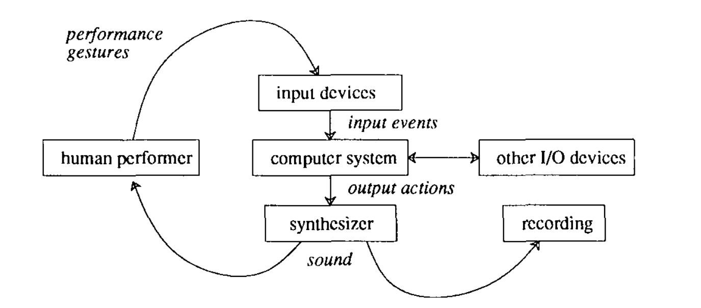

第4章では時間軸に沿って、PLfMの歴史的変遷を追いかけてきた。PLfMは歴史的に、Unit GeneratorやMIDIなど、特定の音楽様式を言語仕様そのものに埋め込みながら発展してきた。しかし、2000年以後は、ブラックボックスとして与えられていたUGen自体をより一般的な代数的表現で記述するFaustのような試みや、SuperColliderを音声合成エンジンに使いながらも、これまでと異なる抽象化を試みるTidalCyclesのような試みが立ち上がってきた。当初はコンピューターを用いた音楽表現に十分可能な範囲の表現の広さを提供してくれると思われたUGenも、その抽象化方法自体を物理化したハードウェアが現れたり、UGenをベースにしたプログラミング作業の効率化を図ることによって、それ以外の抽象化方法の提示を妨げるインフラストラクチャとしての性質を持つようになっている。

本章ではそうした状況を踏まえつつ、PLfMを新しく設計、開発する際の設計方針や、実装のパターンの類型化を試みる。本章で検討するテーマを一言で表すなら、言語設計が内包する音楽様式や、言語を用いて作られた音楽といった、表現の性質に触れることなしにPLfMの設計方針や評価は可能だろうか、ということだ。

プログラミング言語の中で音楽という特定の目的に特化した言語を作ろうとしているのに、表現の性質の話に触れないのはおかしな話に聞こえるかもしれない。しかし、第4章で見たように、MUSIC Nの派生系で作られたMUSIGOLやMUS10が、それを用いて可能な表現は同じであっても、その設計思想には大きな違いがあったように、現状のPLfMの研究に関する評価や主張はその使い方と応用例に偏りすぎているMUSIC Iが作られた1950年代には音楽生成のためのプログラムを作ることと、そのために言語を作るということは同じ行為を意味していた。しかし現在ではDAWのような音楽のためのソフトウェアを作る作業と、プログラミング言語を作るという作業は、そのための設計の理論やツールなど、必要な知識があまりに異なりすぎる。結果として、PLfMの使い方の解説や、それを用いた様々な信号処理、アルゴリズミックコンポジションなどに関する文献は充実している一方で、PLfM自体を実装するための知見は、自力で汎用プログラミング言語設計のための資料から探し出してくるしかない。もしくはSuperColliderを開発したマッカートニーやVultを開発したルイーズ[^ruiz]のように、音楽とは関係のない部分で言語処理系の知識に触れる機会があった者に限られてくる。

[^ruiz]: Vult言語はルイーズが元々コンピューターサイエンスの専攻だったこともあり、コンパイラがPLfMの中では珍しく、汎用言語処理系の入門などでよく使われる関数型言語OCamlで記述されている。

加えて、PLfMを設計するという作業は、換言すれば時間に伴って変化するデータを、どのように人間が解釈可能な形で表現するかを考えることである。その意味では、マシューズのGROOVEシステムのような、目的や音楽様式にとらわれないシステムの設計に関する知見は、PLfMに限らず汎用プログラミング言語の理論や、映像などの音楽以外の時間軸を扱うマルチメディア表現のためのシステムなどの分野にも存在しているはずである。

本章での整理は、デザインパターンを類型化することによってPLfMの開発の参入障壁を下げよう、という意図だと考えてもらって基本的には問題ない。しかし、デザインパターンを用いてデザインの効率化と普遍化を図ることは2章における、デザインサイエンスのムーブメントにおいて批判されたことではないかという疑問については言及しておく必要があるだろう。本章の整理は、普遍的な「良い」PLfMについての設計方針を与えるものではない。むしろ、言語設計と実装に実質的に回避できないトレードオフが存在することを指摘することで、各々が作った言語の立ち位置の選択とその理由をはっきりさせることによって、様々な思想の言語の存在意義を肯定しやすくすることを目的としている。

# ダネンバーグによるPLfMを特徴づける要素

本章で検討するような、表現よりも言語の構造や実装方法という観点で言語の特徴づける要素や言語同士を比較した研究としては、第4章でも参照した、Nyquistを開発したロジャー・ダネンバーグの『Languages for Computer Music』がある[@Dannenberg2018]。

ダネンバーグはコンピューター音楽のためのプログラミング言語を特徴づける要素として以下の6つの要素を挙げた。

- シンタックス
- セマンティクス
- ランタイムシステム
- ライブラリ
- 開発環境
- コミュニティやドキュメントなどの資料

以下、それぞれの項目について簡単に解説する。プログラミング言語についての「言語仕様」と言った時には、**シンタックス（Syntax：統語論）**と**セマンティクス（Semantics：意味論）**という2つのことを同時に指している。

シンタックスとは言語の表面的な仕様のことであり、セマンティクスとはよりプログラムの意味に直接関わる言語仕様のことを指す。

具体例でこの違いを説明する。JavaScriptという言語でで入力を2乗して返す関数powerを定義すると次のようになる。

```javascript
function power(input){
  return input*input;
}
```

このソースコードにおいて`function`という単語はJavaScriptの中であらかじめ定められている用語（いわゆる予約語）だ。

例えばJavaScriptの言語仕様が変更され、「予約語`function`を`fn`に変える」となったとしても、エディタなどでテキスト一括置換を使って`function`を`fn`に入れ替えればすぐに対応できることが想像できる。一方で、「演算子`*`は整数同士の掛け算を表すもので、小数点同士の掛け算を表すには`*.`という演算子を使用しなければエラーとする」という仕様変更の場合はそうはいかなくなる[^ocamlmult]。プログラムを修正しようと思ったら実際にその関数が小数点の計算に使われているのか整数の計算に使われているのかを判断して置換する必要があり、先ほどのように一括置換というわけにはいかない。

[^ocamlmult]: この整数と小数点の変数に対して算術演算子を使い分ける仕様は実際にOCamlに代表されるML系言語で用いられている。もっともその目的は静的型付け言語においてユーザーが整数と小数点の計算を混同しないようにすることもあるが、そうすることで単に実装を簡略化できるという理由の方が大きい。

前者のように、プログラムの意味そのものに影響を与えない言語仕様をシンタックス、後者のように意味論に影響を与えるものをセマンティクスと考えて貰えば良い。もちろんシンタックスも、たとえ意味論に影響は与えなくとも、予約語が短ければ必要なタイピングの回数が減りプログラムを素早く書けるかもしれない、というように言語の使い勝手に大きく影響する。

**ランタイムシステム**、もしくは単にランタイムとは、コンパイラやインタプリタによって、ソースコードからより抽象的なデータ構造に変換されたデータを実際に評価するプログラムや、コンピューターそのもののことを指す。汎用言語の例で考えると、CやRustのような低レベルの操作を行う言語は直接的に機械語を出力するために、ランタイムシステムに相当するものは基本的にコンピューターそのものである。それに対して、JavaScriptなどの高級言語は、実行時にメモリの自動確保と解放を管理するガベージコレクターなどのランタイムプログラムを要とする。PLfMにおいては、例えばFaustは、C++などのソースコードを経て直接機械語に変換されるため同様に依存する特定のランタイムプログラムが存在しない。MaxやPureData、SuperColliderなどのUGenベースのPLfMは、例えばフィルターや発振器の内部の実装に関しては言語の意味論の中に含まれておらず、C++などで実装されたUGen定義をブラックボックスとして扱う。この時のUGenはランタイムプログラムである。また並行して発生するイベントの実行タイミングを管理するスケジューラーの機能もPLfMにおけるランタイムプログラムの中の代表的なものである。

**ライブラリ**は、その言語を用いて作られた関数定義や、MaxやPureDataにおけるサブパッチなどの、再利用可能な要素の集合である。例えばMaxではフィルターはランタイムシステムの一部だったのに対して、Faustにおけるフィルターは、Faustの言語上で定義されたライブラリの一部として提供される。

**開発環境**は、その言語を用いたプログラミング作業を支援するためのプログラムと定義できる。MaxやPureDataのようなビジュアルプログラミング環境では、開発環境を作ることそのものが言語開発の作業の中で必須の要素になる。テキストベースの言語であれば、基本的にはテキストエディタが開発環境に相当する。しかし、近年では単にテキストを編集するだけでなく、テキストを統語論的に意味のある単位で色分け（シンタックスハイライト）したり、エラー表示をエディタ上に直接表示したり、入力中に必要なカッコやライブラリ上の関数の名前などを自動的に補完する機能などが利用できる。Vim、Emacs、AtomやVisual Studio Codeといった、ユーザーによって機能拡張可能なエディタでは、Language Server Protocol（LSP）[^lsp]というプロトコルに応じてハイライトや補完の情報をホストエディタに渡すサーバープログラムを作ることで、専用のエディタを丸ごと作ることなく特定の言語に特化した編集モードを作ることができる。こうした機能はその言語のコンパイラの機能を部分的に借りて作ることで、その言語の意味論に応じた高度な補完などが行えるようになるため、言語開発の中でも重要な作業になりつつある。しかし、こうした汎用エディタはWebブラウザ向けの技術をベースに作られていることが多いので、PLfMの用途においては、例えば編集中の音声信号波形のリアルタイム表示などを行うことが難しいと言った難点もある。そのため例えばSuperColliderやSonic Piなど、テキストベースの言語でも専用のIDEが同時に開発されているものも多く存在する。

[^lsp]: https://microsoft.github.io/language-server-protocol/ 2022年2月16日最終閲覧。

また、**コミュニティやドキュメントなどの資料**の充実もプログラミングの体験に当然大きな影響を与える。多くの環境では言語のエディタから直接サンプルプログラムやチュートリアル、リファレンスドキュメントを参照できるようになっていることも多い。

## 言語を設計することと、コンパイラを作ることの違い

ここから、現代の状況において、そもそもプログラミング言語を作る、という作業が具体的にどのようなものなのかを整理する。

プログラミング言語を作るという作業には、観念的に大きく分けて2つの作業が存在する。1つ目は言語仕様を定義する設計の作業であり、2つ目は仕様に従って実際にその言語を読み込み、実行できるプログラムを実装する作業である。ところが、現実的には（特定のドメインに特化した言語であればなおのこと）言語の仕様は厳密に定義されているとは限らず、曖昧に定義された言語を実行できるプログラムのみが存在していて、実装やリファレンスドキュメントのみが言語仕様を表すものになっているケースも少なくない。

では言語の仕様を形式的に厳密に定義するとどのようなメリットがあるのか。例えば、何かプログラムにバグが起きた場合のことを考えると、次のような複数のケースがありうる。

1. プログラマが言語仕様で未定義動作になっているコードを書いている
2. コンパイラが言語仕様に沿っていない実装をしている
3. 言語仕様そのものの定義に曖昧さがあるため、プログラマも正しく言語仕様に沿ったコードを書いていて、コンパイラも言語仕様に沿ってコンパイルしたが、予期しない動作が発生している

言語仕様を厳密に定義すれば、C言語のような低レイヤーに近いプログラムを記述する言語では、セキュリティ関連の重大なインシデントが起きた場合などに、問題の原因と責任がどこにあるのかをはっきりさせられるといった利点が考えられる。しかし一方で厳密さを追い求めすぎると、ISOで規格化されたC言語の仕様書が700ページ以上あるように[^isoc]、そもそもプログラマが正しい仕様を覚えること自体が困難になってしまうという問題もある。

[^isoc]: http://www.open-std.org/jtc1/sc22/wg14/www/docs/n1570.pdf 2021年1月4日最終閲覧。

PLfMにおいては、何かしら予期しない動作が起きたとしてもせいぜいプログラムがクラッシュする程度の問題にしかならないことに加えて、音楽のための言語に必須ともいえる、オーディオ入出力のようなペリフェラルを形式的に定義することはあまり一般的でないこと、また言語自体が特定の開発/実行環境のプログラムとセットになって設計されており、形式的に言語仕様を定義するよりも、その実装におけるコメントや、ドキュメンテーションの充実で言語仕様らしい情報を補完する方が現実的であるため、言語仕様＝唯一の実装となっているものが大多数である。

ただし、テキストベースの言語において、意味論はともかく統語論の形式的定義に関しては、バッカス・ナウア記法に代表される文脈自由文法による形式的な記法が存在している。かつ、これに似せた記法で統語論、ソースコードをパース（文字列から抽象構文木など基礎的なデータ構造）するためのプログラムを自動で出力できる、コンパイラ・コンパイラと呼ばれるツールが存在している。こうしたツールを用いれば実装による仕様定義ではあっても、ある程度形式的定義が可能だ。実際コンパイラコンパイラの代表的ツールであるbison(yaccというツールの拡張版)はSuperCollider、ChucK、Faustといった多くの言語の実装で用いられており、筆者の実装したmimiumもこれを用いている。

また音楽向け言語において意味論を形式的に定義する方法、形式的意味論での定義を用いている代表的な例としてはFaustが挙げられる。Faustは形式的意味論の中でも表示的意味論(Denotational Semantics)という、ある項を別の言語の項へと変換する論理的規則を定義する意味論を採用している[^axiom][@Orlarey2004]。

[^axiom]: この他に、操作的意味論（Operational Semantics）、公理的意味論（Axiomatic Semantics）といった種類が存在する。[@UnderstandingComputation,p56]を参照。

# ドメイン固有言語のデザインパターン

次に、プログラミング言語全般における言語仕様の定義方法の話から、より特定の応用領域（ドメイン）に向けたプログラミング言語、いわゆるドメイン固有言語（Domain-Specific-Language：DSL）の実装方法に関する議論を概観する。

DSLは音楽に限らず、例えばProcessingやGLSLのようなグラフィック生成のための言語や、ArduinoやHDLのようなハードウェアの操作に特化した言語が存在する。先ほど挙げたbisonのようなシンタックス定義のためのコンパイラ・コンパイラも、バッカス・ナウア記法風に書かれたテキストデータからパースプログラムのソースコードを出力する、いわばプログラミング言語実装のためのDSLである。

一般的にプログラミング言語のコンパイラ、インタプリタの基本的な構造はテキストというデータを次々と機械語へと近い形のデータ構造へと変換し続けるパイプラインのような構造を取っている。ところが、ProcessingやArduinoといったツールは、実装の方法からするとJavaやC++といった汎用言語上に構築されたライブラリとほとんど見分けがつかない構造を持っているが、DSLに分類されることもある。音楽のためのプログラミング言語も同様に、独自に文法が定義され、テキストデータの構文解析から行う必要があるもの、汎用プログラミング言語のライブラリとして実装されているもの、また両者をハイブリッド的に用いるものなど複数のアプローチが存在している。第4章で見たように、例えばMUSIC Nは独自に文法を定義しており、一方MUSIGOLは、実行プログラムもALGOL上のライブラリとして実装され、ユーザーもALGOLのコードを書くのだった。

プログラミング言語研究の分野で、スピネリスはこのような実装のアプローチの違いをデザインパターンとして整理した[@Spinellis2001]。そのうち、実装方針に関わる一部を以下に列挙する。

- 文字列解析
- 言語特殊化
- 言語拡張
- Piggyback(おんぶ)
- ソースtoソース変換
- パイプライン

**文字列解析**は、すでに説明した、テキストデータを直接読み込んで抽象構文木のようなデータ構造へ変換するプログラムを書く方法だ。これは当然、文法の設計の自由度が一番高い代わりに、構文解析という比較的煩雑になりやすいプログラムを自ら実装する必要がある。

**言語特殊化**というのは、汎用言語のうちの一部の機能だけを使うような構造をとる言語である。先程の例で言えば、ProcessingやArduinoがあてはまる。Processingでは画面上に四角形を描画する`rect(100,100,200,200)`関数のように、画像描画のための関数を呼び出せる。このときProcessingのホスト言語（ライブラリ実装に用いているプログラミング言語）はJavaという言語で、関数定義などの意味論に関わる文法やその呼び出しの仕組みはJavaの仕様と実行環境に準ずる。このようにライブラリとしてDSLを実装する大きな利点は、ホスト言語上で実装されているライブラリの資産を活用できる点である。例えば、Processingの中で音声信号処理のライブラリを用いたければ、Java言語のために実装されたライブラリをそのまま使うことも可能である。もちろん、そのライブラリ内ではいかにJavaのより高度な言語仕様が用いられていても、問題なく実行できる。

では、普通のライブラリと、言語特殊化を用いたDSLとはどのように異なるのだろうか。通常、特定の目的に特化した関数をライブラリとして実装する場合は、例えば関数の名前がライブラリ間で重複しないように、名前空間のような、言語仕様に存在する様々な構造化のための機能を用いて、グローバル名前空間の中で関数の名前が重複することを避けるようにする。一方で言語特殊化を用いるDSLは、例えばProcessingではグローバル名前空間で定義された`rect`関数を利用するように、名前重複のリスクや、構造化された状態の読みやすさよりも、より初心者が関数定義や実行といった、基本的言語仕様のみを使って記述できることを重視する。Processing上でJava言語で書かれたライブラリを使うことは簡単でも、Java言語のプロジェクトの中で一部分だけProcessingを使用する、といったユースケースを想定していない、とも表現できる。

**言語拡張**とは、言語制限と同様ホスト言語上のライブラリとしての実装をする点では共通しているが、ホスト言語自体に意味論を自己拡張できるような機能が存在していると、ライブラリでありながらまるで別の言語を用いているかのようにDSLを実装することが可能になる。これは次の節で詳しく説明する。

**Piggyback（おんぶ）**とは、構文解析を行うようなDSL、とライブラリとしてのDSLの中間的アプローチとも言える方法だ。例えば、bisonというコンパイラ・コンパイラは、その構文の仕様自体は独自に定義されている。しかし文を解析した後に行う処理、アクションと呼ばれる部分の記述は、後に変換されるC言語やC++言語の記法をそのまま用いることができる。このような別の言語仕様をある言語上に埋め込むようなパターンがPiggybackだ。このアプローチを用いることで、言語の構文の自由度を高めつつも、部分的には別の言語を借りることができ、実装のコストを減らすことができる。

**ソースtoソース変換**は、ある言語のソースコードを別のホスト言語へ変換する方法のことだ。これはPiggybackとの違いが分かりにくいかもしれない。例えば典型的なソース変換を行う言語であるFaustは自身の言語内で意味体系が完結している。そのため、元々はC++のソースコードに変換する機能がメインの言語であるものの、現在はC言語、Rust、D言語、Java、LLVM IRなどさまざまな言語に変換することができるようになっている。一方で、bisonのような言語の場合には初めからアクションの部分はC言語の仕様に頼ることになっているので、バックエンドをC++に変更したいときに同じソースコードをそのまま流用することができない。ソースtoソース変換アプローチの利点は1つのホスト言語に縛られないながらもホスト言語の持つインフラストラクチャ（ビルド、デプロイのためのツール群等）を活用することができる点だと言える。

**パイプライン**は、様々なツールを組み合わせてデータ構造を変換していくデザインパターンである。これは、SuperColliderをホストとして動くSonic PiやTidalCyclesのことを考えればわかりやすい。起源を辿ればMUSIC Nも基本的に、テキストデータをバイナリ表現に変換するPass1、ノートの情報を整理し時間軸に沿って並べ直すPass2、最終的にPCMの波形を実行するPass3の3つの処理のパイプラインで作られていた。

## 言語拡張と自己反映性：CoffeeColliderを例に

ライブラリとしてのDSL実装の中でも、ホスト言語の機能が拡張性がある場合はかなり構文の自由度がある言語設計を行うことが可能だ。

その例を、mohayonaoによるCoffeeColliderというWebブラウザ上で動作するPLfMを例にして見ていこう。CoffeeColliderは、音楽プログラミング言語の中でも代表的な言語であるSuperColliderの構文を模した、CoffeeScriptという言語のライブラリとして実装されているDSLである[@mohayonao]。なお、CoffeeScript自体はブラウザ上で動作する唯一の言語であるJavaScriptへと変換されることで動作する、AltJSと呼ばれる言語の1つである。

本来SuperColliderは構文解析から行う言語であり、ネイティブアプリケーションとして動作するがWebブラウザでは動作しない。

CoffeeColliderはSuperCollider上におけるUnit Generatorの接続をWeb Audio APIという、Webブラウザに近年標準的に組み込まれるようになった音声合成のためのインターフェースを用いることで実現している。CoffeeColliderは文字列解析を自分では行っておらず、特定のオブジェクトに対する`+`演算子や`*`演算子の挙動をオーバーロードすることで、CoffeeScriptの文法で可能な範囲の表現でシンタックスをSuperColliderへと模している。

\begin{lstlisting}[float=btph,caption=CoffeeColliderのコードサンプル,label=lst:coffeecollider]
(->
  noise = PinkNoise.ar(0.2)
  noise = Mix Array.fill 10, (i)->
    Resonz.ar(noise, i * 800 + 200, 0.05)
  noise = (noise * 0.2 + noise * Decay.kr(Dust.kr(0.5), 10))
  noise = RHPF.ar(noise, LFNoise0.kr(0.5).range(220, 880), rq:0.001)
  CombL.ar(noise, delaytime:0.5, decaytime:25).dup() * 0.5
).play()
\end{lstlisting}

\begin{lstlisting}[float=btph,caption=SuperColliderのコードサンプル,label=lst:supercollider]
{
   var noise = PinkNoise.ar(0.2);
   noise = Mix.new(Array.fill(10, {arg i;
     Resonz.ar(noise, i * 800 + 200, 0.05)}));
   noise = (noise * 0.2 + noise * Decay.kr(Dust.kr(0.5),10));
   noise = RHPF.ar(noise, LFNoise0.kr(0.5).range(220, 880), rq:0.001);
   CombL.ar(noise, delaytime:0.5, decaytime:25).dup() * 0.5
}.play;
\end{lstlisting}

[@lst:coffeecollider]と[@lst:supercollider]にSuperColliderとCoffeeColliderで、等価な音を出すサンプルコードの比較を示す。2つのコードを見比べると、SuperColliderでの`{}`で囲むことでオブジェクトを生成するシンタックスを、CoffeeScriptにおける無名関数`(-> statements)`を利用して似せていることがわかる。CoffeeColliderの実装は、**演算子のオーバーロード**というホスト言語にある機能を積極的に活用することで、テキストをパースするプログラムを書くことなく、かつ、CoffeeScriptのシンタックスの中で可能な限り記法をSuperColliderに近づけている。


演算子のオーバーロードとは、たとえば`+`や`*`などの二項演算を数値の加算乗算やテキストの結合などの言語組み込みの型だけではなく、自身の定義したカスタム型に対して新しく振る舞いを定義してやれるような機能のことだ。たとえば、Number型2つで構成されるの2次元ベクトルの型を定義した時に、`+`演算子を使ったら要素同士をそれぞれ加算できたり、`*`演算子を使ったら直積、内積や外積を計算できるようにしたらコードの記述が短くできたり、一般的に数学で使われるような記法と近づけられることでソースコードを直感的に読めるようにできる。

演算子のオーバーロードができるようになっている汎用的な言語としては、たとえばC++、Scala、Haskellなどがある。特にHaskellでは、あらゆる関数を中置演算子のように使える上に`!  #  $  %  &  *  +  .  /  <  =  >  ?  @  \  ^  |  -  ~`などの文字から任意の文字を組み合わせて演算子を作ることもでき、`~~<=>||`演算子のような、存在しない独自の演算子を作ることもできてしまう。

JavaScriptの言語仕様には演算子オーバーロードの機能がない。そのため例えばTone.js[@tonejs]といったJavaScript上で構築される音声信号処理ライブラリでは、信号処理プロセッサのようなユーザー（Tone.js自体の開発者という、JavaScriptのユーザー）によって定義されたデータ型同士を組み合わせるためには関数呼び出し`f(arg)`やオブジェクトのメソッド呼び出し`A.callmethod()`のような記法を用いて表現するしかなくなる。一方、CoffeeScriptには演算子オーバーロードがついているので、SuperColliderという全く関連性のない言語体系の言語であっても、ある程度表面上のシンタックスを近づけることができる。

演算子オーバーロード以外に、こうした言語自体の記法を自己拡張できるような機能は他にも、KotlinのType-Safe Builder[^kotlin] やF\#のApplicative Computation Expression[^applicative]などがある。また、C言語など多くの言語で一般的に使えるマクロのような、言語本体の処理より前にテキストや抽象構文木をユーザーが定義したルールを用いて置き換える記法もシンタックスを変えることができる構文拡張の1つとみなせる。

[^kotlin]: https://kotlinlang.org/docs/type-safe-builders.html 2022年1月28日最終閲覧。
[^applicative]: https://docs.microsoft.com/ja-jp/dotnet/fsharp/whats-new/fsharp-50#applicative-computation-expressions 2022年1月28日最終閲覧。

こうした言語の意味を拡張していくような言語機能は、場合によっては自然な記述を可能にする一方、場合によっては同じ言語で書かれているのにソースコードの見た目が全く異なってしまい、かえって読みにくくしてしまうような効果も持つ。そのため、言語設計として意図的にオーバーロードを禁止することで、ソースコードの見た目に一貫性を持たせる方針を取る言語も少なくない（例えばgo言語など）。その意味ではLISPの系列の言語では、シンタックスを敢えてS式と呼ばれる括弧で括る記法に統一してしまうことで、マクロなどで機能を拡張し続けても、結果的にソースコードの見た目の一貫性は保つことができる。

極端な言語の一例としては、コンパイラの挙動を実行コード側からかなり自由に変更できるようにすることで、ライブラリや利用目的ごとに言語のシンタックスを大きく変えられてしまうRacket[@Racket]がある。Racketそのものは本来S式のシンタックスを持つLISP系列の言語だが、`#lang slideshow`のようなシンタックス指定の命令を記述することによってその行以下で利用する言語をスライドショーを作る機能に特化した言語に切り替えられ流用に、ライブラリを切り替える感覚で言語の表面的な見た目までを切り替えられてしまう。この設計思想は、解きたい問題のドメインに合わせてまずそのドメインに特化した言語を作る、Language-Oriented Programmingと呼ばれている。実装面から見れば、マクロにしてもRacketのような高度なコンパイラの挙動変更にしても、ソースコードをコンパイルしながら適宜その内容によってコンパイラ自体も変更されるというフィードバックプロセスが、言語の自由度を高めるほどに複雑化していくため、単に入力されたテキストデータを低レベルのデータまで変換していくパイプ的な構造から遠ざかっていくことになり、実装の難易度も一般的に上がっていく。

## TidalCycles - ハイブリッドなアプローチ

さらに、文字列解析、言語拡張、言語特殊化など複数のパターンを組み合わせて実装するハイブリッドなアプローチもありうる。例としてはTidalCycles[@McLean2014]が挙げられる。

```haskell
d1 $ sound "bd*4" # gain (every 3 (rev) $ "1 0.8 0.5 0.7")
```

この1行において、`#`はホスト言語であるHaskellにおける中置演算子の機能をオーバーロード（**言語拡張**）したものである。`$`は`()`で囲むで関数実行の順番と単位を切り替えるのに近い役割をする、Haskellで標準的に使われる演算子そのものである。soundやgain、everyなどはHaskell上でTidalCyclesライブラリとして定義された関数の名前である。また同時に、ユーザーはHaskellの関数定義や型宣言など高度な文法を知る必要はない（**言語特殊化**）。

そのためTidalCyclesはおおむねライブラリとしてのDSLの性質を備えている一方、ダブルクォートで囲まれた部分はHaskellの意味論の上ではただの文字列であり、ParsecというHaskellの**字句解析**ライブラリで内部的にパースしている。この記法はBol Processorという表記法をベースに独自に定義されたものである。また最終的にTidalCyclesはSuperColliderという音声合成エンジンに対してOSC(Open Sound Control)というネットワークコマンドを送ることで音を出している(**パイプライン**)。

## ライブラリとしてのPLfMの限界

それでは、TidalCyclesのように、自己反映性の高いホスト言語があれば音楽のために1からテキスト解析をする言語の実装は必要ないのだろうか。

実際、マッカートニーはSuperColliderの設計についての論文で、究極的には音楽のために言語をゼロから開発する必要はないと述べていた。

> コンピュータ音楽に特化した言語は実際必要なのだろうか？少なくとも理論的には、私はそうではないと思う。今日の汎用プログラミング言語で利用できる抽象化方法は、コンピュータ音楽を便利に表現するフレームワークを構築するのには十分なものだ。ただ残念なことに、実用的には、今すぐ使える言語の実装としては欠けている部分もある。多くの場合、ガベージコレクションはリアルタイムでは実行されず、引数の受け渡しはあまり柔軟でない。遅延評価がないと、パターンやストリームの実装がより複雑になる。SuperColliderを書いたのは、コンピュータ音楽のために柔軟に使えるような抽象化方法を持たせたいと思ったからだ。将来的には他の言語の方が適しているかもしれない。SC Serverの合成エンジンと言語を分離する目的の一つは、SuperCollider言語とクラスライブラリで表現されている概念を他の言語で実装することを模索可能にすることだ。他にも、将来的にコンピュータ音楽のために面白い可能性を秘めた言語として、 OCaml (www.ocaml.org)、Dylan (www.gwydiondylan.org)、 GOO (www.googoogaga.org)、そして、偶然にも文法規則の多くに似た仕様を持つスクリプト言語であるRuby (www.ruby-lang.org)がある。[@McCartney2002]

4章で見たように、SuperColliderのサーバー・クライアントモデルは実際にTidalCycles（Haskell）やSonic Pi（Ruby）のような多くのクライアント言語の誕生に寄与した。しかし、SuperColliderそれ自体にあたる言語を既存の言語のライブラリで完全に置き換えられるかというと、難しい現状がある。

その大きな要因として、ハードウェアについて意識する必要がないスクリプティング言語に近づくほど、実行タイミングの制御の不確定さが増すことがある。多くのスクリプティング言語では変数のためのメモリ確保と解放はガベージコレクターというランタイムシステムの機能によって行われる。この時、リアルタイム動作を厳密に想定していない環境では一時的に全ての処理を停止して使われなくなったメモリの解放などを行うSTW（Stop-the-World）と呼ばれる処理が挟まれる。オーディオ処理が行われている最中にこのSTWが挟まれてしまうと処理がリアルタイム実行に間に合わなくなってしまい音が途切れる可能性が出てくる。SuperColliderのガベージコレクターはあらかじめこうした事情を考慮した設計になっているが、大抵の汎用スクリプティング言語は音声合成のようなリアルタイム性を想定した作りにはなっていない。

そもそも、ガベージコレクターの作りがリアルタイム動作を考慮できていたとしても、Faustで記述するような低レベルのDSPのプログラムでは、OSが提供するAPIを経由したメモリの確保（`malloc`関数など）自体、実行時間が非決定的になるために避けるべきこととされている[@Bencina2011]。多くのスクリプティング言語では変数を宣言しただけでこのOSのAPIを経由したメモリ確保が行われる。そのため、スクリプティング言語での直接的なDSPの記述には、単に実行性能がC言語などの低級言語に劣るという問題ではなく、言語がOSの仕組みに依存することで発生する構造的な問題があり、ほとんど解決不可能である。

また、汎用OSの上で並行処理を実現しようとすると、多くのOSが採用しているプリエンプティブ・スケジューリングと呼ばれるマルチタスク管理の方法も実行タイミングの非決定性につながる。多くのOSでは、実際のCPUのコア数よりもはるかに多くのプロセスが並行して動作する。これは、OSが多くのアプリケーションの実行を適切にCPUに割り振り、さらに1つのCPUの中でも細かくそれぞれのプロセスを時分割して実行しているからである。プリエンプティブスケジューリングの特徴は、このOSが時分割を行うタイミングに、分割される側のユーザープログラム（e.g. PLfMのランタイム）が関与できないことである[^linuxscheduling]。

[^linuxscheduling]: Linuxカーネルの場合にはユーザーはプロセスのスケジューリングポリシーをいくつかの種類から選択できる。 https://linuxjm.osdn.jp/html/LDP_man-pages/man7/sched.7.html 2022年1月31日最終閲覧。またそもそもLinuxの場合はOSがオープンソースなため、Bela（[@sec:intro]参照）で用いられていたXenomaiのように、ユーザーアプリケーションがメインのスケジューラーをバイパスして動作するカーネル拡張を利用する選択肢もある。

ライブラリとしてのPLfMを実現している数少ない例外としては、Lua言語上で、コードをメモリ上でネイティブバイナリへとコンパイルし即時利用するJITコンパイルするLuaJITの機能を活用した音声、映像のライブコーディング環境LuaAVがある[@Wakefield2010]。LuaAVはライブラリでありながら論理時間ベースのサンプル単位の制御を保証したスケジューラーを搭載している。LuaAVというライブラリとしてのPLfMの実現にはLuaという言語自体が様々な言語やアプリケーションに埋め込んで用いることを想定した作りになっていることが反映されている（例えば、音楽制作ソフトウェアではオープンソースのDAWであるArdourが機能拡張のためにLuaを採用している）。

<!-- 
## ビジュアル言語のシンタックスと保存フォーマット

一般的には中間表現を低次へ変換していくほどより抽象的な操作に近づいていくので言語処理系の実装が汎用言語の実装に近くなっていく。

またMaxやPuredataのようなビジュアル言語の場合は、保存されているテキスト/バイナリデータを解釈してビジュアルインターフェースとして表示する評価と、音声処理のためのデータ構造としての評価と2方向の評価が行われていると解釈することができる。この時の保存されているデータ形式は例えばMaxではJSONというJavascriptのための汎用データ表現形式を用いているように、その言語のSemanticsとは関係のない汎用的なデータ構造を利用している場合もある。
 -->

# PLfMの特徴を表す語彙の整理

ここまで、PLfMを特徴づける要素と実装の方法の違いについて概観してきた。では実際のところ、これらの要素がそれぞれの言語を**どのように特徴づける**のだろうか？

これまで、PLfMの実装に関する論文では、**汎用的（General）**、**効率的（Efficient）**、**表現力が高い（Expressive）**という3つの語がそのシステムの特徴を形容するために頻繁に使われてきた。

しかし実際には、これらの語が用いられる意図は文献ごとにかなりのばらつきがある。

例えば、ブランドがChronicを開発するにあたってのモチベーションは音楽のための言語に存在する表現力の高さ（Expressiveness）と汎用性（Generality）のトレードオフの解消だった[@Brandt2002]。それを説明したのが[@fig:chronic-tradeoff]である。

![ブランドがChronicを開発するにあたって説明した、ExpressivenessとGeneralityのトレードオフ。[@Brandt2002]より引用。](img/chronic-tradeoff.pdf){width=70% #fig:chronic-tradeoff}

ブランドは文献中で、Expressivenessを「ユーザーが読みやすく書きやすい」、 Generalを「可能な表現の範囲が広い」という意味で用いられている。またChronicはOCamlというホスト言語の実行速度の問題もあり、リアルタイムで実行はできなかった。つまりChronicではGeneralとExpressiveの両立はできたが実行時パフォーマンスという新たなトレードオフが発生していたことがわかる。

一方、ラッザリーニはMusic N系列やCsoundの設計の、Score/Orchestra/Instrumentという3種類の内部言語を用いるアプローチに関して以下のように述べている。

> 音楽プログラミングにおいて多言語アプローチを取ると、ユーザは**汎用性〔Generality〕**と**効率性〔Efficiency〕**のバランスを取りやすくなる。[@Lazzarini2013,p103、筆者訳、強調は筆者による]

ここでの語用は、続く以下の説明を参照するとわかる。

> タスクに応じてプログラマは異なる複雑度のエントリーポイントを選択することが可能になる。一般には、より低く、より一般的な〔general〕レベルでは、複雑なコードの設計が必要だが広い範囲の結果をもたらす。一方、より高い、特殊化、具体化されたレベルで操作できるなら、プログラミングに必要な労力という観点からプロセスはより効率的〔efficient〕になるだろう。（ibid.）

つまり、ラッザリーニの説明においては、generalに関してはブランドと同じく、可能な表現の範囲が広いという意味で用いている。一方で、ここでのEfficiencyとは、実行コストのことではなく、**ユーザーが目的のプログラムを構築するまでの効率**のことを指している。

さらに、ダネンバーグのサーベイでは以下のような表現がある。

> この論文では音楽プログラミングでとりわけ重要な計算モデルについて、これらのモデルがどのようにプログラミング言語の中でサポートされているか、そしてどのようにこれらが**表現力が高く〔expressive〕**、**効率的〔efficient〕**なプログラムを導くかについて検討する。[@Dannenberg2018,p1、筆者訳、強調は筆者による] 

ここでのefficientはprogramsに掛かっているのでラッザリーニとは異なり実行コストのことを指していると推察できる。このように、同じefficiencyというワードでも計算機が負担するコストと、ユーザーが負担するコストという異なる事項を指している場合とがあることがわかる。

実のところ、音楽に限らずプログラミング言語という分野自体、1960年頃から長く学術的研究がされている中でその貢献をどう主張するか、特に作った言語をどのように評価すればよいかという話題は2009年のACM SIGPLAN[^sigplan]主催の*PLATEAU: Evaluation and Usability of Programming Languages and Tools*が開催されるまであまり触れられてこなかった。2010年のPLATEAUでマークストラムは新しい言語の実装や設計などのアイデアを論文として提示する際の正当化の方法として、**主張と根拠の整合性(Claim-Evidence-Correspondense)**という見方を提示した[@Markstrum2010]。

[^sigplan]: 筆者の投稿したFARMなどの国際会議を主催する団体。[@sec:researchfield]を参照。

マークストラムによれば、プログラミング言語の論文で提示される主張は大きく分けて3種類あるという。1つ目はこれまで存在しなかった新機能を作ったというもの、2つ目はすでにある既存の機能の効率性を上げるような内容、3つ目は望ましい言語の特徴（property）、つまりこの言語は直感的である、読みやすい、効率的であるといったような内容だ。しかしこれまでのプログラミング言語の提案の論文には、1と2、つまり新機能と機能の増強に関しては論文が査読されたものであるならば十分認められるものであるが、望ましい言語の特徴に関してはその主張と、それを支える根拠は両方とも提示されているが論理的な結びつきは不十分なものが多数あるとしたのだ。

主張と根拠の整合性を証明する方法論は、統計的な評価実験のような実証主義的方法だけでは不十分とマークストラムは警鐘を鳴らしている。こうした流れを引き継いで、近年では2018年にコブレンツらによって、ベンチマークや評価実験など工学的手法に限らない学際的なプログラミング言語デザインについての提言がなされたり[@Coblenz2018]、2020年のミュラーとリングラーの修辞的フレームワーク[@Muller2020]のように、論文中で主張された表現の変遷などを人文学的手法で辿ることで明らかにするような研究が進んでいる。またPLfMに関しては、マクファーソンらが言語設計者へのインタビューを通じて、言語設計者がそれぞれどのような価値観を持って機能実装をしているかを分析している[@Mcpherson2020]。

そこで、次の項ではコブレンツらやマクファーソンの分類を参考にしながら、改めて評価のための語彙を整理する。そのためにまずは、音楽プログラミング言語を評価、また設計の指針となるための指標を、ユーザーがソースを編集し、実行し、そのフィードバックが帰ってくるHuman-in-the-Loopシステムとしてモデル化することで、その際に考えられるコストや自由度をユーザー、コンピューターそれぞれの観点で分類するという方針をとる。


# 音楽プログラミング行為のモデル化と評価語彙の提示

{width=75% #fig:andersonmodel}

音楽プログラミングのプロセスをその表現の様式によらずモデル化したものとして、アンダーソンとキビラによるコンピューターを用いる音楽パフォーマンスのためのシステムを、彼らが開発したFORMULA（FORTH言語上に構築されたPLfM）を中心に分析した研究がある[@Anderson1990]。アンダーソンらは論文内で[@fig:andersonmodel]のように、コンピューターを用いた音楽生成を人間とコンピューターが作り出すフィードバックループ、いわゆるHuman In the Loopモデルとして捉えた。

{width=100% #fig:humanintheloop}

このアンダーソンらのモデルにおいて、Computer Systemに相当する部分がコンパイラ、Synthesizerに相当する部分がランタイムシステムだと捉えれば、ライブコーディングのような近年の対話的プログラミングの実行モデルとしてもよく当てはまるように思える。

そこで、PLfMの実行モデルとしてより説明しやすくなるように、アンダーソンらのモデルを参考にしつつ、ダネンバーグが提示したPLfMを特徴づける要素の語彙も参照することで、新しいモデルを提示する。[@fig:humanintheloop]にそれを示した。そして、この実行モデルの各要素において、評価の指標となる言葉を当てはめることで、その意味の明確化を図ることにする。なおこのモデルは議論が英語で中心的に行われており、かつその中で意味合いの不明瞭なものを問題視しているため語彙は英語で示している。

まず、ソフトウェアとしてのPLfMの実行環境は大きく分けて**開発のための環境（Developing Environment）**と、実際に音を鳴らす**実行環境（Running Environment）**の2つに分けられる。もちろん、実際のソフトウェアとしてはこれら2つの環境は同じソフトウェアの中に同居しているケースが多い。

開発のための環境に属する要素としては、その言語で書かれた**ソース（Source）**が存在する。これを特徴づける要素として、言語のシンタックスと瀬満ティクスが関わってくる。また、ダネンバーグの指摘のように、開発環境の特徴づけには**ドキュメンテーション（Documentation）**の充実や**コミュニティ（Community）**の活発さといった要素も関係してくる。

実行環境には、ソースコードのデータを受け取り解釈する**コンパイラ（Compiler）**が存在する。コンパイラは何かしらの**中間表現（Intermediate Representation）**、、例えばUGenのネットワーク、仮想機械の命令列、BDA、etc…を出力し、**ランタイム（Runtime）**がそれを実行し音声を出力する。

コンパイラやランタイムは最終的に音を出力するだけではなく、時に実行結果や実行エラーなどの付加的情報をプログラマーに伝える。こうした情報はエディタのような**フロントエンド（Frontend）**プログラムを介して伝えられる。フロントエンドは当然エラーのような情報だけでなく、ソースコードの情報そのものを表示する仕事も受け持つため、開発のための環境と実行環境にまたがってプログラマとの情報のやり取りを引き受ける。Maxやプログラマのようなビジュアル言語であれば、必ずしもソースコードの保存されている状態のデータのテキスト表現と、プログラマがソースコードとして実際に認識する視覚的なオブジェクト同士の接続の表現は大きく異なる。例えば、Maxはバージョン5で採用された保存フォーマット（`.maxpat`形式）は、JSONと呼ばれる、JavaScript言語で使われるデータ表現フォーマットを流用している。そのためテキストファイルとしても編集可能だが、テキストとしての`.maxpat`ファイルからそのパッチの内容を読み取ることはほとんど不可能である。つまり、こうしたビジュアル言語においてフロントエンドはある種のビジュアライザとしての役割を果たしている。極論を言えば、テキストを表示するエディタプログラムも、既存の利用できるライブラリが多いというだけで、本質的には特定の文字コードで保存されたバイナリデータを解釈し人間が解釈可能な形に視覚化するプログラムと言える。

ユーザーはこのフロントエンドを通じて、ソースコードのデータを編集し、プログラムを実行した結果得られた実行結果/エラーメッセージ/音声などを確認し、再度編集するというループを繰り返すことになる。

図の中で角丸かつ斜体になっている部分が評価のための語彙となる要素である。以下に改めて列挙する。

1. 汎用性（可能な表現の広さ） / Generality (Possible Expressions)
1. プラットフォーム非依存性 / Platform Independency
1. 学習しやすさ / Learnability
1. 動的変更 / Live Modification
1. コーディングコスト / Coding Cost
1. コンパイルのコスト / Compilation Cost
1. 実行コスト / Execution Cost
1. 開発のコスト / Development Cost

**汎用性（Generality）**はブランドの用いていた意味合いと同じ、可能な表現の範囲が広い/狭いの観点である。

**プラットフォーム非依存性**は、ソースコードの実行に特定のハードウェアやアーキテクチャ、OSなどの環境に依存するかどうか、という視点である。

また、ソースコードの編集、実行の繰り返しのしやすさという視点で2つの指標を導入できる。開発環境側に関わる繰り返しのしやすさとしては、**学習のしやすさ（Learnability）**がある。これには文法規則はもちろん、ドキュメンテーションやコミュニティといった要素も大きく関わってくる。学習のしやすさにはシンタックスやセマンティクスに加え言語の核となる抽象化モデルがどの程度一般に馴染み深いものであるかも影響してくるため、同じ言語であっても相対的かつ時代によって変化もするものである。また実行環境に関わる繰り返しのしやすさには、プログラムの**動的変更（Live Modification）**のしやすさが影響する。ライブコーディングが可能な言語のように、変更したコードの内容が即時反映されれば編集-実行のフィードバックプロセスは一層スムーズになる。

**コーディングコスト**はプログラマが自らの意図通りの表現をいかにスムーズに記述できるかという点である（ブランドがExpressivenessと表現していたものに相当する）。コーディングコストは、同じ言語でも意図した表現に素早く辿り着けるかどうかにはエディタによる補完機能やライブラリの充実度合いによっても影響してくるため、開発のための環境全体が作用する指標である。このコーディングコストは学習のしやすさと区別することが難しいかもしれない。だが例えばTidalCyclesとSuperCollider両方に熟練したからといって、TidalCyclesで作りやすい複雑なリズムパターンを、SuperColliderで同じようには作り難いことを考えれば理解できるだろう。

また、同じアルゴリズムをどの程度高速に実行できるかという観点は、**コンパイル時のコスト（Compilation Cost）**と**実行時のコスト（Execution Cost）**の2つにさらに分類できる。

最後に、その言語自体の開発にかかる手間、**開発のコスト（Development Cost）**が存在する。

<!--
綺麗な切り分けじゃなかったのでやめた
{width=80% #fig:diagram2} -->

## 各特徴間のトレードオフ

![[@fig:humanintheloop]の図における特徴間に存在するトレードオフを表した図。](img/tradeoff.pdf){width=90% #fig:tradeoff1}

これら8つの特徴全てを同時に改善することは根本的に難しい。少なくとも、全ての要素を改善しようと思えばそれだけ開発のコストは増大してしまうことは直感的に納得できるだろう。それ以外に存在するトレードオフには、コンパイラからランタイムに渡される中間表現の抽象度が大きく影響してくる。

[@fig:tradeoff1]でそれを説明する。この中で、学習のしやすさとコーディングコストについてはシンタックスとセマンティクスのデザイン、ドキュメンテーションやコミュニティの充実度合いに大きく影響を受け中間表現の粒度からは独立したものであるため除外して考えている。また、コンパイル時や実行時、開発時のコストに関する矢印の向きに関しては、一般的に少なくできる方が良いためLowの側に矢印を向けていることに注意されたい。

{width=90% #fig:tradeoff2}

{width=90% #fig:tradeoff3}

まず、コンパイル時のコストと実行時コストは一般的には相補的な関係にある。なぜなら、実行時のコストの低下は一般的に、実行するプログラムの形式を機械語に近い形式へと変換する作業によってなされるためである。そのため、中間表現の粒度が大きいほどコンパイルコストは下がり、代わりに実行時のコストが嵩む。中間表現の粒度が上がるほど、コンパイル-実行という区別が付きづらいインタプリタ型の言語に近付いていくという表現もできる。

また、中間表現の粒度が小さくなるほどプラットフォーム非依存性は一般的に上がっていく。例えばFaustはブロックダイアグラム代数のデータをC言語やRust、LLVM IR、WebAssemblyと言った様々な形式に変換できるため、同じコードを幅広いプラットフォームで動作させることができる。


{width=90% #fig:tradeoff4}

{width=90% #fig:tradeoff5}

例えばPureDataをWeb上で動作させようとすると、ソースファイルの読み込み機能や様々な種類のUGenそれぞれをJavaScriptやWebAssemblyを用いてゼロから実装し直すという方法と、Emscriptenというツールを利用して、C言語で書かれたPureDataのソースコードをそのまま利用してWebAssemblyのフォーマットとして改めてビルドするという2種類の方法がありうる。実際、前者はWebPd[^webpd]、後者はempd[^empd]というプロジェクトで実際に行われている。しかしWebPdのような方針の場合は実質PureDataというソフトウェアそのものを別の言語で作り直しているに等しいので開発のコストは非常に大きい。同様に、Emscriptenを経由してWebAssemblyを出力する場合、OSの機能を含め、C言語のソースコードではなく、ビルド済みのバイナリ形式のライブラリを利用している部分はやはり何らかの形で補う必要がある。また、どちらの場合にしても、多くのユーザーによって作られたエクスターナルオブジェクトはそのソースコードを手に入れ、改めてWebAssembly向けにビルドし直さなければ利用できない。

[^webpd]: https://github.com/sebpiq/WebPd 2022年1月29日最終閲覧。
[^empd]: https://mathr.co.uk/empd/ 2022年1月29日最終閲覧。

つまり、[@fig:tradeoff2]から[@fig:tradeoff3]の変化のように、中間表現の粒度が大きな言語をプラットフォーム非依存的にするためには必然的に開発コストが増大することになる。逆に、中間表現の粒度が下がるとプログラムの動的変更は難しくなっていく。Extemporeのような、低レベル部分へのアクセス性を残しつつ、かつライブコーディングを想定したシステムを作るためには、[@fig:tradeoff4]から[@fig:tradeoff5]への変化のように、やはり開発コストが同時に増大してしまうというトレードオフが存在している。

この各間のトレードオフの難しいところは、実行エンジンのパフォーマンスのような、量的に測定可能な指標と、動的変更のしやすさのような量として表しづらい指標が同時に関係しているという、**量的特徴と質的特徴間のトレードオフ**の存在である。

単に実行コストのような量的な指標だけを取ってみても、第4章で見たように、音楽プログラミング初期の一度信号処理の結果をテープに書き込んでから再生する方式と、1980年代以降のリアルタイムに信号処理ができる環境とでは作られる音楽の質やプログラミングの体験の質も大きく異なる。一見単純な実行速度という量的な指標もある段階から質を大きく左右するものへと転化するのだ。

そのため、PLfMを設計する際には、その言語がトレードオフのどのポジションに位置付けられるのかを認識することが重要な点になる。


# 小括

本章では音楽プログラミング言語を主に設計、実装の視点から検討し、音楽プログラミングという行為と計算機内で発生するプロセスをHuman-in-the-Loopモデル化し提示することでを改めて整理した。その上で音楽のための言語の特性や、評価するための語彙について検討した。

まず音楽プログラミング言語を実行するソフトウェアとは、通常のプログラミング言語と同じようにテキストデータがコンパイラによって様々な中間表現を経てより低次なデータ構造へと変換され、ランタイムへと渡されるという大まかな構造を持っている。

この時、実装方法としてはテキストデータを直接解析せずとも、あるプログラミング言語の自己反映性（演算子オーバーロードやマクロ）が高ければ、その言語自体の機能を変化させる形でライブラリとして言語を実装もできる。ただし、多くの自己反映性の高い言語は、リアルタイムでの動作をあまり考慮しないメモリ自動解放機能のような、信号処理を行う上では障害となる言語機能を同時に備えおり、楽譜レベルの記述やリズムパターンのような比較的抽象度が高く、発生する時間間隔が大きい表現の記述にその対象が絞られるという問題点がある。

そして、中間表現の粒度をUnit Generatorのグラフ構造、仮想機械のバイトコード、Block Diagram Algebra、LLVM IRというようにより機械語へ近いレベルへ下げていくと、一般的に表現可能な範囲が広まり、実行性能が良くなるといった利点があるが、コンパイルの過程がより汎用プログラミング言語のそれに近づき複雑化する、コードのプラットフォームをまだいだ可搬性が下がる、コードを動的に部分変更することが難しくなるといった根本的トレードオフが存在する。

このトレードオフを両立することは不可能ではないが、必然的に言語の構造そのものが複雑化することに繋がる他、その言語の実装過程そのものに音楽的要素が無くなることから、開発者にとってはドメイン固有言語を実装モチベーションを下げることにも繋がるという問題があった。

