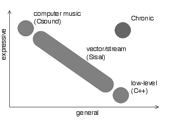
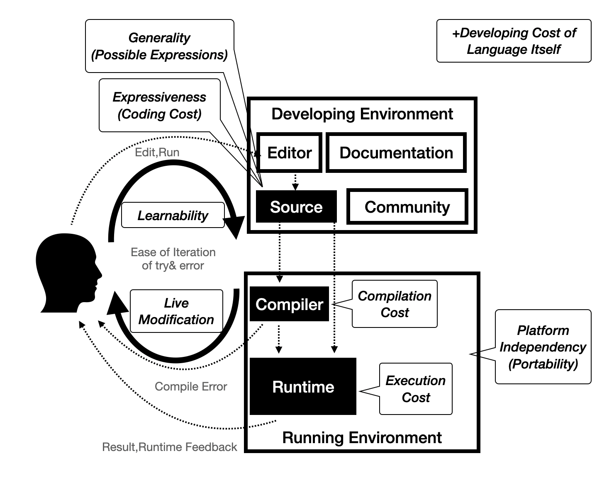

<!-- 第5章 音楽プログラミング言語の歴史と語彙の整理 -->


# 音楽言語設計におけるトレードオフーGeneral,Efficient and Expressive

Dannenbergは音楽のためのプログラミング言語を特徴付ける要素としてSyntax、Semantics、Runtime、Libraries、IDE(Interface?)、Community&Resourcesという6要素を挙げた[@Dannenberg2018]。

一方で、こうした言語ごとの実装や設計における要素が、言語にどのような特性をもたらすのかについての整理はこれまで多くは行われていない。

少ない例としては、Mcphersonらは音楽プログラミング環境の設計者へのインタビューを通じて、言語設計者がそれぞれどのような価値観を持って機能実装をしているかを分析している[@Mcpherson2020]。

(Mcphersonの例を解説)

また関連するものとして、汎用のプログラミング言語においてはCoblenzらが主に以下のような評価のための用語整理とその意味の明確化を試みている[@Coblenz2018]。

- General
- Efficient "Execution cost"
- Expressive "To what extent can users specify their intent using the formal mechanisms of the language?"
- Modifiability "How easy or hard is it to adapt software to changing requirements?"
- Learnability
- Understandability
- Portability
- ...

特に、音楽言語の実装に関する論文では、General、Efficient、Expressiveという3つの語がよく使われる用語でありながら、実際には指している意味が複数混在しているので用語を整理する必要がある。

例えば、Brandtは音楽言語設計における大きな問題としてExpressivenessとGeneralityのTradeoffが存在するとして、それらの両立を目指して関数型言語OCaml上でのライブラリChronicを開発している[@Brandt2002]。

{width=70% #fig:chronic-tradeoff}

ここでのExpressivenessとは“ユーザーが読みやすく書きやすい”、 Generalとは“可能な表現の範囲が広い”という意味で用いられている。またChronicはOCamlというホスト言語の実行速度の問題もあって、リアルタイムで実行はできなかった。つまりChronicではgeneralとexpressiveの両立はできたが実行時パフォーマンスという新たなトレードオフが発生していたことがわかる。

またLazzariniはCSoundの設計において、Score、Orchestra、Instrumentという3種類の内部言語を用いるアプローチにおいて、

> 音楽プログラミングにおいて多言語アプローチを取ると、ユーザは**汎用性(Generality)**と**効率性(Efficiency)**のバランスを取りやすくなる、

と述べている。ここでの用語は、続く以下の説明を参照すると、

> タスクに応じてプログラマは異なる複雑度のエントリーポイントを選択することが可能になる。より低く汎用的なレベルではより複雑なコードの設計が必要だが幅広い結果を得られる。一方、より高い、特殊化、具体化されたレベルではプログラミングに必要な労力という観点からプロセスはより効率的になるだろう。[@Lazzarini2013]

つまりここでのEfficiencyは、実行コストのことではなく、ユーザーが目的のプログラムを構築するまでの効率のことを指している。

またDannenbergのサーベイでは。

> This article considers models of computation that are especially important for music programming, how these models are supported in programming languages, and how this leads to **expressive** and **efficient** programs.[@Dannenberg2018] 

ここでのEfficientはprogramsに掛かっているのでRuntime Costのことを指していると推察できる。

このように、同じEfficiencyというワードでもComputerが負担するコストとユーザーが負担するコストという異なる事項を指している場合があることがわかる。


そこで、次の項ではMcphersonらやCoblenzらの分類を参考にしながら、改めて評価のための語彙を整理する。
そのためにまずは、音楽プログラミング言語を評価、また設計の指針となるためのvalueを、ユーザーがソースを編集し、実行し、そのフィードバックが帰ってくるhuman-in-the-loopシステムとしてモデル化し、その際に考えられるコストや自由度をユーザー、コンピューターそれぞれの観点で分類するという方針をとる。

# 実装面から見た音楽プログラミング言語の実行環境

# 実装からの分類-DSLのデザインパターン

一般的にプログラミング言語は、テキストの文字列データを解析して構文木と呼ばれるデータ構造に変換し、それを直接評価することで実行したり（インタプリタ型）、より低次の中間構造、例えばvirtual machineへの命令列やC言語のような汎用言語のソースコードなどへの段階的な変換を経て実行される場合がある。

音楽のためのプログラミング言語もこうした実装に則っているが、構文解析の部分はホスト言語(その言語自体を開発するための言語)の機能を利用しており、ライブラリのような形で実装されるものもある。構文解析から行うものをExternal DSL,ライブラリのような形で実装するものをInternal DSLと呼ぶこともある[@Nishino2015]。

External,Internalといった実装のアプローチの違いをSpinellis2000はデザインパターンとして提示した。そのうちの一部を取り上げる。

- 文字列解析(一番自由度は高いが大変)
- 言語拡張（ホスト言語のライブラリとして実装）
- 言語特殊化（ホスト言語の一部の機能だけを使う）
- Source to Souce Transformation
- Pipeline

言語拡張、言語特殊化の表現の範囲は、言語を実装するためのホスト言語の自由度（演算子のオーバーロードができるか、高機能なマクロが使えるかなど）にも左右される。

例えばSuperColliderの文法をCoffeeScript（Javascriptに変換され実行する言語）で模したWebブラウザ上で動作する音声処理ライブラリ/DSLであるCoffeeColliderは文字列解析などは自分では行っておらず、特定のオブジェクトに対する+演算子や*演算子の挙動をオーバーロードしたりすることで、CoffeeScriptの文法で可能な範囲の表現でSyntaxを模している[@mohayonao]。

```coffeescript
(->
  noise = PinkNoise.ar(0.2)
  noise = Mix Array.fill 10, (i)->
    Resonz.ar(noise, i * 800 + 200, 0.05)
  noise = (noise * 0.2 + noise * Decay.kr(Dust.kr(0.5), 10))
  noise = RHPF.ar(noise, LFNoise0.kr(0.5).range(220, 880), rq:0.001)
  CombL.ar(noise, delaytime:0.5, decaytime:25).dup() * 0.5
).play()
```

このExampleをSuperCollider本来の記法で書いたのが次のコードだ。

```smalltalk
{
   var noise = PinkNoise.ar(0.2);
   noise = Mix.new(Array.fill(10, {arg i;
     Resonz.ar(noise, i * 800 + 200, 0.05)}));
   noise = (noise * 0.2 + noise * Decay.kr(Dust.kr(0.5),10));
   noise = RHPF.ar(noise, LFNoise0.kr(0.5).range(220, 880), rq:0.001);
   CombL.ar(noise, delaytime:0.5, decaytime:25).dup() * 0.5
}.play;
```

SuperColliderでの`{}`で囲むことでオブジェクトを生成するシンタックスを、CoffeeScriptにおける無名関数`(-> statements)`を利用して似せていることがわかる。

<!-- ブログ記事から写したので語調を直す -->
## 演算子オーバーロードと自己反映性

さて、coffeecolliderの特徴的な点としては、演算子のオーバーロードを積極的に活用することでテキストをパースするプログラムを書くことなく、CoffeeScriptそのままで記法を可能な限りSuperColliderに近づけているという点だ。

演算子のオーバーロードとは、たとえば`+`や`*`などの二項演算を数値の加算乗算やテキストの結合などの言語組み込みの型だけではなく、自身の定義したカスタム型に対して新しく振る舞いを定義してやれるような機能のことだ。

たとえば、Number型2つで構成されるの2次元ベクトルの型を定義したら+演算子を使ったら要素同士をそれぞれ加算できたり、`*`演算子を使ったら直積、内積や外積を計算できるようにしたらコードの記述が短くできたり、一般的に数学で使われるような記法と近づけられることでソースコードを直感的に読めるようにできる。

演算子のオーバーロードができるようになっている汎用的な言語としては、たとえばC++、Scala、Haskellなどがある。特にHaskellでは、あらゆる関数を中置演算子のように使える上に`!  #  $  %  &  *  +  .  /  <  =  >  ?  @  \  ^  |  -  ~`などの文字から任意の文字を組み合わせて演算子を作ることもでき、`<=>??@`演算子のような独自演算子を作ることもできてしまう。

例えばJavascriptには演算子オーバーロードの機能がないので、例えばTone.js[@tonejs]などのライブラリでは、信号処理プロセッサのようなユーザーによって定義されたデータ型同士を組み合わせるためには関数呼び出しを用いて表現するしかなくなる。

一方、CoffeeScriptには演算子オーバーロードがついているのでSuperColliderのような、全く別の言語体系の言語であってもある程度表面上のシンタックスを近づけることができる。

演算子オーバーロード以外に、こうした言語自体の記法を自己拡張するような機能は他にも、Kotlinの[Type-Safe Builder](https://kotlinlang.org/docs/type-safe-builders.html) やF#の[Applicative Computation Expression](https://docs.microsoft.com/ja-jp/dotnet/fsharp/whats-new/fsharp-50#applicative-computation-expressions)などがある。

またマクロのような、言語本体の処理より前にテキストやAbstract Syntax Treeをユーザーが定義したルールを用いて置き換える記法も構文拡張の一つとして見ることができる。


こうした言語の意味を拡張していくような言語機能は、場合によっては自然な記述を可能にする一方、場合によっては同じ言語で書かれているのにソースコードの見た目が全く異なってしまい、かえって読みにくくしてしまうような効果も持つ。そのため、言語設計としてはgo言語のように意図してオーバーロードを禁止することで、ソースの見た目の一貫性をキープする方針を取る言語も少なくない。その意味ではLISPの系列の言語では、Syntaxを敢えてS式に統一してしまうことによって、マクロなどで機能を拡張し続けても、結果的にソースコードの見た目は一貫性を保つことができる。

逆に極端な言語の一例としては、コンパイラの挙動を実行コード側からかなり自由に変更できるようにすることで、ライブラリや利用目的ごとに言語のシンタックスを大きく変えられてしまうRacket[@Racket]がある。例えば、Racketそのものは本来S式の言語だが、$\#lang slideshow$を1行目に記述することによってスライドショーを作る機能に特化した言語に切り替えられたり、ライブラリを切り替える感覚で言語の見た目自体を切り替えられてしまう。この設計思想は、解きたい問題のドメインに合わせてまずそのドメインに特化した言語を作る、Language-Oriented Programmingと呼ばれている。

実装面から見れば、マクロにしてもRacketのような高度なコンパイラの挙動変更にしても、ソースコードをコンパイルしながら適宜その内容によってコンパイラ自体も変更されるというフィードバックプロセスが、言語の自由度を高めるほどに複雑化していくため、単に入力されたテキストデータを低レベルのデータまで変換していくパイプ的な構造から遠ざかっていくことになり、実装の難易度も一般的に上がっていく。


## TidalCycles - ハイブリッドなアプローチ

またTidalCyclesのように文字列解析、言語拡張、言語特殊化を組み合わせて実装されることもある。

```haskell
d1 $ sound "bd*4" # gain (every 3 (rev) $ "1 0.8 0.5 0.7")
```

- $や#はホスト言語であるHaskellにおける中置演算子(**言語拡張**)
- soundやgain、everyなどはHaskell上でライブラリとして定義された関数
- “”で囲まれた部分はHaskell上ではただの文字列
- ParsecというHaskellの**字句解析**ライブラリで内部的にパースしている
- ユーザーはHaskellの関数定義や型宣言など高度な文法を知る必要はない（**言語特殊化**）
- TidalCyclesはSuperColliderに対してOSCを送り音を出す(**パイプライン**)

一般的には中間表現を低次へ変換していくほどより抽象的な操作に近づいていくので言語処理系の実装が汎用言語の実装に近くなっていく。

またMaxやPuredataのようなビジュアル言語の場合は、保存されているテキスト/バイナリデータを解釈してビジュアルインターフェースとして表示する評価と、音声処理のためのデータ構造としての評価と2方向の評価が行われていると解釈することができる。この時の保存されているデータ形式は例えばMaxではJSONというJavascriptのための汎用データ表現形式を用いているように、その言語のSemanticsとは関係のない汎用的なデータ構造を利用している場合もある。

## DSLの中でも、音楽特有の問題 - なぜライブラリとしてのDSLではダメなのか？

HaskellみたいなDSL作りやすい言語で全てライブラリとして実装しちゃダメなのか？→基本的には厳しい

OSのプリエンプティブスケジューリング（ユーザプログラムが時間に関与できない）

​	例外- Xenomaiの様なカーネル拡張

信号処理中にヒープメモリ確保をできない問題


- テキストをパースするプログラムを書かなくてもライブラリでもホスト言語が演算子オーバーロードのように自己拡張する仕様を持つ場合DSLとしての性質を帯びさせることができる。
- パースするプログラムをゼロから書いた方が言語設計の自由度は高まる一方で、実装のコストが高くなる。さらにユーザーとしてもまったく新しい言語を1から勉強することになるので学習コストが高い。

McCartneyはSuperColliderの設計についての論文で、究極的には音楽のために言語をゼロから開発する必要はないと述べる。

> コンピュータ音楽に特化した言語は実際必要なのだろうか？少なくとも理論的には、私はそうではないと思う。今日の汎用プログラミング言語で利用できる抽象化方法は、コンピュータ音楽を便利に表現するフレームワークを構築するのには十分なものだ。ただ残念なことに、実用的には、今すぐ使える言語の実装としては欠けている部分もある。多くの場合、ガベージコレクションはリアルタイムでは実行されず、引数の受け渡しはあまり柔軟でない。遅延評価がないと、パターンやストリームの実装がより複雑になる。SuperColliderを書いたのは、コンピュータ音楽のために柔軟に使えるような抽象化方法を持たせたいと思ったからだ。将来的には他の言語の方が適しているかもしれない。SC Serverの合成エンジンと言語を分離する目的の一つは、SuperCollider言語とクラスライブラリで表現されている概念を他の言語で実装することを模索可能にすることだ。他にも、将来的にコンピュータ音楽のために面白い可能性を秘めた言語として、 OCaml (www.ocaml.org)、Dylan (www.gwydiondylan.org)、 GOO (www.googoogaga.org)、そして、偶然にも文法規則の多くに似た仕様を持つスクリプト言語であるRuby (www.ruby-lang.org)がある。[@McCartney2002]


実際、後半で述べられているようにSuperColliderという言語そのものを積極的に利用する人は少なくなった一方、音声合成エンジンとしてのSCServerはさまざまな形で利用され、音楽言語のインフラストラクチャとして機能している。[FoxDot](https://foxdot.org/)はPython、[Overtone](https://overtone.github.io/)はClojure、[TidalCycles](https://tidalcycles.org/)はHaskell、[Sonic Pi](https://sonic-pi.net/)はRubyとErlang)といったように実際に多様なホスト言語から利用されている。

しかしこの論文から20年近く経過した現在でも、汎用言語のライブラリとして音楽プログラミング言語を実装するには未だ限界があると言わざるを得ない。


Elementary(JS+JUCE)を例に


Ladder of Exprerience(加藤)
High Ceiling、Lower floor


# 音楽プログラミング行為のモデル化と評価語彙の提示

{width=70% #fig:humanintheloop}

{width=70% #fig:tradeoff}

​ユーザーへのフィードバックが音を出す前にわかる場合と、音を鳴らして初めてわかるものとある（型チェックとか）

## User-Side

学習しやすさ

表現可能な空間の広さ(Generality)がMcpherson2020におけるOpen-Endedness、BrandtにおけるGeneralityにあたるものと言える。

ユーザーが必要とするコーディングコスト、すなわちユーザーが想定している表現にどれだけ簡単に辿り着けるような言語仕様になっているかどうかがExpressivenessにあたるものと言える。

## Computer-Side

Compilation cost

### コンピューターが必要とするコスト（Runtime Efficiency/Execution Cost）

### 実行可能な空間の広さ（Portability）

## Edit-Executeの繰り返しやすさ

### ユーザー側：Learnability

### コンピューター側：Dynamic Modification

(Mcpherson2020におけるRapid-Prototyping、Mcpherson2020のDynamismは実行中に動的にUGenのデータフローを作り替えられるかどうかという話なので少し違う)　ここが極まるとLive Codingになる

### Development自体のしやすさ

C++とかで作られてると大変、インタプリタ型なら簡単

言語の自己反映性が高ければ言語自体のコーディングしやすさと一致してくる（機能拡張がライブラリを書くことで可能になる）

## それぞれのトレードオフ

10個全部を満たすのは無理、少なくとも全部を撮ろうとするとDevelopmentが超大変

他、具体的には（ここを綺麗に整理できたら嬉しい）

- インタプリタ型の実装だとEdit-Executeの変更はしやすくなる、その代わり信号処理とかをスクラッチで実装するのは実行コストが嵩む
- 

