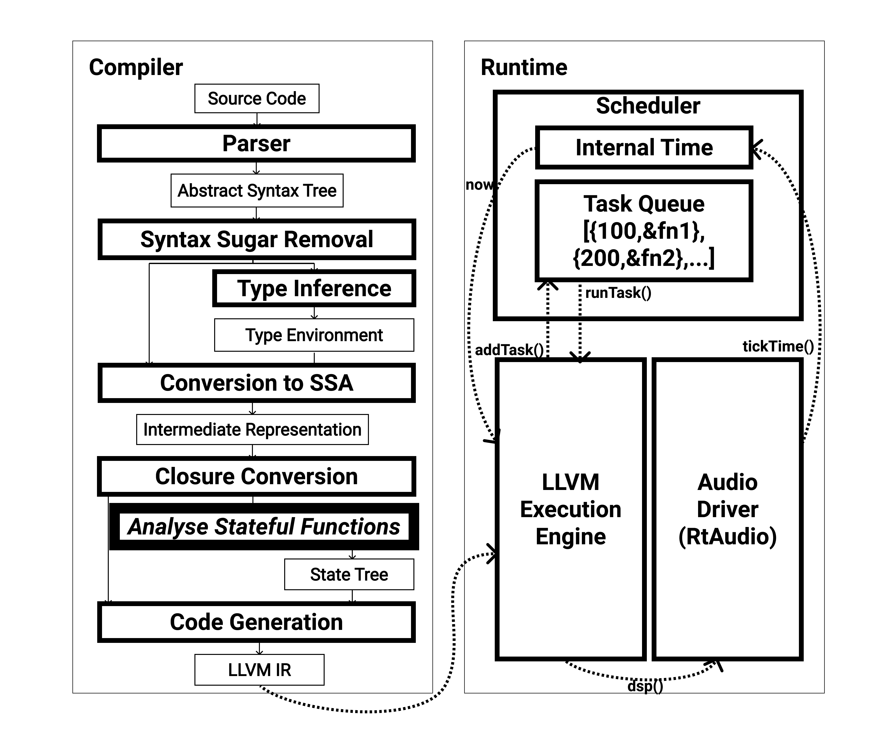

<!-- 第6章 音楽プログラミング言語mimiumの設計と実装 -->

本章では、これまでの背景をもとに、実際に筆者が開発したプログラミング言語mimium(**mi**nimal-**m**usical-med**ium**)[^mimiumrepo]の具体的な実装について記す。

[^mimiumrepo]: 本論文中ではバージョンは0.4.0をもとに解説している。ソースコードは<https://github.com/mimium-org/mimium>で公開されている。

なお、本章は、プログラミング言語に関する最大規模の学会、ACM SIGPLANにおける関数型プログラミング言語をテーマにした国際会議International Conference of Functional Programming（ICFP）の中で行われたFunctional, Art, Music, Modeling and Design（FARM）という、関数型プログラミング言語のアートやデザインへの応用を主題としたワークショップで発表した内容[@Matsuura2021]を実装部分を中心として日本語化したものである。そのため、他の章と比べると幾分文体が工学系論文の慣習に従った硬いものになっているが、プログラミング言語を扱う学会に参加することをある種の参与観察と捉え、その文体自体も、ある種特殊なコミュニティの性質のディテールを伝える要素として残すべきだと判断しそのままにしている。


# mimiumの設計

本セクションでは、mimiumの言語仕様と実行環境の詳細を記述する。

第4章では、歴史のなかでPLfMの設計のなかでUGenモデルが所与のものとされて受け入れられる過程を描いた。また、PLfM設計はケイが目指したようなメタメディア的な、自己拡張可能なツールとしての性質よりも、個別の需要に合わせて各レイヤーに特化した言語を作るMulti-Languageパラダイムの方向に進んできた。

mimiumでは改めて、音楽に特化した言語ではあるが、プログラミングにおけるメタメディアとしての自己拡張性を重視した設計を試みる。具体的には、汎用プログラミング言語の設計に最小限音楽のための使用を追加するという設計方針を取る。ここでは、汎用性を重視しつつもChronicなどと異なりあくまでリアルタイムでの動作を想定する。また、汎用言語の設計をベースにした構造ではあるものの、たとえばExtemporeの中のxtlangでポインターの記法やユーザーによるメモリ確保など、ハードウェア操作に関係する部分の理解が必要なのと異なり、mimiumでこれらの概念は言語仕様として隠蔽するという選択をした。

加えて、汎用言語をベースにした設計ではあるが、既存音楽のためのプログラミング言語を使っている人も参入しやすいように、UGenの概念に近い記法を可能にすることを目指した。

第5章では音楽プログラミング言語の実装方法の観点から、中間表現の粒度とそれに伴う可能な表現の範囲、実行コスト、コンパイルコスト、動的変更のしやすさ、開発コストなどの要素にトレードオフの関係があることを示した。この中でmimiumは中間表現の粒度が比較的細かく、そのためにライブコーディングのような動的変更の機能は実装の難易度が上がることが予想されたため、あらかじめ重視しないで作っている（mimiumの選択が[@fig:tradeoff4]だとすれば、相対的にExtemporeが[@fig:tradeoff5]にあたる）。

\begin{table*}[htb]
  \caption{mimiumと既存の言語の仕様比較。}
\label{langcomparison}
\newcolumntype{C}[1]{>{\hfil}m{#1}<{\hfil}}
\begin{tabular}{m{0.3\textwidth}ccccccc}
    \toprule  
                            & Pd/SC      & ChucK      & Extempore & Faust       &   Vult     &  Kronos  & mimium  \\
    \midrule 
    スケジューラ               & $\bigcirc$ & $\bigcirc$& $\bigcirc$ &     -      &     -      & $\bigcirc$ & $\bigcirc$ \\
    \cmidrule[0.2pt](lr){2-8}
    サンプル精度スケジューリング &     -      & $\bigcirc$ & $\bigcirc$ &     -      &     -      & $\bigcirc$ & $\bigcirc$ \\
    \cmidrule[0.2pt](lr){1-8}
    低レベルなUGenの定義       &     -      & $\bigcirc$ & $\bigcirc$ & $\bigcirc$ & $\bigcirc$ & $\bigcirc$ & $\bigcirc$\\
    \cmidrule[0.2pt](lr){2-8}
    DSPコードのJITコンパイル    &     -      &     -     & $\bigcirc$ & $\bigcirc$ & $\bigcirc$ & $\bigcirc$ & $\bigcirc$\\
    \cmidrule[0.2pt](lr){2-8}
    UGen内部状態の関数型表現    &     -      &     -     &      -     & Graph & \lambda 計算 & Graph & \lambda 計算 \\
    \bottomrule
\end{tabular}
\end{table*}

[@tbl:langcomparison] はmimiumと既存の主要な音楽プログラミング言語の仕様を比較したものである。mimiumは時間方向に離散的な制御の記述と、信号処理と1つのセマンティクスで実現している。信号処理の実行速度はJIT（実行時）コンパイルを用いることでC++などの低レベル言語での記述と同等にしている。またユーザーはメモリーの確保、開放のようなハードウェアの意識をする必要がない。

また低レベルなUGenの定義が言語上で可能ではあるものの、その内部表現はFaustやKronosの採用するグラフ表現と異なり、ラムダ計算をベースにしたフォーマットである。

本節ではまず、基本的な構文を紹介し、メモリ管理などのハードウェアを意識する必要がないこと、型推論により変数の型アノテーションを省略できることを示す。次に、mimiumの実行環境（コンパイラとランタイム）の一般的なアーキテクチャを紹介し、信号処理であっても、LLVMを介してすぐにネイティブバイナリにコンパイルして実行することができることを示す。

さらに、連続的な信号処理と離散的な制御処理を統一されたセマンティクスで記述することを可能にする、mimiumの2つの特徴的な機能について説明する。一つ目は、サンプルレベルで決定的なタスクスケジューリングのためのシンタックスと、スケジューラーの実装である。2つ目は、信号処理用のUGenを言語上で定義するために用いられるセマンティクスとそのコンパイルプロセスについて、関数と内部状態変数のペアのデータ構造という点で既存のパラダイムと比較しながら説明する。

議論のセクションでは、2つの問題を取り上げる。（1）mimiumは離散的な制御と信号処理を統一的なセマンティクスで記述できるが、離散的な処理の記述方法は命令的なものが多く、信号処理に用いられる関数パラダイムは互いに大きく異なること、（2）現在の実装では、FaustやKronosと異なり、信号処理のためのステートフル関数のパラメトリックな複製を表現できないこと。また、前述の問題を解決する方法として、多段階計算の利用可能性についても説明する。

## 基本的な文法

mimiumの基本的なシンタックスは、Rust[@Klabnik2020]をベースにした。シンタックスの選択は常に**すでにある程度普及している言語体系**を眺めた上で設計せざるを得ない。Rustの構文は予約語が比較的短いので音楽のように素早くプロトタイピングを行う分野に適していることが主な理由である。また、既存の言語の構文と似せると、既存の言語のためのシンタックスハイライト（ソースコードを色分けして見やすくするためのツール）を再利用しやすいという副次的効果も得られる。

```rust
//コメントはダブルスラッシュ
//新しい名前の変数への代入が変数宣言になる
mynumber = 1000 
//現在のところ全て変数はmutable
mynumber = 2000

//型注釈もできる
myvariable:float = 10 
//型エイリアス
type FilterCoeffs = (float,float,float,float,float) 

//文字列型は現在のところリテラルでのみ利用され、音声ファイル読み込みなどに用いられる
mystring = "somefile.wav"

//配列型
myarr = [1,2,3,4,5,6,7,8,9,10]
//配列アクセス
arr_content = myarr[0] 
myarr[4] = 20 //配列書き込み

mytup = (1,2,3) //タプル型
one,two,three = mytup //タプルの展開

fn add(x,y){ //関数定義
  return x+y
}

add = |x,y|{ x+y }//無名関数

//{}で囲った複数の文を1つの式として扱える
z = { x = 1
  		y = 2
			return x+y } //z should be 3.

//条件分岐と再帰関数
fn fact(input){
  if(input>0){
    return 1
  }else{
    return input * fact(input-1)
  }
}
// if文は式としても使える
fact = |input|{ if(input>0) 1 else input * fact(input-1) }
```

: mimiumの基本的なシンタックスの説明。 {#lst:mimiumbasic}


```rust
fn dsp(input:(float,float)) ->(float,float){
	left,right = input
	out = (left+right)/2
	return (out,out)
}
```

: mimiumでの、1chの入力を2chに複製して返却する`dsp`関数の例。 {#lst:dsp}

[@lst:mimiumbasic]に基本的な言語仕様を示す。BNFによる形式的な言語仕様定義は付録\ref{sec:appendA}にて示した。
変数の宣言は、関数のスコープ内で新しい名前の変数に何らかの値を代入することで自動的に行われる。変数を宣言する際には、コロンの後に型名を記述することで、値の型を明示的に指定できる。型名が省略された場合は、文脈から型を推測可能である。データ型には、`void`（空の値の型）、`float`（整数、浮動小数点型の区別はなく、内部的にはデフォルトで64bit-float）、`string`といったプリミティブな型のほか、任意の型の値を受け取り任意の型の値を返す`function`、任意の型を列挙する型である`tuple`、任意の型の有限長配列`array`といった合成型がある。また、ユーザー定義の型エイリアスを宣言もできる。

基本的な構文には、関数定義、関数呼び出し、`if-else`文を使った条件分岐などがある。また、関数型のパラダイムを取り入れ、if文を直接値を返す式として使用することができる。これは、複数の文（代入構文や関数実行）を{}で 囲み、最終行の`return`式の値を式として返す構文（Block）を持つことで実現している（`return`を省略することも可能）。同様に、関数定義は、無名関数を変数に代入する構文のシンタックスシュガーとして定義されている。


mimiumは静的型付け言語で、すべての変数と関数の型がコンパイル時に決定される。型推論（現在は単相）はHindley-Milnerのアルゴリズムに基づく。

また、DSP処理の高速化のために、メモリの割り当てと解放はコンパイル時に静的に決定され、ランタイムではガベージコレクションが行われない。

# mimiumでの信号処理

mimiumでは、`dsp`という関数をユーザーが定義すると、オーディオドライバーと音声の入出力に仕様される。例を[@lst:dsp]に示す。この場合、`dsp`関数の型は、*1つ以上の`float`型からなる`tuple`型*を取り、かつ、*1つ以上の`float`型からなる`tuple`型*を返す関数型にする必要がある。タプルの各要素が、オーディオドライバの入力チャンネルと出力チャンネルに対応する。例では、オーディオドライバから2つのチャンネルの入力を受け取り、それらをミックスして、左右それぞれのチャンネルに複製して返している。

mimiumには組み込み関数として、基本的な算術演算、libcの *math.h*で定義されている三角関数や指数関数などの数学関数、`delay`や`mem`（1サンプルの遅延）などの組み込みの状態を持つ関数(後述)、libsndfile[@Lopo]を使ってwavファイルを読み込むための`loadwav`関数、デバッグのための`print`関数などがある。フィルターやオシレーターは、これらの関数を組み合わせることで、すべてライブラリとして定義することになる。


# アーキテクチャ

図[@fig:arch]にmimiumの実行環境（コンパイラとランタイム）のアーキテクチャを示す。


コンパイラの構造は、一般的な関数型言語の構造に近く、mincaml[@Sumii2005]をベースに、C++を用いて実装されている。またバックエンドにはKronosやExtemporeでも用いられている、汎用コンパイラ基盤LLVM[@Lattner2004]を利用する。

ソースコードのテキストデータは、まず抽象構文木（AST）に解析され、シンタックスシュガーを変換した後、ASTはラムダ計算ベースの木構造に変換される。次に、型推論、型検査を行い、すべての変数の型を決定する。ASTは、型情報とともに、すべての変数が一度だけ割り当てられる静的単一代入（SSA）形式の中間表現に変換される。この段階ではまだ関数の入れ子定義が可能になっているので、関数定義から自由変数を取り除くためにクロージャ変換が行われる。

クロージャ変換と低レベルコード（LLVM IR：LLVMで利用される、C言語とアセンブリ言語の中間程度の抽象度を持つ形式）の生成器の間には、mimiumの独自仕様である状態を伴う関数（[@sec:statefulfun]）のための状態変数の検出を行う。この変換では、`dsp`関数を信号処理のエントリポイントとして、関数が使用する状態変数を、呼び出された状態付き関数名のノードと関数内で使われる状態変数の型を持つ木構造（図中の*State Tree*）のデータとして出力する。最後に、クロージャ変換されたIRとState TreeをもとにLLVM IRを生成する。

{width=100% #fig:arch}

ランタイムは、LLVM IRを受け取り、メモリ上でネイティブバイナリにコンパイルするJIT実行エンジン、オーディオデバイスとの入出力通信を行うオーディオドライバ、時間指定実行された関数とその論理時間の情報を保持するスケジューラの3つの部分で構成される。現在、オーディオドライバーには、オーディオデバイスをOSのAPIで抽象化したC++用のクロスプラットフォームライブラリRtAudio[@Scavone2002]を使用している。実行エンジンは、信号処理のエントリーポイントである`dsp`関数をオーディオドライバーに渡す。オーディオドライバーは、ハードウェアからの要求を基にスケジューラーに論理時間を進めるように命令し、スケジューラは、論理時間に基づいてタスクを実行したり、実行されているプログラムからタスクの登録の要求への応答、内部時間(`now`)をプログラムへ返す役割を担う。

LLVM IRまで変換されたコードの中では、タスクの登録と、内部時間の取得という2つの機能だけがランタイムに依存する。それ以外のコードは、メモリ上でコンパイルされて実行されるため、C言語などの低レベル言語で書かれた処理と同等の実行速度を実現できる。

# mimium固有の言語仕様

## `@`演算子によるスケジューリング

```rust
ntrigger = 1
fn setN(val:float){
    ntrigger = val
}
fn playN(duration:float)->void{ 
  setN(1)
  setN(0)@(now+duration)
}
fn Nloop(period:float)->void{ 
    playN(50)
    nextperiod = if(random()>0) period/2 else period
    Nloop(period)@(now+nextperiod) 
}
Nloop(12000)
```

: mimiumにおける継時再帰のサンプル {#lst:tr-mimium}

mimiumで時間方向に離散的に発生するイベントを記述するには、Impromptu（Extemporeの前身）で導入され、Overtone[@Aaron2013]やKronos Meta-Sequener[@Norilo2016]といった言語などでも利用されてきた、継時再帰（**Temporal Recursion**[@Sorensen2010]）と呼ばれるデザインパターンを用いる。継時再帰は、一定時間後に関数を呼び出す機能を用いて、ある関数の中で自分自身を一定の遅延とともに再帰的に呼び出すことで、時間とともに繰り返すイベント処理の記述を可能にするものである。

[@lst:tr-mimium]に具体的な例を挙げる。関数呼び出しに続けて`@`演算子、さらにその後ろに数値型の式を置くと、その関数はすぐには実行されない。代わりに、時間をキーとした優先順位付きタスクキューに登録され、実行コンテキストは次の文に移る。ランタイムは、オーディオドライバのクロックを基にして、各サンプルを処理する前にタスクキューをチェックし、先頭の要素のキーが現在の論理時間に達していれば、それらを先に実行する。時刻は、ランタイム実行を開始を0とした絶対時刻（単位は現在のところサンプル）となっているが、キーワード`now`を用いてランタイムから現在の論理的な時間を取得し相対的な時間を記述できる。

```lisp
(define ntrigger 1)
(define setN
    (lambda (val)
        (!set ntrigger 1)))
(define playN
    (lambda (duration)
            (setN 1)
            (callback (+ now duration) 'setN 0)))
(define Nloop
  (lambda (period)
        (playN 50)
        (callback (+ (now) (if (random > 0) (/ period 2) period)) 'Nloop period)))
(Nloop 12000)
```

: [@lst:tr-mimium]と等価なコードをExtemporeで記述したもの {#lst:tr-extempore}

[@lst:tr-mimium]の場合、`ntrigger`という変数は、`Nloop`という関数が呼ばれるたびに書き換えられる。
`Nloop`は自分自身を乱数によって不定期な間隔で再帰的に実行し続けるようになっている。継時再帰はこのように、言語仕様への最小限の機能追加で、様々なタイミングでのイベント実行を可能にする機能である。

mimiumでの例に対してExtemporeで等価なコードを[@lst:tr-extempore]に示す。Extemporeは`callback`という特殊な関数を使って一時的な再帰を行うが、mimiumは可読性を高めるために中置演算子`@`を導入している。

mimiumはChucKなどと同様に論理時間に基づいた同期的なスケジューリング戦略をとる。これは計算プロセスが変数を書き換えたりするだけで言語の中に閉じたIOを介さない処理の場合、サンプル単位での実行順序が正確に保証される。また実装が単純かつ実行コストが比較的少ない、OSのスケジューラに関与しないため移植性が高いなどの利点がある。一方で、標準入出力、MIDIやネットワークなどの信号を受けたり送ったりするIO処理をスケジューリングして実行した際に、指定した時間が実時間とは必ずしも正確には一致しないというデメリットがある。

Extemporeはこれと対照的な、非同期的スケジューリングを行う。これはIO処理を含めてスケジュールした関数の実行タイミングを実時間に近づけることができるが、実装に各OSごとのスケジューラへの対応が必要だったり、実行コストが論理時間ベースに比べると比較的高いというトレードオフが存在している。

mimiumは現状、実装の単純さを重視して論理時間ベースのスケジューラを用いているが、これは言語仕様と紐づいたものではなくあくまでランタイム上の実装次第である。そのため今後の実装によってはスケジューラの戦略をオプションで切り替え可能にもできるだろう。

## 状態付き関数を利用した信号処理

本セクションでは、まず信号処理のためのUGenを表現するための適切なセマンティクスとデータ構造について検討する。

### UGenに仕様されるデータ構造の比較

UGenは、入力データ（もしくはその配列）を受け取り、何らかの処理をして出力するものだ。これは一見すると純粋な関数として表現できるように見えるが、実際には関数と状態変数のペアというデータ構造を使う必要がある。

例えば、入力を加算・乗算するだけなら純粋な関数で十分だが、フィードバックを持つフィルターや、非線形発振器のように、時間`t`から`f(t)`の写像として表現できない処理を表現する時には、UGenは内部状態を持つ。

<!-- エフェクターの図入れるといいかも -->

したがって、汎用言語上でUGenを表現するためには、典型的にはオブジェクトやクロージャなどの関数と内部状態を組み合わせたデータ構造を利用する。ただし、オブジェクトやクロージャでは複数のプロセッサを用いる時に、一度インスタンス化してから実際の処理を呼び出す必要がある。

mimiumは信号処理専用のデータ型を作らなくても、UGenを通常の関数のように使うことができる文法を持たせている。

以降では例として0から1まで一定の割合で増加し、再び0に戻るノコギリ波のようなUGen：`phasor`の表現方法を、オブジェクト、クロージャ、さらにFaust、Vultにおける関数型の表現という異なる体系間で比較し、最終的にmimiumでUGenを状態を持つ関数として表現するセマンティクスおよびそのコンパイル手順について解説する。

#### オブジェクト

オブジェクトとは、メンバー変数のセットと、変数を変更したり他のオブジェクトにメッセージを送ったりするメンバー関数（メソッド）のセットを含むデータ構造である。オブジェクトの場合、内部状態はメンバ定数として定義されている。これを利用するには、あらかじめインスタンス化した上で、メインの処理メソッドを呼び出す必要がある。[@lst:cppexample]にC++言語でのオブジェクトを用いたphasorの表現の例を示す。


```rust
class Phasor{
  double out_tmp=0;
  double process(double freq){
    out_tmp = out_tmp+freq/48000;
    if(out_tmp>1){
      out_tmp = 0;
    }
    return out_tmp;
  }
};
//Instantiation
Phasor phasor1;
Phasor phasor2;
double something(){
  //use instantiated objects
  return phasor1.process(phasor2.process(10) + 1000);
}

```

: phasorをC++のオブジェクトを用いて表現した例. {#lst:cppexample}

#### クロージャ

クロージャとは、レキシカルスコープを持つ（≒関数の中で関数を定義可能な）言語で利用できる記法である。例えば、関数`A`の中で複数のローカル変数`a, b, c`が定義されており、さらに関数`B`が関数`A`のなかでネストして定義されている状況を考える。`B`の定義の中では、変数`a,b,c`が参照し、何らかの変更を加える操作を行なっている。このとき`a,b,c`は関数`B`にとってはローカル変数ではなく、自由変数と呼ばれる。`A`の定義が最終的に`B`を返り値として返却するような高階関数だったとすると、関数`A`の処理が一通り終わった後も、返却された`B`が実行されることによって`a,b,c`の値に何らかの変更が加えられることになる。言い換えると、この時`a,b,c`に変更を加えられるのは返却された`B`の処理のみである。このように、ある関数のローカル変数を、ネストされた関数の中に閉じ込めることを閉包、クロージャ（closure）と呼ぶ。このとき`A`を実行し`B`を何かの変数に格納する処理は、オブジェクトのインスタンスを生成することに相当する。

信号処理をクロージャで記述する場合、コンパイル時に変数の寿命を決めることが難しくなるという問題がある。クロージャが使える言語では、ガベージコレクション（GC）を実装して、変数へのメモリの割り当てと解放を動的に行うことが一般的だが、1秒間に48000回もの関数がリアルタイムで実行されるDSPのための言語にGCを導入することは困難である[@Dannenberg2005]。クロージャを利用できる数少ない言語として、SuperColliderでは、リアルタイムシステムで動作可能な複雑なGCをランタイムに実装しており、Extemporeでは、ユーザーが手動でメモリと変数の寿命の管理することで解決している。言うなれば、クロージャを用いると、ユーザーか開発者のどちらかが大きな実装コストを負担しなければならない。

[@lst:closure]にクロージャを用いたphasorの表現をJavaScriptでの疑似コードで示す。変数`out_tmp`は最終的に返却される関数`process`の中に閉じ込められている。`makePhasor`関数を実行することはC++における`Phasor`クラスの初期化処理（コンストラクタ）の実行に相当している。JavaScriptは内部的にガベージコレクションなどを利用する言語のため実際にこのコードを利用することは難しいが、命令型ベースの読みやすいシンタックスを持ち、かつクロージャを利用可能な言語であるため例示のために用いている。

```js
//pseudo-code in javascript
function makePhasor(tmpinit){
  let out_tmp = tmpinit;
  let process = (freq) => {
   out_tmp = out_tmp+freq/48000;//referring free variable out_tmp
    if(out_tmp>1){
      out_tmp = 0;
    }
    return out_tmp;
  }
  return process;
}
//instantiation
let phasor1 = makePhasor(0);
let phasor2 = makePhasor(1);
function something(){
  return phasor1(phasor2(10) + 1000);
}
```

: phasorのクロージャを用いた表現をJavaScriptによる疑似コードで表したもの {#lst:closure}


#### 関数型の表現

FaustやKronosの信号処理の記述では、一時変数の読み書きなしにUGenの代数的な組み合わせ表現を、内部状態を状態変数の代わりに遅延（`delay`）関数のような最小セットを組み込みの状態付き関数と、信号の1サンプル遅延を伴う再帰的な接続表現を用意することで可能にしている。

[@lst:faust]のFaustの例では、オブジェクトやクロージャのように、最初にインスタンス化する必要はなく、phasor用の状態変数は、コンパイル後に個別の関数呼び出しごとに自動的に確保される。

これらの言語ではそれぞれ、Faustではそれぞれ0以上の入出力を持つUGen（定数は入力0、出力が1つの関数、`+`演算子は入力が2つで出力が1つの関数、のように）、KronosではUGenの入出力がリストとしてシンボル化されており、通常の言語のように、記号が特定のメモリアドレス上のデータに対応しているわけではない。そのためこれらの言語に汎用言語と同等の自己拡張性を期待することは難しい。

```rust
phasor(freq) = +(freq/4800) ~ out_tmp
	with{
        out_tmp = _ <: select2(>(1),_,0);
 };
// no need to instantiate.
something = phasor(phasor(10)+1000);
```

: Faustでのphasor関数の定義の例。 {#lst:faust}


Vult言語[@Ruiz2020]では、関数定義において、通常の変数宣言である`var`ではなく、キーワード`mem`で変数を宣言すると、破壊的変更された値が時系列で保持され、UGenの内部状態を表現できる。この機能により、Faustと同じくあらかじめインスタンス化しておく必要がなく、通常の関数適用として、内部状態を持つUGenの接続を表現できる。

```rust
fun phasor(freq){
	mem out_tmp;//"mem" variable holds its value over times
  out_tmp = out_tmp+freq/48000;
  if(out_tmp>1){
    out_tmp = 0;
  }	
  return out_tmp;
}
fun something(input){
// no need to instantiate.
  return phasor(phasor(10)+1000);
}
```

: Vult言語でのphasor関数の定義の例。 {#lst:vult}

Faust、Vultともに、内部状態を持つ関数は、最初にインスタンスを作成することなく仕様できる。その代わり、内部状態の初期化は関数定義時に決定され、インスタンス作成時にコンストラクタを介して初期値を決定するような操作はできない。

逆に言えば、内部状態の初期値がほとんどの場合0または0の配列であるという信号処理のドメイン固有知識を利用することで、インスタンス化のための文法をコンパイラ側で省略し通常の関数定義、関数適用と同じように扱える、とも言えるだろう。

### 内部状態つき関数による信号処理 {#sec:statefulfun}

```rust
fn counter(){
  return self+1
}
```

: mimiumでの1サンプルごとに1増加するカウンター関数の例。 {#lst:counter}

こうした様々なUGenの内部表現の例を基に、mimiumでは、内部状態付き関数をUGenのように利用できる文法を導入した。これらの関数は、Vultと同じように、通常の関数適用`f(x)`と同じシンタックスで呼び出せる。その上でFaustのように`delay`などの限られた組み込み状態付き関数を使うことで、ユーザーは内部状態の変数の宣言を行う必要がない。さらに、汎用言語の場合と同様に、変数をメモリ上のデータとしてシンボル化する体系は崩していない。

また、関数定義の中でキーワード`self`を使うことで、1サンプル前の時刻でその関数が返した戻り値を参照することができ、UGenの再帰的な接続を表現することを可能にしている。`self`は、関数定義の中でのみ使用できる予約語で、時刻0では0で初期化され、関数の前回の戻り値を得ることができる。[@lst:counter]に最もシンプルな`self`の使い方として、1サンプルごとに1増加するようなカウンターの関数の例を示した。

```rust
fn phasor(freq){
  res = self + freq/48000 // assuming the sample rate is 48000Hz
  return if (res > 1) 0 else res
}
fn dsp(input){
  return phasor(440)+phasor(660)
}
```

: mimiumでのphasor関数の記述例。 {#lst:phasormimium}

`self`を用いると、これまでオブジェクトやクロージャといった例で見てきたUGenの`phasor`をmimium上で定義することができる。例を[@lst:phasormimium]に示した。この例では、ユーザーは状態変数の宣言の必要も、関数を利用する際のインスタンス化の必要もないことがわかる。
FaustでUGenの再帰的接続の表現のための中置演算子`~`が式の中で何度も利用できるのに比べて、mimiumでは再帰接続の単位は自然と関数定義の単位に分割される。

さらに、データフローや関数型言語に慣れているユーザーのために、パイプライン演算子`|>`を用意し、状態付き関数の呼び出しをプロセッサ間の接続として解釈しやすくする構文を持つ。パイプライン演算子は、F\#[@Microsoft2020]などの関数型言語で使われており、ネストした関数呼び出し`h(g(f(arg)))`を`arg |> f |> g |> h`と書き換えることができる。

[@lst:pipeline]に通常の関数呼び出しとパイプライン演算子の両方を使って正弦波発振器を定義した例を示す。

これに相当するものを、Faustでは[@lst:pipefaust]、Cycling'74 Maxでは図[@fig:maxexample]で示す。Faustの直列接続演算子(`:`)の他にも、ChucK言語のChucK演算子(`=>`)など、他の言語でも似たような機能を持つものはあるが、パイプライン演算子は、セマンティクスとしては通常の関数呼び出しと区別されない点が特徴である。

```rust
fn scaleTwopi(input){
  return input* 2 * 3.141595
}
fn osc(freq){ //normal function call
  return cos(scaleTwipi(phasor(freq)))
}
fn osc(freq){ //pipeline operator version
  return freq |> phasor |> scaleTwopi |> cos
}
```

: mimiumでのパイプライン演算子の利用例。 {#lst:pipeline}

```rust
scaleTwopi(input) = input * 2 * 3.141595;
osc(freq) = freq:phasor:scaleTwopi : cos;
```

: Faustでの直列接続演算子（:）の利用例 {#lst:pipefaust}


\begin{figure}[h]
  \centering
  \includegraphics[width=0.7\columnwidth]{img/max-osc-example.png}
  \caption{Maxでのデーターフロー的表現の例。}
  % \Description{Example of dataflow syntax in Max}
  \label{fig:maxexample}
\end{figure}

### 状態付き関数のコンパイル手順

状態付き関数は、図[@fig:arch]にあるように、コンパイラにおけるクロージャ変換と低レベルコード生成の間で、状態変数を隠れ引数として渡す純粋な関数へと変換される。

変換は以下のように行われる。まず、`dsp`の関数定義に含まれるすべての関数呼び出しを順に検索し、その関数がmimiumのコード上で定義されている場合は、さらにその定義を再帰的に検索して、関数呼び出しの依存関係ツリーを作成する。最終的に、その関数定義で`self`を参照する、`delay`などの組み込み状態付き関数を呼び出す場合、その関数は状態付き関数となり、さらにユーザー定義の状態付き関数を呼び出す関数は再帰的に状態付き関数となる。ツリーを作成した後、状態付き関数の引数に、その関数で使用されるすべての状態変数を列挙したタプル型変数へのポインタを付け加えるように関数定義を書き換え、関数呼び出しの部分も同様に、状態変数が明示的な引数になるように書き換える。例として、組み込み状態付き関数である`delay`と`self`を利用したフィードバックディレイである`fbdelay`関数を定義し、`dsp`の中で`fbdelay`を2つ、異なるパラメータで呼び出すようなコードを[@lst:fbdelay]に示す。


この時の状態変数を明示的に引数として渡すように変換した後の疑似コードを [@lst:fbdelayafter]に示す。`fbdelay`関数やそれを呼び出す`dsp`関数の引数の先頭にそれぞれ内部状態が渡されている。

```rust
// delay is a built-in stateful function
fn fbdelay(input,time,fb){
    return delay(input+self*fb,time) 
}
fn dsp(){
    // mix 2 feedback delay with different parameters
    src = random()*0.1
    out = fbdelay(src,1000,0.8)+ fbdelay(src,2000,0.5)
    return (out,out)
}
```

: mimiumでのフィードバックディレイのコード例。 {#lst:fbdelay}

```rust
// pseudo-code after lifting stateful function
fn fbdelay(state,input,time,fb){
  //unpack state variables
	self,delay_mem = state
	return delay(delay_mem, input+self*fb,time) 
}
fn dsp(state){
    // unpack state variables
    s_fbdelay0, s_fbdelay1 = state
    src = random()*0.1
    out = fbdelay(s_fbdelay0,src,1000,0.8) +fbdelay(s_fbdelay1,src,2000,0.5)
    return (out,out)
}
```

: [@lst:fbdelay]の内部状態付き関数の変換処理後の疑似コード {#lst:fbdelayafter}

## 言語仕様の整理、既存の言語との比較

まとめると、mimiumは、UGenを状態付きな関数として表現でき、時間離散的な制御や信号処理を統一的なセマンティクスで記述でき、ユーザーはハードウェアを意識することなくコードを書くことができる。また、ほとんどのコードがLLVMを介してメモリ上でコンパイルされるため、低レベル言語と同等の実行速度を実現している。時間方向に離散的な処理の記述では、`@`演算子を用いて、関数を実行する時間を指定することができ、継時再帰のデザインパターンと組み合わせることで、繰り返し発生するイベントを抽象化することが可能である。信号処理の記述では、Faustのように状態変数を隠し、`self`を用いたフィードバック接続と組み込み状態付き関数のみを組み合わせることで、内部に状態を持つ関数を通常の関数定義や適用と同じ構文で表現することができる。


既存の環境と比較して、mimiumは、*汎用プログラミング言語の仕様と実装に、最小限の音楽のための機能とセマンティクスを付加するアーキテクチャ*をとることで、プログラミング言語の自己拡張性を損なうことなく、実装をシンプルに保ち、ユーザーが音楽的作業に集中できるようにしている。

実際、スケジューリング機能や状態付き関数が使われていない場合、mimiumは汎用のスクリプト言語のように使える。また、mimiumのコンパイラの実装は、状態付き関数の変換部分を除けば、一般的な関数型言語のコンパイラと同じである。

Extemporeは、単一の環境ですべての記述ができるという点で、このアプローチと似ているものの、ユーザはxtlangとSchemeという2つの異なる言語を使用する必要がある。xtlangでは、UGenをクロージャとして定義する際に、手動のメモリ管理やポインタを含む複雑な型シグネチャを理解する必要がある。Extemporeは音楽に限らないフルスタックのライブコーディングを行うことを想定した環境であるため、手動メモリ管理は必ずしもマイナスポイントではないが、SuperColliderの開発者であるマッカートニーが言うように、音楽のために作られた言語であれば、ユーザーが音楽の作業に集中できるように、メモリやスレッドなどのハードウェア管理を不要、もしくはオプショナルにすることは一般的に重要だと言える[@McCartney2002,p61]。

Kronos（とMeta-Sequencer）も同様に自己拡張性を重視した言語である。KronosはSystem `F\omega`をと呼ばれる、ラムダ計算の拡張体系の1つをベースにしたより厳密な関数型言語であり、プロセッサの入出力をリスト構造としてパラメータ化できることで、よりUGenの一般的な表現が可能である。しかし、その内部表現はFaustのようにグラフ構造をベースにしている[@Norilo2016phd,p23]。mimiumの内部表現は、ラムダ計算ベースの木構造やSSA形式の命令型IRであり、より汎用プログラミング言語の中間表現に近いという違いがある。


# 現状の実装の問題点

```rust
fn frp_constructor(period){
	n = 0
	modifier = |x|{
		n = x //capture freevar
    modifier(n+1)@(now+period)
	}
	modifier(0)@ 0
	get = ||{ n }
	return get
}
val = frp_constructor(1000)
event_val = val()
```

: mimiumの現在の実装ではコンパイル不可能な、時間方向に離散的に変化する値を関数として抽象化するコードの例。 {#lst:frp}


```rust
fn filterbank(N,input,lowestfreq, margin,Q,filter){
	if(N>0){
		return filter(input,lowestfreq+N*margin,Q)
				+  filterbank(N-1,input, lowestfreq,margin,Q,filter)
	}else{
		return 0
	}}
```

: mimiumの現在の実装ではコンパイル不可能な、内部状態を持つ関数のパラメトリックな複製のコード例。 {#lst:filterbank}

現状mimiumを実用的に利用する際に3つの問題点が残っている。1つは離散的なイベントの記述は命令型、信号処理は関数型のパラダイムという2つの記法のミスマッチ、2つ目は信号処理に用いる状態付き関数をパラメトリックに複製できないこと、最後がFFTに代表されるサンプルをあるまとまった数ごとに処理をする信号処理が記述できないことだ。

## 離散イベントの処理と信号処理の記述のミスマッチ

`@`演算子を用いて関数実行を時間指定するという方式は、当然ながら即時その関数が実行されないために、返り値を持たない`void`型の関数を用いて副作用（変数の破壊的代入もしくは標準出力への書き込みなどのIO操作）を起こす、命令型プログラミングのスタイルに帰着する。これはmimiumにおける信号処理で行われる、返り値を次の関数の引数として渡していくことで、信号フローの表現を行うようなスタイルとは大きく異なる。

シンタックス上は[@lst:frp]のように、継時再帰とクロージャを組み合わせれば、離散的な値の変化を連続的な信号処理のスタイルと同様に表現することができる。だが、現在の実装ではこのコードは実現不可能である。mimiumの現在の実装では関数内部で定義されたローカル変数は本来のスコープを超えて生存することができないため、変数の参照を返り値として返却するようなこのコードを実行することができないためである。コンパイラが仮にライフタイム解析[@Ruggieri1988]などの静的解析を用いてコンパイル時に変数の寿命を決定（あるいは、プログラム実行中は永続的に解放されないことを静的に判定）できればこの時間方向に離散的なタイミングで変化する数値の抽象化が可能になる。

## 状態付き変数のパラメトリックな複製

もう1つの問題は、現在の実装では`self`や`delay`を用いる状態付きの関数をパラメトリックに複製できないということだ。[@lst:filterbank]のような例を考えてみよう。関数`filterbank`は引数`N`の条件を基にして、別の引数として与えられる`filter`関数を再帰的に足し合わせるようなコードだ。この時、`filter`関数に用いられる状態変数の数と、そのためのメモリのサイズはコンパイル時に静的に決定されねばならない。しかし`filter`関数が何回複製されるかは引数である`N`によって決定されるために、`filterbank`関数が実行されるタイミングになるまで状態変数の数の決定は不可能である。

このようなパラメトリックな信号処理プロセッサの複製は、たとえばFaustではパターンマッチを用いたコンパイル時再帰によって記述可能である。これはオリジナルのFaustのセマンティクスの中には存在しなかった機能で、Gräfによる項書き換えシステム（パターンに応じてコードそのものをコンパイル前に書き換えてしまう一種のマクロ）の導入によって解決されたものである[@Graf2010]。それ故、コンパイル時に[@lst:filterbank]でいう`N`に相当する、コンパイル時に展開される変数が、整数の定数であることを保証できない場合にはコンパイルエラーになる。加えて、FaustのBlock-diagram Algebraの意味論とマクロの体系は別物として存在しているため、コードを書いている人からすると、コンパイル時定数と実行時に変化する変数はどちらも同じ数値であり区別がつけづらい。

mimiumにおいてこの問題を解決するためには、コンパイラが定数を予め展開してしまうような仕組み、あるいはマクロを最低でも状態変数の解析の前のステップに導入する必要がある。これはコンパイラが暗黙的に行うことでも解決は可能だが、Faust同様、ユーザーからすれば`N`が定数でなければいけないことは意味論の外側の事情になってしまうので理解が複雑になってしまう。

この問題は一歩引いて考えると、そもそもこの`filterbank`関数は、シグナルフローをコンパイル時に決定する処理の記述と、実際にプログラムが実行されるタイミングで発生する信号処理という、**2つの時間における計算を混在させている**ことになる。こうした状況はMetaMLに代表される一種の多段階計算[@Taha1997]と類似した状況と考えられる。多段階計算は、計算が起きるステップを明示的に文法の中に記述でき、型システムにもその変数がいつ計算される変数かという情報を入れることができるような計算パラダイムで、再帰の発生する計算などを効率的にプログラムできるといった特徴がある。

計算がいつ発生するかという視点で考えれば音楽プログラミング言語には、シグナルフローの決定という計算以外にも例えば波形テーブルの生成、リズムパターンの生成といった、プログラムの中では一度きりしか発生しない計算はいくつもあるため、導入することで副次的に得られる利点もある。

さらに、多段階計算はMacroML[@Ganz2001]のように高機能なマクロとしての活用方法もある。つまり多段階計算を導入することによって、UGenのパラメトリックな複製だけでなく、言語の自己反映性を高め、言語内DSLをライブラリとして構築できる仕組みへと応用することも期待できる。

## 複数サンプルレートが混在した信号処理

mimiumの信号処理は1サンプルごとの処理の記述によって表現されているため、高速フーリエ変換（FFT）に代表されるような、256、512などまとまった数のサンプルを処理し、同じまとまりのサンプルを一挙に出力する、いわゆる複数サンプルレートの混在した信号処理（Multi-rate Processing）の記述が不可能である。FFTは音声信号を時間領域から周波数領域へと一度変換し、なんらかの処理を経て再度時間領域へと逆変換を行う、スペクトラルプロセッシングと呼ばれる種類の今日多用されている信号処理に必須の処理である[@Roads2001,13章]。この問題はサンプルごとの処理を基本とする言語であるFaustにも共通した問題であり、実現のための文法拡張は同様に試みられている[@Jouvelot2011]ものの実用には至っていない。Kronosはサンプルレート自体を変更するコンパイラ組み込みの関数を導入することでこれを解決している[@Norilo2015,p40〜41]。これも多段階計算同様に**いつ計算するか**に関わる、一般的なプログラミング言語では考慮されない要素であるため、どのみち意味論に何かしらの拡張を加えなければ根本的な解決はできないものと考えられる。


# より形式的な定義のための関連研究

現在のところ、mimiumの統語論の定義に関しては付録で示すように形式的な定義を行えてはいるが、`self`のような状態付き関数の意味論は実装によって示されているのみである。

この参考となる研究がmimiumを発表したACM SIGPLAN FARM(Functional Art, Research, Modeling)というワークショップで同じセッションで発表された*W*計算（*W*-calculus、ラムダ計算と同じような名付け）である[@Arias2021]。*W*計算はFaustに強く影響を受けたサンプルベースの信号処理に特化した体系ではあるが、FaustやKronosのように入出力を持ったブロックのグラフを組み合わせる構造とは大きく異なる。*W*計算はmimium同様にラムダ計算をベースにした計算体系であり、通常のラムダ計算に現れる項に加えて、$feed\: x.e$といった独自の項が追加されている。

この`feed`はその項における1時刻前のサンプルでの計算結果が$x$として項の中で再帰的に利用できるといった意味合いをもち、これはmimiumにおける`self`の概念に直接的に対応する。例えば1サンプルずつ引数`incl`に応じて増加するカウンターの関数[@lst:wcalc]は*W*計算の中では[@eq:label]のように表せる[^wcalculus]。

[^wcalculus]: *W*計算はフィルタのような線形時不変（Linear Time-Invariant:LTI）システムの実質的等価性を形式的に証明することを1つの目的としている。そのため厳密に言えば基本的演算に式同士の加算と、式と定数の乗算（スケーリング）のみが許されており、式同士の乗算などは許されない。しかし基本的な演算の項を追加すれば非線型システムにも対応はできる。

```rust
fn counter(incl:float){
    return self+incl
}
```

: mimiumでの引数`incl`サンプルずつ増加するカウンター {#lst:wcalc}


$$
\lambda \ incl.feed \ self.(incl+self)
$$ 

: {#eq:label}


\begin{equation}
\lambda \ incl.feed \ self.(incl+self)
\label{eq:label}
\end{equation}

W計算では*feed*の項の他に、式の過去のサンプルの参照、つまりディレイに相当する処理も基本操作として備えている。こうした過去のサンプルへの参照は、実用的には過去のサンプル全てを保存しなければならず、ほぼ無限のメモリを必要としてしまう問題がある。この問題は、Chronicが簡潔なデータ表現を可能にはなってはいるものの、リアルタイム実行が難しくなっていた理由の1つでもある。

*W*計算も、最も簡単な意味論では同じ問題を共有しているものの、リアルタイム実行のために都度意味論を拡張させることで対応できている。また、OCamlで書かれた*W*計算で記述された信号処理のプログラムを、一度MetaOCamlというOCamlのプログラム自体を加工できるメタ言語上で評価することで、入力プログラムに特化したインタプリタプログラムを生成し、コンパイラの最適化などをさらに組み合わせることでリアルタイム計算を実現できている。またMulti-rate信号処理への拡張も既に方針が示されているなど、かなり実用を意識した上での理論構築がなされている。

mimiumも根本的な意味論の定義を*W*計算の形式を借りることによって可能になるだろうと考えられる。もっとも、*W*計算においても時間方向に離散的な処理の意味論は含まれておらず、現状のランタイムとの通信という実装に依存する定義方法に対する解は今後別に検討する必要がある。


# 小括 {#sec:chap6end}

本章ではmimiumの具体的な設計と実装を示した。mimiumは汎用関数型言語の設計に最小限の時間操作の機能を追加する方針で作られていた。その最小限の機能とは、`@`演算子によるスケジューリングと、内部状態付き関数によるUGen相当の信号処理の表現を2つであった。

ここまでmimiumの実装を通じての視点で、一度本研究の提出する貢献のひとつ、PLfMとは一体何かという問いに答えることで本章のまとめに替える。

音楽プログラミング言語とは本質的にはマッカートニーの言ったように、**音楽のための最低限の抽象化機構を備えた人工言語**である。今日（音楽に限らない）プログラミング言語とは、ハードウェアの違いに依存しない抽象的な計算モデルを、（必ずしもテキストに限らない）人間が知覚、認識、記述可能な形で記述/操作できるようにしたものと言える。ただし、ハードウェアを意識する必要のない高級汎用プログラミング言語の多くは、ガベージコレクションのような実行タイミングに不確定性を生じさせる機能を利用している。そのため汎用言語のライブラリとして、信号処理を含むリアルタイムな動作が可能なDSLを構築することは難しい状況が続いている。

そのため多くのPLfMの設計はその統語論や意味論の設計自体を行う必要が出てくるが、問題となるのは**最低限の抽象化**をどこに設定するかである。言語実装者にとっての最低限の抽象化の線引きによってその言語の実行環境は、大きければUnit Generatorのインタプリタモデルのようになるし、小さければFaustのような厳格な形式的意味論を備える言語体系になる。

最低限のラインを大きくすると、それは基本的に、十二音の音階や、モジュラーシンセサイザーのメタファーなど、ある音楽様式が言語自体に埋め込まれてしまい、プログラマーの思考をその様式に固定してしまうだけでなく、基本的にプログラミング言語としての抽象化能力は高くないものが多いので、基本から外れた試みを行うためにその言語上で高度なライブラリを作ることも難しいといった問題が生じてしまう。

一方で、最低限のラインを下げれば下げるほど、その言語自体の設計や実装に必要な知識は音楽ではなくコンピューターに関する知識そのものになっていく。

さらに、比較的現代的なものを含めて汎用プログラミング言語の下敷きになっている理論は基本的に、可能な限り速く計算できることが是とされる、時間を考慮しない計算モデルを基にしており、**いつ計算するか**を明示的に意味論に組み込む言語は少ない。現状、時間の概念が関係してくる抽象計算モデルの議論の種別としては次のような4種類に分類される。1つ目は、例えば線形時相論理、計算木論理などの「時間Aまでに処理が間に合っていればBの処理を、間に合わなければCを」といった、実時間に伴うタイムアウト処理などの用途を想定したリアルタイムコンピューティングの議論。2つ目は、Communicating Sequential Processes（CSP）や$\pi$計算のような、並行システムをラムダ計算と同じように、形式的に抽象化する方法についての議論。3つ目は、Functional-Reactive Programming（FRP）のような、時間に伴って変化するデータ全般を抽象的に表すことを目的とした関数型プログラミングの議論。4つ目は、Faustや*W*計算のような、音声信号処理で使われることを想定した、実時間ではなく等間隔な時間で発生する計算の順序を保証し、かつ、漸化式的に、時間方向に遡って計算結果を利用する計算モデルである。

リアルタイムコンピューティングと並行システムの抽象化は音楽以外の分野が議論の中心である。FRPは元々アニメーションなどの表現に使われることを想定としているが、信号処理の理論との接続は未だ積極的に行われてはいない（数少ない例としては[@Reach2013]や[@Gaster2018]）。

これら4種類の時間に関わる計算モデルを統合するような研究は未だ行われていない。その上、仮にもし時間を含めた計算モデルがあったとしても、現代で使われているコンピューターの構造自体、特にOSのスケジューラーなどの実行タイミングの不確定性から逃れることはどの道できない。

そのため、なるべく可能な表現範囲の広いPLfMを設計するには、まず未だ確たるものが存在しない時間を考慮した抽象計算モデルを考慮に入れた意味論の設計を行う必要がある。その上で、ハードウェアやOSと言った、現状存在しているインフラストラクチャ上で動くランタイムプログラムの工夫などで実行モデルとインフラストラクチャの不一致をつなぎ合わせるという、常に暫定解を探し続ける必要がある。


