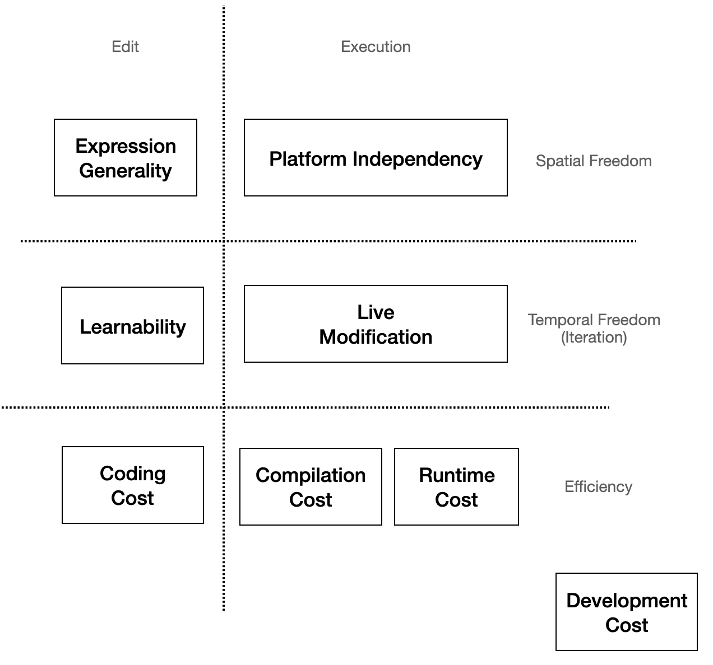
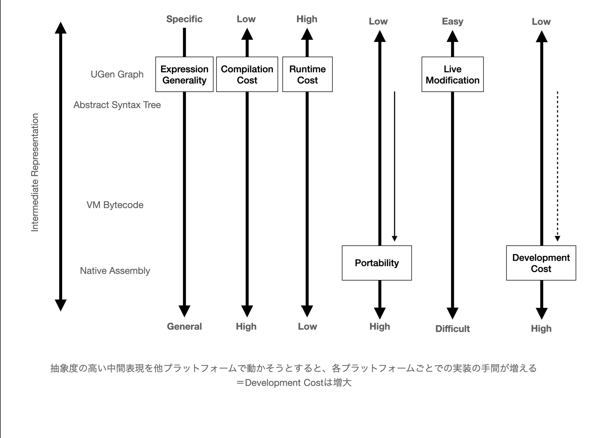
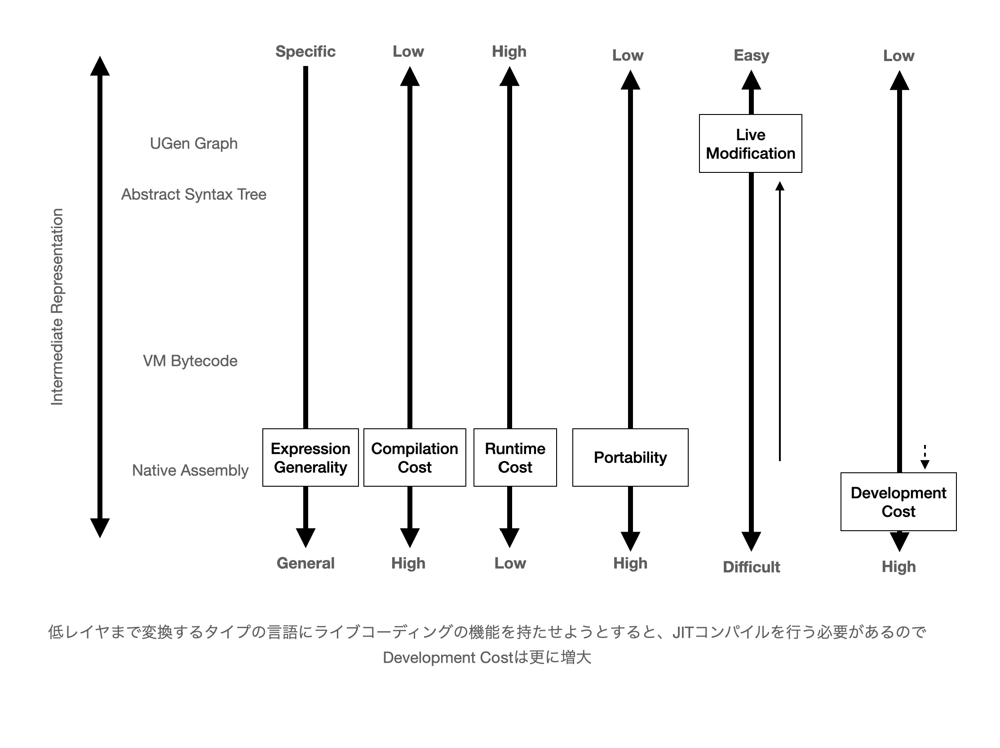

# 導入

第3章では時間軸に沿って音楽プログラミング言語の歴史を追うことでその特性を記述してきた。本章では、対照的に、現在利用されている音楽プログラミング言語の同士の比較をすることで、その共時体とも言えるものを検討する。つまり、音楽のためのプログラミング言語はその幅広い目的に応じて様々な形式の実装がなされている中で、目的や応用以外の視点で言語同士の比較のための概念や語彙を選び出すことによって、歴史的視点とは異なる形で「音楽プログラミング言語とはなんなのか」という疑問に答えるということだ。

本章の構成は大きく2つに分かれる。前半は音楽プログラミング言語を実装するパターンを、Spinellisらにおけるドメイン特化言語全般におけるデザインパターン分析を足がかりとしながら、実際の言語における構成を例を挙げながら検討することで類型化を試みる。また後半では音楽プログラミング言語における設計目標や評価に使われる*General*、*Efficient*、*Expressive*と言った語彙が、同じ単語でありながらも異なる意味で用いられていることを指摘し、より適切な設計目標、評価のための語彙の形成を試みる。そのために、Coblenzらによる汎用プログラミング言語における設計目標の整理をもとに、音楽プログラミング言語を使用する過程を言語の実行環境が実際に動作する過程と組み合わせた、Human-in-the-Loopモデルとして提示し、各要素においてそれぞれどの設計目標が対応するかを検討する。


# 実装面から見た音楽プログラミング言語の実行環境

本章で検討するような言語の特徴の比較の先行例としては、Dannenbergのサーベイが最も詳しい[@Dannenberg2018]。

Dannenbergは音楽プログラミング言語を特徴づける要素として以下の6つの要素を挙げた。

- シンタックス（Syntax）
- セマンティクス（Semantics）
- ランタイム
- ライブラリ
- 開発環境
- コミュニティやドキュメントなどの資料

いわゆる「言語仕様」と言った時には、**シンタックス（Syntax）**と**セマンティクス（Semantics）**という2つを合わせたものを指すことが多い。
シンタックスとは言語の表面的な仕様を表すもので、セマンティクスとはよりプログラムの意味に直接関わる言語仕様のことを指す。

専門的な違いは文献具体例でこの違いを表そう。javascriptという言語でで入力を2乗して返す関数powerを定義すると次のようになります。


```javascript
function power(input){
  return input*input;
}
```

このソースコードにおいてfunctionという単語はjavaScriptの中であらかじめ定められている用語（いわゆる予約語）です。

たとえばJavaScriptの言語仕様がある日、「この予約語functionをfnに変える」となった時のことを考えると、エディタなどでテキスト一括置換を使ってfunctionをfnに入れ替えればすぐに対応できることが想像できるだろう。一方で、ある日「演算子`*`は整数同士の掛け算を表すもので、小数点同士の掛け算を表すには`*.`という演算子を使用しなければエラーとする」という仕様変更の場合はどうだろうか[^ocamlmult]。プログラムを修正しようと思ったら実際にその関数が小数点の計算に使われているのか整数の計算に使われているのかを判断して置換しなければいけないので、先ほどのように一括置換というわけには行かない。

[^ocamlmult]: この整数と小数点の変数に対して算術演算子を使い分ける仕様は実際にOCamlに代表されるML系言語で用いられている。もっともその目的は静的型付け言語においてユーザーが整数と小数点の計算を混同しないようにすることもあるが、そうすることで単に実装を簡略化できるという理由もある。

前者のように、プログラムの意味論そのものに影響を与えない言語仕様をシンタックス、後者のように意味論に影響を与えるものをセマンティクスと考えて貰えば良い。もちろんシンタックスも、たとえ意味論に影響は与えなくとも、予約語が短ければタイピングが早くなってプログラムが早く書けるかもしれない、というように言語の使い勝手に大きく影響する。

## 形式的定義と実装による定義

そもそもプログラミング言語を作るとはなんなのかを考えると、観念的には大きく分けて2つの作業が存在している。1つは言語仕様を定義する作業であり、もう1つは仕様に従って実際にその言語を読み込み、実行できるプログラムを実装する作業である。ところが、現実的には（特に特定のドメインに特化した言語であれば尚のこと）言語の仕様というのは厳密に定義されているとは限らず、それを実行できるプログラムのみが存在していて、実装が唯一の言語仕様を表すものになっているケースも少なくない。

特に、C言語のような低レイヤを記述する言語においては、何かセキュリティ関連の重大なインシデントがプログラムの予想外の動作によって引き起こされた場合、それはプログラマが言語仕様で未定義動作になっているコードを書いていたり、コンパイラが言語仕様に沿っていない実装をしていたり、言語仕様そのものの定義が甘いせいで、正しく言語仕様に沿ってプログラムを書き、コンパイラも言語仕様に沿ってコンパイルしたが予期しない動作が発生してしまったりなど、複数のケースが考えられ問題の原因と責任がどこにあるのかをはっきりさせることができるといった利点が考えられる。

音楽プログラミング言語においては、何かしら予期しない動作が起きたとしてもせいぜいプログラムがクラッシュする程度の問題にしかならないことに加えて、音楽のための言語に必須ともいえる、オーディオ入出力のようなペリフェラルを形式的に定義することはあまり一般的でないこと、また言語自体が特定の開発、実行環境（いわゆる統合開発環境：IDE）とセットになって設計されているため、形式的に言語仕様を定義するよりも、その実装におけるコメントや、ドキュメンテーションの充実で言語仕様らしい情報を補完する方が現実的であるため、言語仕様＝唯一の実装となっているものが大多数である。

ただし、テキストベースの言語において、シンタックスを形式的に定義するには、バッカス・ナウア記法に代表される文脈自由文法による表記法などがあるのだが、これに似せた記法でシンタックスを定義するとテキストから抽象構文木という中間データ構造へ変換する、パースするためのプログラム（やそのためのC言語などのソースコード）を出力してくれる、コンパイラ・コンパイラと呼ばれるツールが存在しており、こうしたツールを用いれば実装による仕様定義ではあるもののある程度形式的定義風味にしてくれる。実際コンパイラコンパイラの代表的ツールであるbison(yaccというツールの拡張版)はSUperCollider、ChucK、Faustといった多くの言語の実装で用いられており、筆者の実装したmimiumもこれを用いている。

また音楽向け言語においてセマンティクスを形式的に定義する方法、形式的意味論での定義を用いている代表的な例としてはFaustが挙げられる。形式的意味論は大きく分けて操作的意味論(Operational Semantics)による定義と表示的意味論(Denotational Semantics)による定義の2種類がある[^axiom]。なるべく簡単に説明すると、操作的意味論はプログラムがある装置（なんらかの仮想機械）上でどのように実行されるかの定義を示すことによって意味を決定し、それに対して表示的意味論はある項を別の言語の項へと変換する規則を定めることによって意味を定めるものである。Faustは形式的意味論を採用しており、ソースコードから、Block Diagram Algebraという、入出力を持ったシグナルプロセッサを並列、直列、分岐、合流、再帰という5種類の演算子で組み合わせで表現する体系へと変換し、それをCやC++をはじめとした様々な低次の言語へと変換する[@Orlarey2004]。


[^axiom]: 厳密には公理的意味論（Axiomatic Semantics）なども存在するが、汎用言語でも定義に用いられている例は少なく、音楽プログラミング言語で使われている例は知る限り存在しないので本稿では省略する。[@UnderstandingComputation,p56]を参照。

# ドメイン固有言語のデザインパターン

次に、プログラミング言語一般の言語仕様の定義方法の話から、特定の応用領域（ドメイン）に向けたプログラミング言語、いわゆるドメイン固有言語（Domain-Specific-Language:DSL）の実装方法を概観しよう。

DSLは音楽に限らず、例えばProcessingやGLSLのようなグラフィック生成のための言語であったり、ArduinoやHDLのようなハードウェアの操作に特化した言語が存在する。先ほど挙げたbisonのようなコンパイラ・コンパイラも、バッカス・ナウア記法風に書かれたテキストデータからパースプログラムのソースコードを出力する、いわばプログラミング言語実装のためのDSLである。

一般的な汎用プログラミング言語は簡単に言えば、テキストという文字列データを解析して構文木と呼ばれるデータ構造に変換し、それを直接評価することで実行したり（インタプリタ型）、より低次の中間構造、例えば仮想機械への命令列やC言語のような汎用言語のソースコードなどへの段階的な変換を経て実行される場合があるのだが、基本的な構造はテキストというデータを次々と機械語へと近い形のデータ構造へと変換し続けるパイプラインのような構造を取っていることが多い。

ところが、先ほどあげたProcessingやArduinoといったツールは、実装の方法からするとJavaやC++といった汎用言語上に構築されたライブラリとほとんど見分けがつかない構造を持っているが、DSLに分類されることもある。


音楽のためのプログラミング言語も同様に、汎用プログラミング言語のライブラリ的に実装されているものと、構文解析を1から行うもの、また両者をハイブリッド的に用いるものなど複数のアプローチが存在している。構文解析から行うものをExternal DSL、ライブラリのような形で実装するものをInternal DSLと呼ぶこともある[@Nishino2016,p28]。

このようなExternal,Internalといった実装のアプローチの違いをSpinellisはデザインパターンとして提示した。そのうち、実装方針に関わる一部を以下に列挙する[@Spinellis2001]。

- 文字列解析
- 言語特殊化
- 言語拡張
- Piggyback(おんぶ)
- ソースtoソース変換
- パイプライン

文字列解析は、すでに説明した、テキストデータを直接読み込んで抽象構文木のようなデータ構造へ変換するプログラムを書く方法だ。これは当然、文法の設計の自由度が一番高い代わりに、構文解析という比較的複雑になりやすいプログラムを自ら実装する必要がある。しかし、特定の応用領域があるとは言っても、必ずしも表面的な文法をゼロから設計しなくても良い、むしろ、汎用プログラミングにもある程度触れたことがあり、そうした言語の記法からかけ離れない方が習得しやすいというケースもあるだろう。そうした時には言語特殊化、あるいは言語拡張という既存の言語に乗っかる形でのライブラリ的実装をするという選択肢がある。

**言語特殊化**というのは、たくさんある言語機能のうちの敢えて一部だけを使うような構造をとる言語である。先程の例で言えば、ProcessingやArduinoがそれに当たる。Processingは画面上に四角形を描画する`rect(100,100,200,200)`関数のように、画像描画のための関数を呼び出せるが、このホスト言語（ライブラリ実装に用いているプログラミング言語）はJavaという言語で、関数定義などの意味論に関わる文法はJavaのものに準ずる。こうしたライブラリとしてのDSLを実装するもっとも大きな利点は、ホスト言語上で実装されているライブラリの資産を活用できる点である。例えば、Processingの中で音声信号処理のライブラリを用いたければ、Java言語のために実装されたライブラリをそのまま使うことも可能である。もちろん、そのライブラリ内ではいかにJavaのより高度な言語仕様が用いられていても、問題なく実行できる。一方で普通のライブラリと言語特殊化を用いたDSLとしてのライブラリの違いとしては、通常、特定の目的に特化した関数をライブラリとして実装する場合は名前空間のような、言語仕様に存在する構造化のための機能を用いて、グローバル名前空間の中で関数の名前が重複することを避けるようにすることが多いが、そのような名前重複のリスクや、構造化された状態の読みやすさよりも、より初心者が関数定義や実行のような単純な機能のみを使って表現するための直感性を重視していることだと言えよう。Processing上でJava言語で書かれたライブラリを使うことは簡単でも、Java言語のプロジェクトの中で一部分だけProcessingを使用する、と言ったユースケースを想定していない、という言い方もできる。

**言語拡張**とは、言語制限と同様ホスト言語上のライブラリとしての実装をする点では共通しているが、ホスト言語自体に意味論を自己拡張できるような機能が存在していると、ライブラリでありながらまるで別の言語を用いているかのようにDSLを実装することが可能になる。これは次のセクションで詳しく説明しよう。

Piggyback(おんぶ)とは、構文解析を行うようなDSLとライブラリとしてのDSLの中間的アプローチとも言える方法だ。例えば、bisonというコンパイラコンパイラは、その構文の使用自体は独自に定義されているものの、文を解析した後に行う処理、アクションと呼ばれる部分の記述は、後に変換されるC言語やC++言語の記法をそのまま用いることができる。このような別の言語仕様をある言語上に埋め込むようなパターンがPiggybackだ。このアプローチを用いることで、言語の構文の自由度を高めつつも、部分的には別の言語を借りて実装のコストを減らすことができる。

ソースtoソース変換は、ある言語のソースコードを別のホスト言語へ変換する方法のことだ。Piggybackとどう違うのかというと、例えば典型的なソース変換を行う言語であるFaustは自身の言語内で意味体系が完結している。そのため、元々はC++のソースコードに変換する機能がメインの言語であるものの、現在はC言語、Rust、D言語、Java、LLVM IRなどさまざまな言語に変換することができるようになっている。このアプローチの利点は1つのホスト言語に縛られないながらもホスト言語の持つインフラストラクチャ（ビルド、デプロイのためのツール群等）を活用することができる点だと言える。

## 言語拡張と自己反映性：CoffeeColliderを例に

ライブラリとしてのDSL実装の中でも、ホスト言語の機能が拡張性がある場合はかなり構文の自由度がある言語設計を行うことが可能だ。

その例を、mohayonaoによるCoffeeColliderというDSLを例にして見ていこう。

CoffeeColliderは、音楽プログラミング言語の中でも代表的な言語であるSuperColliderの構文を模した、CoffeeScriptというWebブラウザ上で動作する言語のライブラリとしてのDSLである。なお、CoffeeScript自体はブラウザ上で動作する唯一の言語であるJavaScriptへと変換されることで動作する、いわゆるAltJSと呼ばれる言語の一つだ[@mohayonao]。SuperColliderは構文解析から行う言語であり、ネイティブアプリケーションとして動作するもののWebブラウザでは動作しない。その代わりにCoffeeColliderはSuperCollider上におけるUnit Generatorの接続をWeb Audio APIという、Webブラウザに近年標準的に組み込まれるようになったインターフェースを用いることで実現している。

CoffeeColliderは文字列解析を自分では行っておらず、特定のオブジェクトに対する`+`演算子や`*`演算子の挙動をオーバーロードすることで、CoffeeScriptの文法で可能な範囲の表現でシンタックスをSuperColliderへと模している。以下にCoffeeColliderのサンプルコードを示す。

```coffeescript
(->
  noise = PinkNoise.ar(0.2)
  noise = Mix Array.fill 10, (i)->
    Resonz.ar(noise, i * 800 + 200, 0.05)
  noise = (noise * 0.2 + noise * Decay.kr(Dust.kr(0.5), 10))
  noise = RHPF.ar(noise, LFNoise0.kr(0.5).range(220, 880), rq:0.001)
  CombL.ar(noise, delaytime:0.5, decaytime:25).dup() * 0.5
).play()
```

この例と実質的に等価なコードをSuperColliderの記法で書いたのが次のコードだ。

```smalltalk
{
   var noise = PinkNoise.ar(0.2);
   noise = Mix.new(Array.fill(10, {arg i;
     Resonz.ar(noise, i * 800 + 200, 0.05)}));
   noise = (noise * 0.2 + noise * Decay.kr(Dust.kr(0.5),10));
   noise = RHPF.ar(noise, LFNoise0.kr(0.5).range(220, 880), rq:0.001);
   CombL.ar(noise, delaytime:0.5, decaytime:25).dup() * 0.5
}.play;
```

SuperColliderでの`{}`で囲むことでオブジェクトを生成するシンタックスを、CoffeeScriptにおける無名関数`(-> statements)`を利用して似せていることがわかる。

さて、CoffeeColliderの実装において特徴的な点としては、**演算子のオーバーロード**というホスト言語にある機能をを積極的に活用することでテキストをパースするプログラムを書くことなく、CoffeeScriptそのままで記法を可能な限りSuperColliderに近づけているという点だ。

演算子のオーバーロードとは、たとえば`+`や`*`などの二項演算を数値の加算乗算やテキストの結合などの言語組み込みの型だけではなく、自身の定義したカスタム型に対して新しく振る舞いを定義してやれるような機能のことだ。

たとえば、Number型2つで構成されるの2次元ベクトルの型を定義したら+演算子を使ったら要素同士をそれぞれ加算できたり、`*`演算子を使ったら直積、内積や外積を計算できるようにしたらコードの記述が短くできたり、一般的に数学で使われるような記法と近づけられることでソースコードを直感的に読めるようにできる。

演算子のオーバーロードができるようになっている汎用的な言語としては、たとえばC++、Scala、Haskellなどがある。特にHaskellでは、あらゆる関数を中置演算子のように使える上に`!  #  $  %  &  *  +  .  /  <  =  >  ?  @  \  ^  |  -  ~`などの文字から任意の文字を組み合わせて演算子を作ることもでき、`<=>??@`演算子のような独自演算子を作ることもできてしまう。

例えばJavascriptには演算子オーバーロードの機能がないので、Tone.js[@tonejs]といったJavaScript上での音声処理ライブラリでは、信号処理プロセッサのようなユーザーによって定義されたデータ型同士を組み合わせるためには関数呼び出しやオブジェクトのメソッド呼び出しといった記法を用いて表現するしかなくなる。

一方、CoffeeScriptには演算子オーバーロードがついているのでSuperColliderのような、全く別の言語体系の言語であってもある程度表面上のシンタックスを近づけることができる。

演算子オーバーロード以外に、こうした言語自体の記法を自己拡張するような機能は他にも、Kotlinの[Type-Safe Builder](https://kotlinlang.org/docs/type-safe-builders.html) やF#の[Applicative Computation Expression](https://docs.microsoft.com/ja-jp/dotnet/fsharp/whats-new/fsharp-50#applicative-computation-expressions)などがある。

またマクロのような、言語本体の処理より前にテキストやAbstract Syntax Treeをユーザーが定義したルールを用いて置き換える記法も構文拡張の一つとして見ることができる。


こうした言語の意味を拡張していくような言語機能は、場合によっては自然な記述を可能にする一方、場合によっては同じ言語で書かれているのにソースコードの見た目が全く異なってしまい、かえって読みにくくしてしまうような効果も持つ。そのため、言語設計としてはgo言語のように意図してオーバーロードを禁止することで、ソースの見た目の一貫性をキープする方針を取る言語も少なくない。その意味ではLISPの系列の言語では、Syntaxを敢えてS式と呼ばれる括弧で括る記法に統一してしまうことによって、マクロなどで機能を拡張し続けても、結果的にソースコードの見た目は一貫性を保つことができる。

極端な言語の一例としては、コンパイラの挙動を実行コード側からかなり自由に変更できるようにすることで、ライブラリや利用目的ごとに言語のシンタックスを大きく変えられてしまうRacket[@Racket]がある。Racketそのものは本来S式の言語だが、$\#lang slideshow$のようなシンタックス指定の命令を記述することによってその行以下で利用する言語をスライドショーを作る機能に特化した言語に切り替えられたり、ライブラリを切り替える感覚で言語の表面的な見た目までを切り替えられてしまう。この設計思想は、解きたい問題のドメインに合わせてまずそのドメインに特化した言語を作る、Language-Oriented Programmingと呼ばれている。

実装面から見れば、マクロにしてもRacketのような高度なコンパイラの挙動変更にしても、ソースコードをコンパイルしながら適宜その内容によってコンパイラ自体も変更されるというフィードバックプロセスが、言語の自由度を高めるほどに複雑化していくため、単に入力されたテキストデータを低レベルのデータまで変換していくパイプ的な構造から遠ざかっていくことになり、実装の難易度も一般的に上がっていく。


## TidalCycles - ハイブリッドなアプローチ

またTidalCycles[@McLean2014]のように文字列解析、言語拡張、言語特殊化を組み合わせて実装されることもある。

```haskell
d1 $ sound "bd*4" # gain (every 3 (rev) $ "1 0.8 0.5 0.7")
```

この1行において、`$`や`#`はホスト言語であるHaskellにおける中置演算子の機能をオーバーロード（**言語拡張**）したものである。(`$`は括弧で関数実行の順番と単位を切り替えるのに近い役割をする、Haskell標準の機能そのままだ)。soundやgain、everyなどはHaskell上でTidalCyclesライブラリとして定義された関数の名前である。また同時に、ユーザーはHaskellの関数定義や型宣言など高度な文法を知る必要はない（**言語特殊化**）。

そのためTidalCyclesはおおむねライブラリとしてのDSLの性質を備えている一方、""で囲まれた部分はHaskell上ではただの文字列であり、ParsecというHaskellの**字句解析**ライブラリで内部的にパースしている。この記法はBol Processorという表記法をベースに独自に定義されたものである。

また最終的にTidalCyclesはSuperColliderという音声合成エンジンに対してOSC(Open Sound Control)というネットワークコマンドを送ることで音を出している(**パイプライン**)。

## DSLの中でも、音楽特有の問題 - なぜライブラリとしてのDSLではダメなのか？

HaskellみたいなDSL作りやすい言語で全てライブラリとして実装しちゃダメなのか？→基本的には厳しい

OSのプリエンプティブスケジューリング（ユーザプログラムが時間に関与できない）

​	例外- Xenomaiの様なカーネル拡張

信号処理中にヒープメモリ確保をできない問題


- テキストをパースするプログラムを書かなくてもライブラリでもホスト言語が演算子オーバーロードのように自己拡張する仕様を持つ場合DSLとしての性質を帯びさせることができる。
- パースするプログラムをゼロから書いた方が言語設計の自由度は高まる一方で、実装のコストが高くなる。さらにユーザーとしてもまったく新しい言語を1から勉強することになるので学習コストが高い。

McCartneyはSuperColliderの設計についての論文で、究極的には音楽のために言語をゼロから開発する必要はないと述べる。

> コンピュータ音楽に特化した言語は実際必要なのだろうか？少なくとも理論的には、私はそうではないと思う。今日の汎用プログラミング言語で利用できる抽象化方法は、コンピュータ音楽を便利に表現するフレームワークを構築するのには十分なものだ。ただ残念なことに、実用的には、今すぐ使える言語の実装としては欠けている部分もある。多くの場合、ガベージコレクションはリアルタイムでは実行されず、引数の受け渡しはあまり柔軟でない。遅延評価がないと、パターンやストリームの実装がより複雑になる。SuperColliderを書いたのは、コンピュータ音楽のために柔軟に使えるような抽象化方法を持たせたいと思ったからだ。将来的には他の言語の方が適しているかもしれない。SC Serverの合成エンジンと言語を分離する目的の一つは、SuperCollider言語とクラスライブラリで表現されている概念を他の言語で実装することを模索可能にすることだ。他にも、将来的にコンピュータ音楽のために面白い可能性を秘めた言語として、 OCaml (www.ocaml.org)、Dylan (www.gwydiondylan.org)、 GOO (www.googoogaga.org)、そして、偶然にも文法規則の多くに似た仕様を持つスクリプト言語であるRuby (www.ruby-lang.org)がある。[@McCartney2002]


実際、後半で述べられているようにSuperColliderという言語そのものを積極的に利用する人は少なくなった一方、音声合成エンジンとしてのSCServerはさまざまな形で利用され、音楽言語のインフラストラクチャとして機能している。[FoxDot](https://foxdot.org/)はPython、[Overtone](https://overtone.github.io/)はClojure、[TidalCycles](https://tidalcycles.org/)はHaskell、[Sonic Pi](https://sonic-pi.net/)はRubyとErlang)といったように実際に多様なホスト言語から利用されている。

しかしこの論文から20年近く経過した現在でも、汎用言語のライブラリとして音楽プログラミング言語を実装するには未だ限界があると言わざるを得ない。


Elementary(JS+JUCE)を例に


Ladder of Exprerience(加藤)
High Ceiling、Lower floor

## ビジュアル言語のシンタックスと保存フォーマット

一般的には中間表現を低次へ変換していくほどより抽象的な操作に近づいていくので言語処理系の実装が汎用言語の実装に近くなっていく。

またMaxやPuredataのようなビジュアル言語の場合は、保存されているテキスト/バイナリデータを解釈してビジュアルインターフェースとして表示する評価と、音声処理のためのデータ構造としての評価と2方向の評価が行われていると解釈することができる。この時の保存されているデータ形式は例えばMaxではJSONというJavascriptのための汎用データ表現形式を用いているように、その言語のSemanticsとは関係のない汎用的なデータ構造を利用している場合もある。


# 音楽言語設計におけるトレードオフーGeneral,Efficient and Expressive


少ない例としては、Mcphersonらは音楽プログラミング環境の設計者へのインタビューを通じて、言語設計者がそれぞれどのような価値観を持って機能実装をしているかを分析している[@Mcpherson2020]。

(Mcphersonの例を解説)


音楽言語の実装に関する論文では、General、Efficient、Expressiveという3つの語がよく使われる用語でありながら、実際には指している意味が複数混在しているので用語を整理する必要がある。

例えば、Brandtは音楽言語設計における大きな問題としてExpressivenessとGeneralityのTradeoffが存在するとして、それらの両立を目指して関数型言語OCaml上でのライブラリChronicを開発している[@Brandt2002]。

{width=70% #fig:chronic-tradeoff}

ここでのExpressivenessとは“ユーザーが読みやすく書きやすい”、 Generalとは“可能な表現の範囲が広い”という意味で用いられている。またChronicはOCamlというホスト言語の実行速度の問題もあって、リアルタイムで実行はできなかった。つまりChronicではgeneralとexpressiveの両立はできたが実行時パフォーマンスという新たなトレードオフが発生していたことがわかる。

またLazzariniはCSoundの設計において、Score、Orchestra、Instrumentという3種類の内部言語を用いるアプローチにおいて、

> 音楽プログラミングにおいて多言語アプローチを取ると、ユーザは**汎用性(Generality)**と**効率性(Efficiency)**のバランスを取りやすくなる、

と述べている。ここでの用語は、続く以下の説明を参照すると、

> タスクに応じてプログラマは異なる複雑度のエントリーポイントを選択することが可能になる。より低く汎用的なレベルではより複雑なコードの設計が必要だが幅広い結果を得られる。一方、より高い、特殊化、具体化されたレベルではプログラミングに必要な労力という観点からプロセスはより効率的になるだろう。[@Lazzarini2013]

つまりここでのEfficiencyは、実行コストのことではなく、ユーザーが目的のプログラムを構築するまでの効率のことを指している。

またDannenbergのサーベイでは。

> This article considers models of computation that are especially important for music programming, how these models are supported in programming languages, and how this leads to **expressive** and **efficient** programs.[@Dannenberg2018] 

ここでのEfficientはprogramsに掛かっているのでRuntime Costのことを指していると推察できる。

このように、同じEfficiencyというワードでもComputerが負担するコストとユーザーが負担するコストという異なる事項を指している場合があることがわかる。


汎用のプログラミング言語においてはCoblenzらが主に以下のような評価のための用語整理とその意味の明確化を試みている[@Coblenz2018]。

- General
- Efficient "Execution cost"
- Expressive "To what extent can users specify their intent using the formal mechanisms of the language?"
- Modifiability "How easy or hard is it to adapt software to changing requirements?"
- Learnability
- Understandability
- Portability
- ...

そこで、次の項ではMcphersonらやCoblenzらの分類を参考にしながら、改めて評価のための語彙を整理する。
そのためにまずは、音楽プログラミング言語を評価、また設計の指針となるためのvalueを、ユーザーがソースを編集し、実行し、そのフィードバックが帰ってくるhuman-in-the-loopシステムとしてモデル化し、その際に考えられるコストや自由度をユーザー、コンピューターそれぞれの観点で分類するという方針をとる。


# 音楽プログラミング行為のモデル化と評価語彙の提示


Human in the Loopなシステムとしての音楽プログラミングモデルの行為[@Anderson1990]

{width=60% #fig:andersonmodel}

{width=70% #fig:humanintheloop}

{width=70% #fig:tradeoff}

​ユーザーへのフィードバックが音を出す前にわかる場合と、音を鳴らして初めてわかるものとある（型チェックとか）

## User-Side

学習しやすさ

表現可能な空間の広さ(Generality)がMcpherson2020におけるOpen-Endedness、BrandtにおけるGeneralityにあたるものと言える。

ユーザーが必要とするコーディングコスト、すなわちユーザーが想定している表現にどれだけ簡単に辿り着けるような言語仕様になっているかどうかがExpressivenessにあたるものと言える。

## Computer-Side

Compilation cost

### コンピューターが必要とするコスト（Runtime Efficiency/Execution Cost）

### 実行可能な空間の広さ（Portability）

## Edit-Executeの繰り返しやすさ

### ユーザー側：Learnability

### コンピューター側：Dynamic Modification

(Mcpherson2020におけるRapid-Prototyping、Mcpherson2020のDynamismは実行中に動的にUGenのデータフローを作り替えられるかどうかという話なので少し違う)　ここが極まるとLive Codingになる

### Development自体のしやすさ

C++とかで作られてると大変、インタプリタ型なら簡単

言語の自己反映性が高ければ言語自体のコーディングしやすさと一致してくる（機能拡張がライブラリを書くことで可能になる）

## それぞれのトレードオフ

10個全部を満たすのは無理、少なくとも全部を撮ろうとするとDevelopmentが超大変

他、具体的には（ここを綺麗に整理できたら嬉しい）

- インタプリタ型の実装だとEdit-Executeの変更はしやすくなる、その代わり信号処理とかをスクラッチで実装するのは実行コストが嵩む
- 


{width=100% #fig:tradeoff1}
{width=100% #fig:tradeoff2}
{width=100% #fig:tradeoff3}

# Multi-Language Paradigmの

# 小括

本章では音楽プログラミング言語を主に設計、実装の視点から検討し、音楽プログラミングという行為と計算機内で発生するプロセスをHuman-in-the-Loopモデル化し提示することでを改めて整理した。その上で音楽のための言語の特性や、評価するための語彙について検討した。

まず音楽プログラミング言語を実行するソフトウェアとは、通常のプログラミング言語と同じようにテキストデータがコンパイラによって様々な中間表現を経てより低次なデータ構造へと変換され、ランタイムへと渡されるという大まかな構造を持っている。

この時、実装方法としてはテキストデータを直接解析せずとも、あるプログラミング言語の自己反映性(演算子オーバーロードやマクロ)が高ければ、その言語自体の機能を変化させる形でライブラリとして言語を実装することもできる。ただし、多くの自己反映性の高い言語は、リアルタイムでの動作をあまり考慮しないメモリ自動解放機能のような、信号処理を行う上では障害となる言語機能を同時に備えおり、楽譜レベルの記述やリズムパターンのような比較的抽象度が高く、発生する時間間隔が大きい表現の記述にその対象が絞られるという問題点がある。

そして、中間表現の粒度をUnit Generatorのグラフ構造、仮想機械のバイトコード、Block Diagram Algebra、LLVM IRというようにより機械語へ近いレベルへ下げていくと、一般的に表現可能な範囲が広まり、実行性能が良くなるといった利点があるが、コンパイルの過程がより汎用プログラミング言語のそれに近づき複雑化する、コードのプラットフォームをまだいだ可搬性が下がる、コードを動的に部分変更することが難しくなるといった根本的トレードオフが存在する。

このトレードオフを両立することは不可能ではないが、必然的に言語の構造そのものが複雑化することに繋がる他、その言語の実装過程そのものに音楽的要素が無klうなることから、開発者にとってはドメイン固有言語を実装モチベーションを下げることにも繋がるという問題があった。

