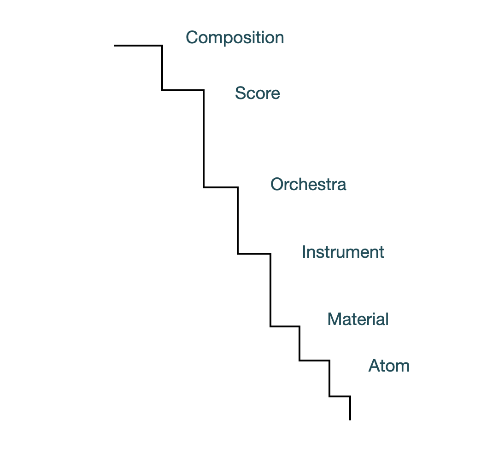
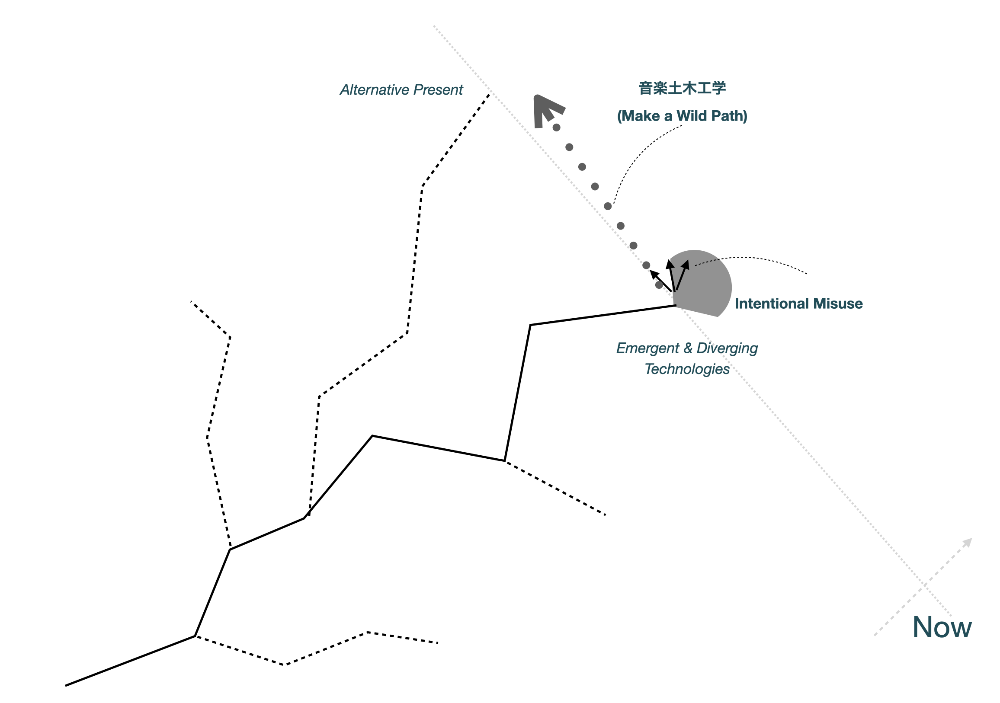

<!-- 第7章 議論-->
# 序言

前章では設計した音楽プログラミング言語mimiumの仕様と特徴を例示してきた。

mimiumはラムダ計算ベースの汎用プログラミング言語の設計、実装の上に最低限の音楽向けの機能ー論理時間ベースのスケジューラ、`delay`や`self`を用いた時間方向の参照による表現という2つの機能を足すことで、汎用プログラミング言語の自己拡張性を失うことなくブラックボックス的構造によるアクセス不可能性を可能な限り排すことを目指した。

本章ではmimiumの開発という実践を通じて明らかになった、PLfMとはそもそも何だったのか、PLfMを作るという行為は何だったのかを再検討する。そして、第2〜4章で検討してきた歴史的背景に照らし合わせ、音楽家が主体的にコンピューターを利用する行為の一環としてのPLfMの利用や開発という行為の位置付けを改めて試みる。

そこで明らかになった課題から、プログラミング言語に限らない、音楽のためのテクノロジーのあり方全般を再検討する、音楽土木工学という枠組みの必要性を提出する。

# PLfMとは何か？

まずここまでの視点で一度本研究の提出する貢献のひとつ、音楽プログラミング言語の存在論についての議論を具体的な実装を踏まえて固める。

音楽プログラミング言語とは本質的にはマッカートニーの言ったように、**音楽のための最低限の抽象化機構を備えた人工言語**である。今日（音楽に限らない）プログラミング言語とは、ハードウェアの違いに依存しない抽象的な計算モデルを、（必ずしもテキストに限らない）人間が知覚、認識、記述可能な形で記述/操作できるようにしたものと言える。ただし、ハードウェアを意識する必要のない高級汎用プログラミング言語の多くは、ガベージコレクションのような実行タイミングに不確定性を生じさせる機能を利用している。そのため汎用言語のライブラリとして、信号処理を含むリアルタイムな動作が可能なDSLを構築することは難しい状況が続いている。

そのため多くのPLfMの設計はその統語論や意味論の設計自体を行う必要が出てくるが、問題となるのは**最低限の抽象化**をどこに設定するかである。言語実装者にとっての最低限の抽象化の線引きによってその言語の実行環境は、大きければUnit Generatorのインタプリタモデルのようになるし、小さければFaustのような厳格な形式的意味論を備える言語体系になる。

最低限のラインを大きくすると、それは基本的に、十二音の音階や、モジュラーシンセサイザーのメタファーなど、ある音楽様式が言語自体に埋め込まれてしまい、プログラマーの思考をその様式に固定してしまうだけでなく、基本的にプログラミング言語としての抽象化能力は高くないものが多いので、基本から外れた試みを行うためにその言語上で高度なライブラリを作ることも難しいといった問題が生じてしまう。

一方で、最低限のラインを下げれば下げるほど、その言語自体の設計や実装に必要な知識は音楽ではなくコンピューターに関する知識そのものになっていく。

さらに、比較的現代的なものを含めて汎用プログラミング言語の下敷きになっている理論は基本的に、可能な限り速く計算できることが是とされる、時間を考慮しない計算モデルを基にしている。現状、時間の概念が関係してくる抽象計算モデルの議論の種別としては次のような4種類に分類される。1つ目は、例えば線形時相論理、計算木論理などの "時間Aまでに処理が間に合っていればBの処理を、間に合わなければCを"、といった、実時間に伴うタイムアウト処理などの用途を想定したリアルタイムコンピューティングの議論。2つ目は、Communicating Sequential Processes（CSP）や$\pi$計算のような、並行システムをラムダ計算と同じように、形式的に抽象化する方法についての議論。3つ目は、Functional-Reactive Programming（FRP）のような、時間に伴って変化するデータ全般を抽象的に表すことを目的とした関数型プログラミングの議論。4つ目は、FaustやW計算（後述）のような、音声信号処理で使われることを想定した、実時間ではなく等間隔な時間で発生する計算の順序を保証し、かつ、漸化式的に、時間方向に遡って計算結果を利用する計算モデルである。

リアルタイムコンピューティングと並行システムの抽象化は音楽以外の分野が議論の中心である。FRPは元々アニメーションなどの表現に使われることを想定としているが、信号処理の理論との接続は未だ積極的に行われてはいない（数少ない例としては[@Reach2013]や[@Gaster2018]）。

これら4種類の時間に関わる計算モデルを統合するような研究は未だ行われていない。その上、仮にもし時間を含めた計算モデルがあったとしても、現代で使われているコンピューターの構造自体、特にOSのスケジューラーなどの実行タイミングの不確定性から逃れることはどの道できない。

そのため、なるべく可能な表現範囲の広いPLfMを設計するには、まず未だ確たるものが存在しない時間を考慮した抽象計算モデルを考慮に入れた意味論の設計を行う必要がある。その上で、ハードウェアやOSと言った、現状存在しているインフラストラクチャ上で動くランタイムプログラムの工夫などで実行モデルとインフラストラクチャの不一致をつなぎ合わせるという、常に暫定解を探し続ける必要がある。

mimiumでは特に`@`演算子の実行を保証するのは基本的にはランタイムのスケジューラーの実装が正しいことを信用するしかなく、厳密な意味論を定義することは現状のシステムではそもそも難しい。しかし、mimiumの`self`のような、ChronicやFaustと異なり、ラムダ計算ベースの記述を基本にしながらも内部状態を伴う関数の形式化に関しては本研究と並列して研究がなされている。

## より形式的な定義のための関連研究

現在のところ、mimiumの統語論の定義に関しては付録で示すように形式的な定義を行えてはいるが、`self`のような状態付き関数の意味論は実装によって示されているのみである。

この参考となる研究がmimiumを発表したACM SIGPLAN FARM(Functional Art, Research, Modeling)というワークショップで同じセッションで発表されたW計算（W-calculus、ラムダ計算と同じような名付け）である[@Arias2021]。W計算はFaustに強く影響を受けていながらも、Faustのように入出力を持ったブロックのグラフを組み合わせる構造ではなく、ラムダ計算をベースにした信号処理のための計算で、通常のラムダ計算に現れる項に加えて、$feed\: x.e$といった独自の項が追加されている。この`feed`はその項における1時刻前のサンプルでの計算結果が$x$として項の中で再帰的に利用できるといった意味合いをもち、これはmimiumにおける`self`の概念に直接的に対応する。例えば1サンプルずつ引数`incl`に応じて増加するカウンターの関数[@lst:wcalc]はW計算の中では次のように表せる[^wcalculus]。

[^wcalculus]: W計算はフィルタなどの線形時不変システムの実質的等価性などを形式的に証明することを1つの目的としているため、厳密に言うと基本的演算では式同士の加算と、式と定数の乗算（スケーリング）のみが許されている。しかし基本的な演算の項を追加すれば非線型システムにも対応はできる。

\begin{lstlisting}[float,floatplacement=H,label=lst:wcalc,language=Rust,style=mystyle,caption=\mimium{}での引数$\mathit{incl}$サンプルずつ増加するカウンター]
fn counter(incl:float){
    return self+incl
}
\end{lstlisting}

<!-- 
$$
\lambda \ incl.feed \ self.(incl+self)
$$ 
-->

\begin{figure}
\[ \lambda \ incl.feed \ self.(incl+self) \]
\label{eq:label}
\caption{W計算によるコード\ref{lst:wcalc}と等価な表現。}
\end{figure}

W計算はディレイのような、過去のサンプルを参照するような意味合いを定義すると、実用的には過去のサンプル全てを保存しなければならず無限のメモリを必要としてしまうという理想的形式化に伴う問題（例えばChronicがその典型である[@Brandt2002,pどこか]）に対しても都度意味論を拡張することで対応できている。また、OCamlで書かれたW計算で記述された信号処理のプログラムを、W計算のインタプリタとともに一度MetaOCaml上で評価することで、入力プログラムに特化したインタプリタプログラムを生成し、コンパイラの最適化をさらに組み合わせることでリアルタイムでの計算も実現できるようになっている、Multi-rate信号処理への拡張も既に方針が示されているなど、実用を意識した上での理論構築がなされている。

mimiumも根本的な意味論の定義をW計算の形式を借りることによって可能になるだろうと考えられる。もっとも、W計算においても時間方向に離散的な処理の意味論は含まれておらず、現状のランタイムとの通信という実装に依存する定義方法に対する解は今後別に検討する必要がある。

# PLfMのメタ性が生む体験のギャップ

PLfMのための最低限の抽象計算モデルの不在を理解した上で、それでも可能な限り最低限を目指したのがmimiumの設計方針である。この最低限の抽象化の不在はPLfMの研究として大きな課題であるのは間違いない。しかし、なるべく汎用性の高い言語が仮に作れたとして、それだけで、MIDIやUGenのような埋め込まれた音楽様式と異なる音楽が作られるようなことがあるのだろうか。もっと言えば、1950、1960年代のように、コンピューターを使って音楽を作ることが、コンピューターを理解してプログラムを作るという不可分な行為であったように、音楽家が主体的にコンピューターを扱えるような環境は、汎用性の高い、ブラックボックスのなるべく少ないPLfMを作るだけで実現可能なのだろうか？その、汎用性の高いPLfM自体はいったい誰が作るのだろうか？これが、mimiumを作るなかで最も強く感じた疑問と矛盾だった。

この矛盾の説明をするため、第5章で整理した、音楽プログラミング言語の実装の方針と、それに伴う特性のトレードオフがmimiumではどうなっていたかを改めて考える。

mimiumの実装方針は、中間表現の粒度を限りなく小さくするために、文字列データの解析から行うExternal DSLとなっていた。コンパイラ・コンパイラであるbisonを用いることで文字列解析の実装そのものはSuperColliderやFaust同様に下げられているが、C++という低レベルプログラミング言語での実装を行っているためその実装の手間（開発コスト）は少なくない。コードの動的変更の難しさや、開発コストの増大はあらかじめ想定されていた通りである。

しかしこの実装のコストは当初予想していたよりもずっと大きく、正弦波を鳴らすための音が出るまでに1年以上の時間を費やすという状況を引き起こし、開発の経験の大半は音に関連したトピックというよりもむしろ汎用プログラミング言語の開発とほとんど変わらないものになっていた。

これは実際mimiumという言語に特有の問題というわけではなく、Generalityを高めようとすれば必然的に発生する問題へと一般化できる。

<!-- 
{#fig:ladder1 width=90%}

{#fig:ladder2 width=90%} 
-->
\begin{figure}[htbp]
  \begin{minipage}{0.5\hsize}
    \begin{center}
        \includegraphics[keepaspectratio, width=1\hsize]{img/Ladder.png}
    \end{center}
    \caption{従来のMulti-Languageパラダイムに基づく言語におけるプログラミングの学習経験の差を "いびつな階段" として概念的に表した図。}
    \label{fig:ladder1}
  \end{minipage}
  \begin{minipage}{0.5\hsize}
    \begin{center}
        \includegraphics[keepaspectratio, width=1\hsize]{img/Ladder2.png}
    \end{center}
    \caption{mimiumのようなブラックボックスを減らし、ライブラリとしての実装の役割を広げた言語における学習経験の差を "突然急になる坂" として概念的に表した図。}
    \label{fig:ladder2}
  \end{minipage}
\end{figure}

音楽プログラミングにおける作業における経験の階段のギャップを減らし、パパートのいう「天井は高く、床は低く」といった目標を追求していくと、これまで（例えばCSoundにおけるScore—Orchestra—Instrument）のように抽象化のレイヤーをその言語上でのライブラリ実装という作業にすることができれば、元々あった言語間のギャップは埋まっていく。

しかし言語自体の汎用性を高めると、肝心のその言語の処理系実装そのものはほとんどテキストデータを読み込んでより抽象的なデータ構造へと変換していくデータ変換器と言った様相を呈してくる。階段のギャップはほとんど均一になったが最後の一段だけが飛び抜けて高い、といった切断を引き起こしてしまう矛盾が根本的に存在する。この現象を説明した図が[@fig:ladder1]と[@fig:ladder2]である。**いびつな階段モデル**：[@fig:ladder1]が各ドメインごとに使う言語を分ける、現状のMulti-Languageパラダイムに基づく言語の使用と開発においてそれぞれの経験の差が発生していることを概念的に表したものだ。（なおScore-Orchestra-InstrumentはMUSIC NやCsoundで用いられた用語だが、MaterialやAtomはあくまでメタファーとして独自に用いている）。言うなればInstrumentというUGenをC言語などでプログラミングする作業がMaterialレベルのプログラム、さらにC言語のコンパイラそのものを作るような作業がAtomレベルのプログラムとでも言えよう。一方、**突然急になる坂モデル**[@fig:ladder2]がmimiumのようなブラックボックスを減らし、ライブラリとしての実装の役割を広げた言語に対応する。シーモア・パパートのいうプログラミング体験における天井と床、つまり高レベルの抽象化と低レイヤーへのアクセス可能性は広がっているし、各言語間に存在した差異もなだらかになっている一方、言語を作ることそのものの難易度はC言語などよりも理論的背景を多く必要とし難易度が高くなってしまう。

つまり、音楽プログラミング言語を作るという作業は最終的に "音楽のためのライブラリを作りやすい汎用言語を作る"と "その言語上でライブラリを作る"という2つの行為へと分裂してしまう。

こうした汎用性の高い言語そのものの実装の困難さを解消するための方法として、言語同士の相互運用性が上がればよいという立場をとることもできる。

mimium自体をFaustのように、MaxやSuperColliderのUGenとして扱えるようなワークフローを整備することで他の言語の拡張機能的に使えるようにするという方法だ。Faustに限らずとも、例えば現在は文字列から独自の構文解析を行う典型的なExternal DSLである、SuperColliderもその元となった環境はPyriteというMax上で利用できるスクリプト言語だった。こうした埋め込みによる相互運用は既に、mimium自体のアーキテクチャをなるべく疎結合にしていたこともあり、アーキテクチャの図におけるオーディオドライバの部分に当たる箇所を、MaxやSuperColliderそれぞれのUGen作成のためのAPIを用いて実装すればよいため、比較的簡単ではある。
<!-- （この辺ももうちょっと充実させたい） -->

# 音楽土木工学と専門知/アマチュアリズム

しかしよりそもそもの問題になるのは、言語を作るという作業が音楽から分離して行ってしまうという分業体制そのものである。

そもそも、Maxを使って簡単に音声合成をしてみる程度の踏み込み方で、手軽に音楽のためのプログラミング言語を作りながら音声合成自体のプロトタイピングもする、といったハードルの下げ方は存在しないのだろうか？

プログラミング言語自体の理論の難易度というのも確かにあるかもしれないがそれでも、今日ソースコード共有サービスGitHubにおいて、"Programming Language"と検索すれば87502のリポジトリが出てくるのに対して、"Programming Language Music"では137しか出てこないことからその探究の規模の小ささががわかるだろう。実際、第4章の歴史を振り返っても、年を追うごとに時代ごとの開発者の数が増えているかといえば、微増はしているものの頭打ちといった印象もある。

〜

<!-- 音楽のためのプログラミング言語を作り始めて以降、作っていることを人に話すと、 -->

電子計算機が歴史的に軍事技術として現れてきたことはもはや否定のしようもないし、テクノロジーが常に非中立的にならざるを得ないことを工学者は頭に入れ続けなければならない。音楽のためを標榜したIRCAM 4Xが最終的に軍事目的に利用される結末に至ったことからもそれは明らかである。

しかし同時に、計算機を戦争だけが生み出した怪物のように捉えてしまうことは、テクノロジーを責任を持って扱う今日のCivil Engieeringのあり方に何ら希望を与えてくれないという困難さも併せ持つ。ならば立てるべき問いとはこうなる。WW2無くして現代の電子計算機は生まれなかったのかもしれないが、同時にエッカートの、自らの楽しみや、身の回りの人の楽しみのために行ってきたティンカリング無くしても現代の電子計算機の姿はなかったのではないか？

# テクノロジーを用いる音楽実践として

最後に、プログラミング言語設計自体を2020年代における1つの音楽的実践としてできるかについて検討しよう。

アマチュアリズム的態度に準じたハッキング/ティンカリング的態度に基づくテクノロジーの誤用はもはや、アクセス不可能なブラックボックスにより無効化され、コンピューターという象徴機械を介して音楽文化は無意識に画一的な方向に収束する傾向にある。

そうした時代に音楽家が取れる態度はまず、テクノロジーの中身そのものを根本的に理解できるようになっていくよう変わる必要があるし、音楽文化全体においてテクノロジーの理解を促すような教育も必要である。パケットはMaxやPuredataが比較的普及した後でも、それを使うためには教育の要素が不可欠だと主張しているが、この状況は現在になっても変わっていないと言える。

> しかし、コンピュータハードウェアの低廉化によって交わされた約束に、私たちはまだ追いついていない。確かに、いまやすべての道具が入ったコンピュータを400ドル程度で購入でき、アンプとスピーカを追加すればコンピュータ音楽制作の準備が整う。しかしこれは、システムを構築し、フリーの良いソフト見つけてインストールし実行するために必要な知識があることを前提としている。コンピュータを数千ドルに、ソフトウェアを数千ドルにしたいという多くの商業的な関心が、私たちの前に立ちはだかる。
> コンピューティングとコンピュータ音楽の民主化に不可欠な要素は、地域の知識ベースを育成することだ。将来を見据えた音楽教育者は、学生が自分のコンピュータを構築するのを促すために何時間も割いている。自家製コンピュータと自家製コンピュータ音楽ソフトウェアの国際的な文化を、いつか見たいと私は思う。過去に裕福な西側はソフトウェアを開発し、何百万ものCDを作り、買う人には誰にでも販売した。将来的には、他の世界から輸入されたソフトウェアを研究し学習するセンターを見てみたい。
> 知識を育てるコミュニティが、特にLinuxのような非商用OSでは必要である。もしLinuxを使う友人がいなければ、動かすまでには障害があるだろう。しかし、世界の多くで少なくとも村の1人や2人に、コンピュータ音楽の専門知識（マシンの組み立て方法、OSのインストール方法、ソフトウェアの実行方法など）がある未来を想像できる。[@Puckette2002]

{#fig:wildpath width=100%}

さらに、テクノロジーを深いところまで理解した上で取れる態度は2つに分かれる。概念を[@fig:wildpath]として提示した。ひとつはテクノロジーの中身をわかった上で敢えて誤用することで、作られたテクノロジーの価値を転換する[@Tokui2021]という的態度だ。一方でこの態度には、音楽家という人間の外部にテクノロジーを置き、誰かが作ったテクノロジーの変革のタイミングに依存して音楽文化が変化していく、ThebergeのMultiSectorial Innovation的状況を受け入れた上で、即興的に反応して技術の異なる可能性を追求するということにもなる。これは近視眼的な意味でのテクノロジーとそれが生み出す新たな象徴による文化を形成するかもしれないが、Attaliの反復の系から抜け出せるほどの新しい音楽文化を作るには一歩足らない。

そうでないやり方として、ここ数年の人工知能の過熱のような論争中のテクノロジーではなく、論争後、例えばMIDIのようにすでに所与のものと決定づけられてしまい、透明な背景と化してしまったインフラストラクチャのような対象を、長い時間がかかるとしても自らの手で再発明し、あり得るかもしれない今（Alternative Present）を生み出すことが必要だ。そしてそれはデモンストレーションとして議論を巻き起こすところまで完結するのではなく、少しづつでも今作り始めて今使い始めてしまうという、技術の可能性の道の間に存在するフィールドにけもの道を作り出すようなアプローチである。

この態度の1つのインスタンスが、プログラミング言語開発という手段である。

# 音楽土木工学という学問領域

- **イノベーションではなく、使用中(Not an Innovation but in use)**
- **応用ではなく、基盤と周縁（Not an Application but an Infrastructure and Merginal Area）**
- **誤用ではなく、開き直り（Not an Misuse but Being Defiant）**

<!-- 強いコンピューター音楽 : 作品のユニークネスにコンピューターを使用することが関わってくる
弱いコンピューター音楽 : 頑張ればコンピューターがなくても実現できるけど、コンピューターを使用することで製作/配布/再生/上演が円滑になる

**やや弱いコンピューター音楽: 作品を成立させるのにコンピューターが不可欠だが、コンピューターを使っていることは作品のユニークネスとは特に関係がない**

トフラーのプロシューマー、CGM、End User Programming -->

# 小括